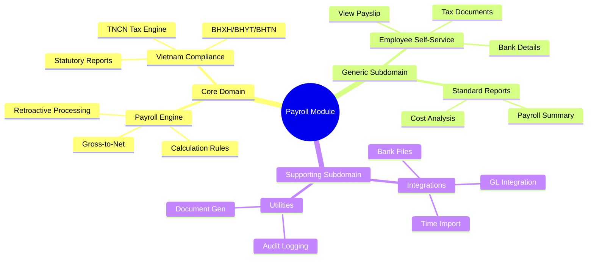
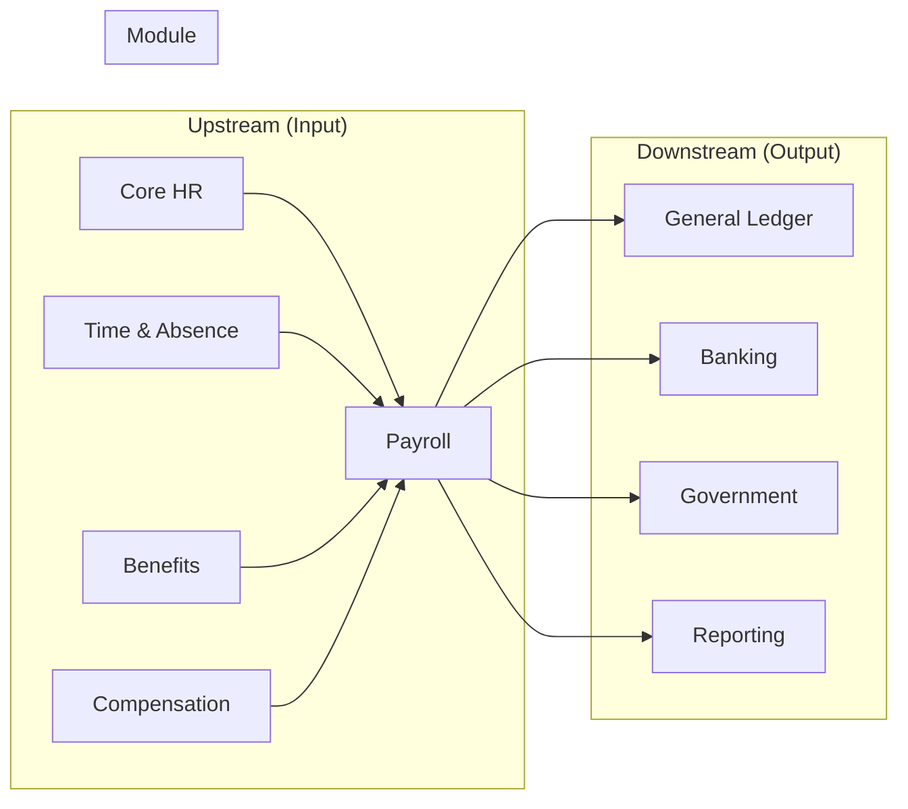

# 🔬 Research Report: Payroll Module (HCM)

> **Research Date:** 2026-01-30  
> **Module:** PR (Payroll)  
> **Status:** Complete  
> **Confidence:** HIGH

---

## 1. Executive Summary

Module **Payroll** là thành phần quan trọng nhất về mặt compliance và financial accuracy trong hệ thống Human Capital Management. Nghiên cứu này phân tích chi tiết các feature cần thiết dựa trên benchmark với Oracle HCM Cloud, SAP SuccessFactors Employee Central Payroll, Workday Payroll, và Microsoft Dynamics 365 HR.

### Key Findings:
- **82 features** được xác định cho module Payroll hoàn chỉnh
- **20 entities** cần thiết cho data model
- **Payroll Engine** là Core Domain - cần đầu tư xây dựng hoàn hảo
- Vietnam statutory compliance (TNCN, BHXH, BHYT, BHTN) là mandatory
- On-Demand Pay (EWA) là trend mới cần đưa vào roadmap

---

## 2. Confidence Assessment

| Dimension | Score | Rationale |
|-----------|-------|-----------|
| **Regulatory Clarity** | HIGH | Vietnam Labor Law, Tax Law clearly defined |
| **Market Consensus** | HIGH | Oracle/SAP/Workday converge on core features |
| **Business Stability** | MEDIUM | Tax rules update annually |
| **Overall Score** | **HIGH** | Proceed with full implementation |

### Conflict Warnings:
- **On-Demand Pay (EWA)**: SAP/Workday supports, Oracle limited → Consider as H2 feature
- **Global Payroll**: Different approaches (native vs partner) → Focus Vietnam first

---

## 3. Domain Strategic Classification

### Investment Strategy:

| Type | Strategy | Investment | Focus |
|------|----------|------------|-------|
| **Core Domain** | Build perfectly | HIGH | Payroll Engine, Tax Compliance |
| **Generic Subdomain** | Standardize | MEDIUM | ESS, Reports |
| **Supporting Subdomain** | Simplify | LOW | Integrations |

---

## 4. Competitive Analysis

### 4.1 Oracle HCM Cloud Payroll

**Strengths:**
- Unified platform với Global HR, Benefits, Time & Labor
- High-performance rules-based processing engine
- 50+ country localizations
- AI-driven capabilities với Generative AI
- Redwood modern UI

**Key Features:**
- Automated tax calculations với retro-earnings
- FLSA overtime compliance
- Parallel processing for high-volume
- Element Security Profile

**Architecture:**
- SaaS model
- Unified data platform
- Fusion Middleware integration
- Role-based security

### 4.2 SAP SuccessFactors Employee Central Payroll

**Strengths:**
- 57+ country localizations
- Payroll Control Center (PCC)
- Monthly regulatory updates
- "Explain My Pay" với Joule AI

**Key Features:**
- Built-in retro calculations
- Off-cycle payments
- Real-time insights
- Multi-country within single platform
- Harmonized payroll cycles

**Integration:**
- SAP ERP, S/4HANA Cloud
- Workday, Oracle connectors
- Tax authority integrations (60 countries)

### 4.3 Workday Payroll

**Strengths:**
- Native HCM integration (single data model)
- Rules-based calculation engine
- Continuous calculation (real-time)
- 300+ standard reports

**Key Features:**
- Unlimited pay groups/components
- What-if analysis
- AI/ML for pay rule interpretation
- Mobile self-service

**Limitations:**
- Limited to US, Canada, UK, France native
- Premium pricing
- Hybrid needed for global

### 4.4 Microsoft Dynamics 365 HR

**Strengths:**
- Integration với Dynamics 365 ecosystem
- AI-powered processing
- Flexible benefit configuration

**Key Features:**
- Leave & Absence management
- Loan management
- Document management
- Multi-currency support

**Approach:**
- ISV partner integration for payroll execution
- Focus on HR framework, not native payroll

---

## 5. Vietnam Regulatory Requirements

### 5.1 Personal Income Tax (TNCN)

| Type | Rate | Notes |
|------|------|-------|
| Resident | 5-35% progressive | 7 brackets |
| Non-Resident | 20% flat | No deductions |
| Personal Deduction | 15.5M VND/month | As of Jan 2026 |
| Dependent Deduction | 6.2M VND/month | Per registered dependent |

**Progressive Tax Brackets:**
| Income (VND/month) | Rate |
|-------------------|------|
| ≤ 5M | 5% |
| 5M - 10M | 10% |
| 10M - 18M | 15% |
| 18M - 32M | 20% |
| 32M - 52M | 25% |
| 52M - 80M | 30% |
| > 80M | 35% |

### 5.2 Social Insurance (BHXH)

| Contributor | Rate | Notes |
|-------------|------|-------|
| Employee | 8% | Monthly salary |
| Employer | 17.5% | Includes sickness, maternity, retirement |
| Cap | 20x minimum wage | ~46.8M VND (Jul 2024) |

### 5.3 Health Insurance (BHYT)

| Contributor | Rate |
|-------------|------|
| Employee | 1.5% |
| Employer | 3% |

### 5.4 Unemployment Insurance (BHTN)

| Contributor | Rate | Eligibility |
|-------------|------|-------------|
| Employee | 1% | Contract ≥3 months |
| Employer | 1% | |
| Cap | 20x regional minimum | |

### 5.5 Trade Union Fee

| Contributor | Rate |
|-------------|------|
| Employer | 2% of gross |

### 5.6 Overtime Rates

| Type | Rate |
|------|------|
| Weekday | 150% |
| Weekend | 200% |
| Holiday | 300% |

---

## 6. Evolution Horizons

### H1 (0-1 year) - Hard Requirements

| Feature | Priority | Rationale |
|---------|----------|-----------|
| Payroll Calculation Engine | P0 | Core functionality |
| Vietnam Tax (TNCN) | P0 | Mandatory compliance |
| BHXH/BHYT/BHTN | P0 | Mandatory compliance |
| Earnings/Deductions Config | P0 | Basic operations |
| Payslip Generation | P0 | Employee requirement |
| GL Integration | P0 | Finance requirement |
| Basic Reports | P1 | Operations |
| ESS Payslip | P1 | Employee experience |

### H2 (1-3 years) - Predictable Trends

| Feature | Priority | Rationale |
|---------|----------|-----------|
| On-Demand Pay (EWA) | P1 | Employee benefit trend |
| AI Anomaly Detection | P1 | Error reduction |
| Multi-Country (SEA) | P1 | Business expansion |
| Advanced Analytics | P2 | Strategic insights |
| Continuous Calculation | P2 | Real-time payroll |
| Mobile ESS | P2 | UX improvement |

### H3 (3-5 years) - Uncertain Shifts

| Feature | Priority | Rationale |
|---------|----------|-----------|
| Agentic AI | P3 | Autonomous payroll |
| Blockchain Verification | P3 | Trust & audit |
| Global Payroll Platform | P3 | Enterprise scale |
| Predictive Workforce Costing | P3 | Strategic HR |

---

## 7. Explicit Non-Goals

| Non-Goal | Rationale |
|----------|-----------|
| Real-time Bank API Gateway | Complex banking regulations, use bank file export |
| Tax Filing Automation | Government portal integration deferred to Phase 2 |
| Global Payroll (100+ countries) | Focus Vietnam + SEA first |
| Contractor Payment Processing | Separate contractor management module |
| Cryptocurrency Payments | Not legal tender in Vietnam |
| Investment/Stock Administration | Separate module (Total Rewards) |

---

## 8. Cross-Domain Dependencies

### Integration Points:

| Domain | Direction | Data |
|--------|-----------|------|
| Core HR | Input | Employee, Organization, Job |
| Time & Absence | Input | Time entries, Leave |
| Benefits | Input | Benefit deductions |
| Compensation | Input | Salary, Allowances |
| General Ledger | Output | Journal entries |
| Banking | Output | Payment files |
| Government | Output | Tax/Insurance reports |

---

## 9. Architectural Decision Records (ADRs)

### ADR-PR-001: Payroll Engine Architecture

**Status:** Proposed

**Context:**  
Need to decide how to build the payroll calculation engine - custom code vs rules-based vs hybrid.

**Decision:**  
Build a configurable **rules-based calculation engine** with:
- Element-based architecture (earnings, deductions, contributions)
- Configurable formulas per element
- Priority/sequencing control
- Conditional processing based on criteria

**Rationale:**
- Oracle, SAP, Workday all use rules-based approach
- Allows configuration without code changes
- Supports complex business rules
- Enables retroactive processing

**Consequences:**
- Higher initial development effort
- Requires formula builder UI
- Testing complexity increases
- Performance optimization needed

---

### ADR-PR-002: Tax Calculation Strategy

**Status:** Proposed

**Context:**  
Vietnam tax law changes annually. Need to decide how to handle tax rule updates.

**Decision:**  
Build a **separate tax engine** with:
- Tax rules stored in configuration (not code)
- Effective date versioning
- Admin UI for rule updates
- Annual update process

**Rationale:**
- Tax brackets change frequently
- Deduction amounts updated annually
- Need audit trail of historical rules
- Enable updates without deployment

**Consequences:**
- Complex configuration schema
- Requires validation logic
- Need migration tools for updates

---

### ADR-PR-003: Retroactive Processing Approach

**Status:** Proposed

**Context:**  
Salary changes, promotions, or corrections may require recalculating past pay periods.

**Decision:**  
Implement **delta-only retroactive processing**:
- Calculate difference from original
- Create adjustment entries
- Maintain audit trail of original + adjustment

**Rationale:**
- Better performance than full recalculation
- Clearer audit trail
- Industry standard approach
- Supports multiple retro in same period

**Consequences:**
- Complex logic for multi-period retro
- Need clear adjustment reporting
- GL reconciliation considerations

---

### ADR-PR-004: GL Integration Pattern

**Status:** Proposed

**Context:**  
Payroll must post journal entries to General Ledger for financial reporting.

**Decision:**  
Use **Event-driven + API pattern**:
- Payroll emits "PayrollCompleted" event
- Costing service processes allocations
- API call to GL to create journal entries
- Async processing with retry

**Rationale:**
- Decouples Payroll from Finance
- Supports different GL systems
- Enables retry on failure
- Maintains transactional integrity

**Consequences:**
- Need event infrastructure
- Requires idempotent GL API
- Monitoring for failed posts

---

## 10. Search Audit Trail

| Query | Source Tier | Key Finding |
|-------|-------------|-------------|
| Oracle HCM Cloud Payroll features 2024 | Tier 1 (oracle.com) | Rules-based engine, 50+ countries, AI integration |
| SAP SuccessFactors ECP capabilities | Tier 1 (sap.com) | 57 countries, PCC, monthly updates |
| Workday Payroll engine | Tier 1 (workday.com) | Continuous calculation, native HCM |
| Vietnam TNCN BHXH requirements | Tier 1 (vss.gov.vn) | Tax brackets, insurance rates |
| Payroll engine architecture | Tier 2 (mercans.com) | Horizontal modular approach |
| On-demand pay EWA | Tier 2 (multiple) | Employee benefit trend |
| GL integration best practices | Tier 2 (oracle.com) | Account alignment, automation |
| AI payroll trends 2025 | Tier 2 (multiple) | 50% adoption, anomaly detection |

---

## 11. References (Tiered)

### Tier 1 (Official Documentation)
- [Oracle HCM Cloud Payroll](https://oracle.com/hcm)
- [SAP SuccessFactors Employee Central Payroll](https://sap.com)
- [Workday Payroll](https://workday.com)
- [Vietnam Social Security (vss.gov.vn)](https://vss.gov.vn)
- [Vietnam Tax Law](https://pwc.com/vietnam)

### Tier 2 (Industry Sources)
- [Mercans Global Payroll](https://mercans.com)
- [Corpay Payroll Trends](https://corpay.com)
- [ADP Payroll Research](https://adp.com)

### Tier 3 (Community)
- Payroll.org Forums
- Reddit r/payroll

---

## 12. Next Steps

1. **Create Entity Catalog** → Define 20 entities with YAML metadata
2. **Create Feature Catalog** → Detail 82 features with differentiation
3. **Solution Blueprint** → Fit-gap analysis with xTalent context
4. **Ontology Design** → Build *.onto.md files for core entities

---

*Report generated using native-research-protocol + domain-research skills*
