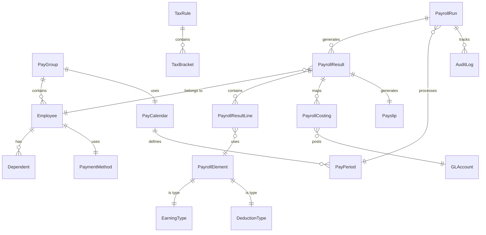

# Entity Catalog: Payroll Module

> **Module:** PR (Payroll)  
> **Version:** 1.0  
> **Last Updated:** 2026-01-30  
> **Total Entities:** 20

---

## Entity Overview



---

## Core Entities

### 1. PayrollRun

```yaml
entity:
  name: PayrollRun
  domain: Payroll
  type: Core
  stability: HIGH
  change_frequency: REALTIME
  pii_sensitive: false
  
attributes:
  - name: id
    type: UUID
    required: true
  - name: code
    type: String
    required: true
    description: Unique run identifier (e.g., "PR-2026-01-001")
  - name: pay_group_id
    type: UUID
    required: true
  - name: pay_period_id
    type: UUID
    required: true
  - name: run_type
    type: Enum
    values: [REGULAR, OFF_CYCLE, BONUS, CORRECTION, FINAL]
    required: true
  - name: status
    type: Enum
    values: [DRAFT, IN_PROGRESS, CALCULATED, VERIFIED, APPROVED, POSTED, CANCELLED]
    required: true
  - name: scheduled_date
    type: Date
    required: true
  - name: payment_date
    type: Date
    required: true
  - name: total_gross
    type: Decimal
    precision: 18,2
  - name: total_net
    type: Decimal
    precision: 18,2
  - name: total_employees
    type: Integer
  - name: calculation_start
    type: Timestamp
  - name: calculation_end
    type: Timestamp
  - name: created_by
    type: UUID
  - name: created_at
    type: Timestamp
  - name: updated_at
    type: Timestamp

relationships:
  - type: belongs_to
    entity: PayGroup
    cardinality: many-to-one
  - type: belongs_to
    entity: PayPeriod
    cardinality: many-to-one
  - type: has_many
    entity: PayrollResult
    cardinality: one-to-many
  - type: has_many
    entity: AuditLog
    cardinality: one-to-many

dependencies:
  upstream: [PayGroup, PayPeriod, Employee]
  downstream: [PayrollResult, GLJournalEntry, Payslip]
```

---

### 2. PayrollResult

```yaml
entity:
  name: PayrollResult
  domain: Payroll
  type: Core
  stability: MEDIUM
  change_frequency: MONTHLY
  pii_sensitive: true
  
attributes:
  - name: id
    type: UUID
    required: true
  - name: payroll_run_id
    type: UUID
    required: true
  - name: employee_id
    type: UUID
    required: true
  - name: status
    type: Enum
    values: [PENDING, CALCULATED, ERROR, VERIFIED, PAID, REVERSED]
    required: true
  - name: gross_pay
    type: Decimal
    precision: 18,2
    required: true
  - name: net_pay
    type: Decimal
    precision: 18,2
    required: true
  - name: total_earnings
    type: Decimal
    precision: 18,2
  - name: total_deductions
    type: Decimal
    precision: 18,2
  - name: total_tax
    type: Decimal
    precision: 18,2
  - name: total_insurance
    type: Decimal
    precision: 18,2
  - name: taxable_income
    type: Decimal
    precision: 18,2
  - name: is_retroactive
    type: Boolean
    default: false
  - name: retro_adjustment
    type: Decimal
    precision: 18,2
  - name: payment_method_id
    type: UUID
  - name: payment_status
    type: Enum
    values: [PENDING, PROCESSED, FAILED, REVERSED]
  - name: payment_reference
    type: String
  - name: calculation_errors
    type: JSON
  - name: created_at
    type: Timestamp
  - name: updated_at
    type: Timestamp

relationships:
  - type: belongs_to
    entity: PayrollRun
    cardinality: many-to-one
  - type: belongs_to
    entity: Employee
    cardinality: many-to-one
  - type: has_many
    entity: PayrollResultLine
    cardinality: one-to-many
  - type: has_one
    entity: Payslip
    cardinality: one-to-one
  - type: has_many
    entity: PayrollCosting
    cardinality: one-to-many
```

---

### 3. PayrollElement

```yaml
entity:
  name: PayrollElement
  domain: Payroll
  type: Core
  stability: HIGH
  change_frequency: YEARLY
  pii_sensitive: false
  
attributes:
  - name: id
    type: UUID
    required: true
  - name: code
    type: String
    required: true
    unique: true
    description: Element identifier (e.g., "BASIC_SALARY", "BHXH_EE")
  - name: name
    type: String
    required: true
  - name: name_vi
    type: String
    description: Vietnamese name
  - name: element_type
    type: Enum
    values: [EARNING, DEDUCTION, CONTRIBUTION, INFORMATION]
    required: true
  - name: category
    type: Enum
    values: [REGULAR, OVERTIME, BONUS, ALLOWANCE, TAX, INSURANCE, LOAN, GARNISHMENT, BENEFIT, OTHER]
    required: true
  - name: processing_type
    type: Enum
    values: [RECURRING, NONRECURRING, ONETIME]
    required: true
  - name: calculation_type
    type: Enum
    values: [FIXED, RATE, FORMULA, EXTERNAL]
    required: true
  - name: formula_id
    type: UUID
    description: Reference to PayrollFormula
  - name: priority
    type: Integer
    default: 100
    description: Processing order
  - name: is_taxable
    type: Boolean
    default: true
  - name: is_gross_up
    type: Boolean
    default: false
  - name: affects_insurance
    type: Boolean
    default: true
  - name: is_statutory
    type: Boolean
    default: false
  - name: is_pre_tax
    type: Boolean
    default: false
  - name: gl_account_debit
    type: String
  - name: gl_account_credit
    type: String
  - name: effective_start
    type: Date
    required: true
  - name: effective_end
    type: Date
  - name: is_active
    type: Boolean
    default: true
  - name: created_at
    type: Timestamp
  - name: updated_at
    type: Timestamp

relationships:
  - type: has_one
    entity: EarningType
    cardinality: one-to-one
    condition: element_type = 'EARNING'
  - type: has_one
    entity: DeductionType
    cardinality: one-to-one
    condition: element_type = 'DEDUCTION'
  - type: belongs_to
    entity: PayrollFormula
    cardinality: many-to-one

standard_elements:
  earnings:
    - BASIC_SALARY: Lương cơ bản
    - ALLOWANCE_HOUSING: Phụ cấp nhà ở
    - ALLOWANCE_MEAL: Phụ cấp ăn trưa
    - ALLOWANCE_TRANSPORT: Phụ cấp đi lại
    - ALLOWANCE_PHONE: Phụ cấp điện thoại
    - ALLOWANCE_RESP: Phụ cấp trách nhiệm
    - OVERTIME_NORMAL: Làm thêm ngày thường (150%)
    - OVERTIME_WEEKEND: Làm thêm cuối tuần (200%)
    - OVERTIME_HOLIDAY: Làm thêm ngày lễ (300%)
    - BONUS_MONTH13: Lương tháng 13
    - BONUS_PERFORMANCE: Thưởng hiệu suất
    - COMMISSION: Hoa hồng
    
  deductions:
    - TNCN_EE: Thuế TNCN
    - BHXH_EE: BHXH người lao động (8%)
    - BHYT_EE: BHYT người lao động (1.5%)
    - BHTN_EE: BHTN người lao động (1%)
    - LOAN_DEDUCTION: Khấu trừ vay
    - ADVANCE_DEDUCTION: Khấu trừ ứng lương
    - UNION_FEE: Phí công đoàn
    
  contributions:
    - BHXH_ER: BHXH người sử dụng (17.5%)
    - BHYT_ER: BHYT người sử dụng (3%)
    - BHTN_ER: BHTN người sử dụng (1%)
    - UNION_ER: Kinh phí công đoàn (2%)
```

---

### 4. PayrollResultLine

```yaml
entity:
  name: PayrollResultLine
  domain: Payroll
  type: Core
  stability: MEDIUM
  change_frequency: MONTHLY
  pii_sensitive: true
  
attributes:
  - name: id
    type: UUID
    required: true
  - name: payroll_result_id
    type: UUID
    required: true
  - name: element_id
    type: UUID
    required: true
  - name: element_code
    type: String
    required: true
  - name: element_type
    type: Enum
    values: [EARNING, DEDUCTION, CONTRIBUTION, INFORMATION]
    required: true
  - name: amount
    type: Decimal
    precision: 18,2
    required: true
  - name: base_amount
    type: Decimal
    precision: 18,2
  - name: rate
    type: Decimal
    precision: 8,4
  - name: units
    type: Decimal
    precision: 8,2
  - name: is_retroactive
    type: Boolean
    default: false
  - name: retro_period
    type: String
  - name: retro_original
    type: Decimal
    precision: 18,2
  - name: retro_adjustment
    type: Decimal
    precision: 18,2
  - name: calculation_basis
    type: JSON
    description: Calculation details for audit
  - name: created_at
    type: Timestamp

relationships:
  - type: belongs_to
    entity: PayrollResult
    cardinality: many-to-one
  - type: belongs_to
    entity: PayrollElement
    cardinality: many-to-one
```

---

### 5. TaxRule

```yaml
entity:
  name: TaxRule
  domain: Payroll
  type: Core
  stability: MEDIUM
  change_frequency: YEARLY
  pii_sensitive: false
  
attributes:
  - name: id
    type: UUID
    required: true
  - name: country_code
    type: String
    required: true
    default: VN
  - name: tax_type
    type: Enum
    values: [TNCN_RESIDENT, TNCN_NONRESIDENT, WITHHOLDING]
    required: true
  - name: calculation_method
    type: Enum
    values: [PROGRESSIVE, FLAT, FORMULA]
    required: true
  - name: personal_deduction
    type: Decimal
    precision: 18,0
    description: Giảm trừ bản thân (VND)
  - name: dependent_deduction
    type: Decimal
    precision: 18,0
    description: Giảm trừ người phụ thuộc (VND)
  - name: flat_rate
    type: Decimal
    precision: 5,4
    description: For non-resident (0.20)
  - name: effective_start
    type: Date
    required: true
  - name: effective_end
    type: Date
  - name: is_active
    type: Boolean
    default: true
  - name: version
    type: Integer
    required: true
  - name: notes
    type: Text
  - name: created_at
    type: Timestamp
  - name: updated_at
    type: Timestamp

relationships:
  - type: has_many
    entity: TaxBracket
    cardinality: one-to-many
    condition: calculation_method = 'PROGRESSIVE'
    
current_values_vn:
  personal_deduction: 15500000  # VND/month (Jan 2026)
  dependent_deduction: 6200000  # VND/month per dependent
  non_resident_rate: 0.20
```

---

### 6. TaxBracket

```yaml
entity:
  name: TaxBracket
  domain: Payroll
  type: Core
  stability: MEDIUM
  change_frequency: YEARLY
  pii_sensitive: false
  
attributes:
  - name: id
    type: UUID
    required: true
  - name: tax_rule_id
    type: UUID
    required: true
  - name: bracket_order
    type: Integer
    required: true
    description: 1-7 for Vietnam TNCN
  - name: lower_bound
    type: Decimal
    precision: 18,0
    required: true
  - name: upper_bound
    type: Decimal
    precision: 18,0
    description: NULL for highest bracket
  - name: rate
    type: Decimal
    precision: 5,4
    required: true
  - name: fixed_amount
    type: Decimal
    precision: 18,0
    default: 0
    description: Pre-calculated fixed amount for efficiency
  - name: created_at
    type: Timestamp

relationships:
  - type: belongs_to
    entity: TaxRule
    cardinality: many-to-one

vietnam_brackets:
  - bracket_order: 1
    lower_bound: 0
    upper_bound: 5000000
    rate: 0.05
  - bracket_order: 2
    lower_bound: 5000001
    upper_bound: 10000000
    rate: 0.10
  - bracket_order: 3
    lower_bound: 10000001
    upper_bound: 18000000
    rate: 0.15
  - bracket_order: 4
    lower_bound: 18000001
    upper_bound: 32000000
    rate: 0.20
  - bracket_order: 5
    lower_bound: 32000001
    upper_bound: 52000000
    rate: 0.25
  - bracket_order: 6
    lower_bound: 52000001
    upper_bound: 80000000
    rate: 0.30
  - bracket_order: 7
    lower_bound: 80000001
    upper_bound: null
    rate: 0.35
```

---

### 7. SocialInsuranceRule

```yaml
entity:
  name: SocialInsuranceRule
  domain: Payroll
  type: Core
  stability: MEDIUM
  change_frequency: YEARLY
  pii_sensitive: false
  
attributes:
  - name: id
    type: UUID
    required: true
  - name: country_code
    type: String
    required: true
    default: VN
  - name: insurance_type
    type: Enum
    values: [BHXH, BHYT, BHTN]
    required: true
  - name: employee_rate
    type: Decimal
    precision: 5,4
    required: true
  - name: employer_rate
    type: Decimal
    precision: 5,4
    required: true
  - name: cap_multiplier
    type: Integer
    default: 20
    description: Multiplier of minimum wage for cap
  - name: cap_type
    type: Enum
    values: [STATUTORY_MINIMUM, REGIONAL_MINIMUM]
    required: true
  - name: cap_amount
    type: Decimal
    precision: 18,0
    description: Pre-calculated cap for efficiency
  - name: eligibility_months
    type: Integer
    default: 1
    description: Min contract months for eligibility
  - name: effective_start
    type: Date
    required: true
  - name: effective_end
    type: Date
  - name: is_active
    type: Boolean
    default: true
  - name: created_at
    type: Timestamp
  - name: updated_at
    type: Timestamp

vietnam_rates:
  - type: BHXH
    employee_rate: 0.08
    employer_rate: 0.175
    cap_type: STATUTORY_MINIMUM
  - type: BHYT
    employee_rate: 0.015
    employer_rate: 0.03
    cap_type: STATUTORY_MINIMUM
  - type: BHTN
    employee_rate: 0.01
    employer_rate: 0.01
    cap_type: REGIONAL_MINIMUM
```

---

### 8. PayGroup

```yaml
entity:
  name: PayGroup
  domain: Payroll
  type: Core
  stability: HIGH
  change_frequency: RARE
  pii_sensitive: false
  
attributes:
  - name: id
    type: UUID
    required: true
  - name: code
    type: String
    required: true
    unique: true
  - name: name
    type: String
    required: true
  - name: description
    type: Text
  - name: pay_calendar_id
    type: UUID
    required: true
  - name: pay_frequency
    type: Enum
    values: [WEEKLY, BIWEEKLY, SEMIMONTHLY, MONTHLY]
    required: true
  - name: default_payment_method
    type: Enum
    values: [BANK_TRANSFER, CHECK, CASH]
    default: BANK_TRANSFER
  - name: country_code
    type: String
    required: true
    default: VN
  - name: currency_code
    type: String
    required: true
    default: VND
  - name: is_active
    type: Boolean
    default: true
  - name: created_at
    type: Timestamp
  - name: updated_at
    type: Timestamp

relationships:
  - type: belongs_to
    entity: PayCalendar
    cardinality: many-to-one
  - type: has_many
    entity: Employee
    cardinality: one-to-many
  - type: has_many
    entity: PayrollRun
    cardinality: one-to-many
```

---

### 9. PayCalendar

```yaml
entity:
  name: PayCalendar
  domain: Payroll
  type: Core
  stability: HIGH
  change_frequency: YEARLY
  pii_sensitive: false
  
attributes:
  - name: id
    type: UUID
    required: true
  - name: code
    type: String
    required: true
    unique: true
  - name: name
    type: String
    required: true
  - name: year
    type: Integer
    required: true
  - name: pay_frequency
    type: Enum
    values: [WEEKLY, BIWEEKLY, SEMIMONTHLY, MONTHLY]
    required: true
  - name: total_periods
    type: Integer
    required: true
  - name: is_active
    type: Boolean
    default: true
  - name: created_at
    type: Timestamp

relationships:
  - type: has_many
    entity: PayPeriod
    cardinality: one-to-many
```

---

### 10. PayPeriod

```yaml
entity:
  name: PayPeriod
  domain: Payroll
  type: Core
  stability: HIGH
  change_frequency: YEARLY
  pii_sensitive: false
  
attributes:
  - name: id
    type: UUID
    required: true
  - name: pay_calendar_id
    type: UUID
    required: true
  - name: period_number
    type: Integer
    required: true
  - name: period_name
    type: String
    required: true
    description: e.g., "January 2026" or "Period 1-15 Jan"
  - name: start_date
    type: Date
    required: true
  - name: end_date
    type: Date
    required: true
  - name: cutoff_date
    type: Date
    required: true
    description: Data cutoff for payroll
  - name: pay_date
    type: Date
    required: true
  - name: status
    type: Enum
    values: [OPEN, CLOSED, LOCKED]
    default: OPEN
  - name: created_at
    type: Timestamp

relationships:
  - type: belongs_to
    entity: PayCalendar
    cardinality: many-to-one
  - type: has_many
    entity: PayrollRun
    cardinality: one-to-many
```

---

### 11. Dependent

```yaml
entity:
  name: Dependent
  domain: Payroll
  type: Core
  stability: MEDIUM
  change_frequency: QUARTERLY
  pii_sensitive: true
  
attributes:
  - name: id
    type: UUID
    required: true
  - name: employee_id
    type: UUID
    required: true
  - name: relationship
    type: Enum
    values: [SPOUSE, CHILD, PARENT, OTHER]
    required: true
  - name: full_name
    type: String
    required: true
  - name: date_of_birth
    type: Date
    required: true
  - name: id_number
    type: String
    description: CCCD/CMND
  - name: tax_code
    type: String
    description: MST của người phụ thuộc (nếu có)
  - name: registration_date
    type: Date
    required: true
  - name: effective_start
    type: Date
    required: true
  - name: effective_end
    type: Date
  - name: status
    type: Enum
    values: [PENDING, APPROVED, REJECTED, EXPIRED]
    default: PENDING
  - name: approved_by
    type: UUID
  - name: approved_at
    type: Timestamp
  - name: document_url
    type: String
    description: Supporting documents
  - name: notes
    type: Text
  - name: created_at
    type: Timestamp
  - name: updated_at
    type: Timestamp

relationships:
  - type: belongs_to
    entity: Employee
    cardinality: many-to-one
```

---

### 12. PayrollFormula

```yaml
entity:
  name: PayrollFormula
  domain: Payroll
  type: Core
  stability: MEDIUM
  change_frequency: YEARLY
  pii_sensitive: false
  
attributes:
  - name: id
    type: UUID
    required: true
  - name: code
    type: String
    required: true
    unique: true
  - name: name
    type: String
    required: true
  - name: description
    type: Text
  - name: formula_type
    type: Enum
    values: [EXPRESSION, SCRIPT, EXTERNAL]
    required: true
  - name: expression
    type: Text
    description: Formula expression (e.g., "BASIC_SALARY * RATE")
  - name: input_variables
    type: JSON
    description: List of input variable codes
  - name: output_type
    type: Enum
    values: [AMOUNT, RATE, UNITS, BOOLEAN]
    required: true
  - name: rounding_rule
    type: Enum
    values: [NONE, ROUND, FLOOR, CEIL]
    default: ROUND
  - name: rounding_precision
    type: Integer
    default: 0
  - name: is_active
    type: Boolean
    default: true
  - name: version
    type: Integer
    required: true
  - name: created_at
    type: Timestamp
  - name: updated_at
    type: Timestamp

example_formulas:
  - code: OVERTIME_150
    expression: "HOURLY_RATE * 1.5 * OVERTIME_HOURS"
  - code: BHXH_EE
    expression: "MIN(GROSS_INSURABLE, CAP_BHXH) * 0.08"
  - code: TNCN_PROGRESSIVE
    expression: "CALCULATE_PROGRESSIVE_TAX(TAXABLE_INCOME, TAX_BRACKETS)"
```

---

### 13. PayrollVariable

```yaml
entity:
  name: PayrollVariable
  domain: Payroll
  type: Core
  stability: MEDIUM
  change_frequency: MONTHLY
  pii_sensitive: false
  
attributes:
  - name: id
    type: UUID
    required: true
  - name: code
    type: String
    required: true
    unique: true
  - name: name
    type: String
    required: true
  - name: variable_type
    type: Enum
    values: [SYSTEM, STATUTORY, CONFIG, CALCULATED, INPUT]
    required: true
  - name: data_type
    type: Enum
    values: [NUMBER, DECIMAL, BOOLEAN, STRING, DATE]
    required: true
  - name: scope
    type: Enum
    values: [GLOBAL, PAYGROUP, EMPLOYEE]
    required: true
  - name: default_value
    type: String
  - name: current_value
    type: String
  - name: effective_start
    type: Date
  - name: effective_end
    type: Date
  - name: is_readonly
    type: Boolean
    default: false
  - name: created_at
    type: Timestamp
  - name: updated_at
    type: Timestamp

standard_variables:
  statutory:
    - MIN_WAGE_STATUTORY: Lương tối thiểu vùng
    - MIN_WAGE_COMMON: Mức lương cơ sở (cũ)
    - PERSONAL_DEDUCTION: Giảm trừ bản thân
    - DEPENDENT_DEDUCTION: Giảm trừ người phụ thuộc
  calculated:
    - GROSS_PAY: Tổng thu nhập
    - NET_PAY: Thực lĩnh
    - TAXABLE_INCOME: Thu nhập chịu thuế
    - INSURABLE_INCOME: Thu nhập đóng bảo hiểm
```

---

### 14. Payslip

```yaml
entity:
  name: Payslip
  domain: Payroll
  type: Core
  stability: HIGH
  change_frequency: MONTHLY
  pii_sensitive: true
  
attributes:
  - name: id
    type: UUID
    required: true
  - name: payroll_result_id
    type: UUID
    required: true
  - name: employee_id
    type: UUID
    required: true
  - name: payslip_number
    type: String
    required: true
    unique: true
  - name: period_name
    type: String
    required: true
  - name: generated_at
    type: Timestamp
    required: true
  - name: pdf_url
    type: String
  - name: distribution_status
    type: Enum
    values: [PENDING, SENT, VIEWED, ERROR]
    default: PENDING
  - name: sent_at
    type: Timestamp
  - name: viewed_at
    type: Timestamp
  - name: email_sent_to
    type: String
  - name: is_final
    type: Boolean
    default: true
  - name: created_at
    type: Timestamp

relationships:
  - type: belongs_to
    entity: PayrollResult
    cardinality: one-to-one
  - type: belongs_to
    entity: Employee
    cardinality: many-to-one
```

---

### 15. PayrollCosting

```yaml
entity:
  name: PayrollCosting
  domain: Payroll
  type: Supporting
  stability: MEDIUM
  change_frequency: MONTHLY
  pii_sensitive: false
  
attributes:
  - name: id
    type: UUID
    required: true
  - name: payroll_result_id
    type: UUID
    required: true
  - name: element_id
    type: UUID
    required: true
  - name: cost_center_id
    type: UUID
  - name: project_id
    type: UUID
  - name: department_id
    type: UUID
  - name: gl_account_debit
    type: String
    required: true
  - name: gl_account_credit
    type: String
    required: true
  - name: amount
    type: Decimal
    precision: 18,2
    required: true
  - name: allocation_percentage
    type: Decimal
    precision: 5,2
    default: 100.00
  - name: journal_entry_id
    type: UUID
    description: Reference to GL journal entry
  - name: posting_status
    type: Enum
    values: [PENDING, POSTED, FAILED, REVERSED]
    default: PENDING
  - name: created_at
    type: Timestamp

relationships:
  - type: belongs_to
    entity: PayrollResult
    cardinality: many-to-one
```

---

### 16. PaymentMethod

```yaml
entity:
  name: PaymentMethod
  domain: Payroll
  type: Supporting
  stability: HIGH
  change_frequency: RARE
  pii_sensitive: true
  
attributes:
  - name: id
    type: UUID
    required: true
  - name: employee_id
    type: UUID
    required: true
  - name: method_type
    type: Enum
    values: [BANK_TRANSFER, CHECK, CASH]
    required: true
  - name: is_primary
    type: Boolean
    default: true
  - name: bank_code
    type: String
  - name: bank_name
    type: String
  - name: branch_name
    type: String
  - name: account_number
    type: String
    encrypted: true
  - name: account_holder_name
    type: String
  - name: swift_code
    type: String
  - name: allocation_percentage
    type: Decimal
    precision: 5,2
    default: 100.00
  - name: effective_start
    type: Date
    required: true
  - name: effective_end
    type: Date
  - name: is_active
    type: Boolean
    default: true
  - name: verified_at
    type: Timestamp
  - name: created_at
    type: Timestamp
  - name: updated_at
    type: Timestamp

relationships:
  - type: belongs_to
    entity: Employee
    cardinality: many-to-one
```

---

### 17. PayrollBatch

```yaml
entity:
  name: PayrollBatch
  domain: Payroll
  type: Supporting
  stability: HIGH
  change_frequency: REALTIME
  pii_sensitive: false
  
attributes:
  - name: id
    type: UUID
    required: true
  - name: payroll_run_id
    type: UUID
    required: true
  - name: batch_type
    type: Enum
    values: [CALCULATION, VALIDATION, PAYMENT, GL_POSTING]
    required: true
  - name: status
    type: Enum
    values: [QUEUED, RUNNING, COMPLETED, FAILED, CANCELLED]
    required: true
  - name: total_items
    type: Integer
  - name: processed_items
    type: Integer
    default: 0
  - name: failed_items
    type: Integer
    default: 0
  - name: start_time
    type: Timestamp
  - name: end_time
    type: Timestamp
  - name: error_log
    type: JSON
  - name: created_by
    type: UUID
  - name: created_at
    type: Timestamp

relationships:
  - type: belongs_to
    entity: PayrollRun
    cardinality: many-to-one
```

---

### 18. RetroactiveAdjustment

```yaml
entity:
  name: RetroactiveAdjustment
  domain: Payroll
  type: Core
  stability: MEDIUM
  change_frequency: MONTHLY
  pii_sensitive: true
  
attributes:
  - name: id
    type: UUID
    required: true
  - name: employee_id
    type: UUID
    required: true
  - name: adjustment_type
    type: Enum
    values: [SALARY_CHANGE, PROMOTION, CORRECTION, SETTLEMENT]
    required: true
  - name: effective_date
    type: Date
    required: true
    description: When the change should have taken effect
  - name: original_period_start
    type: Date
    required: true
  - name: original_period_end
    type: Date
    required: true
  - name: element_id
    type: UUID
    required: true
  - name: original_amount
    type: Decimal
    precision: 18,2
    required: true
  - name: adjusted_amount
    type: Decimal
    precision: 18,2
    required: true
  - name: difference
    type: Decimal
    precision: 18,2
    required: true
  - name: applied_payroll_run_id
    type: UUID
  - name: status
    type: Enum
    values: [PENDING, CALCULATED, APPLIED, CANCELLED]
    default: PENDING
  - name: reason
    type: Text
  - name: created_by
    type: UUID
  - name: created_at
    type: Timestamp
  - name: applied_at
    type: Timestamp

relationships:
  - type: belongs_to
    entity: Employee
    cardinality: many-to-one
  - type: belongs_to
    entity: PayrollRun
    cardinality: many-to-one
    description: The run where adjustment was applied
```

---

### 19. AuditLog

```yaml
entity:
  name: AuditLog
  domain: Payroll
  type: Supporting
  stability: HIGH
  change_frequency: REALTIME
  pii_sensitive: false
  retention_period: 7_YEARS
  
attributes:
  - name: id
    type: UUID
    required: true
  - name: entity_type
    type: String
    required: true
    description: e.g., "PayrollRun", "PayrollResult"
  - name: entity_id
    type: UUID
    required: true
  - name: action
    type: Enum
    values: [CREATE, UPDATE, DELETE, CALCULATE, APPROVE, REJECT, POST, REVERSE]
    required: true
  - name: actor_id
    type: UUID
    required: true
  - name: actor_type
    type: Enum
    values: [USER, SYSTEM, INTEGRATION]
    required: true
  - name: changes
    type: JSON
    description: Before/After values
  - name: ip_address
    type: String
  - name: user_agent
    type: String
  - name: timestamp
    type: Timestamp
    required: true
  - name: notes
    type: Text
```

---

### 20. EarningType

```yaml
entity:
  name: EarningType
  domain: Payroll
  type: Reference
  stability: HIGH
  change_frequency: RARE
  pii_sensitive: false
  
attributes:
  - name: id
    type: UUID
    required: true
  - name: code
    type: String
    required: true
    unique: true
  - name: name
    type: String
    required: true
  - name: name_vi
    type: String
  - name: category
    type: Enum
    values: [REGULAR, OVERTIME, BONUS, ALLOWANCE, COMMISSION, REIMBURSEMENT, OTHER]
    required: true
  - name: is_taxable
    type: Boolean
    default: true
  - name: affects_insurance
    type: Boolean
    default: true
  - name: is_recurring
    type: Boolean
    default: true
  - name: statutory_code
    type: String
    description: Government reporting code
  - name: is_active
    type: Boolean
    default: true
  - name: created_at
    type: Timestamp
  - name: updated_at
    type: Timestamp

relationships:
  - type: has_many
    entity: PayrollElement
    cardinality: one-to-many
```

---

## Entity Summary Table

| Entity | Type | Stability | PII | Change Freq |
|--------|------|-----------|-----|-------------|
| PayrollRun | Core | HIGH | No | Realtime |
| PayrollResult | Core | MEDIUM | Yes | Monthly |
| PayrollElement | Core | HIGH | No | Yearly |
| PayrollResultLine | Core | MEDIUM | Yes | Monthly |
| TaxRule | Core | MEDIUM | No | Yearly |
| TaxBracket | Core | MEDIUM | No | Yearly |
| SocialInsuranceRule | Core | MEDIUM | No | Yearly |
| PayGroup | Core | HIGH | No | Rare |
| PayCalendar | Core | HIGH | No | Yearly |
| PayPeriod | Core | HIGH | No | Yearly |
| Dependent | Core | MEDIUM | Yes | Quarterly |
| PayrollFormula | Core | MEDIUM | No | Yearly |
| PayrollVariable | Core | MEDIUM | No | Monthly |
| Payslip | Core | HIGH | Yes | Monthly |
| PayrollCosting | Supporting | MEDIUM | No | Monthly |
| PaymentMethod | Supporting | HIGH | Yes | Rare |
| PayrollBatch | Supporting | HIGH | No | Realtime |
| RetroactiveAdjustment | Core | MEDIUM | Yes | Monthly |
| AuditLog | Supporting | HIGH | No | Realtime |
| EarningType | Reference | HIGH | No | Rare |

---

*Generated from domain-research skill*
