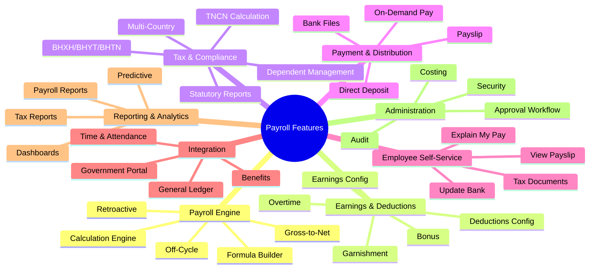

# Feature Catalog: Payroll Module

> **Module:** PR (Payroll)  
> **Version:** 1.0  
> **Last Updated:** 2026-01-30  
> **Total Features:** 82

---

## Feature Overview



---

## 1. PAYROLL ENGINE (Core)

### F-PR-001: Payroll Calculation Engine

```yaml
feature:
  id: F-PR-001
  name: Payroll Calculation Engine
  name_vi: Hệ thống tính lương
  category: Payroll Engine
  priority: P0
  complexity: HIGH
  
classification:
  type: Core
  differentiation: Parity
  source: Standard
  
description: |
  Rules-based engine that processes payroll calculations for all employees
  in a pay group. Supports configurable calculation rules, element processing,
  and multi-step gross-to-net transformation.
  
capabilities:
  - Process multiple pay groups simultaneously
  - Execute calculation rules in defined sequence
  - Handle complex conditional logic
  - Support parallel processing for performance
  - Maintain calculation audit trail
  - Resume from failure point
  
benchmark:
  oracle_hcm: High-performance rules-based engine with parallel processing
  sap_sf: Batch processing with Payroll Control Center
  workday: Continuous calculation engine with real-time updates
  
dependencies:
  entities: [PayrollRun, PayrollResult, PayrollElement, PayrollFormula]
  upstream: [Employee, Time & Attendance, Benefits, Compensation]
  
acceptance_criteria:
  - Process 10,000 employees in under 30 minutes
  - Support at least 100 concurrent calculation rules
  - Zero data loss on failure with resume capability
  - Complete audit trail of all calculations
```

---

### F-PR-002: Gross-to-Net Processing

```yaml
feature:
  id: F-PR-002
  name: Gross-to-Net Processing
  name_vi: Xử lý Gross-to-Net
  category: Payroll Engine
  priority: P0
  complexity: HIGH
  
classification:
  type: Core
  differentiation: Parity
  source: Standard
  
description: |
  Core calculation flow that transforms gross earnings to net pay by
  applying all earnings, pre-tax deductions, taxes, post-tax deductions,
  and employer contributions in the correct sequence.
  
calculation_sequence:
  1. Calculate gross earnings
  2. Apply pre-tax deductions (retirement, health insurance)
  3. Calculate taxable income
  4. Apply tax calculations (TNCN)
  5. Apply social insurance (BHXH, BHYT, BHTN)
  6. Apply post-tax deductions (loans, garnishments)
  7. Calculate employer contributions
  8. Determine net pay
  
vietnam_specifics:
  - Personal deduction (giảm trừ bản thân)
  - Dependent deduction (giảm trừ gia cảnh)
  - Progressive TNCN calculation
  - Insurance cap calculations
  
dependencies:
  entities: [PayrollResult, PayrollResultLine, TaxRule, SocialInsuranceRule]
```

---

### F-PR-003: Multi-Element Processing

```yaml
feature:
  id: F-PR-003
  name: Multi-Element Processing
  name_vi: Xử lý đa phần tử
  category: Payroll Engine
  priority: P0
  complexity: MEDIUM
  
classification:
  type: Core
  differentiation: Parity
  source: Standard
  
description: |
  Process multiple payroll elements (earnings, deductions, contributions)
  with proper sequencing, priority ordering, and dependency resolution.
  
capabilities:
  - Define element processing priority
  - Handle element dependencies (e.g., BHXH based on gross)
  - Support element categories and grouping
  - Enable/disable elements based on conditions
  - Track element balances across periods
  
element_categories:
  earnings: [BASIC_SALARY, ALLOWANCE, OVERTIME, BONUS, COMMISSION]
  deductions: [TNCN, BHXH_EE, BHYT_EE, BHTN_EE, LOAN, ADVANCE]
  contributions: [BHXH_ER, BHYT_ER, BHTN_ER, UNION_ER]
  information: [HOURS_WORKED, DAYS_WORKED, LEAVE_BALANCE]
```

---

### F-PR-004: Retroactive Calculation

```yaml
feature:
  id: F-PR-004
  name: Retroactive Calculation
  name_vi: Tính toán hồi tố
  category: Payroll Engine
  priority: P0
  complexity: HIGH
  
classification:
  type: Core
  differentiation: Parity
  source: Standard
  
description: |
  Calculate and apply adjustments for changes that should have been
  effective in prior periods (salary increases, promotions, corrections).
  
capabilities:
  - Identify retro-eligible changes automatically
  - Calculate delta from original period
  - Apply adjustments in current period
  - Support multiple retro adjustments per employee
  - Maintain clear audit trail of original vs adjusted
  - Handle tax recalculation across periods
  
scenarios:
  - Backdated salary increase
  - Late promotion processing
  - Prior period correction
  - Settlement calculation
  
dependencies:
  entities: [RetroactiveAdjustment, PayrollResultLine]
```

---

### F-PR-005: Off-Cycle Payroll

```yaml
feature:
  id: F-PR-005
  name: Off-Cycle Payroll
  name_vi: Lương ngoài chu kỳ
  category: Payroll Engine
  priority: P1
  complexity: MEDIUM
  
classification:
  type: Core
  differentiation: Parity
  source: Standard
  
description: |
  Process payroll runs outside the regular pay cycle for special
  payments, corrections, or termination settlements.
  
off_cycle_types:
  - BONUS: Special bonus payments
  - CORRECTION: Error corrections
  - FINAL: Termination/settlement
  - ADVANCE: Salary advances
  - REIMBURSEMENT: Expense reimbursements
  
capabilities:
  - Create ad-hoc payroll runs
  - Include/exclude specific elements
  - Process for single or multiple employees
  - Apply tax calculations appropriately
  - Post to GL with correct period
```

---

### F-PR-006: Formula Builder/Configuration

```yaml
feature:
  id: F-PR-006
  name: Formula Builder/Configuration
  name_vi: Công cụ xây dựng công thức
  category: Payroll Engine
  priority: P1
  complexity: HIGH
  
classification:
  type: Core
  differentiation: Innovation
  source: Oracle/SAP Pattern
  
description: |
  Visual/text-based interface for defining payroll calculation formulas
  without code changes. Supports variables, conditions, and functions.
  
capabilities:
  - Define formulas using expression language
  - Reference system/statutory variables
  - Create conditional logic (IF/THEN/ELSE)
  - Use mathematical functions
  - Test formulas with sample data
  - Version and audit formula changes
  
formula_syntax:
  operators: [+, -, *, /, %, ^, =, !=, <, >, <=, >=, AND, OR, NOT]
  functions: [MIN, MAX, ROUND, FLOOR, CEIL, ABS, IF]
  variables: [BASIC_SALARY, HOURLY_RATE, WORK_DAYS, OVERTIME_HOURS]
  
example:
  name: OVERTIME_150
  formula: "HOURLY_RATE * 1.5 * OVERTIME_HOURS_WEEKDAY"
```

---

### F-PR-007: Batch Processing Control

```yaml
feature:
  id: F-PR-007
  name: Batch Processing Control
  name_vi: Điều khiển xử lý hàng loạt
  category: Payroll Engine
  priority: P1
  complexity: MEDIUM
  
classification:
  type: Core
  differentiation: Parity
  source: Standard
  
description: |
  Control and monitor batch payroll processing with status tracking,
  error handling, and restart capabilities.
  
capabilities:
  - Queue payroll runs for processing
  - Track progress (employees processed/total)
  - Handle errors without stopping entire batch
  - Restart failed runs from last checkpoint
  - Cancel running batches
  - View detailed error logs
  
batch_types:
  - CALCULATION: Main payroll calculation
  - VALIDATION: Pre-run validation
  - PAYMENT: Payment file generation
  - GL_POSTING: General ledger posting
```

---

### F-PR-008: Continuous Calculation

```yaml
feature:
  id: F-PR-008
  name: Continuous Calculation
  name_vi: Tính toán liên tục
  category: Payroll Engine
  priority: P2
  complexity: HIGH
  
classification:
  type: Core
  differentiation: Innovation
  source: Workday Pattern
  evolution_horizon: H2
  
description: |
  Real-time payroll calculation that automatically updates when
  pay-impacting events occur (time entries, salary changes).
  
capabilities:
  - Trigger calculation on data changes
  - Show estimated pay in real-time
  - Update calculations incrementally
  - Reduce end-of-period processing time
  
triggers:
  - Time entry submission
  - Salary change
  - Benefit enrollment
  - Absence recording
```

---

### F-PR-009: What-If Analysis

```yaml
feature:
  id: F-PR-009
  name: What-If Analysis
  name_vi: Phân tích giả định
  category: Payroll Engine
  priority: P2
  complexity: MEDIUM
  
classification:
  type: Core
  differentiation: Innovation
  source: Workday Pattern
  evolution_horizon: H2
  
description: |
  Simulate payroll changes to understand impact before committing.
  Used for budgeting, salary planning, and policy changes.
  
capabilities:
  - Simulate salary increases
  - Model tax bracket changes
  - Preview bonus distributions
  - Compare scenarios side-by-side
  - Export analysis results
```

---

### F-PR-010: Parallel Processing

```yaml
feature:
  id: F-PR-010
  name: Parallel Processing
  name_vi: Xử lý song song
  category: Payroll Engine
  priority: P1
  complexity: HIGH
  
classification:
  type: Core
  differentiation: Parity
  source: Oracle Pattern
  
description: |
  Execute payroll calculations in parallel threads to improve
  performance for large employee populations.
  
capabilities:
  - Split employees into parallel batches
  - Utilize database parallel query features
  - Balance load across processing threads
  - Aggregate results after parallel processing
  
performance_targets:
  - 10,000 employees: < 30 minutes
  - 50,000 employees: < 2 hours
  - 100,000 employees: < 4 hours
```

---

### Additional Engine Features

```yaml
features:
  - id: F-PR-011
    name: Calculation Audit Trail
    priority: P0
    description: Complete audit log of all calculation inputs, rules applied, and results
    
  - id: F-PR-012
    name: Error Handling & Recovery
    priority: P0
    description: Graceful error handling with employee-level isolation and recovery options
    
  - id: F-PR-013
    name: Pay Period Management
    priority: P0
    description: Define and manage pay periods with proper cutoff and payment dates
    
  - id: F-PR-014
    name: Pay Calendar Configuration
    priority: P0
    description: Create annual pay calendars with automatic period generation
    
  - id: F-PR-015
    name: Pay Group Management
    priority: P0
    description: Group employees by payment schedule and processing rules
```

---

## 2. EARNINGS & DEDUCTIONS

### F-PR-016: Earnings Type Configuration

```yaml
feature:
  id: F-PR-016
  name: Earnings Type Configuration
  name_vi: Cấu hình loại thu nhập
  category: Earnings & Deductions
  priority: P0
  complexity: MEDIUM
  
classification:
  type: Core
  differentiation: Parity
  source: Standard
  
description: |
  Configure different types of earnings with tax treatment, insurance
  basis inclusion, and GL account mapping.
  
earning_types:
  regular:
    - BASIC_SALARY: Lương cơ bản (taxable, insurable)
    - POSITION_ALLOWANCE: Phụ cấp chức vụ (taxable, insurable)
    - RESPONSIBILITY_ALLOWANCE: Phụ cấp trách nhiệm (taxable, insurable)
    
  non_taxable_allowances:
    - MEAL_ALLOWANCE: Phụ cấp ăn trưa (≤730K non-taxable)
    - UNIFORM_ALLOWANCE: Phụ cấp trang phục (≤5M/year non-taxable)
    - BUSINESS_TRIP: Công tác phí (non-taxable if documented)
    
  overtime:
    - OT_150: Làm thêm ngày thường (150%)
    - OT_200: Làm thêm cuối tuần (200%)
    - OT_300: Làm thêm ngày lễ (300%)
    
  bonus:
    - MONTH_13: Lương tháng 13 (taxable)
    - PERFORMANCE: Thưởng hiệu suất (taxable)
    - PROJECT: Thưởng dự án (taxable)
```

---

### F-PR-017: Deduction Type Configuration

```yaml
feature:
  id: F-PR-017
  name: Deduction Type Configuration
  name_vi: Cấu hình loại khấu trừ
  category: Earnings & Deductions
  priority: P0
  complexity: MEDIUM
  
classification:
  type: Core
  differentiation: Parity
  source: Standard
  
description: |
  Configure different types of deductions with processing order,
  pre-tax/post-tax classification, and limits.
  
deduction_types:
  statutory:
    - TNCN: Thuế thu nhập cá nhân
    - BHXH_EE: Bảo hiểm xã hội (8%)
    - BHYT_EE: Bảo hiểm y tế (1.5%)
    - BHTN_EE: Bảo hiểm thất nghiệp (1%)
    
  pre_tax:
    - RETIREMENT_CONTRIB: Đóng góp hưu trí bổ sung
    - HEALTH_SAVINGS: Tiết kiệm sức khỏe
    
  post_tax:
    - LOAN: Khấu trừ vay
    - ADVANCE: Trừ ứng lương
    - GARNISHMENT: Khấu trừ theo lệnh
    - UNION_FEE: Phí công đoàn (nếu áp dụng)
```

---

### Additional Earnings/Deductions Features

```yaml
features:
  - id: F-PR-018
    name: Allowance Management
    priority: P0
    description: Configure and manage various allowances with eligibility rules
    
  - id: F-PR-019
    name: Bonus Processing
    priority: P1
    description: Handle one-time and recurring bonuses with tax treatment
    
  - id: F-PR-020
    name: Overtime Calculation
    priority: P0
    description: Calculate overtime at Vietnam statutory rates (150%/200%/300%)
    
  - id: F-PR-021
    name: Commission Calculation
    priority: P2
    description: Calculate sales commissions based on configurable rules
    
  - id: F-PR-022
    name: Reimbursement Processing
    priority: P1
    description: Process expense reimbursements through payroll
    
  - id: F-PR-023
    name: Loan Deduction Management
    priority: P1
    description: Track and deduct employee loans with balance tracking
    
  - id: F-PR-024
    name: Garnishment Processing
    priority: P1
    description: Handle court-ordered wage garnishments with limits
    
  - id: F-PR-025
    name: Benefits Deduction
    priority: P1
    description: Integrate benefit plan deductions from Benefits module
    
  - id: F-PR-026
    name: Pre-tax/Post-tax Order
    priority: P0
    description: Ensure correct processing order for tax calculations
    
  - id: F-PR-027
    name: Element Priority & Sequencing
    priority: P0
    description: Control element processing order with priority numbers
```

---

## 3. TAX & STATUTORY COMPLIANCE

### F-PR-028: Tax Calculation (TNCN)

```yaml
feature:
  id: F-PR-028
  name: Tax Calculation (TNCN)
  name_vi: Tính thuế TNCN
  category: Tax & Compliance
  priority: P0
  complexity: HIGH
  
classification:
  type: Compliance
  differentiation: Compliance
  source: Legal
  
description: |
  Calculate Vietnamese Personal Income Tax (TNCN) using progressive
  tax rates with proper deductions and withholding.
  
calculation_flow:
  1. Calculate gross taxable income
  2. Subtract personal deduction (15.5M)
  3. Subtract dependent deductions (6.2M × count)
  4. Apply progressive tax brackets
  5. Determine tax payable
  
vietnam_specifics:
  resident_rates:
    - bracket: 1
      range: "0 - 5M"
      rate: 5%
    - bracket: 2
      range: "5M - 10M"
      rate: 10%
    - bracket: 3
      range: "10M - 18M"
      rate: 15%
    - bracket: 4
      range: "18M - 32M"
      rate: 20%
    - bracket: 5
      range: "32M - 52M"
      rate: 25%
    - bracket: 6
      range: "52M - 80M"
      rate: 30%
    - bracket: 7
      range: "> 80M"
      rate: 35%
      
  non_resident_rate: 20% flat
  
dependencies:
  entities: [TaxRule, TaxBracket, Dependent]
```

---

### F-PR-032: Social Insurance (BHXH)

```yaml
feature:
  id: F-PR-032
  name: Social Insurance (BHXH)
  name_vi: Bảo hiểm xã hội
  category: Tax & Compliance
  priority: P0
  complexity: MEDIUM
  
classification:
  type: Compliance
  differentiation: Compliance
  source: Legal
  
description: |
  Calculate mandatory social insurance contributions for employees
  and employers according to Vietnam regulations.
  
rates:
  employee: 8%
  employer: 17.5%
  cap: 20 × statutory minimum wage
  
eligibility:
  - Contract ≥ 1 month
  - Vietnamese citizen or foreign with work permit
  
components_employer:
  - Sickness & Maternity: 3%
  - Labor Accidents & Occupational Diseases: 0.5%
  - Retirement & Death: 14%
  
dependencies:
  entities: [SocialInsuranceRule]
```

---

### Additional Tax/Compliance Features

```yaml
features:
  - id: F-PR-029
    name: Progressive Tax Bracket
    priority: P0
    description: Calculate tax using 7-bracket progressive system
    
  - id: F-PR-030
    name: Personal Deduction Management
    priority: P0
    description: Manage personal tax deduction amounts (15.5M VND)
    
  - id: F-PR-031
    name: Dependent Registration
    priority: P0
    description: Register and manage employee dependents for tax deductions
    
  - id: F-PR-033
    name: Health Insurance (BHYT)
    priority: P0
    description: Calculate BHYT at 1.5% employee / 3% employer
    
  - id: F-PR-034
    name: Unemployment Insurance (BHTN)
    priority: P0
    description: Calculate BHTN at 1% each for contracts ≥3 months
    
  - id: F-PR-035
    name: Trade Union Fee
    priority: P0
    description: Calculate employer trade union contribution at 2%
    
  - id: F-PR-036
    name: Contribution Cap Handling
    priority: P0
    description: Apply 20× minimum wage cap for insurance calculations
    
  - id: F-PR-037
    name: Non-Resident Tax
    priority: P1
    description: Apply 20% flat tax for non-resident employees
    
  - id: F-PR-038
    name: Tax Finalization
    priority: P1
    description: Annual tax settlement calculation and reporting
    
  - id: F-PR-039
    name: Statutory Reporting
    priority: P0
    description: Generate required government reports
    
  - id: F-PR-040
    name: Compliance Dashboard
    priority: P2
    description: Visual overview of compliance status
    
  - id: F-PR-041
    name: Regulatory Update Management
    priority: P1
    description: Manage changes to tax/insurance rules with versioning
    
  - id: F-PR-042
    name: Multi-Country Tax Support
    priority: P2
    evolution_horizon: H2
    description: Support additional ASEAN country tax rules
```

---

## 4. PAYMENT & DISTRIBUTION

### F-PR-043: Payment Processing

```yaml
feature:
  id: F-PR-043
  name: Payment Processing
  name_vi: Xử lý thanh toán
  category: Payment & Distribution
  priority: P0
  complexity: MEDIUM
  
classification:
  type: Core
  differentiation: Parity
  source: Standard
  
description: |
  Process employee payments through various methods after payroll
  calculation is complete and approved.
  
payment_methods:
  - BANK_TRANSFER: Electronic bank transfer (primary)
  - CHECK: Physical check printing
  - CASH: Cash payment tracking
  
capabilities:
  - Generate payment files by bank
  - Track payment status
  - Handle failed payments
  - Support payment reversal
```

---

### F-PR-050: On-Demand Pay (EWA)

```yaml
feature:
  id: F-PR-050
  name: On-Demand Pay (EWA)
  name_vi: Thanh toán khi cần (EWA)
  category: Payment & Distribution
  priority: P2
  complexity: HIGH
  
classification:
  type: Core
  differentiation: Innovation
  source: Market Trend
  evolution_horizon: H2
  
description: |
  Allow employees to access a portion of their earned wages before
  the regular payday. Also known as Earned Wage Access (EWA).
  
capabilities:
  - Track real-time earned wages
  - Allow partial wage withdrawal
  - Set withdrawal limits (e.g., 50% of earned)
  - Deduct advances from regular payroll
  - Mobile app integration
  
benefits:
  - Reduce employee financial stress
  - Improve retention
  - Competitive advantage in hiring
  
compliance_notes:
  - Not classified as loan
  - No interest charges
  - Clear terms and conditions required
```

---

### Additional Payment Features

```yaml
features:
  - id: F-PR-044
    name: Direct Deposit
    priority: P0
    description: Process bank transfers to employee accounts
    
  - id: F-PR-045
    name: Bank File Generation
    priority: P0
    description: Generate bank-specific payment files (NAPAS, etc.)
    
  - id: F-PR-046
    name: Check Printing
    priority: P2
    description: Print payment checks for non-bank employees
    
  - id: F-PR-047
    name: Cash Payment Tracking
    priority: P2
    description: Track and document cash payments
    
  - id: F-PR-048
    name: Payslip Generation
    priority: P0
    description: Generate formatted payslips for employees
    
  - id: F-PR-049
    name: Payslip Distribution
    priority: P0
    description: Distribute payslips via email, app, or print
```

---

## 5. EMPLOYEE SELF-SERVICE

### F-PR-051: View Payslip Online

```yaml
feature:
  id: F-PR-051
  name: View Payslip Online
  name_vi: Xem bảng lương trực tuyến
  category: Employee Self-Service
  priority: P1
  complexity: LOW
  
classification:
  type: Generic
  differentiation: Parity
  source: Standard
  
description: |
  Allow employees to view their payslips online through web portal
  or mobile app with secure access.
  
capabilities:
  - View current and historical payslips
  - Search by date range
  - Download PDF copies
  - Print-friendly format
  - Mobile-responsive design
```

---

### F-PR-056: Explain My Pay

```yaml
feature:
  id: F-PR-056
  name: Explain My Pay
  name_vi: Giải thích lương của tôi
  category: Employee Self-Service
  priority: P2
  complexity: MEDIUM
  
classification:
  type: Generic
  differentiation: Innovation
  source: SAP Pattern
  evolution_horizon: H2
  
description: |
  AI-powered feature that explains payslip details to employees
  in natural language, answering common questions about their pay.
  
capabilities:
  - Explain each line item in simple terms
  - Answer "Why did my pay change?" questions
  - Show period-over-period comparisons
  - Highlight unusual items
  - Multi-language support (Vietnamese/English)
```

---

### Additional ESS Features

```yaml
features:
  - id: F-PR-052
    name: Download Tax Documents
    priority: P1
    description: Download annual tax statements and certificates
    
  - id: F-PR-053
    name: Update Bank Details
    priority: P1
    description: Self-service update of payment bank details
    
  - id: F-PR-054
    name: Dependent Registration (Self)
    priority: P1
    description: Submit dependent information for tax deductions
    
  - id: F-PR-055
    name: Payroll Inquiry
    priority: P1
    description: Submit questions about payroll to HR
```

---

## 6. INTEGRATION

### F-PR-061: General Ledger Integration

```yaml
feature:
  id: F-PR-061
  name: General Ledger Integration
  name_vi: Tích hợp sổ cái
  category: Integration
  priority: P0
  complexity: HIGH
  
classification:
  type: Core
  differentiation: Parity
  source: Standard
  
description: |
  Integrate payroll with General Ledger to post journal entries
  for payroll expenses, liabilities, and cash disbursements.
  
capabilities:
  - Map payroll elements to GL accounts
  - Generate journal entries automatically
  - Support cost center allocation
  - Support project costing
  - Handle accruals and reversals
  - Reconciliation reporting
  
journal_types:
  - Salary expense
  - Tax liability
  - Insurance liability (employee)
  - Insurance expense (employer)
  - Benefit expense
  - Payment clearing
  
dependencies:
  entities: [PayrollCosting]
```

---

### Additional Integration Features

```yaml
features:
  - id: F-PR-057
    name: Time & Attendance Integration
    priority: P0
    description: Import time data for payroll calculation
    
  - id: F-PR-058
    name: Absence Management Integration
    priority: P0
    description: Import leave data affecting pay
    
  - id: F-PR-059
    name: Benefits Integration
    priority: P1
    description: Import benefit deductions from Benefits module
    
  - id: F-PR-060
    name: Compensation Integration
    priority: P0
    description: Receive salary data from Compensation module
    
  - id: F-PR-062
    name: Bank Integration
    priority: P0
    description: Generate payment files for banks
    
  - id: F-PR-063
    name: Government Portal Integration
    priority: P2
    evolution_horizon: H2
    description: Direct submission to tax/insurance portals
    
  - id: F-PR-064
    name: Third-Party Payroll Integration
    priority: P2
    description: Integrate with external payroll providers
    
  - id: F-PR-065
    name: ERP Integration
    priority: P1
    description: Connect with SAP, Oracle ERP systems
    
  - id: F-PR-066
    name: Data Export/Import
    priority: P1
    description: Bulk data import/export capabilities
```

---

## 7. REPORTING & ANALYTICS

### F-PR-067: Payroll Reports

```yaml
feature:
  id: F-PR-067
  name: Payroll Reports
  name_vi: Báo cáo lương
  category: Reporting & Analytics
  priority: P0
  complexity: MEDIUM
  
classification:
  type: Generic
  differentiation: Parity
  source: Standard
  
description: |
  Standard payroll reports for operational and management use.
  
standard_reports:
  operational:
    - Payroll Register: Detail of all payments
    - Payroll Summary: Summarized totals by department
    - Exception Report: Warnings and errors
    - Variance Report: Period-over-period changes
    
  management:
    - Cost by Department: Payroll cost allocation
    - Headcount vs Cost: Workforce cost analysis
    - Budget vs Actual: Variance analysis
    
  statutory:
    - Tax Deduction Report: Monthly TNCN summary
    - Insurance Report: BHXH/BHYT/BHTN summary
    - Annual Tax Statement: Year-end employee statements
```

---

### F-PR-074: Predictive Analytics

```yaml
feature:
  id: F-PR-074
  name: Predictive Analytics
  name_vi: Phân tích dự đoán
  category: Reporting & Analytics
  priority: P3
  complexity: HIGH
  
classification:
  type: Generic
  differentiation: Innovation
  source: Market Trend
  evolution_horizon: H2
  
description: |
  AI/ML-powered analytics for payroll cost forecasting and
  workforce financial planning.
  
capabilities:
  - Forecast payroll costs
  - Predict overtime trends
  - Identify cost anomalies
  - Model compensation scenarios
```

---

### Additional Reporting Features

```yaml
features:
  - id: F-PR-068
    name: Tax Reports
    priority: P0
    description: Generate tax-related reports and filings
    
  - id: F-PR-069
    name: Statutory Reports
    priority: P0
    description: Government-required reports and declarations
    
  - id: F-PR-070
    name: Cost Analysis
    priority: P1
    description: Analyze payroll costs by dimensions
    
  - id: F-PR-071
    name: Trend Analysis
    priority: P1
    description: Track payroll trends over time
    
  - id: F-PR-072
    name: Payroll Dashboard
    priority: P1
    description: Visual dashboard of key payroll metrics
    
  - id: F-PR-073
    name: Custom Report Builder
    priority: P2
    description: Build custom reports with drag-and-drop
```

---

## 8. ADMINISTRATION & CONTROL

### F-PR-075: Payroll Security/Access Control

```yaml
feature:
  id: F-PR-075
  name: Payroll Security/Access Control
  name_vi: Bảo mật và kiểm soát truy cập
  category: Administration
  priority: P0
  complexity: MEDIUM
  
classification:
  type: Core
  differentiation: Compliance
  source: Standard
  
description: |
  Role-based access control for payroll functions to protect
  sensitive compensation data.
  
security_roles:
  - Payroll Administrator: Full access
  - Payroll Processor: Run payroll, limited config
  - Payroll Viewer: View only
  - Manager: View team payroll summary
  - Employee: View own payslip only
  
data_security:
  - Element-level security (e.g., hide executive pay)
  - Department/Legal Entity restrictions
  - Audit logging of all access
```

---

### Additional Administration Features

```yaml
features:
  - id: F-PR-076
    name: Approval Workflow
    priority: P0
    description: Multi-level approval for payroll runs
    
  - id: F-PR-077
    name: Payroll Audit
    priority: P0
    description: Comprehensive audit trail of all changes
    
  - id: F-PR-078
    name: Error Correction
    priority: P0
    description: Tools to correct payroll errors
    
  - id: F-PR-079
    name: Payroll Calendar Management
    priority: P0
    description: Manage pay dates and deadlines
    
  - id: F-PR-080
    name: Payroll Simulation
    priority: P1
    description: Test payroll changes without committing
    
  - id: F-PR-081
    name: Costing Configuration
    priority: P1
    description: Configure GL account mappings
    
  - id: F-PR-082
    name: Global Payroll Management
    priority: P2
    evolution_horizon: H2
    description: Manage payroll across multiple countries
```

---

## Feature Summary by Priority

| Priority | Count | Description |
|----------|-------|-------------|
| P0 | 42 | Critical - Must have for MVP |
| P1 | 24 | High - Phase 2 delivery |
| P2 | 12 | Medium - Future enhancements |
| P3 | 4 | Low - Long-term roadmap |

## Feature Summary by Category

| Category | Count |
|----------|-------|
| Payroll Engine | 15 |
| Earnings & Deductions | 12 |
| Tax & Compliance | 15 |
| Payment & Distribution | 8 |
| Employee Self-Service | 6 |
| Integration | 10 |
| Reporting & Analytics | 8 |
| Administration | 8 |
| **Total** | **82** |

## Feature Summary by Differentiation

| Type | Count | Strategy |
|------|-------|----------|
| Parity | 48 | Match industry standard |
| Innovation | 14 | Invest for competitive advantage |
| Compliance | 20 | No shortcuts, must implement |

---

*Generated from domain-research skill*
