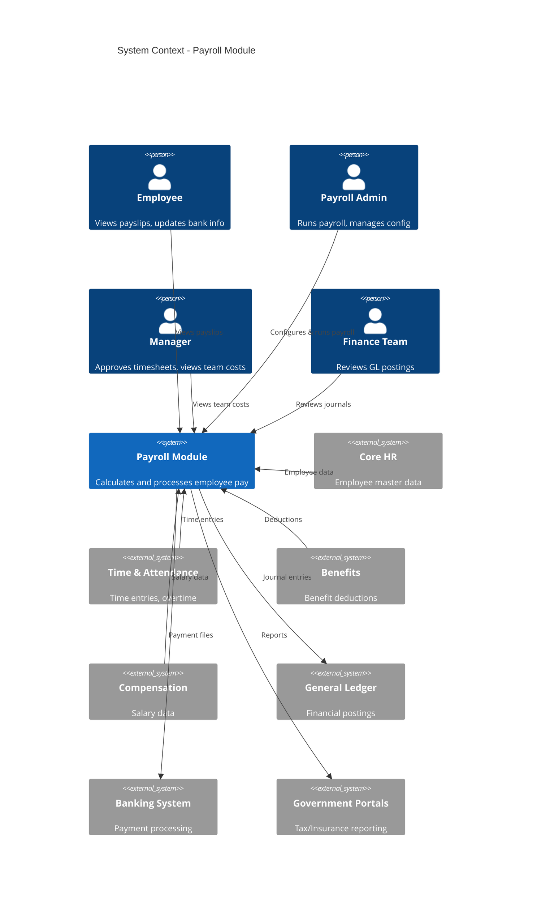
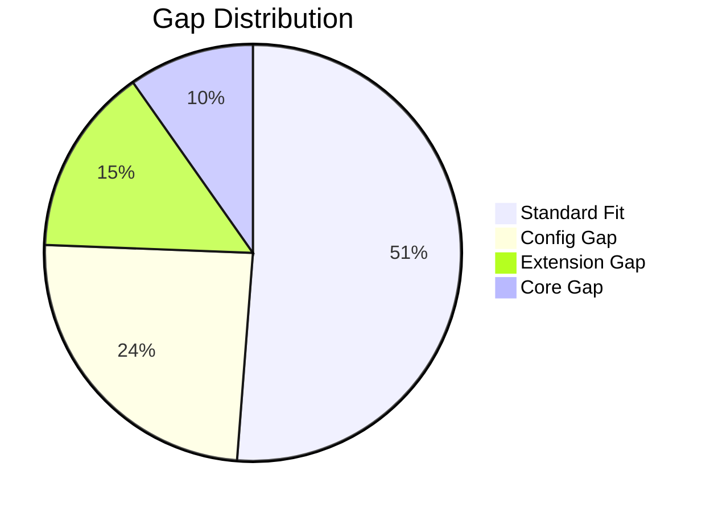
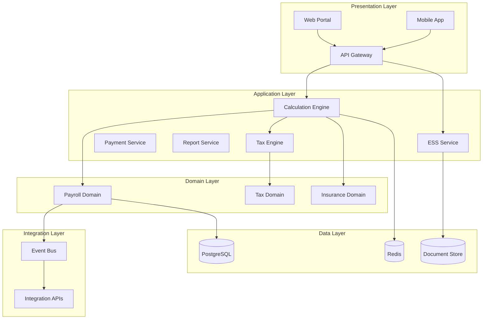
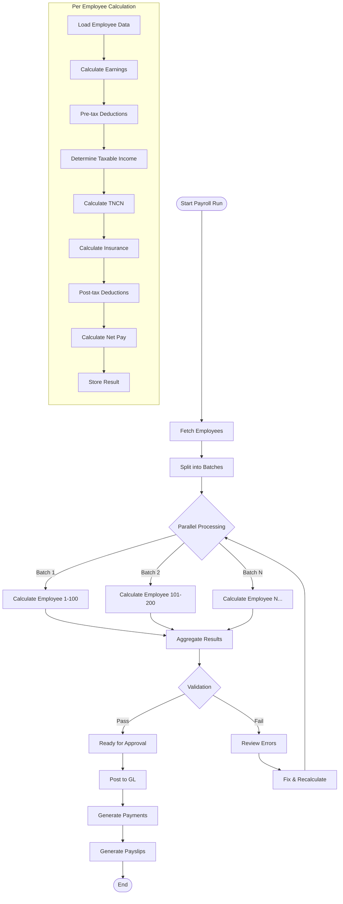
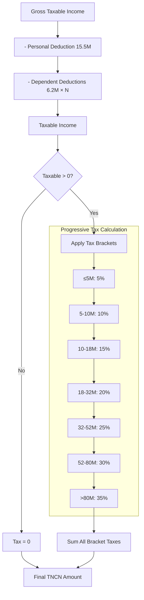
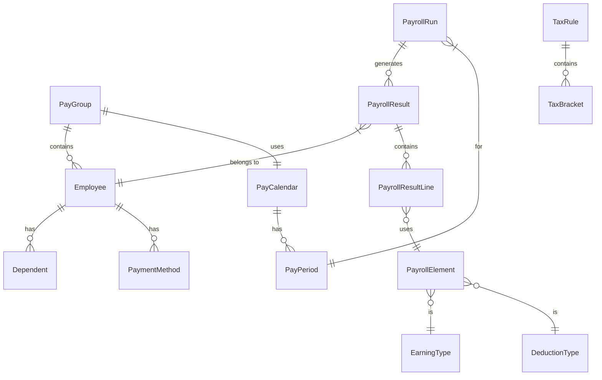
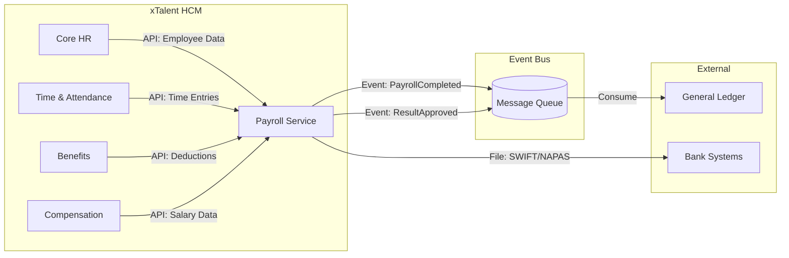
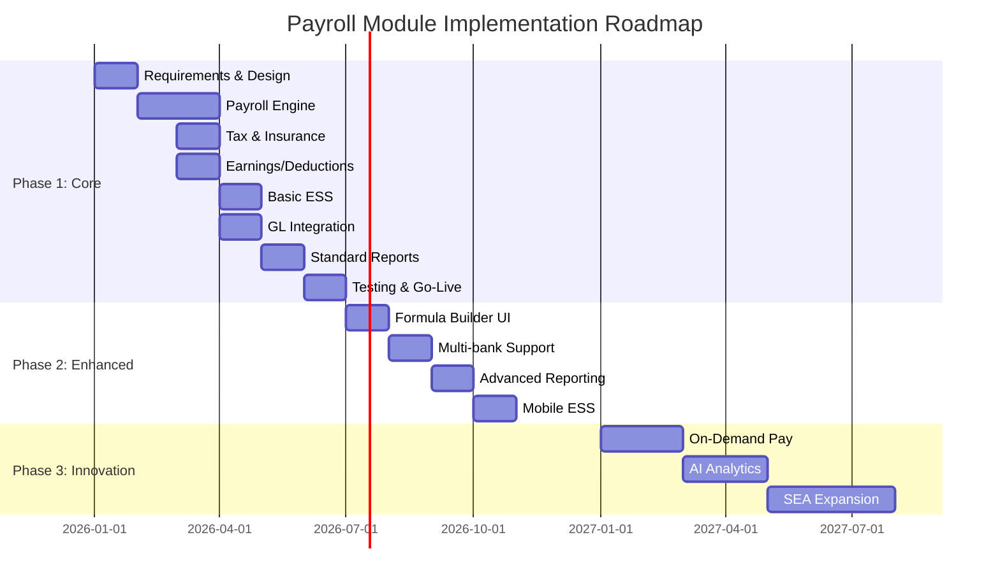

# Solution Blueprint: Payroll Module

> **Module:** PR (Payroll)  
> **Version:** 1.0  
> **Status:** Draft  
> **Last Updated:** 2026-01-30

---

## 1. Executive Summary

### 1.1 Objective

Xây dựng module **Payroll** cho xTalent HCM Platform với khả năng:
- Xử lý tính lương cho doanh nghiệp Việt Nam (500+ nhân viên)
- Tuân thủ đầy đủ quy định về thuế TNCN, BHXH, BHYT, BHTN
- Tích hợp mạnh mẽ với các module Core HR, Time & Attendance, Benefits
- Mở rộng được sang thị trường Đông Nam Á trong tương lai

### 1.2 Scope

| In Scope | Out of Scope |
|----------|--------------|
| Payroll calculation engine | Contractor payments |
| Vietnam tax compliance | 100+ country global payroll |
| Social insurance | Real-time bank API |
| Payslip generation | Government portal integration (Phase 2) |
| GL integration | Cryptocurrency payments |
| ESS for payroll | |

### 1.3 Key Constraints

| Constraint | Impact | Mitigation |
|------------|--------|------------|
| Vietnam Labor Law | Must comply with 7-bracket TNCN | Config-driven tax engine |
| BHXH regulations | Rates change annually | Versioned rule management |
| Data privacy | Sensitive salary data | Encryption, RBAC |
| Performance | 10,000+ employees | Parallel processing |

### 1.4 Risks

| Risk ID | Risk | Probability | Impact | Mitigation |
|---------|------|-------------|--------|------------|
| R1 | Tax regulation change | MEDIUM | HIGH | Config-driven rules, annual update process |
| R2 | Calculation errors | LOW | CRITICAL | Extensive testing, simulation mode, audit trail |
| R3 | GL reconciliation issues | MEDIUM | MEDIUM | Clear mapping, automated matching |
| R4 | Performance at scale | LOW | MEDIUM | Parallel processing, batch optimization |
| R5 | Security breach | LOW | CRITICAL | Encryption, RBAC, audit logging |

---

## 2. Context Diagram



---

## 3. Fit-Gap Analysis

### 3.1 Gap Summary



### 3.2 Detailed Fit-Gap Matrix

#### 3.2.1 Payroll Engine

| Feature | Standard | xTalent Need | Gap Type | Authority | Notes |
|---------|----------|--------------|----------|-----------|-------|
| Calculation Engine | ✅ | Yes | Standard | Project Team | Rules-based engine |
| Gross-to-Net | ✅ | Yes | Standard | Project Team | |
| Multi-Element | ✅ | Yes | Standard | Project Team | |
| Retroactive Calc | ✅ | Yes | Standard | Project Team | Delta-only approach |
| Off-Cycle | ✅ | Yes | Standard | Project Team | |
| Formula Builder | ✅ | Yes + UI | Config | Solution Architect | Need visual editor |
| Batch Control | ✅ | Yes | Standard | Project Team | |
| Continuous Calc | ⚠️ | H2 | Extension | Solution Architect | Real-time updates |
| What-If Analysis | ⚠️ | H2 | Extension | Solution Architect | Simulation feature |
| Parallel Processing | ✅ | Yes | Standard | Project Team | 10K+ employees |

#### 3.2.2 Tax & Compliance

| Feature | Standard | xTalent Need | Gap Type | Authority | Notes |
|---------|----------|--------------|----------|-----------|-------|
| TNCN Calculation | ✅ | Yes | Standard | Project Team | 7-bracket progressive |
| Personal Deduction | ✅ | Yes (15.5M) | Standard | Project Team | |
| Dependent Deduction | ✅ | Yes (6.2M) | Standard | Project Team | |
| BHXH | ✅ | Yes (8%/17.5%) | Standard | Project Team | |
| BHYT | ✅ | Yes (1.5%/3%) | Standard | Project Team | |
| BHTN | ✅ | Yes (1%/1%) | Standard | Project Team | |
| Trade Union | ✅ | Yes (2%) | Standard | Project Team | |
| Cap Handling | ✅ | Yes (20×) | Standard | Project Team | |
| Multi-Country | ⚠️ | H2 (SEA) | Extension | Solution Architect | Thailand, Philippines |
| Gov Portal Integration | ❌ | H2 | Extension | Solution Architect | API not available |

#### 3.2.3 Payment & ESS

| Feature | Standard | xTalent Need | Gap Type | Authority | Notes |
|---------|----------|--------------|----------|-----------|-------|
| Direct Deposit | ✅ | Yes | Standard | Project Team | |
| Bank File Gen | ✅ | Yes | Config | Solution Architect | Multi-bank formats |
| Payslip Gen | ✅ | Yes | Standard | Project Team | |
| On-Demand Pay | ⚠️ | H2 | Extension | Solution Architect | Partner needed |
| View Payslip | ✅ | Yes | Standard | Project Team | |
| Download Tax Docs | ✅ | Yes | Standard | Project Team | |
| Update Bank | ✅ | Yes | Standard | Project Team | With approval |
| Explain My Pay | ⚠️ | H2 | Extension | Solution Architect | AI feature |

#### 3.2.4 Integration

| Feature | Standard | xTalent Need | Gap Type | Authority | Notes |
|---------|----------|--------------|----------|-----------|-------|
| Time Integration | ✅ | Yes | Standard | Project Team | API import |
| Absence Integration | ✅ | Yes | Standard | Project Team | |
| Benefits Integration | ✅ | Yes | Standard | Project Team | |
| Compensation Integration | ✅ | Yes | Standard | Project Team | |
| GL Integration | ✅ | Yes | Standard | Project Team | Event-driven |
| Bank Integration | ✅ | Yes | Config | Solution Architect | Format config |
| ERP Integration | ⚠️ | H2 | Extension | Solution Architect | SAP/Oracle |

### 3.3 Gap Resolution Strategy

| Gap Type | Count | Strategy | Timeline |
|----------|-------|----------|----------|
| Standard Fit | 42 | Implement as designed | Phase 1 |
| Config Gap | 20 | Build configuration | Phase 1 |
| Extension Gap | 12 | Extend platform | Phase 2-3 |
| Core Gap | 8 | Non-goal or defer | N/A |

---

## 4. Solution Architecture

### 4.1 High-Level Architecture



### 4.2 Payroll Calculation Engine Design



### 4.3 Tax Calculation Flow



### 4.4 Data Model Overview



---

## 5. Integration Design

### 5.1 Integration Pattern

**Selected Pattern: Event-Driven + API Hybrid**



### 5.2 Key Integration Points

| Integration | Direction | Method | Frequency | Data |
|-------------|-----------|--------|-----------|------|
| Core HR → Payroll | Inbound | API + Webhook | Real-time | Employee, Org, Job |
| Time → Payroll | Inbound | API (Batch) | Daily/Cutoff | Time entries |
| Benefits → Payroll | Inbound | API | On enrollment | Deductions |
| Compensation → Payroll | Inbound | API | On change | Salary, Allowances |
| Payroll → GL | Outbound | Event | On approve | Journal entries |
| Payroll → Bank | Outbound | File | On payment | SWIFT/NAPAS files |

### 5.3 GL Integration Detail

```yaml
gl_integration:
  pattern: Event-Driven
  
  events:
    - name: PayrollResultApproved
      payload:
        payroll_run_id: UUID
        period: String
        total_gross: Decimal
        total_net: Decimal
        
    - name: PayrollPosted
      payload:
        journal_entries: List<JournalEntry>
        
  journal_templates:
    salary_expense:
      debit: "6110-{cost_center}-SAL"
      credit: "2110-00-SAL"
      
    tax_liability:
      debit: "2110-00-SAL"
      credit: "2210-00-TNCN"
      
    insurance_liability:
      debit: "2110-00-SAL"
      credit: "2220-00-BHXH"
      
    payment_clearing:
      debit: "2110-00-SAL"
      credit: "1111-{bank_account}"
```

---

## 6. Implementation Roadmap

### 6.1 Phase Overview



### 6.2 Phase 1: Core Payroll (Q1-Q2 2026)

| Deliverable | Features | Exit Criteria | CoD |
|-------------|----------|---------------|-----|
| Payroll Engine | F-PR-001 to F-PR-015 | 10K employees < 30min | $30K/month |
| Tax Engine | F-PR-028 to F-PR-036 | 100% TNCN accuracy | $50K/month (fines) |
| Earnings/Deductions | F-PR-016 to F-PR-027 | All VN earning types | $20K/month |
| Basic ESS | F-PR-051, F-PR-048, F-PR-049 | Employee can view payslip | $10K/month |
| GL Integration | F-PR-061 | Journals posted correctly | $20K/month |
| Reports | F-PR-067 to F-PR-069 | Statutory reports available | $10K/month |

**Phase 1 Exit Criteria:**
- [ ] Payroll can be run for test group (100 employees)
- [ ] Tax calculations verified against Excel baseline
- [ ] Insurance calculations verified against VSS formula
- [ ] GL journals reconcile with payroll totals
- [ ] Payslips accessible by employees
- [ ] No Severity-1 bugs open

**Cost of Delay (Phase 1):** $140K/month

### 6.3 Phase 2: Enhanced Features (Q3-Q4 2026)

| Deliverable | Features | Exit Criteria | CoD |
|-------------|----------|---------------|-----|
| Formula Builder | F-PR-006 | Admin can create formulas | $5K/month |
| Multi-bank | F-PR-045 | 5 major banks supported | $10K/month |
| Advanced Reports | F-PR-070 to F-PR-073 | Custom reports possible | $5K/month |
| Mobile ESS | Mobile F-PR-051 | Mobile payslip access | $5K/month |

**Cost of Delay (Phase 2):** $25K/month

### 6.4 Phase 3: Innovation (2027)

| Deliverable | Features | Exit Criteria | CoD |
|-------------|----------|---------------|-----|
| On-Demand Pay | F-PR-050 | EWA provider integrated | Competitive |
| AI Analytics | F-PR-074 | Anomaly detection live | Competitive |
| SEA Expansion | F-PR-042, F-PR-082 | Thailand payroll live | $50K/month |

---

## 7. Feature Prioritization (WSJF)

| Feature | Business Value | Time Criticality | Risk Reduction | Job Size | WSJF | Priority |
|---------|---------------|------------------|----------------|----------|------|----------|
| Payroll Engine | 10 | 10 | 10 | 8 | 3.75 | 1 |
| TNCN Calculation | 10 | 10 | 10 | 5 | 6.00 | 2 |
| BHXH/BHYT/BHTN | 10 | 10 | 10 | 3 | 10.00 | 3 |
| Payslip Generation | 8 | 8 | 5 | 3 | 7.00 | 4 |
| GL Integration | 8 | 8 | 8 | 5 | 4.80 | 5 |
| Retroactive Calc | 8 | 6 | 7 | 5 | 4.20 | 6 |
| ESS Payslip | 7 | 6 | 3 | 2 | 8.00 | 7 |
| Formula Builder | 6 | 4 | 5 | 8 | 1.88 | 8 |
| On-Demand Pay | 6 | 3 | 2 | 8 | 1.38 | 9 |
| AI Analytics | 5 | 2 | 2 | 13 | 0.69 | 10 |

---

## 8. Technical Standards

### 8.1 Calculation Standards

| Standard | Specification |
|----------|---------------|
| Decimal Precision | 18 digits, 2-4 decimal places |
| Rounding | HALF_UP for currency |
| Currency | VND (no decimals), USD (2 decimals) |
| Date Format | ISO 8601 (YYYY-MM-DD) |
| Audit | Every calculation logged |

### 8.2 Performance Standards

| Metric | Target | Measurement |
|--------|--------|-------------|
| Calculation Speed | 10K employees < 30min | Wall clock time |
| API Response | < 500ms P95 | Latency |
| Report Generation | < 30 seconds | Standard reports |
| Uptime | 99.9% | Monthly SLA |

### 8.3 Security Standards

| Control | Implementation |
|---------|----------------|
| Access Control | Role-based (RBAC) |
| Data Encryption | AES-256 at rest, TLS 1.3 in transit |
| Audit Logging | All changes logged with user/timestamp |
| PII Protection | Encryption, masking in logs |
| Retention | 7 years for payroll records |

---

## 9. Governance

### 9.1 Decision Authority

| Decision Type | Authority | Escalation |
|---------------|-----------|------------|
| Standard Fit | Project Team | - |
| Config Gap | Solution Architect | - |
| Extension Gap | Solution Architect | Chief Architect |
| Core Gap | Architecture Review Board | Steering Committee |

### 9.2 Core Gap Escalation

> **Rule:** AI cannot approve Core Gaps. All Core Gaps must be marked "PENDING ARB APPROVAL".

**Current Core Gaps:**

| Gap | Description | Status | Workaround |
|-----|-------------|--------|------------|
| Global Payroll 100+ Countries | Not in scope | Non-Goal | Focus VN + SEA |
| Government API | No API available | Deferred | Manual file upload |
| Cryptocurrency | Not legal tender | Non-Goal | N/A |

### 9.3 Change Control

| Change Type | Process |
|-------------|---------|
| Tax Rate Update | Config change, version, test, deploy |
| New Earning Type | Config + formula, test, deploy |
| New Country | Extension development, ARB review |
| Core Engine Change | Full SDLC, regression testing |

---

## 10. Next Steps

### Immediate Actions

1. **Create Ontology Documents**
   - [ ] payroll-run.onto.md
   - [ ] payroll-element.onto.md
   - [ ] tax-rule.onto.md

2. **Create BRS Documents**
   - [ ] tax-calculation.brs.md
   - [ ] insurance-calculation.brs.md
   - [ ] gross-to-net.brs.md

3. **Create Feature Documents**
   - [ ] payroll-engine.feat.md
   - [ ] ess-payslip.feat.md

4. **Create Flow Documents**
   - [ ] run-payroll.flow.md
   - [ ] post-to-gl.flow.md

### Review Schedule

| Milestone | Date | Participants |
|-----------|------|--------------|
| Architecture Review | TBD | Solution Architects |
| Design Review | TBD | Development Team |
| Security Review | TBD | Security Team |
| Go/No-Go Phase 1 | TBD | Stakeholders |

---

## Appendices

### A. Vietnam Statutory Reference

| Item | Rate/Amount | Effective |
|------|-------------|-----------|
| Personal Deduction | 15,500,000 VND | Jan 2026 |
| Dependent Deduction | 6,200,000 VND | Jan 2026 |
| BHXH Employee | 8% | Current |
| BHXH Employer | 17.5% | Current |
| BHYT Employee | 1.5% | Current |
| BHYT Employer | 3% | Current |
| BHTN Employee | 1% | Current |
| BHTN Employer | 1% | Current |
| Trade Union | 2% (employer) | Current |
| Insurance Cap | 20× minimum wage | Current |

### B. Glossary

| Term | Vietnamese | Definition |
|------|------------|------------|
| TNCN | Thuế TNCN | Personal Income Tax |
| BHXH | Bảo hiểm xã hội | Social Insurance |
| BHYT | Bảo hiểm y tế | Health Insurance |
| BHTN | Bảo hiểm thất nghiệp | Unemployment Insurance |
| EWA | - | Earned Wage Access |
| GL | Sổ cái | General Ledger |
| Net Pay | Thực lĩnh | Take-home pay |
| Gross Pay | Tổng thu nhập | Total before deductions |

---

*Blueprint generated using business-blueprint-architect skill*
