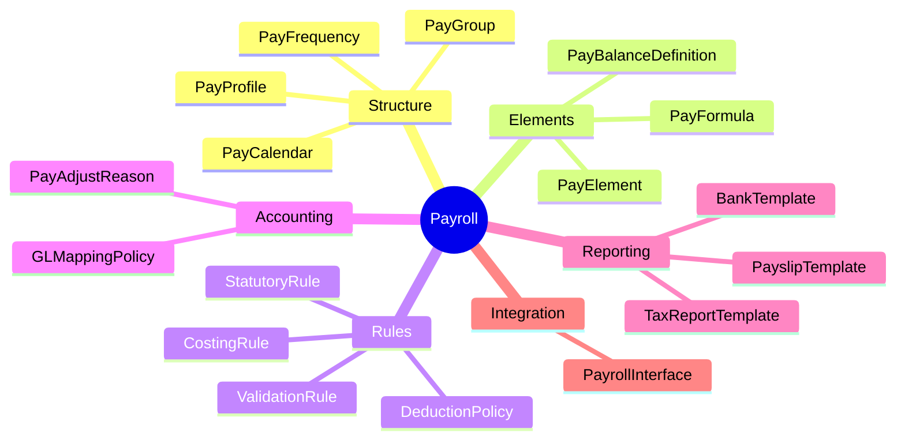
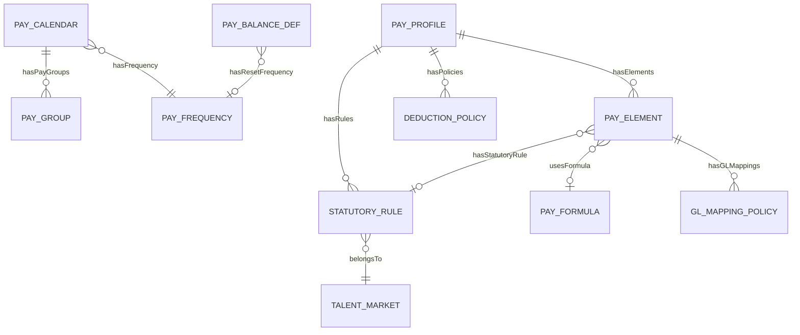

# Payroll Ontology Index

> **Domain**: Payroll (PR)  
> **Version**: 1.0.0  
> **Last Updated**: 2026-01-05

---

## Domain Overview



Payroll ontology định nghĩa các khái niệm business cho module trả lương, tách biệt khỏi payroll engine/runtime.

---

## Entity Map

### Structure (4 entities)

| Entity | Classification | Description |
|--------|---------------|-------------|
| [[PayFrequency]] | REFERENCE_DATA | Chu kỳ trả lương (MONTHLY, BIWEEKLY) |
| [[PayCalendar]] | AGGREGATE_ROOT | Lịch trả lương với periods và dates |
| [[PayGroup]] | ENTITY | Nhóm employees có cùng đặc điểm payroll |
| [[PayProfile]] | AGGREGATE_ROOT | Bundle của policies, rules, elements |

### Elements (3 entities)

| Entity | Classification | Description |
|--------|---------------|-------------|
| [[PayElement]] | AGGREGATE_ROOT | Thành phần lương (earnings, deductions, tax) |
| [[PayFormula]] | ENTITY | Công thức tính dùng chung |
| [[PayBalanceDefinition]] | ENTITY | Định nghĩa balance (GROSS, NET, YTD) |

### Rules (4 entities)

| Entity | Classification | Description |
|--------|---------------|-------------|
| [[StatutoryRule]] | AGGREGATE_ROOT | Quy định pháp lý (tax, insurance) |
| [[DeductionPolicy]] | ENTITY | Chính sách khấu trừ |
| [[ValidationRule]] | ENTITY | Quy tắc kiểm tra dữ liệu |
| [[CostingRule]] | ENTITY | Quy tắc phân bổ chi phí |

### Accounting (2 entities)

| Entity | Classification | Description |
|--------|---------------|-------------|
| [[GLMappingPolicy]] | ENTITY | Mapping element → GL account |
| [[PayAdjustReason]] | REFERENCE_DATA | Lý do điều chỉnh lương |

### Reporting (3 entities)

| Entity | Classification | Description |
|--------|---------------|-------------|
| [[PayslipTemplate]] | ENTITY | Mẫu phiếu lương |
| [[BankTemplate]] | REFERENCE_DATA | Mẫu file payment ngân hàng |
| [[TaxReportTemplate]] | ENTITY | Mẫu báo cáo thuế |

### Integration (1 entity)

| Entity | Classification | Description |
|--------|---------------|-------------|
| [[PayrollInterface]] | AGGREGATE_ROOT | Định nghĩa tích hợp |

---

## Relationship Overview



---

## External Dependencies

| External Entity | Module | Used By |
|-----------------|--------|---------|
| [[LegalEntity]] | ORG | PayCalendar, PayGroup, PayProfile |
| [[TalentMarket]] | CORE | PayCalendar, PayGroup, StatutoryRule |
| [[Employee]] | CORE | PayGroup assignment |
| [[BankAccount]] | FIN | PayGroup |

---

## Directory Structure

```
PR/00-ontology/
├── _index.onto.md          # This file
├── _glossary.onto.md       # Domain terminology
├── _research/
│   └── payroll-analysis.md # Domain research
└── domain/
    ├── structure/
    │   ├── pay-frequency.onto.md
    │   ├── pay-calendar.onto.md
    │   ├── pay-group.onto.md
    │   └── pay-profile.onto.md
    ├── elements/
    │   ├── pay-element.onto.md
    │   ├── pay-formula.onto.md
    │   └── pay-balance-definition.onto.md
    ├── rules/
    │   ├── statutory-rule.onto.md
    │   ├── deduction-policy.onto.md
    │   ├── validation-rule.onto.md
    │   └── costing-rule.onto.md
    ├── accounting/
    │   ├── gl-mapping-policy.onto.md
    │   └── pay-adjust-reason.onto.md
    ├── reporting/
    │   ├── payslip-template.onto.md
    │   ├── bank-template.onto.md
    │   └── tax-report-template.onto.md
    └── integration/
        └── payroll-interface.onto.md
```

---

## Out of Scope

Các bảng sau KHÔNG phải là ontology (runtime/engine):

- `pay_run.*` - Payroll calculation engine
- `payment_*` - Payment execution
- `manual_adjust` - Transaction data
- `audit_log` - Meta/logging
- `generated_file` - Output artifacts
