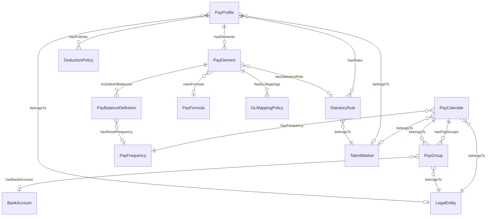
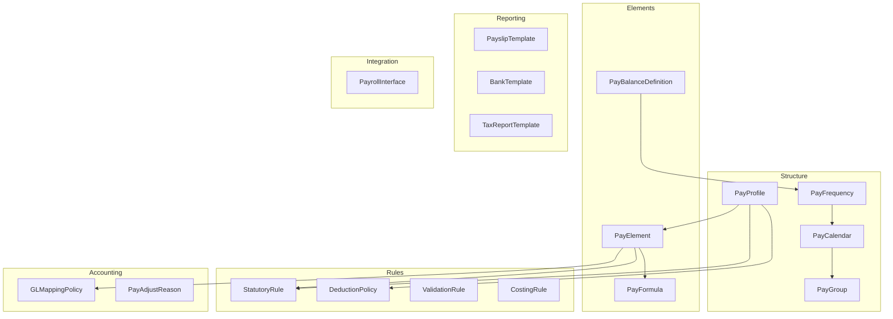

# Domain Research: Payroll

> **Created**: 2026-01-05  
> **Source**: `ontology_list.md`, `5.Payroll.v3.dbml`  
> **Workflow**: `/build-ontology` Step 2

---

## 1. Scope

### Domain Scope: Payroll Ontology

**Problem**: Định nghĩa business domain cho module Payroll - các khái niệm cấu trúc, quy tắc, và chính sách trả lương. Tách biệt với payroll engine/runtime.

**Actors**:
- **Payroll Directors**: Định nghĩa policies, approve changes
- **Payroll Administrators**: Cấu hình elements, calendars, groups
- **Finance/Accounting**: GL mappings, cost allocation
- **Compliance**: Statutory rules, tax reporting
- **HR**: Assign employees vào pay groups

**In Scope** (17 entities):
- Payroll structure: frequency, calendar, group, profile
- Pay elements: element, formula, balance
- Rules: statutory, deduction, validation, costing
- Accounting: GL mapping, adjust reason
- Reporting: payslip, bank, tax templates
- Integration: interface definitions

**Out of Scope** (KHÔNG phải ontology):
- `pay_run.*` - Engine/runtime tables
- `payment_*` - Transaction processing
- `manual_adjust`, `import_job` - Transaction data
- `audit_log` - Meta/logging
- `generated_file` - Output artifacts

**Integration Points**:
- `org_legal.entity` → Legal Entity
- `common.talent_market` → Market/Country
- `employment.employee` → Employee assignment
- ERP/Finance systems → GL posting

---

## 2. Glossary

| Term | Definition | Vietnamese | Example |
|------|------------|------------|---------|
| **Pay Frequency** | Chu kỳ trả lương chuẩn | Tần suất trả lương | MONTHLY, BIWEEKLY |
| **Pay Calendar** | Lịch trả lương với cut-off dates | Lịch lương | VN-MONTHLY-2025 |
| **Pay Group** | Nhóm employees có cùng đặc điểm payroll | Nhóm trả lương | VN-HQ-STAFF |
| **Pay Profile** | Bundle của policies, rules, elements | Profile lương | VN-STANDARD |
| **Pay Element** | Thành phần lương (earning/deduction/tax) | Thành phần lương | BASIC_SALARY, OT_150, BHXH_EE |
| **Pay Formula** | Công thức tính dùng chung | Công thức | BHXH_CALC_VN |
| **Balance Definition** | Định nghĩa balance (GROSS, NET, YTD) | Balance | YTD_GROSS, NET_PAY |
| **Statutory Rule** | Quy định pháp lý (tax, insurance) | Quy định pháp luật | VN_PIT_2025, VN_BHXH_2025 |
| **Deduction Policy** | Chính sách khấu trừ | Chính sách khấu trừ | GARNISHMENT, LOAN |
| **Validation Rule** | Quy tắc kiểm tra dữ liệu | Quy tắc validation | POSITIVE_GROSS |
| **Costing Rule** | Quy tắc phân bổ chi phí | Phân bổ chi phí | COST_BY_DEPT |
| **GL Mapping** | Mapping element → GL account | Mapping kế toán | 61000, 62100 |
| **Payslip Template** | Mẫu phiếu lương | Mẫu bảng lương | VN_STANDARD |
| **Bank Template** | Mẫu file payment ngân hàng | Mẫu file bank | VCB, DBS |
| **Tax Report Template** | Mẫu báo cáo thuế | Mẫu báo cáo thuế | 05QTT_TNCN |
| **Payroll Interface** | Định nghĩa tích hợp | Giao diện tích hợp | TA_IMPORT_DAILY |
| **SCD-2** | Slowly Changing Dimension Type 2 | Version history | effective_start_date, is_current_flag |

---

## 3. Entity Map

### 3.1 Entity Classification

| Entity | Classification | Sub-module | DB Table |
|--------|---------------|------------|----------|
| **PayFrequency** | REFERENCE_DATA | structure | `pay_frequency` |
| **PayCalendar** | AGGREGATE_ROOT | structure | `pay_calendar` |
| **PayGroup** | ENTITY | structure | `pay_group` |
| **PayProfile** | AGGREGATE_ROOT | structure | `pay_profile` |
| **PayElement** | AGGREGATE_ROOT | elements | `pay_element` |
| **PayFormula** | ENTITY | elements | `pay_formula` |
| **PayBalanceDefinition** | ENTITY | elements | `balance_def` |
| **StatutoryRule** | AGGREGATE_ROOT | rules | `statutory_rule` |
| **DeductionPolicy** | ENTITY | rules | `pay_deduction_policy` |
| **ValidationRule** | ENTITY | rules | `validation_rule` |
| **CostingRule** | ENTITY | rules | `costing_rule` |
| **GLMappingPolicy** | ENTITY | accounting | `gl_mapping` |
| **PayAdjustReason** | REFERENCE_DATA | accounting | `pay_adjust_reason` |
| **PayslipTemplate** | ENTITY | reporting | `payslip_template` |
| **BankTemplate** | REFERENCE_DATA | reporting | `bank_template` |
| **TaxReportTemplate** | ENTITY | reporting | `tax_report_template` |
| **PayrollInterface** | AGGREGATE_ROOT | integration | `iface_def` |

### 3.2 Relationship Map

### 3.3 Sub-module Dependency Flow

---

## 4. Business Rules

### 4.1 PayCalendar Rules
| ID | Rule | Source |
|----|------|--------|
| CAL-001 | Calendar phải có frequency_code | DBML FK |
| CAL-002 | Calendar phải có legal_entity_id | DBML FK |
| CAL-003 | SCD-2: is_current_flag track active version | DBML design |
| CAL-004 | default_currency phải là ISO 4217 | Business |

### 4.2 PayElement Rules
| ID | Rule | Source |
|----|------|--------|
| ELE-001 | classification IN (EARNING, DEDUCTION, TAX) | DBML |
| ELE-002 | unit IN (AMOUNT, HOURS) | DBML |
| ELE-003 | TAX elements: taxable_flag = false | Business logic |
| ELE-004 | EARNING contributes positive to gross | Business logic |
| ELE-005 | DEDUCTION reduces net pay | Business logic |
| ELE-006 | priority_order determines calculation sequence | Business logic |

### 4.3 StatutoryRule Rules
| ID | Rule | Source |
|----|------|--------|
| STAT-001 | Rule phải có market_id | DBML FK |
| STAT-002 | valid_from không thể null | DBML |
| STAT-003 | valid_to > valid_from nếu set | Business logic |
| STAT-004 | SCD-2 cho internal versioning | DBML design |

### 4.4 PayGroup Rules
| ID | Rule | Source |
|----|------|--------|
| GRP-001 | PayGroup phải có calendar_id | DBML FK |
| GRP-002 | PayGroup phải có legal_entity_id | DBML FK |
| GRP-003 | currency_code phải là ISO 4217 | Business |

---

## 5. Industry Context

### 5.1 Vietnam Regulations

| Regulation | Description | Ontology Impact |
|------------|-------------|-----------------|
| **Luật Thuế TNCN** | Personal Income Tax - progressive rates | StatutoryRule: VN_PIT |
| **Luật BHXH 2014** | Social Insurance 10.5% EE, 21.5% ER | StatutoryRule: VN_BHXH |
| **Luật BHYT** | Health Insurance 1.5% EE, 3% ER | StatutoryRule: VN_BHYT |
| **Luật BHTN** | Unemployment Insurance 1% EE, 1% ER | StatutoryRule: VN_BHTN |
| **TT 59/2025** | Tax reporting templates | TaxReportTemplate: 05QTT_TNCN |

### 5.2 Market Patterns

| Vendor | Approach | Key Entities |
|--------|----------|--------------|
| **Oracle HCM Cloud** | Elements, Formulas, Balance Definitions, Costing Rules | Similar structure |
| **SAP SuccessFactors** | Pay Components, Wage Types, Calculation Rules | Similar but different naming |
| **Workday** | Earning/Deduction codes, Calculation Groups | More bundled approach |

**Common Patterns Identified**:
1. Element-based design (earnings, deductions, taxes)
2. Formula/Rule separation từ element definitions
3. Balance tracking (RUN, PTD, QTD, YTD, LTD)
4. Profile/Group bundling cho mass assignment
5. SCD-2 cho configuration versioning

---

## 6. Recommendations

### 6.1 Priority Order for Update
1. **PayElement** - Central entity, most relationships
2. **PayCalendar** - Core structure
3. **StatutoryRule** - Critical for compliance
4. **PayProfile** - Bundle mechanism
5. Others follow dependency order

### 6.2 Missing Elements in Current Ontology Files
Based on `ontology-builder` SKILL requirements:

| Element | Status | Required Action |
|---------|--------|-----------------|
| Mermaid mindmap (Overview) | ❌ Missing | Add concept breakdown |
| stateDiagram-v2 (Lifecycle) | ❌ Missing | Add state transitions |
| erDiagram (Relationships) | ❌ Missing | Add relationship viz |
| flowchart (Actions) | ❌ Missing | Add process flows |
| [[Entity]] wiki links | ⚠️ Inconsistent | Standardize all references |
| Business Context section | ⚠️ Incomplete | Add stakeholders, processes |

### 6.3 Key Decisions Needed
1. **PayProfile assignment**: Via PayGroup or direct Employee?
2. **Balance categories**: Expand beyond current list?
3. **Template versioning**: Separate template files or JSON blob?

### 6.4 Risks
1. **Diagram complexity**: Payroll relationships nhiều layers
2. **Statutory rules**: Cần update thường xuyên theo luật mới
3. **Multi-market**: Cần test với Singapore, US ngoài Vietnam
