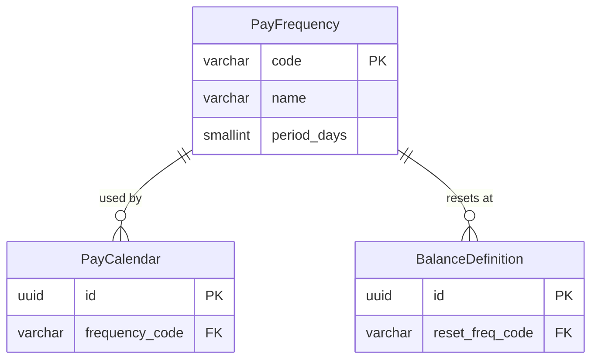

# PayFrequency

**Module**: Payroll (PR)
**Submodule**: CONFIG
**Version**: 2.0
**Last Updated**: 2025-12-23

---

## Entity: PayFrequency {#pay-frequency}

**Classification**: REFERENCE_DATA  

**Definition**: Defines standard payroll frequency patterns (monthly, bi-weekly, weekly, etc.)

**Purpose**: Provides standardized frequency codes used by pay calendars to determine payroll cycles

**Key Characteristics**:
- Simple reference table with predefined frequency codes
- Includes period length in days for calculation purposes
- Used by `PayCalendar` and `BalanceDefinition` for reset frequencies
- Immutable reference data (rarely changes)
- **SCD Type 2**: No - reference data, rarely changes

---

### Attributes

| Attribute | Type | Required | Constraints | Description |
|-----------|------|----------|-------------|-------------|
| `code` | varchar(20) | ✅ | PK, UNIQUE | Frequency code (MONTHLY, BIWEEKLY, WEEKLY, SEMIMONTHLY) |
| `name` | varchar(50) | ✅ | NOT NULL | Display name of frequency |
| `period_days` | smallint | ✅ | > 0 | Number of days in standard period |

---

### Relationships

> **📌 Note**: Structural relationships only. For business context, see [Concept Layer](../../../01-concept/01-config/).

#### Entity Relationship Diagram

#### Relationship Details

| Relationship | Target | Cardinality | Foreign Key | Purpose |
|--------------|--------|-------------|-------------|---------|
| `calendars` | [PayCalendar](./02-pay-calendar.md) | 1:N | (inverse) | Calendars using this frequency for payroll cycles |
| `balance_resets` | [BalanceDefinition](./05-balance-definition.md) | 1:N | (inverse) | Balances that reset at this frequency (YTD, QTD) |

**Integration Points**:
- **Payroll Processing**: Determines payroll run frequency
- **Balance Management**: Defines balance reset periods (YTD, QTD)
- **Reporting**: Groups payroll data by frequency periods

---

---

## References

- **Sub-module Index**: [README.md](./README.md)
- **Glossary**: [../../glossary-config.md](../../glossary-config.md)
- **Database Schema**: [../../../03-design/5.Payroll.V3.dbml](../../../03-design/5.Payroll.V3.dbml)