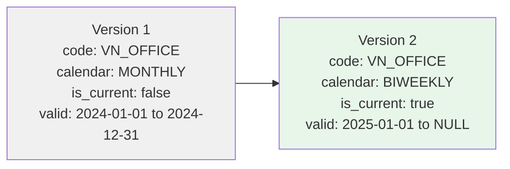

# PayGroup

**Module**: Payroll (PR)
**Submodule**: CONFIG
**Version**: 2.0
**Last Updated**: 2025-12-23

---

## Entity: PayGroup {#pay-group}

**Classification**: CORE_ENTITY  

**Definition**: Defines a group of employees processed together in the same payroll run with shared calendar and currency

**Purpose**: Organizes employees into logical payroll processing groups for efficient batch processing and reporting

**Key Characteristics**:
- Links employees to specific payroll calendar
- Defines currency for the group
- Optional bank account for payment processing
- SCD Type 2 for historical tracking
- Can be organized by department, location, or business unit
- Supports payroll profile assignment for policy management

---

### Attributes

| Attribute | Type | Required | Constraints | Description |
|-----------|------|----------|-------------|-------------|
| `id` | UUID | ✅ | PK | Primary identifier |
| `code` | varchar(50) | ✅ | UNIQUE, NOT NULL | Unique pay group code |
| `name` | varchar(100) | ✅ | NOT NULL | Pay group display name |
| `legal_entity_id` | UUID | ✅ | FK → Core.LegalEntity | Owning legal entity |
| `market_id` | UUID | ✅ | FK → Core.TalentMarket | Talent market |
| `calendar_id` | UUID | ✅ | FK → [PayCalendar](#pay-calendar) | Payroll calendar |
| `currency_code` | char(3) | ✅ | ISO 4217 | Payment currency |
| `bank_account_id` | UUID | ❌ | FK → BankAccount | Default bank account for payments |
| `metadata` | jsonb | ❌ | NULL | Additional flexible data |
| `created_at` | timestamp | ✅ | Auto-generated | Creation timestamp |
| `updated_at` | timestamp | ❌ | Auto-updated | Last modification timestamp |

---

### Relationships

> **📌 Note**: This section lists **structural relationships only** (foreign keys, references). For **business context** (how PayGroup organizes payroll processing), see [Concept Layer](../../../01-concept/02-processing/).

| Relationship | Target | Cardinality | Foreign Key | Purpose |
|--------------|--------|-------------|-------------|---------|
| `legal_entity` | Core.LegalEntity | N:1 | `legal_entity_id` | Owning legal entity for this pay group |
| `market` | Core.TalentMarket | N:1 | `market_id` | Talent market for localization |
| `calendar` | [PayCalendar](./02-pay-calendar.md) | N:1 | `calendar_id` | Payroll calendar defining schedule |
| `bank_account` | BankAccount (BANK) | N:1 | `bank_account_id` | Default bank account for group payments |
| `employees` | Core.Employee | 1:N | (inverse via assignment) | Employees assigned to this group |
| `payroll_batches` | PayrollBatch (PROCESSING) | 1:N | (inverse) | Payroll runs for this group |

**Relationship Notes**:
- Multiple pay groups can share the same calendar
- currency_code should match calendar's default_currency (can differ for special cases)
- bank_account_id is optional (can be specified at payment batch level)

---

### Business Rules

| Rule ID | Rule Name | Description | Validation Trigger |
|---------|-----------|-------------|----------------------|
| BR-PR-GRP-001 | Currency Consistency | Pay group currency should match calendar's default currency unless explicitly approved | On Create/Update |
| BR-PR-GRP-002 | Entity-Calendar Match | Pay group's legal_entity_id must match calendar's legal_entity_id | On Create/Update |
| BR-PR-GRP-003 | Active Calendar Required | Cannot assign inactive calendar to pay group | On Create/Update |
**Rule Details**:

#### BR-PR-GRP-001: Currency Consistency

**Condition**: When creating pay group  
**Logic**: System validates that `currency_code` matches calendar's `default_currency`  
**Error Message**: "Pay group currency '{currency}' should match calendar default currency '{calendar_currency}'"  
**Example**:
```yaml
Given: Calendar has default_currency = "VND"
When: User creates pay group with currency_code = "USD"
Then: System shows warning (can proceed with approval)
```

---

### Audit Fields

**Standard Audit**:
- `created_at`, `created_by`, `updated_at`, `updated_by`

**SCD Type 2** (applicable):
- `effective_start_date`, `effective_end_date`, `is_current_flag`

**SCD2 Pattern Visualization**:

---

### Examples

#### Example 1: Vietnam Office Workers

```yaml
PayGroup:
  code: "VN_OFFICE_MONTHLY"
  name: "Vietnam Office Workers - Monthly"
  legal_entity_id: "vng-corp-uuid"
  market_id: "vietnam-market-uuid"
  calendar_id: "vn-monthly-calendar-uuid"
  currency_code: "VND"
  bank_account_id: "vng-vietcombank-uuid"
  effective_start_date: "2025-01-01"
  is_current_flag: true
```

---

### Best Practices

✅ **DO**:
- Group employees by similar pay characteristics (frequency, currency)
- Use descriptive group codes indicating location and frequency
- Align currency with calendar default currency

❌ **DON'T**:
- Don't create too many small groups (impacts processing efficiency)
- Don't mix different currencies in same group
- Don't change calendar mid-period

---

### Related Entities

**Parent/Upstream**:
- **Core.LegalEntity**: Owns the pay group and defines organizational boundary
- [PayCalendar](./02-pay-calendar.md): Defines payroll processing schedule for this group
- BankAccount (BANK): Default payment method for group
- **Core.TalentMarket**: Provides market-specific regulations

**Children/Downstream**:
- **Core.Employee**: Employees assigned via employee-paygroup assignment
- PayrollBatch (PROCESSING): Batch payroll runs for this group
- PayrollEmployee (PROCESSING): Employee-level payroll data per run

**Peers/Related**:
- [PayProfile](./12-pay-profile.md): Policy rules applied to pay groups
- [PayElement](./04-pay-element.md): Elements available for this group

**Integration Points**:
- **Core Module (CO)**: Employee assignments and organizational structure
- **Time & Attendance (TA)**: Time data aggregated at pay group level
- **Banking**: Payment file generation per group

---

### Migration Notes

**Version History**:
- **v2.0 (2025-07-01)**: Added `market_id` for talent market linkage
- **v1.0 (2024-01-01)**: Initial pay group definition

**Deprecated Fields**: None

**Breaking Changes**:
- v2.0: `market_id` is now required (previously not present)

---

### Related Workflows

- [WF-PR-CONFIG-002](../workflows/config-workflows.md#wf-pr-config-002) - Pay Group Configuration
- [WF-PR-PROC-001](../workflows/processing-workflows.md#wf-pr-proc-001) - Standard Payroll Run

---

## References

- **Workflow Catalog**: [../workflows/config-workflows.md](../workflows/config-workflows.md)
- **Glossary**: [../glossary-config.md](../glossary-config.md) (quick reference)
- **Concept Guides**: [../../01-concept/02-config/](../../01-concept/02-config/)
- **Database Schema**: [../../03-design/5.Payroll.V3.dbml](../../03-design/5.Payroll.V3.dbml)
- **API Specification**: [../../02-spec/02-api-specification.md](../../02-spec/02-api-specification.md)

---

**Document Version**: 1.0 (Part 1 of 5)  
**Last Review**: 2025-12-23  
**Reviewed By**: xTalent Documentation Team

> [!NOTE]
> This document contains 3 of 13 CONFIG entities. Remaining entities (PayElement, BalanceDefinition, CostingRule, StatutoryRule, GLMapping, ValidationRule, PayslipTemplate, PayFormula, PayProfile, PayProfileMap) will be documented in subsequent parts.

---

## References

- **Sub-module Index**: [README.md](./README.md)
- **Glossary**: [../../glossary-config.md](../../glossary-config.md)
- **Database Schema**: [../../../03-design/5.Payroll.V3.dbml](../../../03-design/5.Payroll.V3.dbml)