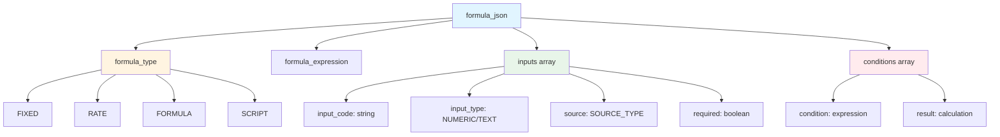
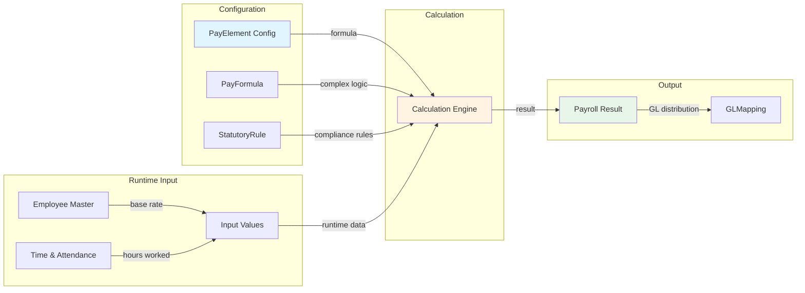
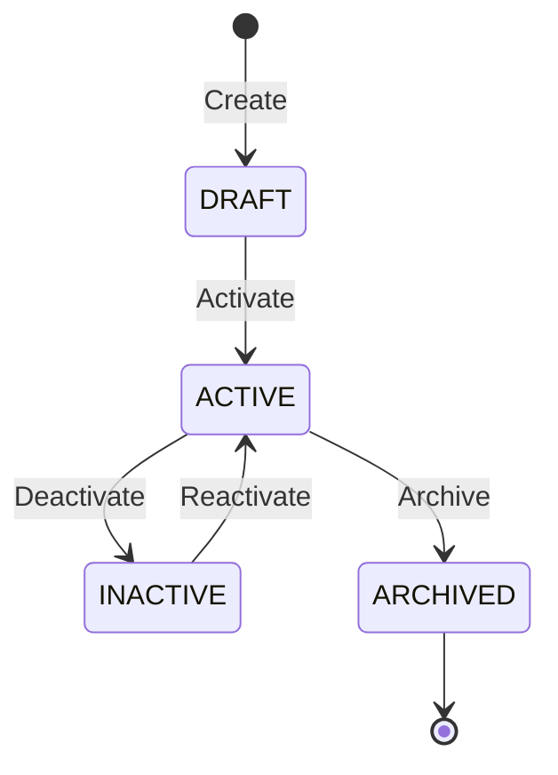
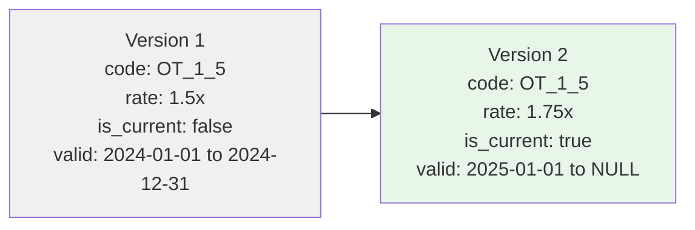

# PayElement

**Module**: Payroll (PR)
**Submodule**: CONFIG
**Version**: 2.0
**Last Updated**: 2025-12-23

---

## Entity: PayElement {#pay-element}

**Classification**: CORE_ENTITY  

**Definition**: Defines payroll elements including earnings, deductions, and taxes that can be calculated and applied during payroll processing

**Purpose**: Provides flexible configuration for all types of payroll compensation components with calculation formulas and tax treatment

**Key Characteristics**:
- Supports three classifications: EARNING, DEDUCTION, TAX
- Can have embedded calculation formulas or reference external formulas
- Links to statutory rules for compliance
- SCD Type 2 for historical tracking of element changes
- Supports both amount-based and hours-based elements
- Priority ordering for calculation sequence
- Tax treatment flags (taxable, pre-tax)

---

### Attributes

| Attribute | Type | Required | Constraints | Description |
|-----------|------|----------|-------------|-------------|
| `id` | UUID | ✅ | PK | Primary identifier |
| `code` | varchar(50) | ✅ | UNIQUE, NOT NULL | Unique element code (e.g., BASIC_SAL, OT_1_5, TAX_PIT) |
| `name` | varchar(100) | ✅ | NOT NULL | Element display name |
| `classification` | varchar(35) | ✅ | EARNING \| DEDUCTION \| TAX | Element type classification |
| `unit` | varchar(10) | ✅ | AMOUNT \| HOURS | Unit of measurement |
| `description` | text | ❌ | NULL | Detailed description of element purpose |
| `input_required` | boolean | ✅ | Default: false | Whether input value is required for calculation |
| `formula_json` | jsonb | ❌ | NULL | Embedded calculation formula |
| `priority_order` | smallint | ❌ | NULL | Calculation sequence priority (lower = earlier) |
| `taxable_flag` | boolean | ✅ | Default: true | Whether element is subject to tax |
| `pre_tax_flag` | boolean | ✅ | Default: true | Whether element is calculated before tax |
| `statutory_rule_id` | UUID | ❌ | FK → [StatutoryRule](#statutory-rule) | Linked statutory rule |
| `gl_account_code` | varchar(50) | ❌ | NULL | Default GL account code |
| `metadata` | jsonb | ❌ | NULL | Additional flexible data |
| `created_at` | timestamp | ✅ | Auto-generated | Creation timestamp |
| `updated_at` | timestamp | ❌ | Auto-updated | Last modification timestamp |

**Attribute Details**:

#### `formula_json`

**Type**: jsonb  
**Purpose**: Stores calculation formula for the element

**Structure**:
```yaml
formula_json:
  formula_type: "FIXED" | "RATE" | "FORMULA" | "SCRIPT"
  formula_expression: "[calculation logic]"
  inputs:
    - input_code: "RATE"
      input_type: "NUMERIC"
      default_value: 0
    - input_code: "HOURS"
      input_type: "NUMERIC"
      default_value: 0
  conditions:
    - condition: "[when to apply]"
      result: "[calculation if true]"
```

**Structure Diagram**:


**Validation**:
- formula_type must be one of: FIXED, RATE, FORMULA, SCRIPT
- For FORMULA type: formula_expression is required
- inputs array must define all required inputs

**Example - Overtime 1.5x**:
```json
{
  "formula_type": "RATE",
  "formula_expression": "BASIC_HOURLY_RATE * 1.5 * OT_HOURS",
  "inputs": [
    {
      "input_code": "BASIC_HOURLY_RATE",
      "input_type": "NUMERIC",
      "source": "EMPLOYEE_MASTER"
    },
    {
      "input_code": "OT_HOURS",
      "input_type": "NUMERIC",
      "source": "TIME_ATTENDANCE"
    }
  ]
}
```

---

### Relationships

> **📌 Note**: This section lists **structural relationships only** (foreign keys, references). For **business context** (how PayElement works with other entities in payroll workflows), see [Concept Layer](../../../01-concept/02-processing/).

| Relationship | Target | Cardinality | Foreign Key | Purpose |
|--------------|--------|-------------|-------------|---------|
| `statutory_rule` | [StatutoryRule](./07-statutory-rule.md) | N:1 | `statutory_rule_id` | Links to compliance rule (e.g., PIT, SI) |
| `gl_mappings` | [GLMapping](./08-gl-mapping.md) | 1:N | (inverse) | GL account mappings for this element |
| `benefit_links` | PayBenefitLink | 1:N | (inverse) | Links to TR benefit policies |
| `input_values` | InputValue (PROCESSING) | 1:N | (inverse) | Input values in payroll runs |
| `results` | PayrollResult (PROCESSING) | 1:N | (inverse) | Calculated results in payroll runs |

**Relationship Notes**:
- `statutory_rule_id` is optional (only for elements requiring statutory compliance like tax, SI)
- `gl_account_code` provides default GL account, can be overridden by GLMapping entity
- Elements can be referenced by PayFormula for complex calculations
- Cascade behavior: RESTRICT (cannot delete element with active payroll references)

**Data Flow** (PayElement in Payroll Calculation):


---

### Lifecycle States



**State Descriptions**:
- **DRAFT**: Element being configured, not yet available for payroll
- **ACTIVE**: Currently available for use in payroll processing
- **INACTIVE**: Temporarily disabled (e.g., seasonal element)
- **ARCHIVED**: Permanently retired, kept for historical records

**State Transition Rules**:
- Cannot activate element without valid formula (if formula_json is used)
- Cannot deactivate element if referenced by active payroll runs
- Cannot delete element (must archive instead for audit trail)

---

### Business Rules

| Rule ID | Rule Name | Description | Validation Trigger |
|---------|-----------|-------------|----------------------|
| BR-PR-ELEM-001 | Unique Element Code | Element code must be unique across all elements | On Create/Update |
| BR-PR-ELEM-002 | Valid Formula | If formula_json is provided, it must be valid and parseable | On Create/Update |
| BR-PR-ELEM-003 | Tax Element Rules | Elements with classification=TAX must have pre_tax_flag=false | On Create/Update |
| BR-PR-ELEM-004 | Priority Ordering | Elements with priority_order must be unique within same classification | On Create/Update |
| BR-PR-ELEM-005 | Statutory Rule Match | If statutory_rule_id is set, rule must be active and match element's market | On Create/Update |

**Rule Details**:

#### BR-PR-ELEM-001: Unique Element Code

**Condition**: When creating or updating an element  
**Logic**: System checks if another element exists with the same code  
**Error Message**: "Element code '{code}' already exists. Please use a unique code."  
**Example**:
```yaml
Scenario: Attempt to create duplicate element
  Given: Element BASIC_SAL exists
  When: User creates new element with code BASIC_SAL
  Then: System rejects with error
  Error: "Element code 'BASIC_SAL' already exists. Please use a unique code."
```

#### BR-PR-ELEM-003: Tax Element Rules

**Condition**: When classification is set to TAX  
**Logic**: System validates that pre_tax_flag is false and taxable_flag is false  
**Error Message**: "Tax elements must have pre_tax_flag=false and taxable_flag=false"  
**Example**:
```yaml
Scenario: Create tax element with correct flags
  Given: User creates element with classification=TAX
  When: pre_tax_flag=true
  Then: System rejects with error
  Error: "Tax elements must have pre_tax_flag=false and taxable_flag=false"
```

---

### Data Validation Rules

| Field | Validation | Error Message |
|-------|------------|---------------|
| `code` | Unique, 3-50 chars, alphanumeric+underscore | "Element code must be unique and 3-50 characters" |
| `classification` | Must be EARNING, DEDUCTION, or TAX | "Invalid classification. Must be EARNING, DEDUCTION, or TAX" |
| `unit` | Must be AMOUNT or HOURS | "Invalid unit. Must be AMOUNT or HOURS" |
| `priority_order` | Integer 1-999 | "Priority order must be between 1 and 999" |
| `formula_json` | Valid JSON structure | "Invalid formula JSON structure" |

---

### Constraints

| Constraint Name | Type | Columns | Description |
|-----------------|------|---------|-------------|
| `pk_pay_element` | PRIMARY KEY | `id` | Primary key constraint |
| `uk_pay_element_code` | UNIQUE | `code` | Business code must be unique |
| `fk_pay_element_statutory_rule` | FOREIGN KEY | `statutory_rule_id` → `statutory_rule.id` | Reference to statutory rule |
| `ck_pay_element_classification` | CHECK | `classification IN ('EARNING','DEDUCTION','TAX')` | Valid classification |
| `ck_pay_element_unit` | CHECK | `unit IN ('AMOUNT','HOURS')` | Valid unit |

---

### Indexes

| Index Name | Columns | Unique | Type | Purpose |
|------------|---------|--------|------|---------|
| `idx_pay_element_code` | `code` | ✅ | B-tree | Fast lookup by business code |
| `idx_pay_element_classification` | `classification` | ❌ | B-tree | Filter by element type |
| `idx_pay_element_priority` | `priority_order` | ❌ | B-tree | Calculation sequence ordering |
| `idx_pay_element_dates` | `effective_start_date, effective_end_date` | ❌ | B-tree | SCD2 temporal queries |
| `idx_pay_element_current` | `is_current_flag` WHERE `is_current_flag = true` | ❌ | Partial | Fast current version lookup |

---

### Audit Fields

**Standard Audit** (all entities):

| Field | Type | Description |
|-------|------|-------------|
| `created_at` | timestamp | When record was created |
| `updated_at` | timestamp | Last modification time |

**SCD Type 2** (applicable):

| Field | Type | Description |
|-------|------|-------------|
| `effective_start_date` | date | When this version becomes effective |
| `effective_end_date` | date | When this version expires (NULL = current) |
| `is_current_flag` | boolean | `true` for current version, `false` for historical |

**SCD2 Notes**:
- Only one record has `is_current_flag = true` per business key (`code`)
- Temporal queries use `effective_start_date` and `effective_end_date`
- Updates create new version, old version's `is_current_flag` set to `false`
- Never physically delete SCD2 records

**SCD2 Pattern Visualization**:


---

### Examples

#### Example 1: Basic Salary (Fixed Amount)

**Description**: Monthly basic salary element

```yaml
PayElement:
  id: "elem-basic-sal-uuid"
  code: "BASIC_SAL"
  name: "Basic Salary"
  classification: "EARNING"
  unit: "AMOUNT"
  description: "Monthly basic salary"
  input_required: false
  formula_json:
    formula_type: "FIXED"
    formula_expression: "EMPLOYEE.BASIC_SALARY"
  priority_order: 10
  taxable_flag: true
  pre_tax_flag: true
  statutory_rule_id: null
  gl_account_code: "5100"
  effective_start_date: "2025-01-01"
  is_current_flag: true
```

**Business Context**: Basic salary is typically the first element calculated, pulled from employee master data

#### Example 2: Overtime 1.5x (Calculated)

**Description**: Overtime at 1.5x rate

```yaml
PayElement:
  code: "OT_1_5"
  name: "Overtime 1.5x"
  classification: "EARNING"
  unit: "HOURS"
  description: "Overtime hours at 1.5x hourly rate"
  input_required: true
  formula_json:
    formula_type: "RATE"
    formula_expression: "BASIC_HOURLY_RATE * 1.5 * OT_HOURS"
    inputs:
      - input_code: "OT_HOURS"
        input_type: "NUMERIC"
        source: "TIME_ATTENDANCE"
        required: true
  priority_order: 20
  taxable_flag: true
  pre_tax_flag: true
  gl_account_code: "5110"
  effective_start_date: "2025-01-01"
  is_current_flag: true
```

**Business Context**: Requires OT hours input from Time & Attendance, calculated at 1.5x base hourly rate

#### Example 3: Personal Income Tax (Statutory)

**Description**: Vietnam Personal Income Tax

```yaml
PayElement:
  code: "TAX_PIT_VN"
  name: "Personal Income Tax (VN)"
  classification: "TAX"
  unit: "AMOUNT"
  description: "Vietnam Personal Income Tax calculated per progressive tax brackets"
  input_required: false
  formula_json:
    formula_type: "SCRIPT"
    formula_expression: "CALL_STATUTORY_RULE('VN_PIT_2025')"
  priority_order: 900
  taxable_flag: false
  pre_tax_flag: false
  statutory_rule_id: "vn-pit-rule-uuid"
  gl_account_code: "2200"
  effective_start_date: "2025-01-01"
  is_current_flag: true
```

**Business Context**: Tax elements calculated after all earnings and pre-tax deductions, using statutory rules

#### Example 4: Social Insurance Deduction

**Description**: Vietnam Social Insurance employee contribution

```yaml
PayElement:
  code: "DEDUCT_SI_VN"
  name: "Social Insurance (Employee)"
  classification: "DEDUCTION"
  unit: "AMOUNT"
  description: "Employee contribution to Vietnam Social Insurance (8% of gross)"
  input_required: false
  formula_json:
    formula_type: "FORMULA"
    formula_expression: "GROSS_SALARY * 0.08"
    conditions:
      - condition: "GROSS_SALARY <= 29800000"
        result: "GROSS_SALARY * 0.08"
      - condition: "GROSS_SALARY > 29800000"
        result: "29800000 * 0.08"
  priority_order: 800
  taxable_flag: false
  pre_tax_flag: true
  statutory_rule_id: "vn-si-rule-uuid"
  gl_account_code: "2100"
  effective_start_date: "2025-01-01"
  is_current_flag: true
```

**Business Context**: Pre-tax deduction with statutory cap, calculated before PIT

---

### Best Practices

✅ **DO**:
- Use clear, descriptive element codes (BASIC_SAL, OT_1_5, not E001, E002)
- Set appropriate priority_order to ensure correct calculation sequence
- Document formula logic in description field
- Use statutory_rule_id for compliance-driven elements
- Test formulas thoroughly before activating
- Create new SCD2 version when changing formula mid-year

❌ **DON'T**:
- Don't create duplicate elements for same purpose
- Don't hardcode values that should be configurable
- Don't skip priority_order for elements with dependencies
- Don't change formula during active payroll period (create new version)
- Don't delete elements referenced by historical payroll runs
- Don't mix currency-specific logic in formulas (use market-specific rules)

**Performance Tips**:
- Use indexed fields (`code`, `classification`) in WHERE clauses
- Cache active elements in application layer (elements rarely change mid-cycle)
- Minimize complex `formula_json` (use PayFormula entity for very complex logic)
- Batch element lookups when processing payroll (don't query one-by-one)
- Use partial index on `is_current_flag = true` for current version queries
- Pre-compile formulas in calculation engine for performance
- Consider element result caching within same payroll batch

**Security Considerations**:
- Restrict element modification to Payroll Administrators role only
- Audit all formula changes (SCD2 provides automatic audit trail)
- Validate `formula_json` to prevent code injection attacks
- Sanitize formula expressions before execution
- Encrypt sensitive element configurations (e.g., executive compensation)
- Log all element access for compliance auditing
- Implement approval workflow for formula changes
- Restrict access to elements with `classification = TAX` to authorized users only

---

### Related Entities

**Parent/Upstream**:
- [StatutoryRule](./07-statutory-rule.md) - Provides statutory compliance rules (e.g., tax brackets)
- [PayFormula](./11-pay-formula.md) - Reusable calculation formulas for complex logic

**Children/Downstream**:
- [GLMapping](./08-gl-mapping.md) - GL account mappings for costing
- PayBenefitLink - Benefit policy links (in Total Rewards module)
- InputValue (PROCESSING) - Runtime input values for payroll runs
- PayrollResult (PROCESSING) - Calculated results per employee per run

**Peers/Related**:
- [BalanceDefinition](./05-balance-definition.md) - Balances that accumulate element results
- [PayGroup](./03-pay-group.md) - Determines which elements apply to employees

**Integration Points**:
- **Time & Attendance (TA)**: Provides hours input for time-based elements (OT, regular hours)
- **Total Rewards (TR)**: Compensation and benefits configuration drive element values
- **Accounting/GL**: GL account mapping for financial costing and reporting
- **Core.Employee**: Employee master data provides base rates and assignment info

---

### Related Workflows

- [WF-PR-CONFIG-003](../workflows/config-workflows.md#wf-pr-config-003) - Pay Element Management (CREATE/UPDATE element)
- [WF-PR-CONFIG-004](../workflows/config-workflows.md#wf-pr-config-004) - Formula & Rule Configuration (CONFIGURE formula)
- [WF-PR-PROC-001](../workflows/processing-workflows.md#wf-pr-proc-001) - Standard Payroll Run (USES elements for calculation)

**Workflow Context**: PayElement is configured during payroll setup and referenced during every payroll calculation. Elements are processed in priority_order sequence.

---

### Migration Notes

**Version History**:
- **v2.0 (2025-07-01)**: Added `statutory_rule_id` for compliance linkage
- **v2.0 (2025-07-01)**: Added `gl_account_code` for default GL mapping
- **v2.0 (2025-07-01)**: Implemented SCD Type 2 for historical tracking
- **v1.0 (2024-01-01)**: Initial element definition

**Deprecated Fields**:
- None

**Breaking Changes**:
- v2.0: SCD2 fields now required (effective_start_date, effective_end_date, is_current_flag)

---

---

## References

- **Sub-module Index**: [README.md](./README.md)
- **Glossary**: [../../glossary-config.md](../../glossary-config.md)
- **Database Schema**: [../../../03-design/5.Payroll.V3.dbml](../../../03-design/5.Payroll.V3.dbml)