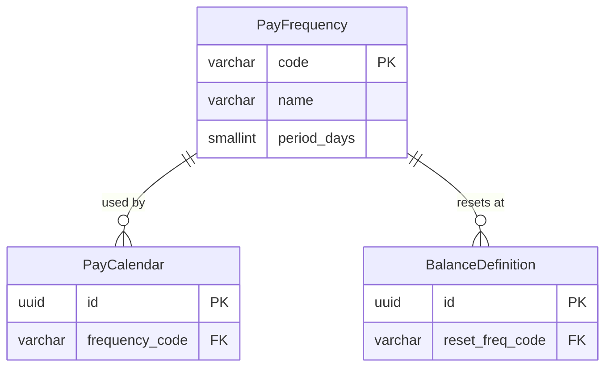

# PayFrequency

**Module**: Payroll (PR)  
**Submodule**: CONFIG  
**Version**: 2.0  
**Last Updated**: 2025-12-23

---

## Entity: PayFrequency {#pay-frequency}

**Classification**: REFERENCE_DATA

**Definition**: Defines standard payroll frequency patterns (monthly, bi-weekly, weekly, etc.) used across the organization

**Purpose**: Provides standardized frequency codes that determine payroll processing cycles and balance reset periods

**Key Characteristics**:
- Simple reference table with predefined frequency codes
- Includes period length in days for calculation purposes
- Used by PayCalendar and BalanceDefinition
- Immutable reference data (rarely changes)
- **SCD Type 2**: No - reference data, changes are extremely rare

---

### Attributes

| Attribute | Type | Required | Constraints | Description |
|-----------|------|----------|-------------|-------------|
| `code` | varchar(20) | ✅ | PK, UNIQUE | Frequency code (MONTHLY, BIWEEKLY, WEEKLY, SEMIMONTHLY) |
| `name` | varchar(50) | ✅ | NOT NULL | Display name of frequency |
| `period_days` | smallint | ✅ | > 0 | Approximate number of days in standard period |

---

### Relationships

> **📌 Note**: Structural relationships only. For business context, see [Concept Layer](../../../01-concept/01-config/).

#### Entity Relationship Diagram



#### Relationship Details

| Relationship | Target | Cardinality | Foreign Key | Purpose |
|--------------|--------|-------------|-------------|---------|
| `calendars` | [PayCalendar](./02-pay-calendar.md) | 1:N | (inverse) | Calendars using this frequency for payroll cycles |
| `balance_resets` | [BalanceDefinition](./05-balance-definition.md) | 1:N | (inverse) | Balances that reset at this frequency (YTD, QTD) |

**Integration Points**:
- **Payroll Processing**: Determines payroll run frequency
- **Balance Management**: Defines balance reset periods (YTD, QTD)
- **Reporting**: Groups payroll data by frequency periods

---

### Data Validation & Constraints

> **Note**: Entity-specific validation rules only.

| Field | Validation | Error Message |
|-------|------------|---------------|
| `code` | Unique, uppercase, alphanumeric | "Frequency code must be unique and uppercase" |
| `name` | 1-50 chars, not empty | "Name is required and must be 1-50 characters" |
| `period_days` | Integer 1-365 | "Period days must be between 1 and 365" |

**Database Constraints**:
- `pk_pay_frequency`: PRIMARY KEY (`code`)
- `uk_pay_frequency_name`: UNIQUE (`name`)
- `ck_pay_frequency_days`: CHECK (`period_days > 0 AND period_days <= 365`)

---

### Examples

#### Example 1: Monthly Frequency

```yaml
PayFrequency:
  code: "MONTHLY"
  name: "Monthly"
  period_days: 30
```

**Business Context**: Most common frequency in Vietnam, payment typically on 5th of following month

#### Example 2: Bi-Weekly Frequency

```yaml
PayFrequency:
  code: "BIWEEKLY"
  name: "Bi-Weekly"
  period_days: 14
```

**Business Context**: Common in US/Singapore operations, payment every 2 weeks

#### Example 3: Semi-Monthly Frequency

```yaml
PayFrequency:
  code: "SEMIMONTHLY"
  name: "Semi-Monthly"
  period_days: 15
```

**Business Context**: Pays twice per month (e.g., 15th and last day), common in US

---

### Best Practices

✅ **DO**:
- Use standard industry codes (MONTHLY, BIWEEKLY, WEEKLY, SEMIMONTHLY)
- Keep period_days as approximate average for calculations
- Document country-specific frequency variations in comments

❌ **DON'T**:
- Don't create custom frequency codes without business justification
- Don't modify period_days after calendars are using the frequency
- Don't delete frequencies referenced by active calendars

**Performance Tips**:
- PayFrequency is reference data - cache indefinitely in application layer
- Very small table (~10 rows) - no special indexing needed beyond PK
- Pre-load all frequencies at application startup

**Security Considerations**:
- Restrict frequency modification to System Administrators only
- Frequency changes are rare and should require approval
- Audit any frequency modifications (impacts all calendars)

---

### Migration Notes

**Version History**:
- **v2.0 (2025-01-01)**: Added SEMIMONTHLY frequency for US operations
- **v1.0 (2024-01-01)**: Initial frequency definitions

**Deprecated Fields**: None

**Breaking Changes**: None

---

## References

- **Sub-module Index**: [README.md](./README.md)
- **Concept Guides**: [../../../01-concept/01-config/](../../../01-concept/01-config/)
- **Database Schema**: [../../../03-design/5.Payroll.V3.dbml](../../../03-design/5.Payroll.V3.dbml)