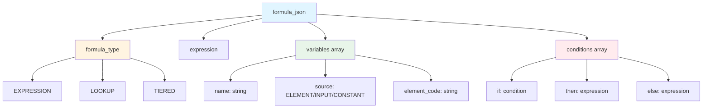
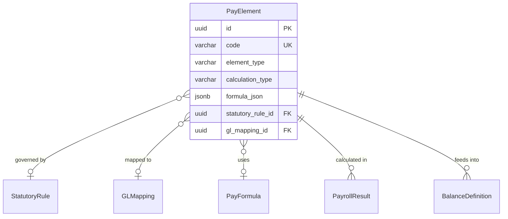
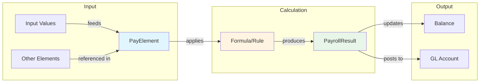
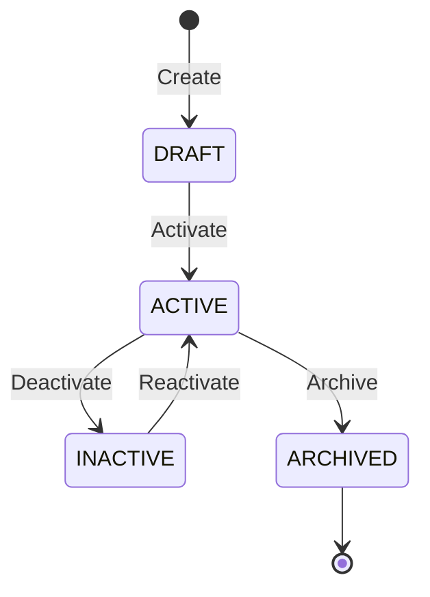

# PayElement

**Module**: Payroll (PR)  
**Submodule**: CONFIG  
**Version**: 2.0  
**Last Updated**: 2025-12-23

---

## Entity: PayElement {#pay-element}

**Classification**: CORE_ENTITY

**Definition**: Defines a payroll element (earning, deduction, benefit, tax) with calculation rules and accounting treatment

**Purpose**: Represents individual components of payroll calculation including salary, bonuses, deductions, taxes, and benefits with their calculation formulas and GL mappings

**Key Characteristics**:
- Supports multiple element types (EARNING, DEDUCTION, BENEFIT, TAX, EMPLOYER_CONTRIBUTION)
- Contains calculation formula in JSON for flexible computation
- Links to statutory rules for compliance
- Maps to GL accounts for accounting integration
- Supports both recurring and one-time elements
- **SCD Type 2**: Yes - tracks historical changes to formulas and configurations

---

### Attributes

| Attribute | Type | Required | Constraints | Description |
|-----------|------|----------|-------------|-------------|
| `id` | UUID | ✅ | PK | Primary identifier |
| `code` | varchar(50) | ✅ | UNIQUE, NOT NULL | Unique element code (e.g., BASIC_SALARY, TAX_PIT) |
| `name` | varchar(100) | ✅ | NOT NULL | Element display name |
| `element_type` | varchar(30) | ✅ | ENUM | Type: EARNING, DEDUCTION, BENEFIT, TAX, EMPLOYER_CONTRIBUTION |
| `calculation_type` | varchar(30) | ✅ | ENUM | FIXED, FORMULA, RATE, PERCENTAGE |
| `formula_json` | jsonb | ❌ | NULL | Calculation formula (required if calculation_type = FORMULA) |
| `default_value` | decimal(15,2) | ❌ | NULL | Default value for FIXED type |
| `is_taxable` | boolean | ✅ | DEFAULT false | Whether element is subject to income tax |
| `is_recurring` | boolean | ✅ | DEFAULT true | Recurring (monthly) vs one-time element |
| `statutory_rule_id` | UUID | ❌ | FK → StatutoryRule | Linked statutory rule (for taxes, social insurance) |
| `gl_mapping_id` | UUID | ❌ | FK → GLMapping | GL account mapping |
| `metadata` | jsonb | ❌ | NULL | Additional flexible data |
| `created_at` | timestamp | ✅ | Auto | Creation timestamp |
| `updated_at` | timestamp | ❌ | Auto | Last modification timestamp |

**Attribute Details**:

#### `formula_json`

**Type**: jsonb  
**Purpose**: Stores calculation formula for complex element computations

**Structure**:
```yaml
formula_json:
  formula_type: "EXPRESSION" | "LOOKUP" | "TIERED"
  expression: "BASE_SALARY * 0.15"  # For EXPRESSION type
  variables:                         # Variables used in formula
    - name: "BASE_SALARY"
      source: "ELEMENT"
      element_code: "BASIC_SALARY"
  conditions:                        # Optional conditions
    - if: "EMPLOYMENT_TYPE == 'FULLTIME'"
      then: "BASE_SALARY * 0.15"
      else: "BASE_SALARY * 0.10"
```

**Structure Diagram**:


**Validation**:
- `expression` must be valid mathematical expression
- `variables` must reference existing elements or inputs
- For TIERED type: must include tier brackets

---

### Relationships

> **📌 Note**: Structural relationships only. For business context, see [Concept Layer](../../../01-concept/02-processing/).

#### Entity Relationship Diagram



#### Relationship Details

| Relationship | Target | Cardinality | Foreign Key | Purpose |
|--------------|--------|-------------|-------------|---------|
| `statutory_rule` | [StatutoryRule](./07-statutory-rule.md) | N:1 | `statutory_rule_id` | Statutory calculation rule (for taxes, social insurance) |
| `gl_mapping` | [GLMapping](./08-gl-mapping.md) | N:1 | `gl_mapping_id` | GL account mapping for accounting |
| `formula` | [PayFormula](./11-pay-formula.md) | N:1 | (via formula_json) | Reusable formula definition |
| `payroll_results` | PayrollResult (PROCESSING) | 1:N | (inverse) | Calculated values in payroll runs |
| `balance_definitions` | [BalanceDefinition](./05-balance-definition.md) | 1:N | (inverse) | Balances that accumulate this element |

**Relationship Notes**:
- statutory_rule_id is required for TAX and EMPLOYER_CONTRIBUTION types
- gl_mapping_id is required for accounting integration
- formula_json can reference other PayElements for cascading calculations

**Integration Points**:
- **Total Rewards (TR)**: Compensation elements (bonuses, allowances)
- **Time & Attendance (TA)**: Overtime elements calculated from time data
- **Accounting/GL**: GL posting via gl_mapping_id

**Data Flow**:


---

### Lifecycle States



**State Descriptions**:
- **DRAFT**: Element being configured, not yet used in payroll
- **ACTIVE**: Currently in use for payroll calculations
- **INACTIVE**: Temporarily disabled (e.g., seasonal elements)
- **ARCHIVED**: Permanently retired, kept for historical records

**State Transition Rules**:
- Cannot activate element without valid formula_json (if calculation_type = FORMULA)
- Cannot deactivate element used in active payroll runs
- Cannot delete element (must archive for audit trail)

---

### Data Validation & Constraints

> **Note**: Entity-specific validation rules only. Complex business rules belong in Spec layer.

| Field | Validation | Error Message |
|-------|------------|---------------|
| `code` | Unique, 3-50 chars, uppercase, alphanumeric+underscore | "Element code must be unique and uppercase" |
| `element_type` | Must be valid enum value | "Invalid element type" |
| `calculation_type` | Must be valid enum value | "Invalid calculation type" |
| `formula_json` | Required if calculation_type = FORMULA | "Formula is required for FORMULA calculation type" |
| `default_value` | Required if calculation_type = FIXED | "Default value is required for FIXED calculation type" |

**Database Constraints**:
- `pk_pay_element`: PRIMARY KEY (`id`)
- `uk_pay_element_code`: UNIQUE (`code`)
- `fk_pay_element_statutory_rule`: FOREIGN KEY (`statutory_rule_id` → `statutory_rule.id`)
- `fk_pay_element_gl_mapping`: FOREIGN KEY (`gl_mapping_id` → `gl_mapping.id`)
- `ck_pay_element_type`: CHECK (`element_type IN ('EARNING','DEDUCTION','BENEFIT','TAX','EMPLOYER_CONTRIBUTION')`)
- `ck_pay_element_calc_type`: CHECK (`calculation_type IN ('FIXED','FORMULA','RATE','PERCENTAGE')`)

---

### Examples

#### Example 1: Basic Salary (Fixed Earning)

```yaml
PayElement:
  code: "BASIC_SALARY"
  name: "Basic Salary"
  element_type: "EARNING"
  calculation_type: "FIXED"
  default_value: null  # Varies per employee
  is_taxable: true
  is_recurring: true
  gl_mapping_id: "gl-salary-expense-uuid"
```

**Business Context**: Base salary, taxable, recurring monthly

#### Example 2: Performance Bonus (Formula-based)

```yaml
PayElement:
  code: "PERF_BONUS"
  name: "Performance Bonus"
  element_type: "EARNING"
  calculation_type: "FORMULA"
  formula_json:
    formula_type: "EXPRESSION"
    expression: "BASIC_SALARY * PERFORMANCE_RATING * 0.1"
    variables:
      - name: "BASIC_SALARY"
        source: "ELEMENT"
        element_code: "BASIC_SALARY"
      - name: "PERFORMANCE_RATING"
        source: "INPUT"
        input_name: "performance_rating"
  is_taxable: true
  is_recurring: false
  gl_mapping_id: "gl-bonus-expense-uuid"
```

**Business Context**: Quarterly bonus based on performance rating

#### Example 3: Personal Income Tax (Statutory)

```yaml
PayElement:
  code: "TAX_PIT"
  name: "Personal Income Tax"
  element_type: "TAX"
  calculation_type: "FORMULA"
  formula_json:
    formula_type: "TIERED"
    tiers:
      - from: 0
        to: 5000000
        rate: 0.05
      - from: 5000001
        to: 10000000
        rate: 0.10
      - from: 10000001
        to: null
        rate: 0.15
  is_taxable: false
  is_recurring: true
  statutory_rule_id: "vietnam-pit-rule-uuid"
  gl_mapping_id: "gl-tax-payable-uuid"
```

**Business Context**: Vietnam PIT with progressive tax brackets

---

### Best Practices

✅ **DO**:
- Use descriptive element codes (BASIC_SALARY, not SAL01)
- Test formulas thoroughly before activating
- Document formula variables and logic in metadata
- Create new SCD2 version when changing formulas
- Link to statutory rules for compliance elements

❌ **DON'T**:
- Don't create circular formula dependencies
- Don't change formulas during active payroll period
- Don't delete elements (archive instead)
- Don't mix element types in formulas (earnings with deductions)
- Don't hardcode values that should be configurable

**Performance Tips**:
- Cache active element configurations
- Pre-compile formula expressions for faster calculation
- Index on element_type and is_recurring for filtering
- Use formula_json efficiently (avoid deep nesting)

**Security Considerations**:
- Restrict element modification to Payroll Administrators
- Audit formula changes (impacts all employees)
- Validate formula expressions to prevent injection attacks
- Monitor for anomalous calculation results

---

### Migration Notes

**Version History**:
- **v2.0 (2025-07-01)**: Added `formula_json` for flexible calculations
- **v2.0 (2025-07-01)**: Added `statutory_rule_id` for compliance
- **v1.0 (2024-01-01)**: Initial element definition

**Deprecated Fields**:
- `formula_text`: Replaced by `formula_json` in v2.0

**Breaking Changes**:
- v2.0: `formula_json` structure changed (migration script required)

---

## References

- **Sub-module Index**: [README.md](./README.md)
- **Concept Guides**: [../../../01-concept/01-config/](../../../01-concept/01-config/)
- **Database Schema**: [../../../03-design/5.Payroll.V3.dbml](../../../03-design/5.Payroll.V3.dbml)
