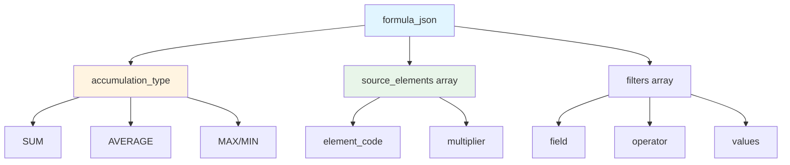
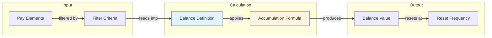
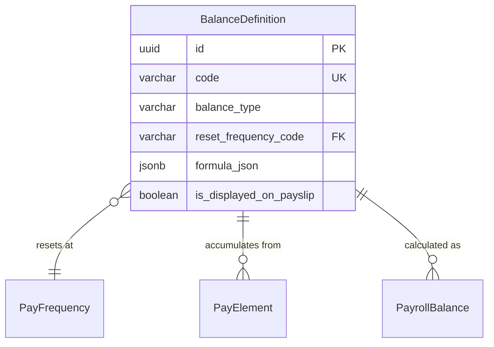

# BalanceDefinition

**Module**: Payroll (PR)  
**Submodule**: CONFIG  
**Version**: 2.0  
**Last Updated**: 2025-12-23

---

## Entity: BalanceDefinition {#balance-definition}

**Classification**: CORE_ENTITY

**Definition**: Defines a payroll balance (YTD, QTD, MTD) that accumulates values from pay elements over time

**Purpose**: Tracks cumulative totals for earnings, deductions, taxes, and other payroll components across different time periods for reporting and compliance

**Key Characteristics**:
- Supports multiple balance types (YTD, QTD, MTD, CUSTOM)
- Links to pay elements that feed the balance
- Defines reset frequency based on PayFrequency
- Contains accumulation formula in JSON
- Used for tax reporting, compliance, and payslips
- **SCD Type 2**: Yes - tracks historical changes to balance definitions and formulas

---

### Attributes

| Attribute | Type | Required | Constraints | Description |
|-----------|------|----------|-------------|-------------|
| `id` | UUID | ✅ | PK | Primary identifier |
| `code` | varchar(50) | ✅ | UNIQUE, NOT NULL | Unique balance code (e.g., YTD_GROSS_PAY) |
| `name` | varchar(100) | ✅ | NOT NULL | Balance display name |
| `balance_type` | varchar(20) | ✅ | ENUM | Type: YTD, QTD, MTD, CUSTOM |
| `reset_frequency_code` | varchar(20) | ✅ | FK → PayFrequency | How often balance resets |
| `formula_json` | jsonb | ✅ | NOT NULL | Accumulation formula |
| `is_displayed_on_payslip` | boolean | ✅ | DEFAULT false | Show on employee payslip |
| `metadata` | jsonb | ❌ | NULL | Additional flexible data |
| `created_at` | timestamp | ✅ | Auto | Creation timestamp |
| `updated_at` | timestamp | ❌ | Auto | Last modification timestamp |

**Attribute Details**:

#### `formula_json`

**Type**: jsonb  
**Purpose**: Defines which pay elements contribute to this balance and how

**Structure**:
```yaml
formula_json:
  accumulation_type: "SUM" | "AVERAGE" | "MAX" | "MIN"
  source_elements:
    - element_code: "BASIC_SALARY"
      multiplier: 1.0
    - element_code: "ALLOWANCE"
      multiplier: 1.0
  filters:
    - field: "element_type"
      operator: "IN"
      values: ["EARNING", "BENEFIT"]
```

**Structure Diagram**:


**Balance Calculation Flow**:


---

### Relationships

> **📌 Note**: Structural relationships only. For business context, see [Concept Layer](../../../01-concept/02-processing/).

#### Entity Relationship Diagram



#### Relationship Details

| Relationship | Target | Cardinality | Foreign Key | Purpose |
|--------------|--------|-------------|-------------|---------|
| `reset_frequency` | [PayFrequency](./01-pay-frequency.md) | N:1 | `reset_frequency_code` | Defines when balance resets (MONTHLY, YEARLY) |
| `source_elements` | [PayElement](./04-pay-element.md) | N:N | (via formula_json) | Pay elements that feed this balance |
| `payroll_balances` | PayrollBalance (PROCESSING) | 1:N | (inverse) | Actual balance values per employee per period |

**Integration Points**:
- **Payroll Processing**: Balance values calculated during payroll run
- **Reporting**: YTD/QTD balances for compliance reports
- **Payslip**: Displayed balances on employee payslips

---

### Data Validation & Constraints

> **Note**: Entity-specific validation rules only.

| Field | Validation | Error Message |
|-------|------------|---------------|
| `code` | Unique, 3-50 chars, uppercase, alphanumeric+underscore | "Balance code must be unique and uppercase" |
| `balance_type` | Must be valid enum value | "Invalid balance type" |
| `formula_json.source_elements` | Must reference existing pay elements | "Invalid element code in formula" |

**Database Constraints**:
- `pk_balance_definition`: PRIMARY KEY (`id`)
- `uk_balance_definition_code`: UNIQUE (`code`)
- `fk_balance_definition_frequency`: FOREIGN KEY (`reset_frequency_code` → `pay_frequency.code`)
- `ck_balance_definition_type`: CHECK (`balance_type IN ('YTD','QTD','MTD','CUSTOM')`)

---

### Examples

#### Example 1: Year-to-Date Gross Pay

```yaml
BalanceDefinition:
  code: "YTD_GROSS_PAY"
  name: "Year-to-Date Gross Pay"
  balance_type: "YTD"
  reset_frequency_code: "YEARLY"
  formula_json:
    accumulation_type: "SUM"
    source_elements:
      - element_code: "BASIC_SALARY"
        multiplier: 1.0
      - element_code: "OVERTIME_PAY"
        multiplier: 1.0
      - element_code: "BONUS"
        multiplier: 1.0
    filters:
      - field: "element_type"
        operator: "="
        values: ["EARNING"]
  is_displayed_on_payslip: true
```

**Business Context**: Accumulates all earnings from Jan 1 to current period, resets yearly

#### Example 2: Monthly Tax Deduction

```yaml
BalanceDefinition:
  code: "MTD_TAX"
  name: "Month-to-Date Tax"
  balance_type: "MTD"
  reset_frequency_code: "MONTHLY"
  formula_json:
    accumulation_type: "SUM"
    source_elements:
      - element_code: "TAX_PIT"
        multiplier: 1.0
    filters:
      - field: "element_type"
        operator: "="
        values: ["TAX"]
  is_displayed_on_payslip: true
```

**Business Context**: Tracks tax withheld in current month, resets monthly

---

### Best Practices

✅ **DO**:
- Use descriptive balance codes (YTD_GROSS_PAY, not BAL01)
- Test accumulation formulas with sample data
- Document which elements feed each balance
- Create new SCD2 version when changing formulas

❌ **DON'T**:
- Don't create circular dependencies in formulas
- Don't change formulas mid-period
- Don't delete balances (archive instead)
- Don't mix incompatible element types

**Performance Tips**:
- Cache balance definitions
- Pre-calculate balances during payroll run
- Index on balance_type and reset_frequency_code

**Security Considerations**:
- Restrict balance modification to Payroll Administrators
- Audit formula changes
- Validate formula expressions

---

### Migration Notes

**Version History**:
- **v2.0 (2025-07-01)**: Added `formula_json` for flexible accumulation
- **v1.0 (2024-01-01)**: Initial balance definition

**Deprecated Fields**: None

**Breaking Changes**: None

---

## References

- **Sub-module Index**: [README.md](./README.md)
- **Concept Guides**: [../../../01-concept/01-config/](../../../01-concept/01-config/)
- **Database Schema**: [../../../03-design/5.Payroll.V3.dbml](../../../03-design/5.Payroll.V3.dbml)
