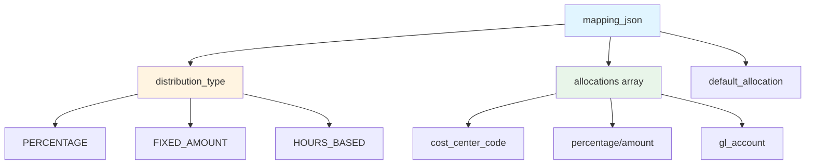
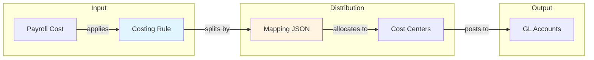
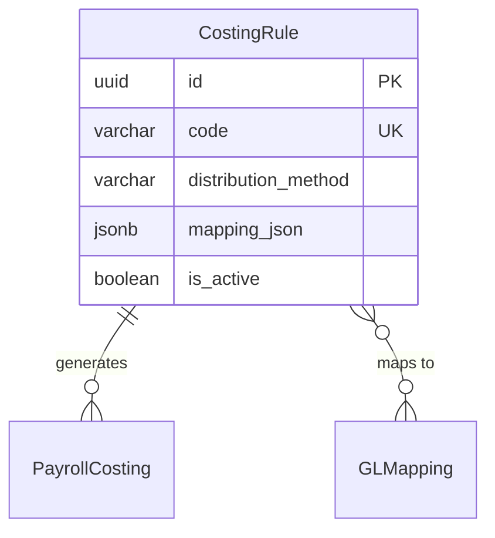

# CostingRule

**Module**: Payroll (PR)  
**Submodule**: CONFIG  
**Version**: 2.0  
**Last Updated**: 2025-12-23

---

## Entity: CostingRule {#costing-rule}

**Classification**: CORE_ENTITY

**Definition**: Defines rules for distributing payroll costs across cost centers, departments, or projects

**Purpose**: Enables allocation of payroll expenses to multiple cost centers based on employee assignments, percentages, or custom rules for accurate financial reporting

**Key Characteristics**:
- Supports multiple distribution methods (PERCENTAGE, FIXED_AMOUNT, HOURS_BASED)
- Contains mapping rules in JSON for flexible allocation
- Links to GL accounts via GLMapping
- Can distribute costs across multiple dimensions
- Used for cost accounting and financial reporting
- **SCD Type 2**: Yes - tracks historical changes to costing rules

---

### Attributes

| Attribute | Type | Required | Constraints | Description |
|-----------|------|----------|-------------|-------------|
| `id` | UUID | ✅ | PK | Primary identifier |
| `code` | varchar(50) | ✅ | UNIQUE, NOT NULL | Unique costing rule code |
| `name` | varchar(100) | ✅ | NOT NULL | Costing rule display name |
| `distribution_method` | varchar(30) | ✅ | ENUM | Method: PERCENTAGE, FIXED_AMOUNT, HOURS_BASED, CUSTOM |
| `mapping_json` | jsonb | ✅ | NOT NULL | Cost distribution mapping rules |
| `is_active` | boolean | ✅ | DEFAULT true | Whether rule is currently active |
| `metadata` | jsonb | ❌ | NULL | Additional flexible data |
| `created_at` | timestamp | ✅ | Auto | Creation timestamp |
| `updated_at` | timestamp | ❌ | Auto | Last modification timestamp |

**Attribute Details**:

#### `mapping_json`

**Type**: jsonb  
**Purpose**: Defines how costs are distributed across cost centers

**Structure**:
```yaml
mapping_json:
  distribution_type: "PERCENTAGE" | "FIXED_AMOUNT" | "HOURS_BASED"
  allocations:
    - cost_center_code: "CC001"
      percentage: 60.0
      gl_account: "6100-001"
    - cost_center_code: "CC002"
      percentage: 40.0
      gl_account: "6100-002"
  default_allocation:
    cost_center_code: "CC999"
    percentage: 100.0
```

**Structure Diagram**:


**Costing Distribution Flow**:


---

### Relationships

> **📌 Note**: Structural relationships only. For business context, see [Concept Layer](../../../01-concept/02-processing/).

#### Entity Relationship Diagram



#### Relationship Details

| Relationship | Target | Cardinality | Foreign Key | Purpose |
|--------------|--------|-------------|-------------|---------|
| `payroll_costings` | PayrollCosting (PROCESSING) | 1:N | (inverse) | Cost distributions generated by this rule |
| `gl_mappings` | [GLMapping](./08-gl-mapping.md) | N:N | (via mapping_json) | GL accounts for cost allocation |

**Integration Points**:
- **Accounting/GL**: Cost distribution for financial reporting
- **Cost Centers**: Multi-dimensional cost allocation
- **Project Accounting**: Project-based cost tracking

---

### Data Validation & Constraints

> **Note**: Entity-specific validation rules only.

| Field | Validation | Error Message |
|-------|------------|---------------|
| `code` | Unique, 3-50 chars, uppercase | "Costing rule code must be unique and uppercase" |
| `mapping_json.allocations` | Total percentage must equal 100% | "Total allocation percentage must equal 100%" |

**Database Constraints**:
- `pk_costing_rule`: PRIMARY KEY (`id`)
- `uk_costing_rule_code`: UNIQUE (`code`)
- `ck_costing_rule_method`: CHECK (`distribution_method IN ('PERCENTAGE','FIXED_AMOUNT','HOURS_BASED','CUSTOM')`)

---

### Examples

#### Example 1: Percentage-Based Distribution

```yaml
CostingRule:
  code: "DEPT_SPLIT_60_40"
  name: "Department Split 60/40"
  distribution_method: "PERCENTAGE"
  mapping_json:
    distribution_type: "PERCENTAGE"
    allocations:
      - cost_center_code: "DEPT_IT"
        percentage: 60.0
        gl_account: "6100-IT"
      - cost_center_code: "DEPT_HR"
        percentage: 40.0
        gl_account: "6100-HR"
  is_active: true
```

**Business Context**: Employee working 60% for IT, 40% for HR

#### Example 2: Project-Based Allocation

```yaml
CostingRule:
  code: "PROJECT_ALLOCATION"
  name: "Project-Based Allocation"
  distribution_method: "HOURS_BASED"
  mapping_json:
    distribution_type: "HOURS_BASED"
    allocations:
      - project_code: "PROJ_A"
        hours: 80
        gl_account: "6100-PROJ-A"
      - project_code: "PROJ_B"
        hours: 80
        gl_account: "6100-PROJ-B"
  is_active: true
```

**Business Context**: Allocate costs based on hours worked per project

---

### Best Practices

✅ **DO**:
- Validate total percentages equal 100%
- Test costing rules before activation
- Document allocation logic in metadata

❌ **DON'T**:
- Don't create overlapping costing rules
- Don't change rules mid-period
- Don't delete rules (archive instead)

**Performance Tips**:
- Cache active costing rules
- Pre-validate allocation percentages

**Security Considerations**:
- Restrict costing rule modification to Finance team
- Audit rule changes

---

### Migration Notes

**Version History**:
- **v2.0 (2025-07-01)**: Added `mapping_json` for flexible distribution
- **v1.0 (2024-01-01)**: Initial costing rule definition

**Deprecated Fields**: None

**Breaking Changes**: None

---

## References

- **Sub-module Index**: [README.md](./README.md)
- **Concept Guides**: [../../../01-concept/01-config/](../../../01-concept/01-config/)
- **Database Schema**: [../../../03-design/5.Payroll.V3.dbml](../../../03-design/5.Payroll.V3.dbml)
