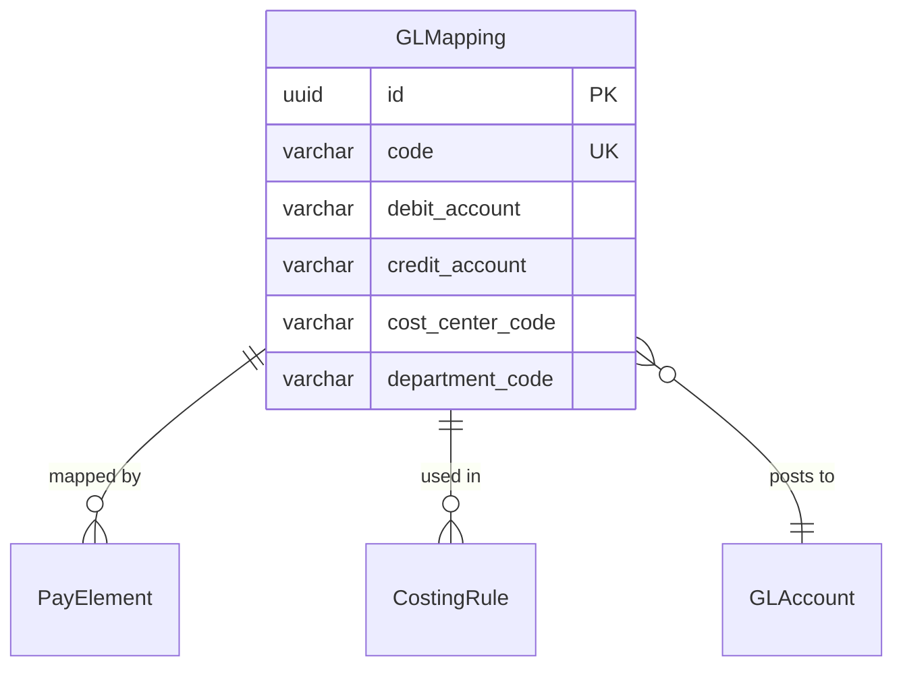
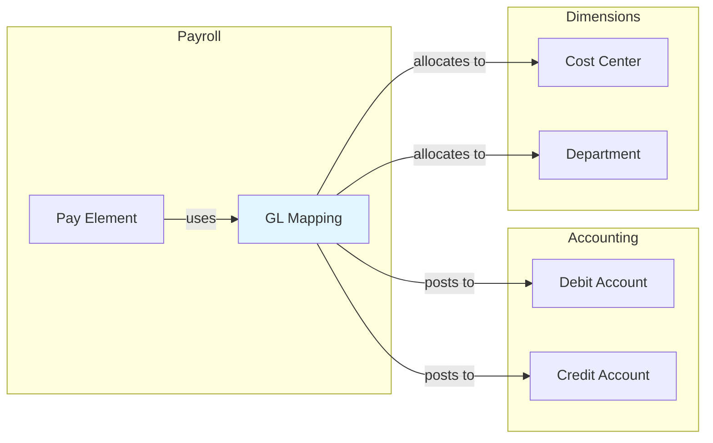

# GLMapping

**Module**: Payroll (PR)  
**Submodule**: CONFIG  
**Version**: 2.0  
**Last Updated**: 2025-12-23

---

## Entity: GLMapping {#gl-mapping}

**Classification**: REFERENCE_DATA

**Definition**: Maps payroll elements to General Ledger (GL) accounts for accounting integration

**Purpose**: Enables automatic posting of payroll transactions to the correct GL accounts in the accounting system

**Key Characteristics**:
- Links pay elements to GL account codes
- Supports debit and credit account mapping
- Can map to multiple GL accounts (split posting)
- Includes cost center and department dimensions
- Used for financial reporting and accounting integration
- **SCD Type 2**: No - reference mapping, changes are rare

---

### Attributes

| Attribute | Type | Required | Constraints | Description |
|-----------|------|----------|-------------|-------------|
| `id` | UUID | ✅ | PK | Primary identifier |
| `code` | varchar(50) | ✅ | UNIQUE, NOT NULL | Unique GL mapping code |
| `name` | varchar(100) | ✅ | NOT NULL | GL mapping display name |
| `debit_account` | varchar(20) | ✅ | NOT NULL | GL debit account code |
| `credit_account` | varchar(20) | ✅ | NOT NULL | GL credit account code |
| `cost_center_code` | varchar(20) | ❌ | NULL | Default cost center |
| `department_code` | varchar(20) | ❌ | NULL | Default department |
| `metadata` | jsonb | ❌ | NULL | Additional flexible data |
| `created_at` | timestamp | ✅ | Auto | Creation timestamp |
| `updated_at` | timestamp | ❌ | Auto | Last modification timestamp |

---

### Relationships

> **📌 Note**: Structural relationships only. For business context, see [Concept Layer](../../../01-concept/01-config/).

#### Entity Relationship Diagram



#### Relationship Details

| Relationship | Target | Cardinality | Foreign Key | Purpose |
|--------------|--------|-------------|-------------|---------|
| `pay_elements` | [PayElement](./04-pay-element.md) | 1:N | (inverse) | Pay elements using this GL mapping |
| `costing_rules` | [CostingRule](./06-costing-rule.md) | 1:N | (inverse) | Costing rules referencing this mapping |
| `gl_accounts` | External.GLAccount | N:1 | (debit/credit_account) | GL accounts in accounting system |

**Integration Points**:
- **Accounting/GL System**: Automatic journal entry posting
- **Financial Reporting**: Cost allocation and reporting
- **Audit**: Transaction traceability

**GL Mapping Flow**:


---

### Data Validation & Constraints

> **Note**: Entity-specific validation rules only.

| Field | Validation | Error Message |
|-------|------------|---------------|
| `code` | Unique, 3-50 chars, uppercase | "GL mapping code must be unique and uppercase" |
| `debit_account` | Valid GL account format | "Invalid debit account code" |
| `credit_account` | Valid GL account format | "Invalid credit account code" |

**Database Constraints**:
- `pk_gl_mapping`: PRIMARY KEY (`id`)
- `uk_gl_mapping_code`: UNIQUE (`code`)

---

### Examples

#### Example 1: Basic Salary Expense

```yaml
GLMapping:
  code: "GL_SALARY_EXPENSE"
  name: "Salary Expense Mapping"
  debit_account: "6100-001"  # Salary Expense
  credit_account: "2100-001"  # Salary Payable
  cost_center_code: "CC_HR"
  department_code: "DEPT_ADMIN"
```

**Business Context**: Debit salary expense, credit salary payable

#### Example 2: Tax Withholding

```yaml
GLMapping:
  code: "GL_TAX_WITHHOLDING"
  name: "Tax Withholding Mapping"
  debit_account: "2100-001"  # Salary Payable
  credit_account: "2200-001"  # Tax Payable
  cost_center_code: null
  department_code: null
```

**Business Context**: Debit salary payable, credit tax payable

---

### Best Practices

✅ **DO**:
- Validate GL account codes with accounting system
- Document mapping logic in metadata
- Test mappings before activation

❌ **DON'T**:
- Don't create duplicate mappings
- Don't change mappings mid-period
- Don't delete mappings (archive instead)

**Performance Tips**:
- Cache GL mappings
- Pre-validate account codes

**Security Considerations**:
- Restrict GL mapping modification to Finance team
- Audit mapping changes

---

### Migration Notes

**Version History**:
- **v2.0 (2025-07-01)**: Added cost_center and department dimensions
- **v1.0 (2024-01-01)**: Initial GL mapping definition

**Deprecated Fields**: None

**Breaking Changes**: None

---

## References

- **Sub-module Index**: [README.md](./README.md)
- **Concept Guides**: [../../../01-concept/01-config/](../../../01-concept/01-config/)
- **Database Schema**: [../../../03-design/5.Payroll.V3.dbml](../../../03-design/5.Payroll.V3.dbml)
