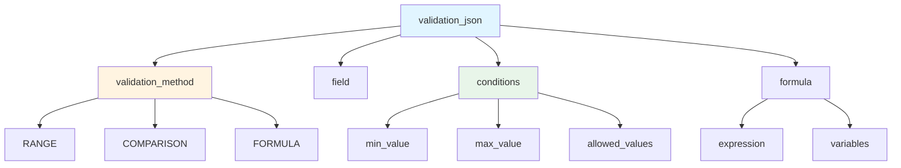
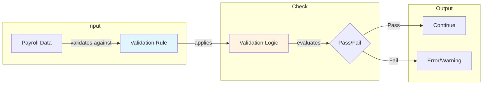
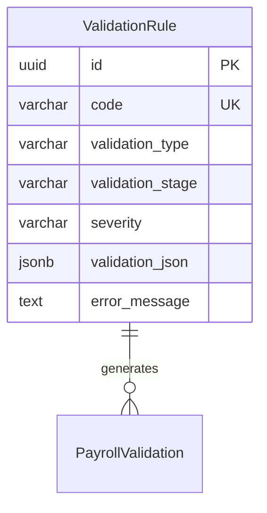

# ValidationRule

**Module**: Payroll (PR)  
**Submodule**: CONFIG  
**Version**: 2.0  
**Last Updated**: 2025-12-23

---

## Entity: ValidationRule {#validation-rule}

**Classification**: CORE_ENTITY

**Definition**: Defines validation rules for payroll data quality checks and business logic enforcement

**Purpose**: Ensures data integrity and business rule compliance during payroll processing through configurable validation checks

**Key Characteristics**:
- Supports multiple validation types (RANGE, COMPARISON, FORMULA, CUSTOM)
- Contains validation logic in JSON
- Can be applied at different stages (INPUT, CALCULATION, OUTPUT)
- Configurable severity levels (ERROR, WARNING, INFO)
- Used for data quality and compliance checks
- **SCD Type 2**: Yes - tracks historical changes to validation rules

---

### Attributes

| Attribute | Type | Required | Constraints | Description |
|-----------|------|----------|-------------|-------------|
| `id` | UUID | ✅ | PK | Primary identifier |
| `code` | varchar(50) | ✅ | UNIQUE, NOT NULL | Unique validation rule code |
| `name` | varchar(100) | ✅ | NOT NULL | Validation rule display name |
| `validation_type` | varchar(30) | ✅ | ENUM | Type: RANGE, COMPARISON, FORMULA, CUSTOM |
| `validation_stage` | varchar(20) | ✅ | ENUM | Stage: INPUT, CALCULATION, OUTPUT |
| `severity` | varchar(20) | ✅ | ENUM | Severity: ERROR, WARNING, INFO |
| `validation_json` | jsonb | ✅ | NOT NULL | Validation logic and parameters |
| `error_message` | text | ✅ | NOT NULL | Error message template |
| `is_active` | boolean | ✅ | DEFAULT true | Whether rule is currently active |
| `metadata` | jsonb | ❌ | NULL | Additional flexible data |
| `created_at` | timestamp | ✅ | Auto | Creation timestamp |
| `updated_at` | timestamp | ❌ | Auto | Last modification timestamp |

**Attribute Details**:

#### `validation_json`

**Type**: jsonb  
**Purpose**: Stores validation logic and parameters

**Structure**:
```yaml
validation_json:
  validation_method: "RANGE" | "COMPARISON" | "FORMULA"
  field: "BASIC_SALARY"
  conditions:
    min_value: 5000000
    max_value: 100000000
  or:
    formula: "BASIC_SALARY > MIN_WAGE * 1.5"
    variables:
      - name: "MIN_WAGE"
        source: "CONSTANT"
        value: 4680000
```

**Structure Diagram**:


**Validation Flow**:


---

### Relationships

> **📌 Note**: Structural relationships only. For business context, see [Concept Layer](../../../01-concept/02-processing/).

#### Entity Relationship Diagram



#### Relationship Details

| Relationship | Target | Cardinality | Foreign Key | Purpose |
|--------------|--------|-------------|-------------|---------|
| `payroll_validations` | PayrollValidation (PROCESSING) | 1:N | (inverse) | Validation results from payroll runs |

**Integration Points**:
- **Payroll Processing**: Data quality checks during calculation
- **Compliance**: Regulatory validation requirements
- **Reporting**: Validation error tracking

---

### Data Validation & Constraints

> **Note**: Entity-specific validation rules only.

| Field | Validation | Error Message |
|-------|------------|---------------|
| `code` | Unique, 3-50 chars, uppercase | "Validation rule code must be unique and uppercase" |
| `validation_type` | Must be valid enum value | "Invalid validation type" |
| `severity` | Must be valid enum value | "Invalid severity level" |

**Database Constraints**:
- `pk_validation_rule`: PRIMARY KEY (`id`)
- `uk_validation_rule_code`: UNIQUE (`code`)
- `ck_validation_rule_type`: CHECK (`validation_type IN ('RANGE','COMPARISON','FORMULA','CUSTOM')`)
- `ck_validation_rule_stage`: CHECK (`validation_stage IN ('INPUT','CALCULATION','OUTPUT')`)
- `ck_validation_rule_severity`: CHECK (`severity IN ('ERROR','WARNING','INFO')`)

---

### Examples

#### Example 1: Salary Range Validation

```yaml
ValidationRule:
  code: "VAL_SALARY_RANGE"
  name: "Salary Range Validation"
  validation_type: "RANGE"
  validation_stage: "INPUT"
  severity: "ERROR"
  validation_json:
    validation_method: "RANGE"
    field: "BASIC_SALARY"
    conditions:
      min_value: 5000000
      max_value: 100000000
  error_message: "Basic salary must be between 5,000,000 and 100,000,000 VND"
  is_active: true
```

**Business Context**: Ensure salary is within reasonable range

#### Example 2: Overtime Hours Limit

```yaml
ValidationRule:
  code: "VAL_OVERTIME_LIMIT"
  name: "Overtime Hours Limit"
  validation_type: "COMPARISON"
  validation_stage: "CALCULATION"
  severity: "WARNING"
  validation_json:
    validation_method: "COMPARISON"
    field: "OVERTIME_HOURS"
    conditions:
      max_value: 200
  error_message: "Overtime hours exceed 200 hours per month - please review"
  is_active: true
```

**Business Context**: Warn if overtime exceeds legal/company limits

---

### Best Practices

✅ **DO**:
- Test validation rules with sample data
- Use appropriate severity levels
- Document validation logic clearly

❌ **DON'T**:
- Don't create overly restrictive rules
- Don't change rules mid-period
- Don't delete rules (archive instead)

**Performance Tips**:
- Cache active validation rules
- Execute validations in appropriate order
- Use WARNING for non-critical checks

**Security Considerations**:
- Restrict validation rule modification to Payroll Administrators
- Audit rule changes
- Validate validation_json structure

---

### Migration Notes

**Version History**:
- **v2.0 (2025-07-01)**: Added `validation_json` for flexible validation logic
- **v1.0 (2024-01-01)**: Initial validation rule definition

**Deprecated Fields**: None

**Breaking Changes**: None

---

## References

- **Sub-module Index**: [README.md](./README.md)
- **Concept Guides**: [../../../01-concept/01-config/](../../../01-concept/01-config/)
- **Database Schema**: [../../../03-design/5.Payroll.V3.dbml](../../../03-design/5.Payroll.V3.dbml)
