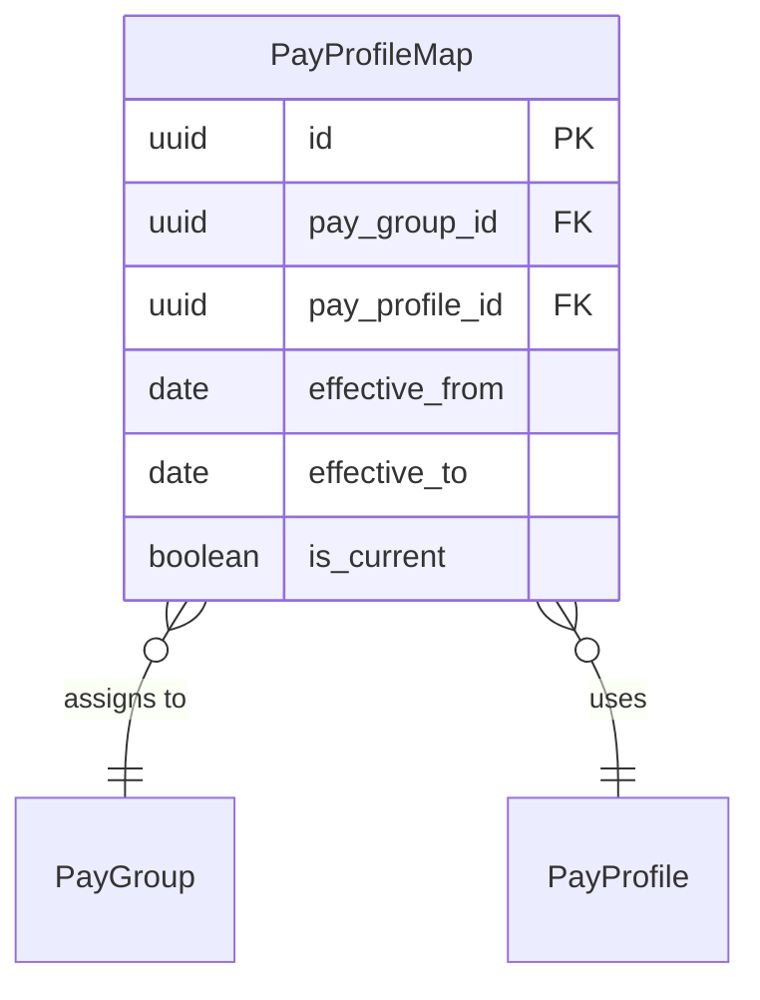

# PayProfileMap

**Module**: Payroll (PR)  
**Submodule**: CONFIG  
**Version**: 2.0  
**Last Updated**: 2025-12-23

---

## Entity: PayProfileMap {#pay-profile-map}

**Classification**: CORE_ENTITY

**Definition**: Maps payroll profiles to pay groups for profile assignment and management

**Purpose**: Enables flexible assignment of payroll processing profiles to pay groups with effective dating

**Key Characteristics**:
- Links PayProfile to PayGroup
- Supports effective date ranges
- Allows profile changes over time
- Tracks assignment history
- Used for profile management and auditing
- **SCD Type 2**: Yes - tracks historical profile assignments

---

### Attributes

| Attribute | Type | Required | Constraints | Description |
|-----------|------|----------|-------------|-------------|
| `id` | UUID | ✅ | PK | Primary identifier |
| `pay_group_id` | UUID | ✅ | FK → PayGroup | Pay group being mapped |
| `pay_profile_id` | UUID | ✅ | FK → PayProfile | Pay profile being assigned |
| `effective_from` | date | ✅ | NOT NULL | Assignment effective start date |
| `effective_to` | date | ❌ | NULL | Assignment expiry date (NULL = current) |
| `is_current` | boolean | ✅ | DEFAULT true | Whether this is the current assignment |
| `metadata` | jsonb | ❌ | NULL | Additional flexible data |
| `created_at` | timestamp | ✅ | Auto | Creation timestamp |
| `updated_at` | timestamp | ❌ | Auto | Last modification timestamp |

---

### Relationships

> **📌 Note**: Structural relationships only. For business context, see [Concept Layer](../../../01-concept/01-config/).

#### Entity Relationship Diagram



#### Relationship Details

| Relationship | Target | Cardinality | Foreign Key | Purpose |
|--------------|--------|-------------|-------------|---------|
| `pay_group` | [PayGroup](./03-pay-group.md) | N:1 | `pay_group_id` | Pay group receiving profile assignment |
| `pay_profile` | [PayProfile](./12-pay-profile.md) | N:1 | `pay_profile_id` | Pay profile being assigned |

**Relationship Notes**:
- One pay group can have only one current profile (is_current = true)
- Historical assignments are preserved for audit trail
- Effective dates must not overlap for same pay group

---

### Data Validation & Constraints

> **Note**: Entity-specific validation rules only.

| Field | Validation | Error Message |
|-------|------------|---------------|
| `effective_from` | Must be <= effective_to | "Effective from date must be before effective to date" |
| `is_current` | Only one current mapping per pay group | "Pay group already has a current profile assignment" |

**Database Constraints**:
- `pk_pay_profile_map`: PRIMARY KEY (`id`)
- `fk_pay_profile_map_group`: FOREIGN KEY (`pay_group_id` → `pay_group.id`)
- `fk_pay_profile_map_profile`: FOREIGN KEY (`pay_profile_id` → `pay_profile.id`)
- `ck_pay_profile_map_dates`: CHECK (`effective_from <= effective_to OR effective_to IS NULL`)
- `uk_pay_profile_map_current`: UNIQUE (`pay_group_id`) WHERE `is_current = true`

---

### Examples

#### Example 1: Standard Profile Assignment

```yaml
PayProfileMap:
  pay_group_id: "vn-office-monthly-uuid"
  pay_profile_id: "profile-standard-uuid"
  effective_from: "2025-01-01"
  effective_to: null
  is_current: true
```

**Business Context**: Assign standard profile to Vietnam office pay group from Jan 2025

#### Example 2: Profile Change (Historical)

```yaml
PayProfileMap:
  pay_group_id: "vn-office-monthly-uuid"
  pay_profile_id: "profile-old-uuid"
  effective_from: "2024-01-01"
  effective_to: "2024-12-31"
  is_current: false
```

**Business Context**: Previous profile assignment, now superseded

---

### Best Practices

✅ **DO**:
- Validate effective date ranges
- Maintain audit trail of profile changes
- Test profile assignments before activation

❌ **DON'T**:
- Don't create overlapping date ranges
- Don't delete mappings (mark as not current)
- Don't change mappings mid-payroll period

**Performance Tips**:
- Index on pay_group_id and is_current
- Cache current profile mappings

**Security Considerations**:
- Restrict profile mapping to Payroll Administrators
- Audit all mapping changes

---

### Migration Notes

**Version History**:
- **v2.0 (2025-07-01)**: Added effective dating for profile changes
- **v1.0 (2024-01-01)**: Initial profile mapping definition

**Deprecated Fields**: None

**Breaking Changes**: None

---

## References

- **Sub-module Index**: [README.md](./README.md)
- **Concept Guides**: [../../../01-concept/01-config/](../../../01-concept/01-config/)
- **Database Schema**: [../../../03-design/5.Payroll.V3.dbml](../../../03-design/5.Payroll.V3.dbml)
