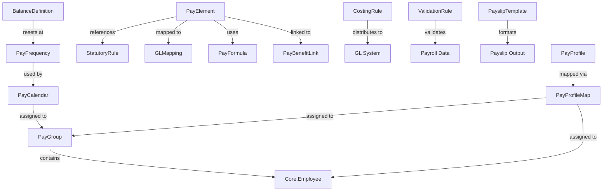

# CONFIG - Payroll Configuration Entities

**Module**: Payroll (PR)  
**Submodule**: CONFIG  
**Version**: 2.0  
**Last Updated**: 2025-12-23

---

## Overview

The Payroll Configuration sub-module defines all master data required for payroll processing. This includes payroll calendars, processing groups, pay elements (earnings/deductions/taxes), calculation formulas, validation rules, and templates.

**Purpose**: Provide flexible, configurable foundation for multi-country payroll processing with:
- Configurable payroll calendars and frequencies
- Flexible pay element definitions with formulas
- Statutory rule management for compliance
- GL costing and distribution rules
- Payslip template customization
- Reusable calculation formulas

**Total Entities**: 13

---

## Entity Index

| # | Entity | File | Classification | Purpose |
|---|--------|------|----------------|---------|
| 01 | PayFrequency | [01-pay-frequency.md](./01-pay-frequency.md) | REFERENCE_DATA | Payroll frequency definitions |
| 02 | PayCalendar | [02-pay-calendar.md](./02-pay-calendar.md) | CORE_ENTITY | Payroll calendar with cut-off/pay dates |
| 03 | PayGroup | [03-pay-group.md](./03-pay-group.md) | CORE_ENTITY | Employee processing groups |
| 04 | PayElement | [04-pay-element.md](./04-pay-element.md) | CORE_ENTITY | Earnings/deductions/taxes elements |
| 05 | BalanceDefinition | [05-balance-definition.md](./05-balance-definition.md) | CORE_ENTITY | Balance accumulators (gross, net, YTD) |
| 06 | CostingRule | [06-costing-rule.md](./06-costing-rule.md) | CORE_ENTITY | GL costing distribution rules |
| 07 | StatutoryRule | [07-statutory-rule.md](./07-statutory-rule.md) | CORE_ENTITY | Country-specific statutory rules |
| 08 | GLMapping | [08-gl-mapping.md](./08-gl-mapping.md) | CORE_ENTITY | Element to GL account mapping |
| 09 | ValidationRule | [09-validation-rule.md](./09-validation-rule.md) | CORE_ENTITY | Data validation rules |
| 10 | PayslipTemplate | [10-payslip-template.md](./10-payslip-template.md) | CORE_ENTITY | Payslip template definitions |
| 11 | PayFormula | [11-pay-formula.md](./11-pay-formula.md) | CORE_ENTITY | Reusable calculation formulas |
| 12 | PayProfile | [12-pay-profile.md](./12-pay-profile.md) | CORE_ENTITY | Payroll policy profiles |
| 13 | PayProfileMap | [13-pay-profile-map.md](./13-pay-profile-map.md) | CORE_ENTITY | Profile to group/employee mapping |

---

## Entity Relationships

---

## Design Patterns

### SCD Type 2 Entities

The following entities use SCD Type 2 for historical tracking:
- PayCalendar
- PayGroup
- PayElement
- BalanceDefinition
- CostingRule
- StatutoryRule
- ValidationRule
- PayslipTemplate
- PayProfile
- PayProfileMap

**Standard SCD2 Fields**:
- `effective_start_date`: When this version becomes effective
- `effective_end_date`: When this version expires (NULL = current)
- `is_current_flag`: `true` for current version, `false` for historical

### Reference Data

Simple lookup tables:
- PayFrequency: Predefined frequency codes (MONTHLY, BIWEEKLY, etc.)

---

## Integration Points

### Core Module (CO)

- **LegalEntity** → `PayCalendar.legal_entity_id`, `PayGroup.legal_entity_id`
- **TalentMarket** → `PayCalendar.market_id`, `PayGroup.market_id`, `StatutoryRule.market_id`  
- **Employee** → `PayGroup` assignment, `PayProfileMap.employee_id`

### Total Rewards (TR)

- **Benefits** → `PayBenefitLink` maps pay elements to benefit policies

### Accounting/GL

- **GL Accounts** → `GLMapping`, `CostingRule` for costing distribution

---

## Configuration Workflows

Related workflow catalog: [../../workflows/01-config/README.md](../../workflows/01-config/README.md)

**Key Workflows**:
- WF-PR-CONFIG-001: Pay Calendar Setup
- WF-PR-CONFIG-002: Pay Group Configuration  
- WF-PR-CONFIG-003: Pay Element Management
- WF-PR-CONFIG-004: Formula & Rule Configuration
- WF-PR-CONFIG-005: Payslip Template Design

---

## Quick Navigation

**By Entity Type**:
- **Master Data**: [PayFrequency](./01-pay-frequency.md), [PayCalendar](./02-pay-calendar.md), [PayGroup](./03-pay-group.md)
- **Payroll Elements**: [PayElement](./04-pay-element.md), [BalanceDefinition](./05-balance-definition.md)
- **Rules & Compliance**: [StatutoryRule](./07-statutory-rule.md), [ValidationRule](./09-validation-rule.md)
- **GL Integration**: [GLMapping](./08-gl-mapping.md), [CostingRule](./06-costing-rule.md)
- **Templates & Formulas**: [PayslipTemplate](./10-payslip-template.md), [PayFormula](./11-pay-formula.md)
- **Profiles**: [PayProfile](./12-pay-profile.md), [PayProfileMap](./13-pay-profile-map.md)

**By Function**:
- **Calendar Management**: PayFrequency, PayCalendar, PayGroup
- **Element Management**: PayElement, BalanceDefinition, PayFormula
- **Compliance**: StatutoryRule, ValidationRule  
- **Accounting**: GLMapping, CostingRule
- **Output**: PayslipTemplate
- **Policies**: PayProfile, PayProfileMap

---

## References

- **Parent Module**: [../../../README.md](../../../README.md)
- **Workflow Catalog**: [../../workflows/01-config/README.md](../../workflows/01-config/README.md)
- **Glossary**: [../../glossary-config.md](../../glossary-config.md)
- **Database Schema**: [../../../03-design/5.Payroll.V3.dbml](../../../03-design/5.Payroll.V3.dbml)

---

**Document Version**: 1.0  
**Created**: 2025-12-23  
**Last Review**: 2025-12-23  
**Reviewed By**: xTalent Documentation Team
