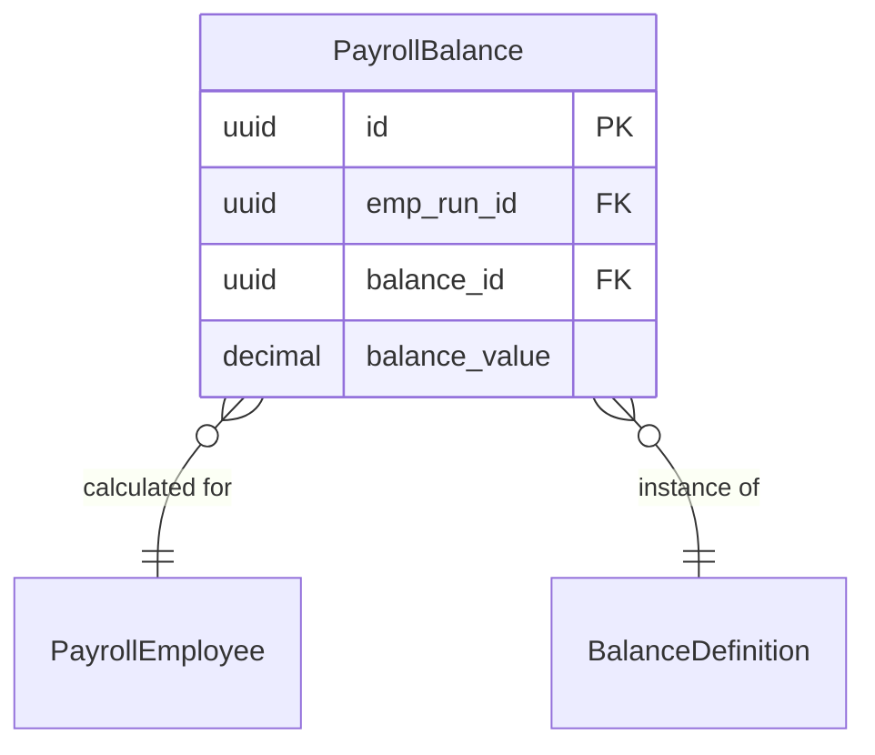

# PayrollBalance

**Module**: Payroll (PR)  
**Submodule**: PROCESSING  
**Version**: 2.0  
**Last Updated**: 2025-12-24

---

## Entity: PayrollBalance {#payroll-balance}

**Classification**: CORE_ENTITY

**Definition**: Stores calculated balance values (YTD, QTD, MTD) for each employee in a payroll run

**Purpose**: Tracks cumulative balance amounts for reporting and compliance

**Key Characteristics**:
- Links to PayrollEmployee and BalanceDefinition
- Stores balance values per run
- Supports multiple balance types (YTD, QTD, etc.)
- **SCD Type 2**: No - transactional data

---

### Attributes

| Attribute | Type | Required | Constraints | Description |
|-----------|------|----------|-------------|-------------|
| `id` | UUID | ✅ | PK | Primary identifier |
| `emp_run_id` | UUID | ✅ | FK → PayrollEmployee | Payroll employee run |
| `balance_id` | UUID | ✅ | FK → BalanceDefinition | Balance definition |
| `balance_value` | decimal(18,2) | ✅ | NOT NULL | Balance value |

---

### Relationships



#### Relationship Details

| Relationship | Target | Cardinality | Foreign Key | Purpose |
|--------------|--------|-------------|-------------|---------|
| `payroll_employee` | [PayrollEmployee](./02-payroll-employee.md) | N:1 | `emp_run_id` | Employee run |
| `balance_definition` | [BalanceDefinition](../01-config/05-balance-definition.md) | N:1 | `balance_id` | Balance definition |

---

### Data Validation & Constraints

**Database Constraints**:
- `pk_payroll_balance`: PRIMARY KEY (`id`)
- `fk_payroll_balance_emp_run`: FOREIGN KEY (`emp_run_id` → `payroll_employee.id`)
- `fk_payroll_balance_def`: FOREIGN KEY (`balance_id` → `balance_definition.id`)

---

### Examples

```yaml
PayrollBalance:
  id: "balance-uuid"
  emp_run_id: "emp-run-uuid"
  balance_id: "ytd-gross-balance-uuid"
  balance_value: 300000000.00
```

**Business Context**: Year-to-date gross pay balance

---

### Best Practices

✅ **DO**:
- Calculate balances after all elements
- Store all balance types for reporting

❌ **DON'T**:
- Don't modify balances after finalization

---

## References

- **Sub-module Index**: [README.md](./README.md)
- **Database Schema**: [../../../03-design/5.Payroll.V3.dbml](../../../03-design/5.Payroll.V3.dbml)
