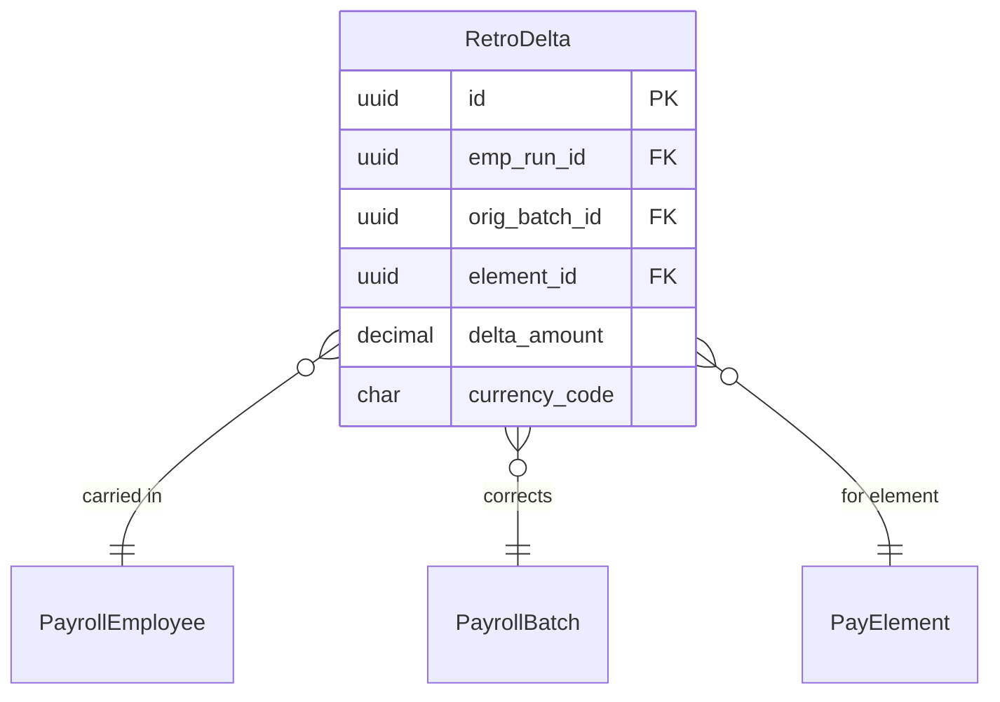

# RetroDelta

**Module**: Payroll (PR)  
**Submodule**: PROCESSING  
**Version**: 2.0  
**Last Updated**: 2025-12-24

---

## Entity: RetroDelta {#retro-delta}

**Classification**: CORE_ENTITY

**Definition**: Stores retroactive adjustment differences between original and corrected payroll runs

**Purpose**: Tracks delta amounts when retroactive changes are applied to previous payroll periods

**Key Characteristics**:
- Links to current run carrying the delta
- References original batch being corrected
- Stores delta amount per element
- Enables retro payment tracking
- **SCD Type 2**: No - transactional data

---

### Attributes

| Attribute | Type | Required | Constraints | Description |
|-----------|------|----------|-------------|-------------|
| `id` | UUID | ✅ | PK | Primary identifier |
| `emp_run_id` | UUID | ✅ | FK → PayrollEmployee | Current run carrying delta |
| `orig_batch_id` | UUID | ✅ | FK → PayrollBatch | Original batch being corrected |
| `element_id` | UUID | ✅ | FK → PayElement | Pay element |
| `delta_amount` | decimal(18,2) | ✅ | NOT NULL | Difference amount (positive or negative) |
| `currency_code` | char(3) | ✅ | ISO 4217 | Currency |
| `metadata` | jsonb | ❌ | NULL | Additional data |

---

### Relationships

> **📌 Note**: Structural relationships only.

#### Entity Relationship Diagram



#### Relationship Details

| Relationship | Target | Cardinality | Foreign Key | Purpose |
|--------------|--------|-------------|-------------|---------|
| `current_run` | [PayrollEmployee](./02-payroll-employee.md) | N:1 | `emp_run_id` | Current run carrying delta |
| `original_batch` | [PayrollBatch](./01-payroll-batch.md) | N:1 | `orig_batch_id` | Original batch |
| `element` | [PayElement](../01-config/04-pay-element.md) | N:1 | `element_id` | Pay element |

**Integration Points**:
- **Payroll Calculation**: Applies retro adjustments
- **Reporting**: Tracks retro payment history

---

### Data Validation & Constraints

| Field | Validation | Error Message |
|-------|------------|---------------|
| `delta_amount` | Can be positive or negative | "Delta amount must be numeric" |

**Database Constraints**:
- `pk_retro_delta`: PRIMARY KEY (`id`)
- `fk_retro_delta_emp_run`: FOREIGN KEY (`emp_run_id` → `payroll_employee.id`)
- `fk_retro_delta_orig_batch`: FOREIGN KEY (`orig_batch_id` → `payroll_batch.id`)
- `fk_retro_delta_element`: FOREIGN KEY (`element_id` → `pay_element.id`)

---

### Examples

#### Example 1: Salary Increase Retro

```yaml
RetroDelta:
  id: "retro-delta-uuid"
  emp_run_id: "emp-run-feb-uuid"
  orig_batch_id: "batch-2025-01-uuid"
  element_id: "basic-sal-element-uuid"
  delta_amount: 2000000.00
  currency_code: "VND"
```

**Business Context**: Salary increase applied retroactively to January, paid in February

#### Example 2: Tax Correction (Negative Delta)

```yaml
RetroDelta:
  id: "retro-delta-tax-uuid"
  emp_run_id: "emp-run-feb-uuid"
  orig_batch_id: "batch-2025-01-uuid"
  element_id: "tax-pit-element-uuid"
  delta_amount: -150000.00
  currency_code: "VND"
```

**Business Context**: Tax over-deduction in January, refunded in February

---

### Best Practices

✅ **DO**:
- Track all retro adjustments for audit
- Use positive delta for increases, negative for decreases
- Link to original batch for traceability
- Document reason in metadata

❌ **DON'T**:
- Don't modify delta amounts after finalization
- Don't create deltas without original batch reference
- Don't delete retro records (archive instead)

**Performance Tips**:
- Index on orig_batch_id for retro reporting
- Index on emp_run_id for employee retro history

**Security Considerations**:
- Restrict retro creation to Payroll Administrators
- Audit all retro adjustments
- Require approval for large delta amounts

---

### Migration Notes

**Version History**:
- **v2.0 (2025-07-01)**: Added retro delta tracking
- **v1.0 (2024-01-01)**: Initial retro mechanism

**Deprecated Fields**: None

**Breaking Changes**: None

---

## References

- **Sub-module Index**: [README.md](./README.md)
- **Concept Guides**: [../../../01-concept/02-processing/](../../../01-concept/02-processing/)
- **Database Schema**: [../../../03-design/5.Payroll.V3.dbml](../../../03-design/5.Payroll.V3.dbml)
