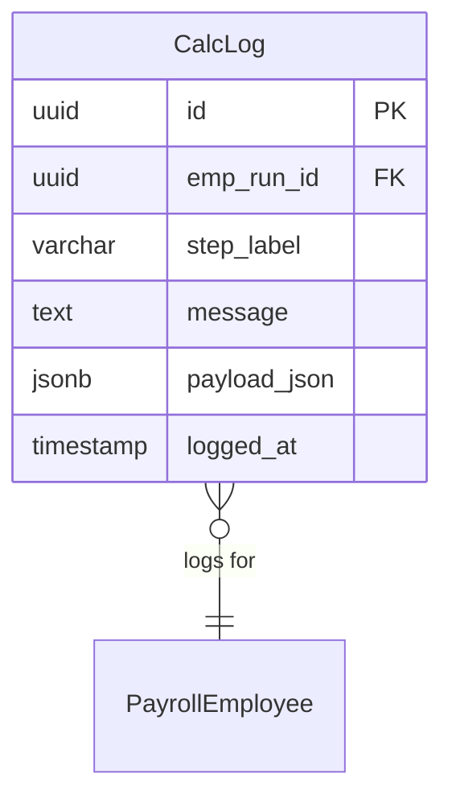

# CalcLog

**Module**: Payroll (PR)  
**Submodule**: PROCESSING  
**Version**: 2.0  
**Last Updated**: 2025-12-24

---

## Entity: CalcLog {#calc-log}

**Classification**: CORE_ENTITY

**Definition**: Stores calculation trace logs for debugging and audit purposes

**Purpose**: Provides detailed logging of payroll calculation steps for troubleshooting and compliance

**Key Characteristics**:
- Links to PayrollEmployee for per-employee logging
- Captures calculation step labels and messages
- Stores payload data in JSON format
- Timestamped for audit trail
- **SCD Type 2**: No - transactional log data

---

### Attributes

| Attribute | Type | Required | Constraints | Description |
|-----------|------|----------|-------------|-------------|
| `id` | UUID | ✅ | PK | Primary identifier |
| `emp_run_id` | UUID | ✅ | FK → PayrollEmployee | Payroll employee run |
| `step_label` | varchar(50) | ✅ | NOT NULL | Calculation step (PRE_BAL, OT_RULE, TAX) |
| `message` | text | ✅ | NOT NULL | Log message |
| `payload_json` | jsonb | ❌ | NULL | Additional payload data |
| `logged_at` | timestamp | ✅ | DEFAULT now() | Log timestamp |

---

### Relationships

> **📌 Note**: Structural relationships only.

#### Entity Relationship Diagram



#### Relationship Details

| Relationship | Target | Cardinality | Foreign Key | Purpose |
|--------------|--------|-------------|-------------|---------|
| `payroll_employee` | [PayrollEmployee](./02-payroll-employee.md) | N:1 | `emp_run_id` | Employee run |

**Integration Points**:
- **Debugging**: Troubleshoot calculation issues
- **Audit**: Compliance and verification
- **Monitoring**: Track calculation performance

---

### Data Validation & Constraints

**Database Constraints**:
- `pk_calc_log`: PRIMARY KEY (`id`)
- `fk_calc_log_emp_run`: FOREIGN KEY (`emp_run_id` → `payroll_employee.id`)

---

### Examples

#### Example 1: Balance Calculation Log

```yaml
CalcLog:
  id: "log-uuid"
  emp_run_id: "emp-run-uuid"
  step_label: "PRE_BAL"
  message: "Calculated pre-tax balance: 25,000,000 VND"
  payload_json:
    balance_code: "PRE_TAX_GROSS"
    amount: 25000000
    elements_included: ["BASIC_SAL", "OT_1_5", "ALLOWANCE"]
  logged_at: "2025-02-01T10:15:23Z"
```

**Business Context**: Logs pre-tax balance calculation step

#### Example 2: Tax Calculation Log

```yaml
CalcLog:
  id: "log-tax-uuid"
  emp_run_id: "emp-run-uuid"
  step_label: "TAX"
  message: "Applied Vietnam PIT progressive tax"
  payload_json:
    taxable_income: 14000000
    tax_bracket: "10%"
    tax_amount: 1150000
    deductions_applied: 11000000
  logged_at: "2025-02-01T10:15:45Z"
```

**Business Context**: Logs tax calculation with bracket details

---

### Best Practices

✅ **DO**:
- Log all critical calculation steps
- Include relevant data in payload_json
- Use consistent step_label codes
- Log errors and warnings

❌ **DON'T**:
- Don't log sensitive employee data unnecessarily
- Don't create excessive logs (impacts performance)
- Don't delete logs (archive old batches instead)

**Performance Tips**:
- Index on emp_run_id for employee log queries
- Index on logged_at for time-based queries
- Archive old logs periodically
- Use async logging to avoid blocking calculation

**Security Considerations**:
- Restrict log access to Payroll Administrators and Auditors
- Sanitize sensitive data in payload_json
- Implement log retention policies
- Monitor for anomalous calculation patterns

---

### Migration Notes

**Version History**:
- **v2.0 (2025-07-01)**: Added payload_json for structured logging
- **v1.0 (2024-01-01)**: Initial calculation logging

**Deprecated Fields**: None

**Breaking Changes**: None

---

## References

- **Sub-module Index**: [README.md](./README.md)
- **Concept Guides**: [../../../01-concept/02-processing/](../../../01-concept/02-processing/)
- **Database Schema**: [../../../03-design/5.Payroll.V3.dbml](../../../03-design/5.Payroll.V3.dbml)
