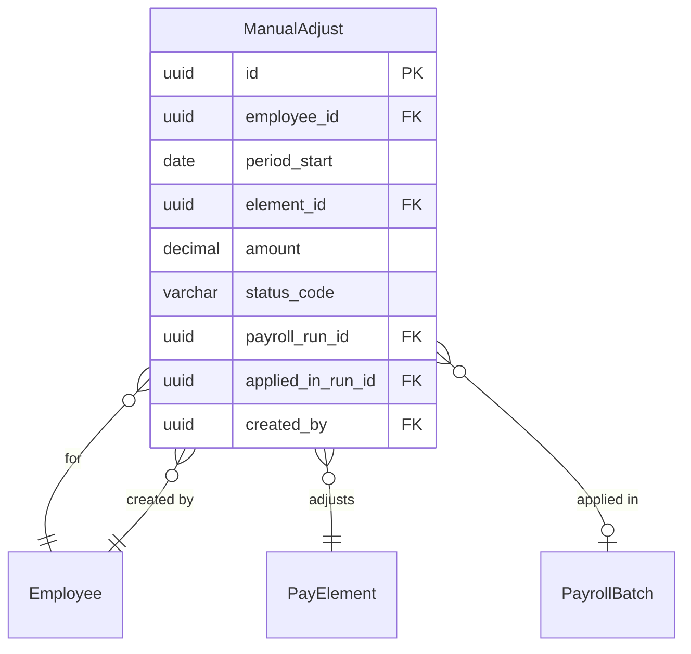

# ManualAdjust

**Module**: Payroll (PR)  
**Submodule**: PROCESSING  
**Version**: 2.0  
**Last Updated**: 2025-12-24

---

## Entity: ManualAdjust {#manual-adjust}

**Classification**: CORE_ENTITY

**Definition**: Stores manual payroll adjustments created by HR/Payroll administrators

**Purpose**: Enables manual corrections and one-time adjustments to employee payroll outside of standard calculation

**Key Characteristics**:
- Links to employee and pay element
- Tracks adjustment period and amount
- Supports workflow status (PENDING, APPLIED)
- Links to payroll batch when applied
- Audit trail with creator tracking
- **SCD Type 2**: No - transactional data

---

### Attributes

| Attribute | Type | Required | Constraints | Description |
|-----------|------|----------|-------------|-------------|
| `id` | UUID | ✅ | PK | Primary identifier |
| `employee_id` | UUID | ✅ | FK → Employee | Employee |
| `period_start` | date | ✅ | NOT NULL | Adjustment period start |
| `period_end` | date | ❌ | NULL | Adjustment period end |
| `element_id` | UUID | ✅ | FK → PayElement | Pay element |
| `amount` | decimal(18,2) | ✅ | NOT NULL | Adjustment amount |
| `reason` | text | ✅ | NOT NULL | Adjustment reason |
| `status_code` | varchar(20) | ✅ | ENUM | Status: PENDING, APPLIED |
| `payroll_run_id` | UUID | ❌ | FK → PayrollBatch | Batch to apply adjustment |
| `applied_in_run_id` | UUID | ❌ | FK → PayrollBatch | Batch where adjustment was applied |
| `metadata` | jsonb | ❌ | NULL | Additional data |
| `created_by` | UUID | ✅ | FK → Employee | Creator |
| `created_at` | timestamp | ✅ | DEFAULT now() | Creation timestamp |
| `updated_at` | timestamp | ❌ | NULL | Last update timestamp |

---

### Relationships

> **📌 Note**: Structural relationships only.

#### Entity Relationship Diagram



#### Relationship Details

| Relationship | Target | Cardinality | Foreign Key | Purpose |
|--------------|--------|-------------|-------------|---------|
| `employee` | Core.Employee | N:1 | `employee_id` | Employee receiving adjustment |
| `element` | [PayElement](../01-config/04-pay-element.md) | N:1 | `element_id` | Pay element |
| `target_batch` | [PayrollBatch](./01-payroll-batch.md) | N:1 | `payroll_run_id` | Batch to apply in |
| `applied_batch` | [PayrollBatch](./01-payroll-batch.md) | N:1 | `applied_in_run_id` | Batch where applied |
| `creator` | Core.Employee | N:1 | `created_by` | Creator |

**Integration Points**:
- **Payroll Calculation**: Applies manual adjustments during run
- **Approval Workflow**: Routes adjustments for approval
- **Audit**: Tracks manual changes

---

### Data Validation & Constraints

| Field | Validation | Error Message |
|-------|------------|---------------|
| `status_code` | Must be PENDING or APPLIED | "Invalid status code" |
| `amount` | Must be non-zero | "Adjustment amount must be non-zero" |
| `reason` | Required, min 10 characters | "Reason must be at least 10 characters" |

**Database Constraints**:
- `pk_manual_adjust`: PRIMARY KEY (`id`)
- `fk_manual_adjust_employee`: FOREIGN KEY (`employee_id` → `employee.id`)
- `fk_manual_adjust_element`: FOREIGN KEY (`element_id` → `pay_element.id`)
- `fk_manual_adjust_run`: FOREIGN KEY (`payroll_run_id` → `payroll_batch.id`)
- `fk_manual_adjust_applied`: FOREIGN KEY (`applied_in_run_id` → `payroll_batch.id`)
- `fk_manual_adjust_creator`: FOREIGN KEY (`created_by` → `employee.id`)
- `ck_manual_adjust_status`: CHECK (`status_code IN ('PENDING','APPLIED')`)

---

### Examples

#### Example 1: One-time Bonus Adjustment

```yaml
ManualAdjust:
  id: "adjust-uuid"
  employee_id: "emp-12345-uuid"
  period_start: "2025-02-01"
  period_end: "2025-02-28"
  element_id: "bonus-element-uuid"
  amount: 5000000.00
  reason: "Exceptional performance bonus for Q1 project completion"
  status_code: "PENDING"
  payroll_run_id: "batch-2025-02-uuid"
  applied_in_run_id: null
  created_by: "hr-admin-uuid"
  created_at: "2025-02-10T14:30:00Z"
```

**Business Context**: One-time bonus pending approval for February payroll

#### Example 2: Salary Correction (Applied)

```yaml
ManualAdjust:
  id: "adjust-correction-uuid"
  employee_id: "emp-67890-uuid"
  period_start: "2025-01-01"
  period_end: "2025-01-31"
  element_id: "basic-sal-element-uuid"
  amount: -500000.00
  reason: "Correction for overpayment in January due to incorrect salary data entry"
  status_code: "APPLIED"
  payroll_run_id: "batch-2025-02-uuid"
  applied_in_run_id: "batch-2025-02-uuid"
  created_by: "payroll-admin-uuid"
  created_at: "2025-02-05T09:15:00Z"
  updated_at: "2025-02-15T11:00:00Z"
```

**Business Context**: Salary overpayment correction applied in February payroll

---

### Best Practices

✅ **DO**:
- Provide clear, detailed reason for all adjustments
- Use approval workflow for large amounts
- Link to target payroll batch
- Track applied_in_run_id for audit
- Document creator for accountability

❌ **DON'T**:
- Don't create adjustments without proper justification
- Don't modify APPLIED adjustments (create reversal instead)
- Don't delete adjustments (archive instead)
- Don't bypass approval workflow for significant amounts
- Don't use manual adjustments for recurring changes (update element instead)

**Performance Tips**:
- Index on employee_id and status_code for pending adjustment queries
- Index on payroll_run_id for batch processing
- Archive old APPLIED adjustments periodically

**Security Considerations**:
- Restrict manual adjustment creation to Payroll Administrators
- Require approval for adjustments above threshold
- Audit all manual adjustments
- Log created_by for accountability
- Implement segregation of duties (creator ≠ approver)

---

### Migration Notes

**Version History**:
- **v2.0 (2025-07-01)**: Added payroll_run_id and applied_in_run_id for batch linkage
- **v2.0 (2025-07-01)**: Added created_by for audit trail
- **v1.0 (2024-01-01)**: Initial manual adjustment definition

**Deprecated Fields**: None

**Breaking Changes**:
- v2.0: payroll_run_id and applied_in_run_id now required for proper batch tracking

---

## References

- **Sub-module Index**: [README.md](./README.md)
- **Concept Guides**: [../../../01-concept/02-processing/](../../../01-concept/02-processing/)
- **Database Schema**: [../../../03-design/5.Payroll.V3.dbml](../../../03-design/5.Payroll.V3.dbml)
