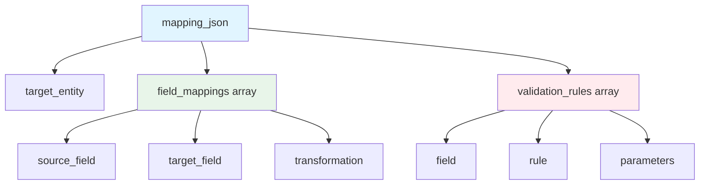
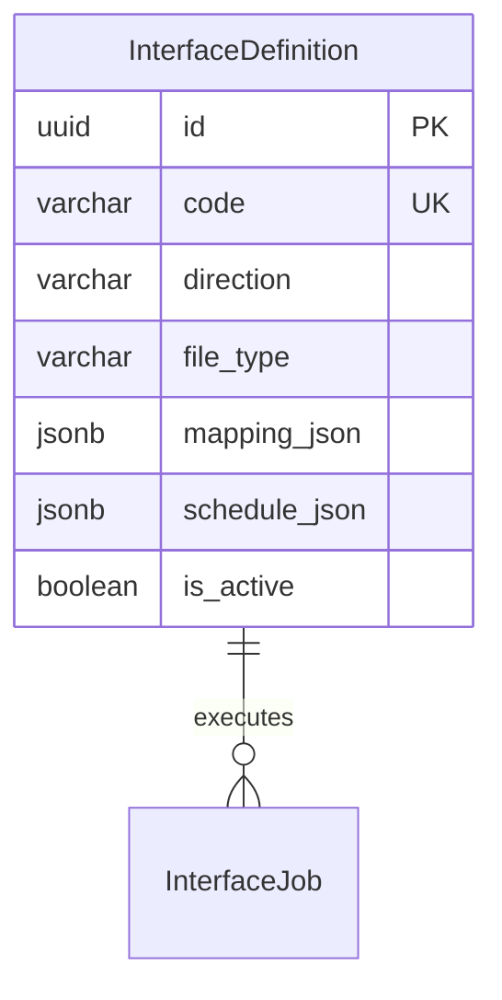
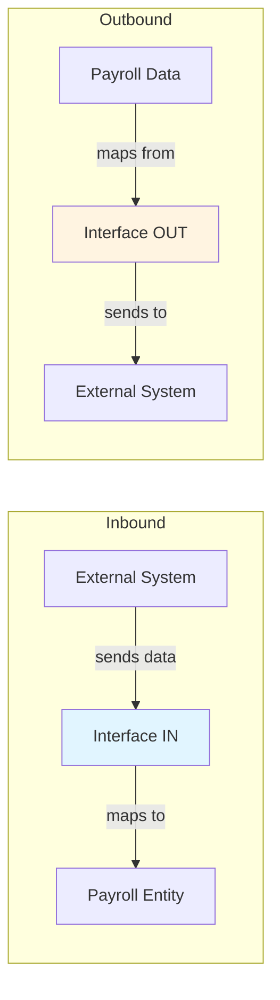

# InterfaceDefinition

**Module**: Payroll (PR)  
**Submodule**: GATEWAY  
**Version**: 2.0  
**Last Updated**: 2025-12-24

---

## Entity: InterfaceDefinition {#interface-definition}

**Classification**: CORE_ENTITY

**Definition**: Defines integration interface configurations for data exchange with external systems

**Purpose**: Provides reusable interface templates for inbound and outbound data integration with payroll

**Key Characteristics**:
- Supports both inbound (IN) and outbound (OUT) interfaces
- Multiple file types (CSV, JSON, API)
- Configurable field mappings via JSON
- Optional scheduling configuration
- Can be activated/deactivated independently
- **SCD Type 2**: No - configuration data with is_active flag

---

### Attributes

| Attribute | Type | Required | Constraints | Description |
|-----------|------|----------|-------------|-------------|
| `id` | UUID | ✅ | PK | Primary identifier |
| `code` | varchar(50) | ✅ | UNIQUE, NOT NULL | Unique interface code |
| `name` | varchar(100) | ✅ | NOT NULL | Interface display name |
| `direction` | varchar(10) | ✅ | ENUM | Direction: IN (inbound), OUT (outbound) |
| `file_type` | varchar(10) | ✅ | ENUM | File type: CSV, JSON, API |
| `mapping_json` | jsonb | ✅ | NOT NULL | Field mapping configuration |
| `schedule_json` | jsonb | ❌ | NULL | Scheduling configuration |
| `is_active` | boolean | ✅ | DEFAULT true | Whether interface is active |

**Attribute Details**:

#### `mapping_json`

**Type**: jsonb  
**Purpose**: Defines field mappings between external system and payroll entities

**Structure**:
```yaml
mapping_json:
  target_entity: "InputValue" | "Employee" | "PayrollResult"
  field_mappings:
    - source_field: "employee_code"
      target_field: "employee_id"
      transformation: "LOOKUP_EMPLOYEE"
    - source_field: "hours_worked"
      target_field: "input_value"
      transformation: "NUMERIC"
  validation_rules:
    - field: "hours_worked"
      rule: "REQUIRED"
    - field: "hours_worked"
      rule: "RANGE"
      min: 0
      max: 300
```

**Structure Diagram**:


#### `schedule_json`

**Type**: jsonb  
**Purpose**: Defines automated scheduling for interface execution

**Structure**:
```yaml
schedule_json:
  frequency: "DAILY" | "WEEKLY" | "MONTHLY"
  time: "02:00"
  timezone: "Asia/Ho_Chi_Minh"
  enabled: true
```

---

### Relationships

> **📌 Note**: Structural relationships only.

#### Entity Relationship Diagram



#### Relationship Details

| Relationship | Target | Cardinality | Foreign Key | Purpose |
|--------------|--------|-------------|-------------|---------|
| `jobs` | [InterfaceJob](./02-interface-job.md) | 1:N | (inverse) | Interface execution jobs |

**Integration Points**:
- **Time & Attendance**: Inbound hours data
- **HR Systems**: Inbound employee updates
- **GL Systems**: Outbound costing entries
- **Banking**: Outbound payment files

**Integration Flow**:


---

### Data Validation & Constraints

| Field | Validation | Error Message |
|-------|------------|---------------|
| `code` | Unique, 3-50 chars, uppercase | "Interface code must be unique and uppercase" |
| `direction` | Must be IN or OUT | "Invalid direction. Must be IN or OUT" |
| `file_type` | Must be CSV, JSON, or API | "Invalid file type" |
| `mapping_json` | Valid JSON structure | "Invalid mapping JSON structure" |

**Database Constraints**:
- `pk_interface_def`: PRIMARY KEY (`id`)
- `uk_interface_def_code`: UNIQUE (`code`)
- `ck_interface_def_direction`: CHECK (`direction IN ('IN','OUT')`)
- `ck_interface_def_file_type`: CHECK (`file_type IN ('CSV','JSON','API')`)

---

### Examples

#### Example 1: Time & Attendance Inbound (CSV)

```yaml
InterfaceDefinition:
  id: "iface-ta-in-uuid"
  code: "TA_HOURS_IN"
  name: "Time & Attendance Hours Import"
  direction: "IN"
  file_type: "CSV"
  mapping_json:
    target_entity: "InputValue"
    field_mappings:
      - source_field: "employee_code"
        target_field: "employee_id"
        transformation: "LOOKUP_EMPLOYEE"
      - source_field: "ot_hours"
        target_field: "input_value"
        transformation: "NUMERIC"
      - source_field: "period_date"
        target_field: "period_start"
        transformation: "DATE"
    validation_rules:
      - field: "employee_code"
        rule: "REQUIRED"
      - field: "ot_hours"
        rule: "RANGE"
        min: 0
        max: 200
  schedule_json:
    frequency: "DAILY"
    time: "02:00"
    timezone: "Asia/Ho_Chi_Minh"
    enabled: true
  is_active: true
```

**Business Context**: Daily import of overtime hours from Time & Attendance system

#### Example 2: GL Costing Outbound (JSON)

```yaml
InterfaceDefinition:
  code: "GL_COSTING_OUT"
  name: "GL Costing Export"
  direction: "OUT"
  file_type: "JSON"
  mapping_json:
    source_entity: "PayrollCosting"
    field_mappings:
      - source_field: "account_code"
        target_field: "gl_account"
        transformation: "STRING"
      - source_field: "amount"
        target_field: "debit_amount"
        transformation: "NUMERIC"
      - source_field: "currency_code"
        target_field: "currency"
        transformation: "STRING"
  schedule_json: null
  is_active: true
```

**Business Context**: Export payroll costing to GL system after payroll finalization

---

### Best Practices

✅ **DO**:
- Use descriptive interface codes (TA_HOURS_IN, GL_COSTING_OUT)
- Validate mapping_json structure before activation
- Test interfaces with sample data
- Document field transformations clearly
- Use schedule_json for automated interfaces

❌ **DON'T**:
- Don't activate untested interfaces
- Don't modify active interface mappings (create new version)
- Don't delete interfaces (inactivate instead)
- Don't create duplicate interfaces for same purpose

**Performance Tips**:
- Cache active interface definitions
- Pre-validate mapping_json at configuration time
- Index on code and is_active for lookups
- Use async processing for large file interfaces

**Security Considerations**:
- Restrict interface modification to Integration Administrators
- Validate all inbound data against mapping rules
- Encrypt sensitive data in transit
- Audit all interface executions
- Implement rate limiting for API interfaces

---

### Migration Notes

**Version History**:
- **v2.0 (2025-07-01)**: Added schedule_json for automated execution
- **v2.0 (2025-07-01)**: Enhanced mapping_json with validation rules
- **v1.0 (2024-01-01)**: Initial interface definition

**Deprecated Fields**: None

**Breaking Changes**:
- v2.0: mapping_json structure enhanced (backward compatible)

---

## References

- **Sub-module Index**: [README.md](./README.md)
- **Concept Guides**: [../../../01-concept/03-gateway/](../../../01-concept/03-gateway/)
- **Database Schema**: [../../../03-design/5.Payroll.V3.dbml](../../../03-design/5.Payroll.V3.dbml)
