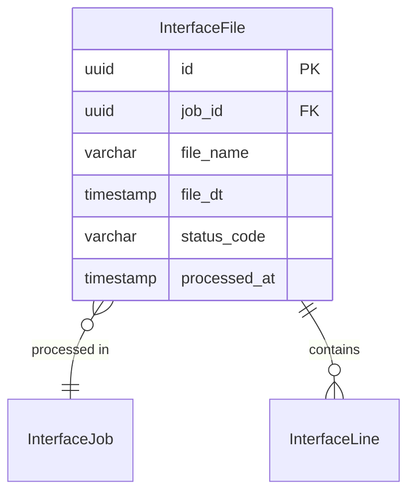

# InterfaceFile

**Module**: Payroll (PR)  
**Submodule**: GATEWAY  
**Version**: 2.0  
**Last Updated**: 2025-12-24

---

## Entity: InterfaceFile {#interface-file}

**Classification**: CORE_ENTITY

**Definition**: Tracks individual files processed within an interface job

**Purpose**: Records file-level processing status and metadata for each file in an interface execution

**Key Characteristics**:
- Links to InterfaceJob
- Tracks file name and processing timestamps
- Stores file-level status
- **SCD Type 2**: No - transactional file data

---

### Attributes

| Attribute | Type | Required | Constraints | Description |
|-----------|------|----------|-------------|-------------|
| `id` | UUID | ✅ | PK | Primary identifier |
| `job_id` | UUID | ✅ | FK → InterfaceJob | Interface job |
| `file_name` | varchar(255) | ✅ | NOT NULL | File name |
| `file_dt` | timestamp | ✅ | NOT NULL | File timestamp |
| `status_code` | varchar(20) | ✅ | ENUM | Status: RECEIVED, PARSED, SENT, ERROR |
| `processed_at` | timestamp | ❌ | NULL | Processing completion time |
| `metadata` | jsonb | ❌ | NULL | File metadata |

---

### Relationships



#### Relationship Details

| Relationship | Target | Cardinality | Foreign Key | Purpose |
|--------------|--------|-------------|-------------|---------|
| `job` | [InterfaceJob](./02-interface-job.md) | N:1 | `job_id` | Interface job |
| `lines` | [InterfaceLine](./04-interface-line.md) | 1:N | (inverse) | File lines |

---

### Data Validation & Constraints

**Database Constraints**:
- `pk_interface_file`: PRIMARY KEY (`id`)
- `fk_interface_file_job`: FOREIGN KEY (`job_id` → `interface_job.id`)
- `ck_interface_file_status`: CHECK (`status_code IN ('RECEIVED','PARSED','SENT','ERROR')`)

---

### Examples

```yaml
InterfaceFile:
  id: "file-uuid"
  job_id: "job-uuid"
  file_name: "TA_HOURS_20250201.csv"
  file_dt: "2025-02-01T01:30:00Z"
  status_code: "PARSED"
  processed_at: "2025-02-01T02:00:45Z"
  metadata:
    file_size_bytes: 15360
    line_count: 150
    error_count: 0
```

---

### Best Practices

✅ **DO**:
- Store file metadata for audit
- Track processing timestamps

❌ **DON'T**:
- Don't delete file records

---

## References

- **Sub-module Index**: [README.md](./README.md)
- **Database Schema**: [../../../03-design/5.Payroll.V3.dbml](../../../03-design/5.Payroll.V3.dbml)
