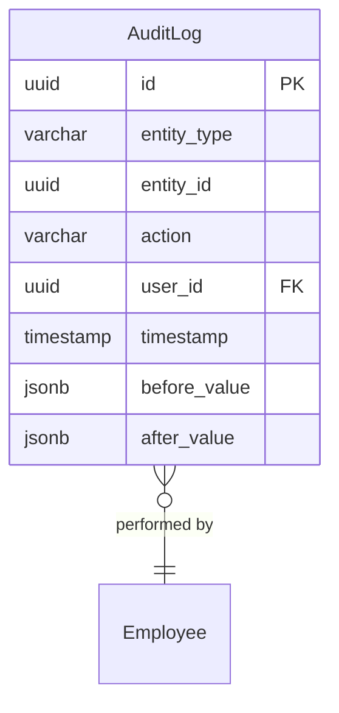

# AuditLog

**Module**: Payroll (PR)  
**Submodule**: UTILITY  
**Version**: 2.0  
**Last Updated**: 2025-12-24

---

## Entity: AuditLog {#audit-log}

**Classification**: CORE_ENTITY

**Definition**: Comprehensive audit trail for all payroll operations and data changes

**Purpose**: Provides complete audit history for compliance, troubleshooting, and security monitoring

**Key Characteristics**:
- Tracks all payroll entity changes
- Records user actions and timestamps
- Stores before/after values
- Supports compliance and security auditing
- **SCD Type 2**: No - append-only audit log

---

### Attributes

| Attribute | Type | Required | Constraints | Description |
|-----------|------|----------|-------------|-------------|
| `id` | UUID | ✅ | PK | Primary identifier |
| `entity_type` | varchar(50) | ✅ | NOT NULL | Entity type (PayrollBatch, PayElement, etc.) |
| `entity_id` | UUID | ✅ | NOT NULL | Entity identifier |
| `action` | varchar(20) | ✅ | ENUM | Action: CREATE, UPDATE, DELETE, EXECUTE |
| `user_id` | UUID | ✅ | FK → Employee | User performing action |
| `timestamp` | timestamp | ✅ | DEFAULT now() | Action timestamp |
| `before_value` | jsonb | ❌ | NULL | Value before change |
| `after_value` | jsonb | ❌ | NULL | Value after change |
| `metadata` | jsonb | ❌ | NULL | Additional audit data |

---

### Relationships



#### Relationship Details

| Relationship | Target | Cardinality | Foreign Key | Purpose |
|--------------|--------|-------------|-------------|---------|
| `user` | Core.Employee | N:1 | `user_id` | User who performed action |

---

### Data Validation & Constraints

**Database Constraints**:
- `pk_audit_log`: PRIMARY KEY (`id`)
- `fk_audit_log_user`: FOREIGN KEY (`user_id` → `employee.id`)
- `ck_audit_log_action`: CHECK (`action IN ('CREATE','UPDATE','DELETE','EXECUTE')`)

---

### Examples

```yaml
AuditLog:
  id: "audit-uuid"
  entity_type: "PayrollBatch"
  entity_id: "batch-2025-01-uuid"
  action: "UPDATE"
  user_id: "admin-uuid"
  timestamp: "2025-02-01T10:30:00Z"
  before_value:
    status_code: "CALC"
  after_value:
    status_code: "REVIEW"
  metadata:
    ip_address: "192.168.1.100"
    session_id: "sess-12345"
```

---

### Best Practices

✅ **DO**:
- Log all critical operations
- Store complete before/after values
- Include metadata for context

❌ **DON'T**:
- Don't delete audit logs
- Don't log sensitive data unnecessarily

---

## References

- **Sub-module Index**: [README.md](./README.md)
- **Database Schema**: [../../../03-design/5.Payroll.V3.dbml](../../../03-design/5.Payroll.V3.dbml)
