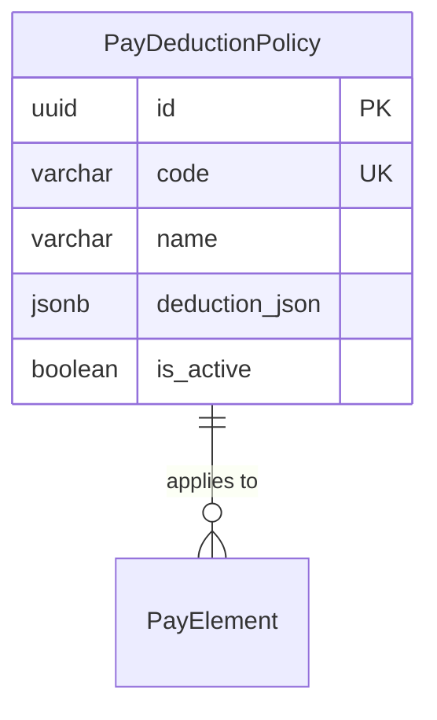

# PayDeductionPolicy

**Module**: Payroll (PR)  
**Submodule**: UTILITY  
**Version**: 2.0  
**Last Updated**: 2025-12-24

---

## Entity: PayDeductionPolicy {#pay-deduction-policy}

**Classification**: CORE_ENTITY

**Definition**: Defines deduction policies with configurable rules and logic

**Purpose**: Manages complex deduction scenarios with country/market-specific rules

**Key Characteristics**:
- Configurable deduction logic via JSON
- Market-specific policies
- Can be activated/deactivated
- **SCD Type 2**: No - configuration data with is_active flag

---

### Attributes

| Attribute | Type | Required | Constraints | Description |
|-----------|------|----------|-------------|-------------|
| `id` | UUID | ✅ | PK | Primary identifier |
| `code` | varchar(50) | ✅ | UNIQUE, NOT NULL | Policy code |
| `name` | varchar(100) | ✅ | NOT NULL | Policy display name |
| `description` | text | ❌ | NULL | Policy description |
| `deduction_json` | jsonb | ❌ | NULL | Deduction rules and logic |
| `is_active` | boolean | ✅ | DEFAULT true | Whether policy is active |
| `created_at` | timestamp | ✅ | Auto | Creation timestamp |
| `updated_at` | timestamp | ❌ | Auto | Last update timestamp |

---

### Relationships



---

### Examples

```yaml
PayDeductionPolicy:
  code: "LOAN_DEDUCTION_VN"
  name: "Vietnam Loan Deduction Policy"
  description: "Employee loan deduction with max 30% of net salary"
  deduction_json:
    max_percentage: 0.30
    base: "NET_SALARY"
    priority: 10
  is_active: true
```

---

### Best Practices

✅ **DO**:
- Document deduction rules clearly
- Test policies before activation

❌ **DON'T**:
- Don't modify active policies (create new version)

---

## References

- **Sub-module Index**: [README.md](./README.md)
- **Database Schema**: [../../../03-design/5.Payroll.V3.dbml](../../../03-design/5.Payroll.V3.dbml)
