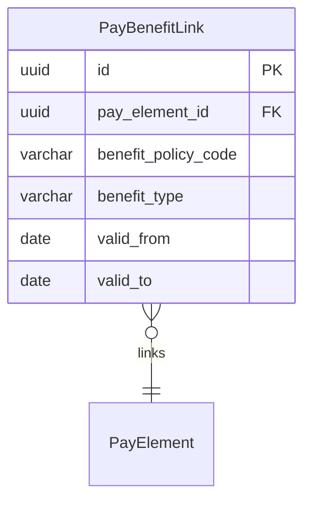

# PayBenefitLink

**Module**: Payroll (PR)  
**Submodule**: UTILITY  
**Version**: 2.0  
**Last Updated**: 2025-12-24

---

## Entity: PayBenefitLink {#pay-benefit-link}

**Classification**: CORE_ENTITY

**Definition**: Links pay elements to benefit policies for integrated benefit management

**Purpose**: Enables connection between payroll elements and Total Rewards benefit policies

**Key Characteristics**:
- Links PayElement to benefit policies
- Supports multiple benefit types (ALLOWANCE, BENEFIT, BONUS)
- Time-bound validity periods
- **SCD Type 2**: No - configuration data with validity dates

---

### Attributes

| Attribute | Type | Required | Constraints | Description |
|-----------|------|----------|-------------|-------------|
| `id` | UUID | ✅ | PK | Primary identifier |
| `pay_element_id` | UUID | ✅ | FK → PayElement | Pay element |
| `benefit_policy_code` | varchar(50) | ✅ | NOT NULL | Benefit policy code |
| `benefit_type` | varchar(50) | ✅ | ENUM | Type: ALLOWANCE, BENEFIT, BONUS |
| `valid_from` | date | ✅ | NOT NULL | Validity start date |
| `valid_to` | date | ❌ | NULL | Validity end date |
| `metadata` | jsonb | ❌ | NULL | Additional data |
| `created_at` | timestamp | ✅ | Auto | Creation timestamp |
| `updated_at` | timestamp | ❌ | Auto | Last update timestamp |

---

### Relationships



#### Relationship Details

| Relationship | Target | Cardinality | Foreign Key | Purpose |
|--------------|--------|-------------|-------------|---------|
| `pay_element` | [PayElement](../01-config/04-pay-element.md) | N:1 | `pay_element_id` | Linked pay element |

**Integration Points**:
- **Total Rewards (TR)**: Links to benefit policies

---

### Examples

```yaml
PayBenefitLink:
  pay_element_id: "meal-allowance-element-uuid"
  benefit_policy_code: "MEAL_ALLOWANCE_POLICY"
  benefit_type: "ALLOWANCE"
  valid_from: "2025-01-01"
  valid_to: null
  metadata:
    auto_calculate: true
```

---

### Best Practices

✅ **DO**:
- Set validity periods clearly
- Link to active benefit policies

❌ **DON'T**:
- Don't create overlapping links for same element

---

## References

- **Sub-module Index**: [README.md](./README.md)
- **Database Schema**: [../../../03-design/5.Payroll.V3.dbml](../../../03-design/5.Payroll.V3.dbml)
