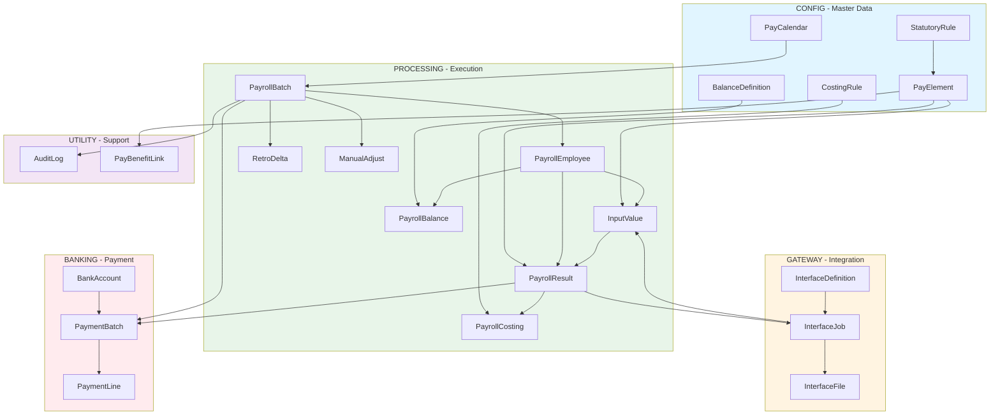
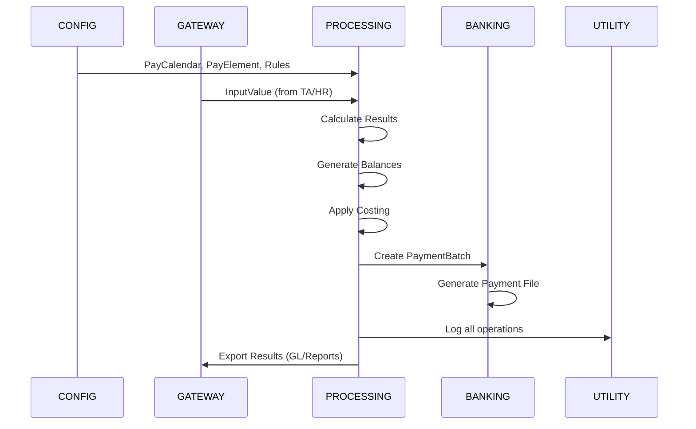

# Payroll Domain Entities

**Module**: Payroll (PR)  
**Layer**: Ontology - Domain  
**Version**: 2.0  
**Last Updated**: 2025-12-24

---

## Overview

This directory contains the complete domain entity definitions for the Payroll module, organized into 6 sub-modules covering the entire payroll lifecycle from configuration through execution to payment and audit.

**Total Entities**: 33  
**Total Documentation**: ~6,024 lines  
**Template Standard**: O3 v2.5

---

## Sub-modules

### 1. CONFIG (13 entities) - Master Data Configuration

**Purpose**: Defines all master data required for payroll processing

**Entities**:
1. [PayFrequency](./01-config/01-pay-frequency.md) - Payroll frequency patterns
2. [PayCalendar](./01-config/02-pay-calendar.md) - Payroll calendars with scheduling
3. [PayGroup](./01-config/03-pay-group.md) - Employee grouping for processing
4. [PayElement](./01-config/04-pay-element.md) - Earnings, deductions, and taxes
5. [BalanceDefinition](./01-config/05-balance-definition.md) - Balance accumulators (YTD, QTD)
6. [CostingRule](./01-config/06-costing-rule.md) - GL costing distribution rules
7. [StatutoryRule](./01-config/07-statutory-rule.md) - Statutory compliance rules
8. [GLMapping](./01-config/08-gl-mapping.md) - GL account mappings
9. [ValidationRule](./01-config/09-validation-rule.md) - Data validation rules
10. [PayslipTemplate](./01-config/10-payslip-template.md) - Payslip templates
11. [PayFormula](./01-config/11-pay-formula.md) - Reusable calculation formulas
12. [PayProfile](./01-config/12-pay-profile.md) - Payroll policy profiles
13. [PayProfileMap](./01-config/13-pay-profile-map.md) - Profile assignments

---

### 2. PROCESSING (9 entities) - Payroll Run Execution

**Purpose**: Handles payroll calculation and result storage

**Entities**:
1. [PayrollBatch](./02-processing/01-payroll-batch.md) - Main payroll run orchestrator
2. [PayrollEmployee](./02-processing/02-payroll-employee.md) - Employee participation in run
3. [InputValue](./02-processing/03-input-value.md) - Input data for calculations
4. [PayrollResult](./02-processing/04-payroll-result.md) - Calculated element results
5. [PayrollBalance](./02-processing/05-payroll-balance.md) - Balance accumulations
6. [PayrollCosting](./02-processing/06-payroll-costing.md) - GL distribution entries
7. [RetroDelta](./02-processing/07-retro-delta.md) - Retroactive adjustments
8. [CalcLog](./02-processing/08-calc-log.md) - Calculation trace logging
9. [ManualAdjust](./02-processing/09-manual-adjust.md) - Manual adjustments

---

### 3. GATEWAY (4 entities) - Integration Interfaces

**Purpose**: Manages data exchange with external systems

**Entities**:
1. [InterfaceDefinition](./03-gateway/01-interface-definition.md) - Interface configurations
2. [InterfaceJob](./03-gateway/02-interface-job.md) - Job execution tracking
3. [InterfaceFile](./03-gateway/03-interface-file.md) - File processing
4. [InterfaceLine](./03-gateway/04-interface-line.md) - Line-level detail

---

### 4. BANKING (3 entities) - Payment Processing

**Purpose**: Handles payment file generation and bank integration

**Entities**:
1. [BankAccount](./04-banking/01-bank-account.md) - Company bank accounts
2. [PaymentBatch](./04-banking/02-payment-batch.md) - Payment batch orchestration
3. [PaymentLine](./04-banking/03-payment-line.md) - Per-employee payment lines

---

### 5. UTILITY (4 entities) - Supporting Functions

**Purpose**: Provides audit, reference data, and integration support

**Entities**:
1. [AuditLog](./05-utility/01-audit-log.md) - Comprehensive audit trail
2. [PayAdjustReason](./05-utility/02-pay-adjust-reason.md) - Adjustment reason codes
3. [PayDeductionPolicy](./05-utility/03-pay-deduction-policy.md) - Deduction policies
4. [PayBenefitLink](./05-utility/04-pay-benefit-link.md) - Benefit policy integration

---

## Architecture Overview

### Complete Payroll Architecture

### Data Flow

---

## Key Features

### 1. Complete Payroll Lifecycle
- ✅ Configuration (calendars, elements, rules)
- ✅ Execution (batches, calculation, results)
- ✅ Costing (GL distribution)
- ✅ Payment (bank file generation)
- ✅ Integration (inbound/outbound)
- ✅ Audit (complete trail)

### 2. Multi-dimensional Support
- **Multi-currency**: All entities support multiple currencies
- **Multi-market**: Statutory rules per market
- **Multi-frequency**: Weekly, bi-weekly, monthly, etc.
- **Multi-segment**: GL accounting with cost centers

### 3. Flexible Integration
- **Inbound**: Time & Attendance, HR systems, Manual adjustments
- **Outbound**: GL systems, Banking, Reporting, Payslips
- **File formats**: CSV, JSON, API
- **Scheduling**: Automated execution support

### 4. Robust Tracking
- Lifecycle states (INIT → CALC → REVIEW → CONFIRM → CLOSED)
- Calculation trace logging
- Payment status tracking
- Complete audit history

---

## Template Compliance

All entities follow **Template O3 v2.5** standards:

**Included Sections**:
- ✅ Entity definition with Key Characteristics
- ✅ SCD2 note (Yes/No with explanation)
- ✅ Attributes table
- ✅ ER diagram in Relationships section
- ✅ Relationship Details table
- ✅ Data Validation & Constraints (combined)
- ✅ Examples with business context
- ✅ Best Practices (DO/DON'T + Performance + Security)
- ✅ Migration Notes
- ✅ References

**Removed Sections**:
- ❌ Business Rules (moved to Spec layer)
- ❌ Indexes (too technical)
- ❌ Audit Fields (redundant)
- ❌ Related Entities (merged into Relationships)

---

## Statistics

| Metric | Value |
|--------|-------|
| Total Sub-modules | 6 |
| Total Entities | 33 |
| Total Lines | ~6,024 |
| Average Lines/Entity | 183 |
| Entities with SCD2 | 10 |
| Entities with JSON structures | 10 |
| Entities with flow diagrams | 8 |

---

## Integration Points

### External Systems
- **Core Module (CO)**: Employee, LegalEntity, TalentMarket
- **Time & Attendance (TA)**: Hours data, attendance records
- **Total Rewards (TR)**: Benefit policies, compensation
- **GL/Accounting**: Chart of accounts, journal entries
- **Banking**: Payment files, account validation

### Internal Dependencies
- CONFIG entities are referenced by PROCESSING
- PROCESSING generates data for BANKING
- GATEWAY facilitates all integrations
- UTILITY supports all sub-modules

---

## Quick Navigation

### By Function
- **Setup**: [CONFIG](./01-config/)
- **Execution**: [PROCESSING](./02-processing/)
- **Integration**: [GATEWAY](./03-gateway/)
- **Payment**: [BANKING](./04-banking/)
- **Support**: [UTILITY](./05-utility/)

### By Entity Type
- **Master Data**: PayFrequency, PayCalendar, PayGroup, PayElement
- **Rules**: StatutoryRule, CostingRule, ValidationRule
- **Transactions**: PayrollBatch, PayrollResult, PaymentBatch
- **Audit**: AuditLog, CalcLog
- **Integration**: InterfaceDefinition, InterfaceJob

---

## Related Documentation

- **Concept Layer**: [../../01-concept/](../../01-concept/) - Detailed guides and workflows
- **Spec Layer**: [../../02-spec/](../../02-spec/) - Functional requirements and business rules
- **Design Layer**: [../../03-design/](../../03-design/) - Database schema and technical design
- **Glossary**: [../glossary/](../glossary/) - Term definitions

---

## Version History

- **v2.0 (2025-12-24)**: Complete rewrite with Template O3 v2.5
  - All 33 entities documented
  - 6 sub-modules complete
  - ER diagrams for all entities
  - Removed BR/Indexes/Audit sections
  - Added architecture diagrams

- **v1.0 (2024-01-01)**: Initial entity definitions

---

**Last Updated**: 2025-12-24  
**Maintained By**: xTalent Documentation Team  
**Status**: ✅ Complete - All 6 sub-modules documented
