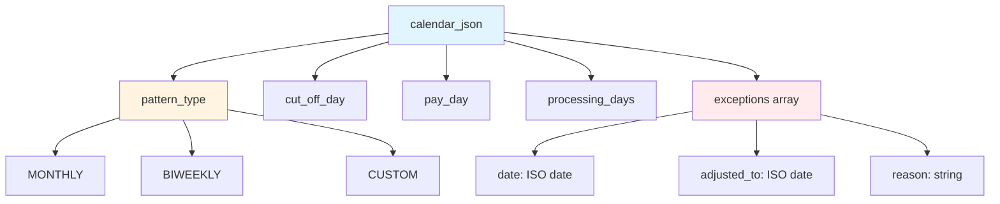
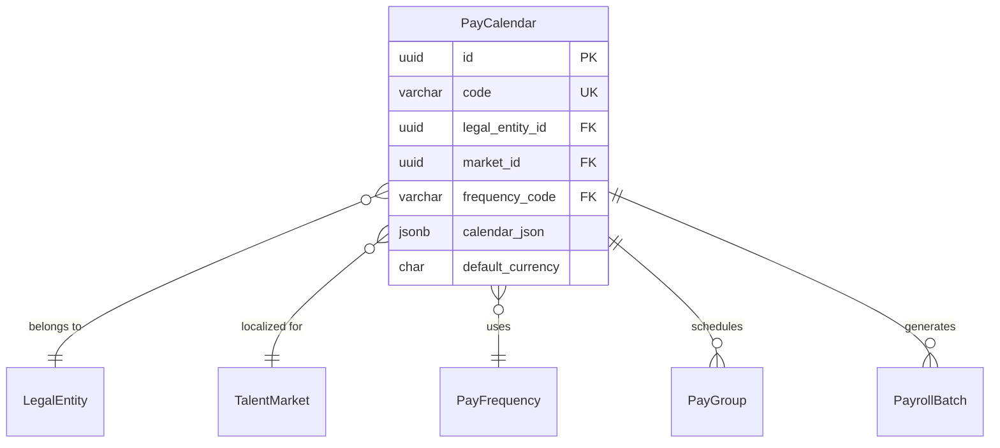
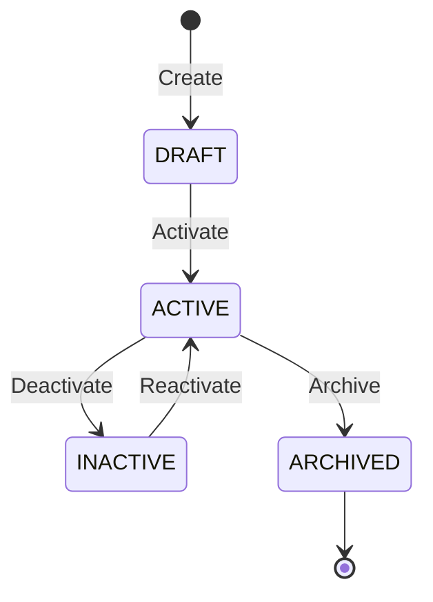
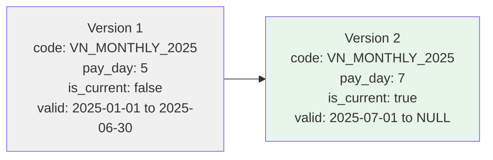

# PayCalendar

**Module**: Payroll (PR)
**Submodule**: CONFIG
**Version**: 2.0
**Last Updated**: 2025-12-23

---

## Entity: PayCalendar {#pay-calendar}

**Classification**: CORE_ENTITY  

**Definition**: Defines payroll calendar with cut-off dates, pay dates, and processing schedule for a legal entity

**Purpose**: Establishes the payroll processing schedule including when time is cut off, when payroll is calculated, and when employees are paid

**Key Characteristics**:
- One calendar per legal entity and market combination
- Supports multiple frequencies (monthly, bi-weekly, etc.)
- Contains calendar pattern in JSON for flexible scheduling
- Multi-currency support with default currency
- Links to talent market for localization
- **SCD Type 2**: Yes - tracks historical changes to calendar patterns and schedules

---

### Attributes

| Attribute | Type | Required | Constraints | Description |
|-----------|------|----------|-------------|-------------|
| `id` | UUID | ✅ | PK | Primary identifier |
| `code` | varchar(50) | ✅ | UNIQUE, NOT NULL | Unique calendar code (e.g., VN_MONTHLY_2025) |
| `name` | varchar(255) | ✅ | NOT NULL | Calendar display name |
| `description` | text | ❌ | NULL | Detailed description of calendar purpose |
| `legal_entity_id` | UUID | ✅ | FK → Core.LegalEntity | Owning legal entity |
| `market_id` | UUID | ✅ | FK → Core.TalentMarket | Talent market for localization |
| `frequency_code` | varchar(20) | ✅ | FK → [PayFrequency](#pay-frequency) | Payroll frequency |
| `calendar_json` | jsonb | ✅ | NOT NULL | Calendar pattern with cut-off and pay dates |
| `default_currency` | char(3) | ✅ | ISO 4217 | Default currency for this calendar |
| `metadata` | jsonb | ❌ | NULL | Additional flexible data |
| `created_at` | timestamp | ✅ | Auto-generated | Creation timestamp |
| `updated_at` | timestamp | ❌ | Auto-updated | Last modification timestamp |

**Attribute Details**:

#### `calendar_json`

**Type**: jsonb  
**Purpose**: Stores the calendar pattern defining cut-off dates, pay dates, and processing windows

**Structure**:
```yaml
calendar_json:
  pattern_type: "MONTHLY" | "BIWEEKLY" | "CUSTOM"
  cut_off_day: 25              # Day of month for time cut-off
  pay_day: 5                   # Day of next month for payment
  processing_days: 7           # Days between cut-off and pay
  exceptions:                  # Holiday/weekend adjustments
    - date: "2025-01-01"
      adjusted_to: "2024-12-29"
      reason: "New Year Holiday"
```

**Structure Diagram**:


**Validation**:
- `cut_off_day` must be between 1-31
- `pay_day` must be between 1-31
- `processing_days` must be > 0
- For BIWEEKLY: must specify start_date and day_of_week

**Example**:
```json
{
  "pattern_type": "MONTHLY",
  "cut_off_day": 25,
  "pay_day": 5,
  "processing_days": 7,
  "exceptions": [
    {
      "date": "2025-12-25",
      "adjusted_to": "2025-12-24",
      "reason": "Christmas"
    }
  ]
}
```

---

### Relationships

> **📌 Note**: Structural relationships only. For business context, see [Concept Layer](../../../01-concept/02-processing/).

#### Entity Relationship Diagram



#### Relationship Details

| Relationship | Target | Cardinality | Foreign Key | Purpose |
|--------------|--------|-------------|-------------|---------|
| `legal_entity` | Core.LegalEntity | N:1 | `legal_entity_id` | Owning legal entity for this calendar |
| `market` | Core.TalentMarket | N:1 | `market_id` | Provides localization (holidays, regulations) |
| `frequency` | [PayFrequency](./01-pay-frequency.md) | N:1 | `frequency_code` | Defines payroll frequency (MONTHLY, etc.) |
| `pay_groups` | [PayGroup](./03-pay-group.md) | 1:N | (inverse) | Pay groups scheduled by this calendar |
| `payroll_batches` | PayrollBatch (PROCESSING) | 1:N | (inverse) | Payroll runs created per calendar schedule |

**Relationship Notes**:
- CASCADE on legal_entity delete (calendar belongs to entity)
- RESTRICT on frequency delete (must not delete referenced frequencies)
- One calendar can serve multiple pay groups

**Integration Points**:
- **Time & Attendance (TA)**: `cut_off_day` determines time entry submission deadline
- **Core Module (CO)**: Legal entity and talent market master data
- **Total Rewards (TR)**: Compensation cycles aligned with payroll calendar

---

### Lifecycle States



**State Descriptions**:
- **DRAFT**: Calendar being configured, not yet used for payroll
- **ACTIVE**: Currently in use for payroll processing
- **INACTIVE**: Temporarily disabled (e.g., during transition)
- **ARCHIVED**: Permanently retired, kept for historical records

**State Transition Rules**:
- Cannot activate calendar without valid calendar_json
- Cannot deactivate calendar with active payroll runs
- Cannot delete calendar (must archive instead for audit trail)

---

### Data Validation & Constraints

> **Note**: Entity-specific validation rules only. Complex business rules belong in Spec layer.

| Rule ID | Rule Name | Description | Validation Trigger |
|---------|-----------|-------------|----------------------|
| BR-PR-CAL-001 | Unique Calendar per Entity-Market | Only one active calendar per legal_entity_id + market_id + frequency_code combination | On Create/Update |
| BR-PR-CAL-002 | Valid Calendar Pattern | calendar_json must contain valid cut_off_day, pay_day, and processing_days | On Create/Update |
| BR-PR-CAL-003 | Currency Match | default_currency must match legal entity's operating currency or be explicitly approved | On Create |
| BR-PR-CAL-004 | SCD2 Versioning | When updating active calendar, create new version with new effective_start_date | On Update |

**Rule Details**:

#### BR-PR-CAL-001: Unique Calendar per Entity-Market

**Condition**: When creating or activating a calendar  
**Logic**: System checks if another ACTIVE calendar exists with same legal_entity_id, market_id, and frequency_code  
**Error Message**: "An active {frequency} calendar already exists for this legal entity and market. Please deactivate the existing calendar first."  
**Example**:
```yaml
Scenario: Attempt to create duplicate monthly calendar
  Given: Active calendar VN_MONTHLY_2025 exists for VNG Corp + Vietnam + MONTHLY
  When: User creates new calendar VN_MONTHLY_2025_V2 with same entity/market/frequency
  Then: System rejects with error
  Error: "An active MONTHLY calendar already exists for VNG Corp - Vietnam"
```


| Field | Validation | Error Message |
|-------|------------|---------------|
| `code` | Unique, 3-50 chars, alphanumeric+underscore+hyphen | "Calendar code must be unique and 3-50 characters" |
| `default_currency` | Must be valid ISO 4217 currency code | "Invalid currency code. Must be 3-letter ISO 4217 code" |
| `calendar_json.cut_off_day` | Integer 1-31 | "Cut-off day must be between 1 and 31" |
| `calendar_json.pay_day` | Integer 1-31 | "Pay day must be between 1 and 31" |
| `calendar_json.processing_days` | Integer > 0 | "Processing days must be greater than 0" |


**Database Constraints**:

| Constraint Name | Type | Columns | Description |
|-----------------|------|---------|-------------|
| `pk_pay_calendar` | PRIMARY KEY | `id` | Primary key constraint |
| `uk_pay_calendar_code` | UNIQUE | `code` | Business code must be unique |
| `fk_pay_calendar_legal_entity` | FOREIGN KEY | `legal_entity_id` → `legal_entity.id` | Reference to legal entity |
| `fk_pay_calendar_market` | FOREIGN KEY | `market_id` → `talent_market.id` | Reference to talent market |
| `fk_pay_calendar_frequency` | FOREIGN KEY | `frequency_code` → `pay_frequency.code` | Reference to frequency |
| `ck_pay_calendar_currency` | CHECK | `LENGTH(default_currency) = 3` | Currency must be 3 characters |


| Index Name | Columns | Unique | Type | Purpose |
|------------|---------|--------|------|---------|
| `idx_pay_calendar_code` | `code` | ✅ | B-tree | Fast lookup by business code |
| `idx_pay_calendar_entity_market` | `legal_entity_id, market_id, frequency_code` | ❌ | B-tree | Find calendars by entity/market |
| `idx_pay_calendar_dates` | `effective_start_date, effective_end_date` | ❌ | B-tree | SCD2 temporal queries |
| `idx_pay_calendar_current` | `is_current_flag` WHERE `is_current_flag = true` | ❌ | Partial | Fast current version lookup |


**Standard Audit** (all entities):

| Field | Type | Description |
|-------|------|-------------|
| `created_at` | timestamp | When record was created |
| `updated_at` | timestamp | Last modification time |

**SCD Type 2** (applicable):

| Field | Type | Description |
|-------|------|-------------|
| `effective_start_date` | date | When this version becomes effective |
| `effective_end_date` | date | When this version expires (NULL = current) |
| `is_current_flag` | boolean | `true` for current version, `false` for historical |

**SCD2 Notes**:
- Only one record has `is_current_flag = true` per business key (`code`)
- Temporal queries use `effective_start_date` and `effective_end_date`
- Updates create new version, old version's `is_current_flag` set to `false`
- Never physically delete SCD2 records

**SCD2 Pattern Visualization**:


---

### Examples

#### Example 1: Vietnam Monthly Calendar

**Description**: Standard monthly payroll calendar for Vietnam operations

```yaml
PayCalendar:
  id: "550e8400-e29b-41d4-a716-446655440000"
  code: "VN_MONTHLY_2025"
  name: "Vietnam Monthly Payroll 2025"
  description: "Monthly payroll for VNG Corp Vietnam employees"
  legal_entity_id: "vng-corp-uuid"
  market_id: "vietnam-market-uuid"
  frequency_code: "MONTHLY"
  default_currency: "VND"
  calendar_json:
    pattern_type: "MONTHLY"
    cut_off_day: 25
    pay_day: 5
    processing_days: 7
    exceptions:
      - date: "2025-01-01"
        adjusted_to: "2024-12-30"
        reason: "New Year Holiday"
      - date: "2025-04-30"
        adjusted_to: "2025-04-29"
        reason: "Reunification Day"
  effective_start_date: "2025-01-01"
  effective_end_date: null
  is_current_flag: true
  created_at: "2024-12-01T10:00:00Z"
```

**Business Context**: Cut-off on 25th of month, payment on 5th of next month, giving 7 business days for processing

#### Example 2: Singapore Bi-Weekly Calendar

**Description**: Bi-weekly payroll calendar for Singapore operations

```yaml
PayCalendar:
  code: "SG_BIWEEKLY_2025"
  name: "Singapore Bi-Weekly Payroll 2025"
  legal_entity_id: "vng-singapore-uuid"
  market_id: "singapore-market-uuid"
  frequency_code: "BIWEEKLY"
  default_currency: "SGD"
  calendar_json:
    pattern_type: "BIWEEKLY"
    start_date: "2025-01-06"
    day_of_week: "FRIDAY"
    cut_off_day_offset: -3
    pay_day_offset: 4
    processing_days: 5
  effective_start_date: "2025-01-01"
  is_current_flag: true
```

**Business Context**: Bi-weekly cycle starting Monday, cut-off Friday, payment following Tuesday

---

### Best Practices

✅ **DO**:
- Use descriptive calendar codes including country, frequency, and year
- Document all holiday exceptions in calendar_json
- Test calendar pattern before activating for production
- Create new SCD2 version when changing calendar pattern mid-year
- Align default_currency with legal entity's primary currency

❌ **DON'T**:
- Don't change calendar pattern during active payroll period
- Don't delete calendars (archive instead for audit trail)
- Don't reuse calendar codes across different legal entities
- Don't set processing_days < 3 (insufficient time for review)
- Don't forget to account for weekends and holidays in exceptions

**Performance Tips**:
- Use indexed fields (`code`, `legal_entity_id`) in WHERE clauses
- Cache active calendar configurations in application layer (calendars rarely change)
- Pre-calculate payroll periods for entire year at calendar activation
- Use partial index on `is_current_flag = true` for active calendar queries
- Cache `calendar_json` patterns to avoid repeated JSON parsing
- Index on (`legal_entity_id, market_id, frequency_code`) for calendar lookups

**Security Considerations**:
- Restrict calendar modification to Payroll Administrators and HR Directors only
- Audit all calendar changes (SCD2 provides automatic audit trail)
- Require approval workflow for calendar pattern changes (impacts all payroll runs)
- Log calendar access for compliance auditing
- Validate `calendar_json` structure to prevent malformed data
- Monitor for anomalies in exception dates (potential fraud indicator)

---


---

### Related Workflows

- [WF-PR-CONFIG-001](../workflows/config-workflows.md#wf-pr-config-001) - Pay Calendar Setup (CREATE calendar)
- [WF-PR-PROC-001](../workflows/processing-workflows.md#wf-pr-proc-001) - Standard Payroll Run (USES calendar for scheduling)

**Workflow Context**: PayCalendar is created during initial payroll setup and referenced by every payroll run to determine cut-off and pay dates.

---

### Migration Notes

**Version History**:
- **v2.0 (2025-07-01)**: Added `default_currency` field for multi-currency support
- **v2.0 (2025-07-01)**: Added `market_id` for talent market localization
- **v1.0 (2024-01-01)**: Initial calendar definition

**Deprecated Fields**:
- None

**Breaking Changes**:
- v2.0: `default_currency` is now required (previously optional)
- v2.0: `market_id` is now required (previously not present)

---


---

## References

- **Sub-module Index**: [README.md](./README.md)
- **Glossary**: [../../glossary-config.md](../../glossary-config.md)
- **Database Schema**: [../../../03-design/5.Payroll.V3.dbml](../../../03-design/5.Payroll.V3.dbml)