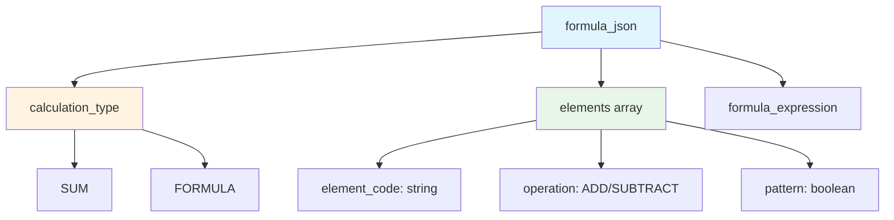
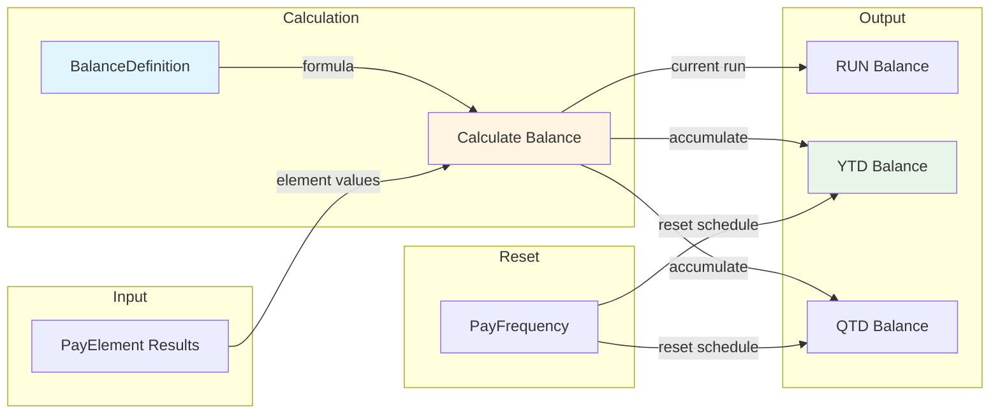
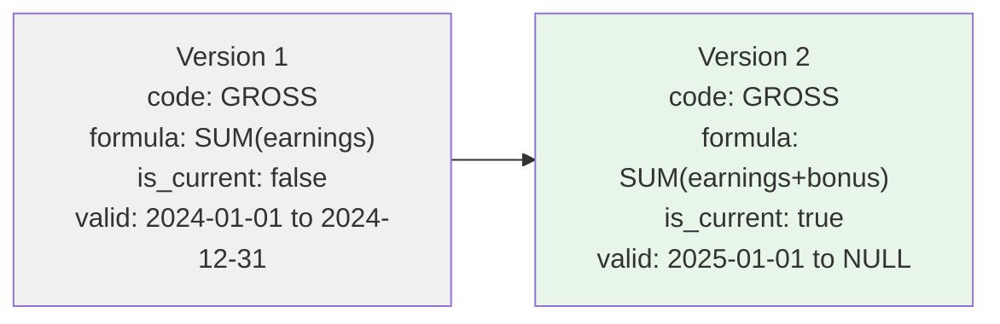

# BalanceDefinition

**Module**: Payroll (PR)
**Submodule**: CONFIG
**Version**: 2.0
**Last Updated**: 2025-12-23

---

## Entity: BalanceDefinition {#balance-definition}

**Classification**: CORE_ENTITY  

**Definition**: Defines payroll balance accumulators (gross, net, YTD, QTD) that track cumulative values across payroll periods

**Purpose**: Provides configurable balance definitions for tracking cumulative payroll amounts over different time periods

**Key Characteristics**:
- Supports multiple balance types: RUN (single run), QTD (quarter-to-date), YTD (year-to-date), LTD (life-to-date)
- Can have calculation formulas to derive balance values
- Links to reset frequency for periodic balances
- SCD Type 2 for historical tracking
- Used for reporting and compliance (e.g., YTD income for tax)

---

### Attributes

| Attribute | Type | Required | Constraints | Description |
|-----------|------|----------|-------------|-------------|
| `id` | UUID | ✅ | PK | Primary identifier |
| `code` | varchar(50) | ✅ | UNIQUE, NOT NULL | Unique balance code (e.g., GROSS, NET, YTD_INC) |
| `name` | varchar(100) | ✅ | NOT NULL | Balance display name |
| `balance_type` | varchar(20) | ✅ | RUN \| QTD \| YTD \| LTD | Balance accumulation type |
| `formula_json` | jsonb | ❌ | NULL | Formula to calculate balance |
| `reset_freq_code` | varchar(20) | ❌ | FK → [PayFrequency](#pay-frequency) | Reset frequency for periodic balances |
| `metadata` | jsonb | ❌ | NULL | Additional flexible data |
| `created_at` | timestamp | ✅ | Auto-generated | Creation timestamp |
| `updated_at` | timestamp | ❌ | Auto-updated | Last modification timestamp |

**Attribute Details**:

#### `formula_json`

**Type**: jsonb  
**Purpose**: Defines how the balance is calculated from element results

**Structure**:
```yaml
formula_json:
  calculation_type: "SUM" | "FORMULA"
  elements:
    - element_code: "BASIC_SAL"
      operation: "ADD"
    - element_code: "OT_1_5"
      operation: "ADD"
  formula_expression: "[custom formula]"
```

**Structure Diagram**:


**Example - Gross Balance**:
```json
{
  "calculation_type": "SUM",
  "elements": [
    {"element_code": "BASIC_SAL", "operation": "ADD"},
    {"element_code": "OT_1_5", "operation": "ADD"},
    {"element_code": "ALLOWANCE_*", "operation": "ADD", "pattern": true}
  ],
  "description": "Sum of all earning elements"
}
```

---

### Relationships

> **📌 Note**: This section lists **structural relationships only**. For **business context** (how balances are calculated and used), see [Concept Layer](../../../01-concept/02-processing/).

| Relationship | Target | Cardinality | Foreign Key | Purpose |
|--------------|--------|-------------|-------------|---------|
| `reset_frequency` | [PayFrequency](./01-pay-frequency.md) | N:1 | `reset_freq_code` | Frequency for balance reset (YTD, QTD) |
| `balance_values` | PayrollBalance (PROCESSING) | 1:N | (inverse) | Actual balance values per payroll run |

**Balance Calculation Flow**:


---

### Business Rules

| Rule ID | Rule Name | Description | Validation Trigger |
|---------|-----------|-------------|----------------------|
| BR-PR-BAL-001 | Unique Balance Code | Balance code must be unique | On Create/Update |
| BR-PR-BAL-002 | Reset Frequency for Periodic | QTD/YTD balances must have reset_freq_code | On Create/Update |
| BR-PR-BAL-003 | Valid Formula | If formula_json provided, must be valid | On Create/Update |
**Rule Details**:

#### BR-PR-BAL-002: Reset Frequency for Periodic

**Condition**: When balance_type is QTD or YTD  
**Logic**: System validates that `reset_freq_code` is not null  
**Error Message**: "Periodic balances (QTD/YTD) must have a reset frequency"  
**Example**:
```yaml
Given: balance_type = "YTD"
When: reset_freq_code = null
Then: Validation fails
Error: "Periodic balances (QTD/YTD) must have a reset frequency"
```

---

### Audit Fields

**Standard Audit**:
- `created_at`, `created_by`, `updated_at`, `updated_by`

**SCD Type 2** (applicable):
- `effective_start_date`, `effective_end_date`, `is_current_flag`

**SCD2 Pattern Visualization**:

---

### Examples

#### Example 1: Gross Pay (Run Balance)

```yaml
BalanceDefinition:
  code: "GROSS"
  name: "Gross Pay"
  balance_type: "RUN"
  formula_json:
    calculation_type: "SUM"
    elements:
      - element_code: "BASIC_SAL"
        operation: "ADD"
      - element_code: "OT_*"
        operation: "ADD"
        pattern: true
      - element_code: "ALLOWANCE_*"
        operation: "ADD"
        pattern: true
  reset_freq_code: null
  effective_start_date: "2025-01-01"
  is_current_flag: true
```

**Business Context**: Gross pay is calculated each run, sum of all earnings

#### Example 2: Year-to-Date Income

```yaml
BalanceDefinition:
  code: "YTD_INC"
  name: "Year-to-Date Income"
  balance_type: "YTD"
  formula_json:
    calculation_type: "SUM"
    elements:
      - element_code: "GROSS"
        operation: "ADD"
  reset_freq_code: "MONTHLY"
  effective_start_date: "2025-01-01"
  is_current_flag: true
```

**Business Context**: YTD income resets annually, used for tax calculations

---

### Best Practices

✅ **DO**:
- Use standard balance codes (GROSS, NET, YTD_INC)
- Set reset_freq_code for periodic balances
- Test balance formulas with sample data

❌ **DON'T**:
- Don't create duplicate balances for same purpose
- Don't change formula during active period (create new SCD2 version)
- Don't delete balances referenced by reports or tax calculations

**Performance Tips**:
- Balance calculations are intensive - optimize formulas
- Cache balance definitions in application layer
- Use indexed queries on `balance_type` for reporting
- Pre-calculate YTD/QTD balances during payroll run
- Consider materialized views for frequently accessed balances

**Security Considerations**:
- Restrict balance definition changes to Payroll Administrators
- Audit all formula changes (SCD2 provides history)
- Validate formulas to prevent calculation errors
- Monitor balance discrepancies for fraud detection

---

### Related Entities

**Parent/Upstream**:
- [PayFrequency](./01-pay-frequency.md): Defines reset frequency for periodic balances
- [PayElement](./04-pay-element.md): Elements whose results feed into balance calculations

**Children/Downstream**:
- PayrollBalance (PROCESSING): Actual balance values calculated per employee per run

**Peers/Related**:
- [PayFormula](./11-pay-formula.md): Complex formulas can be used in balance calculations

**Integration Points**:
- **Payroll Processing**: Balances calculated during each payroll run
- **Tax Reporting**: YTD balances used for tax calculations and reporting
- **Financial Reporting**: Balance totals aggregated for GL reporting

---

### Related Workflows

- [WF-PR-CONFIG-004](../workflows/config-workflows.md#wf-pr-config-004) - Formula & Rule Configuration
- [WF-PR-PROC-001](../workflows/processing-workflows.md#wf-pr-proc-001) - Standard Payroll Run

---


---

## References

- **Sub-module Index**: [README.md](./README.md)
- **Glossary**: [../../glossary-config.md](../../glossary-config.md)
- **Database Schema**: [../../../03-design/5.Payroll.V3.dbml](../../../03-design/5.Payroll.V3.dbml)