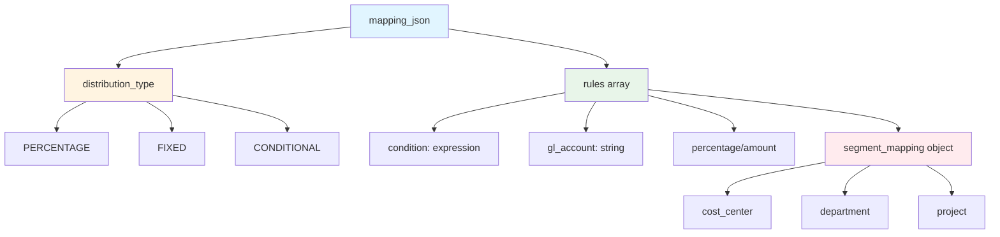
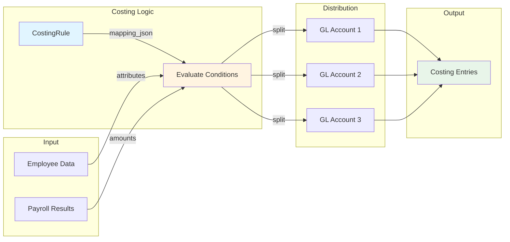
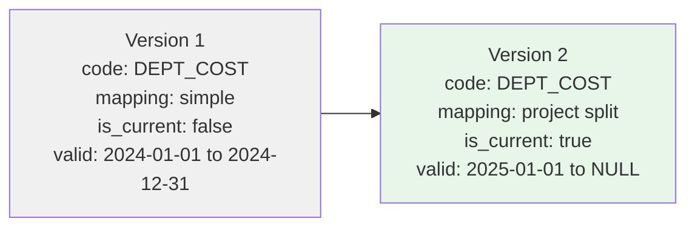

# CostingRule

**Module**: Payroll (PR)
**Submodule**: CONFIG
**Version**: 2.0
**Last Updated**: 2025-12-23

---

## Entity: CostingRule {#costing-rule}

**Classification**: CORE_ENTITY  

**Definition**: Defines rules for distributing payroll costs to GL accounts based on organizational hierarchy or employee attributes

**Purpose**: Enables flexible GL costing distribution for payroll expenses across cost centers, departments, or projects

**Key Characteristics**:
- Supports multiple costing levels: Legal Entity, Business Unit, Employee, Element
- Contains mapping logic in JSON for flexible distribution
- SCD Type 2 for historical tracking
- Can split costs by percentage or fixed amounts

---

### Attributes

| Attribute | Type | Required | Constraints | Description |
|-----------|------|----------|-------------|-------------|
| `id` | UUID | ✅ | PK | Primary identifier |
| `code` | varchar(50) | ✅ | UNIQUE, NOT NULL | Unique costing rule code |
| `name` | varchar(100) | ✅ | NOT NULL | Costing rule display name |
| `level_scope` | varchar(20) | ✅ | LE \| BU \| EMP \| ELEMENT | Costing level |
| `mapping_json` | jsonb | ✅ | NOT NULL | Costing distribution logic |
| `metadata` | jsonb | ❌ | NULL | Additional flexible data |
| `created_at` | timestamp | ✅ | Auto-generated | Creation timestamp |
| `updated_at` | timestamp | ❌ | Auto-updated | Last modification timestamp |

**Attribute Details**:

#### `mapping_json`

**Type**: jsonb  
**Purpose**: Defines how costs are distributed to GL accounts

**Structure**:
```yaml
mapping_json:
  distribution_type: "PERCENTAGE" | "FIXED" | "CONDITIONAL"
  rules:
    - condition: "[when to apply]"
      gl_account: "[account code]"
      percentage: 100
      segment_mapping:
        cost_center: "[source field]"
        department: "[source field]"
```

**Structure Diagram**:


**Example - Department-based Costing**:
```json
{
  "distribution_type": "PERCENTAGE",
  "rules": [
    {
      "condition": "EMPLOYEE.DEPARTMENT = 'IT'",
      "gl_account": "6100-IT",
      "percentage": 100,
      "segment_mapping": {
        "cost_center": "EMPLOYEE.COST_CENTER",
        "department": "IT"
      }
    },
    {
      "condition": "EMPLOYEE.DEPARTMENT = 'SALES'",
      "gl_account": "6100-SALES",
      "percentage": 100,
      "segment_mapping": {
        "cost_center": "EMPLOYEE.COST_CENTER",
        "department": "SALES"
      }
    }
  ]
}
```

---

### Relationships

> **📌 Note**: This section lists **structural relationships only**. For **business context** (how costing rules distribute payroll costs), see [Concept Layer](../../../01-concept/02-processing/).

| Relationship | Target | Cardinality | Foreign Key | Purpose |
|--------------|--------|-------------|-------------|---------|
| `costing_entries` | PayrollCosting (PROCESSING) | 1:N | (inverse) | Generated GL costing entries per payroll run |

**Costing Distribution Flow**:


---

### Business Rules

| Rule ID | Rule Name | Description | Validation Trigger |
|---------|-----------|-------------|----------------------|
| BR-PR-COST-001 | Unique Costing Code | Costing rule code must be unique | On Create/Update |
| BR-PR-COST-002 | Valid Mapping | mapping_json must be valid and parseable | On Create/Update |
| BR-PR-COST-003 | Percentage Total | For PERCENTAGE type, total must equal 100% | On Create/Update |
**Rule Details**:

#### BR-PR-COST-003: Percentage Total

**Condition**: When distribution_type is PERCENTAGE  
**Logic**: Sum of all rule percentages must equal 100%  
**Error Message**: "Costing percentages must total 100%, current total: {total}%"  
**Example**:
```yaml
Given: Two rules with 60% and 30%
When: Validating costing rule
Then: Validation fails (total = 90%)
Error: "Costing percentages must total 100%, current total: 90%"
```

---

### Audit Fields

**Standard Audit**:
- `created_at`, `created_by`, `updated_at`, `updated_by`

**SCD Type 2** (applicable):
- `effective_start_date`, `effective_end_date`, `is_current_flag`

**SCD2 Pattern Visualization**:

---

### Examples

#### Example 1: Simple Department Costing

```yaml
CostingRule:
  code: "DEPT_COSTING"
  name: "Department-based Costing"
  level_scope: "EMP"
  mapping_json:
    distribution_type: "PERCENTAGE"
    rules:
      - condition: "DEFAULT"
        gl_account: "6100-{DEPARTMENT}"
        percentage: 100
        segment_mapping:
          cost_center: "EMPLOYEE.COST_CENTER"
          department: "EMPLOYEE.DEPARTMENT"
  effective_start_date: "2025-01-01"
  is_current_flag: true
```

#### Example 2: Split Costing (Multiple Projects)

```yaml
CostingRule:
  code: "PROJECT_SPLIT"
  name: "Project Split Costing"
  level_scope: "EMP"
  mapping_json:
    distribution_type: "PERCENTAGE"
    rules:
      - condition: "EMPLOYEE.PROJECT_A_ALLOCATION > 0"
        gl_account: "6100-PROJ-A"
        percentage: "EMPLOYEE.PROJECT_A_ALLOCATION"
        segment_mapping:
          project: "PROJECT_A"
      - condition: "EMPLOYEE.PROJECT_B_ALLOCATION > 0"
        gl_account: "6100-PROJ-B"
        percentage: "EMPLOYEE.PROJECT_B_ALLOCATION"
        segment_mapping:
          project: "PROJECT_B"
  effective_start_date: "2025-01-01"
  is_current_flag: true
```

---

### Best Practices

✅ **DO**:
- Validate percentage totals equal 100%
- Use descriptive costing rule codes
- Test costing logic before activating

❌ **DON'T**:
- Don't create overlapping costing rules (causes double-counting)
- Don't hardcode GL accounts (use dynamic templates with variables)
- Don't change costing mid-period (create new SCD2 version)

**Performance Tips**:
- Costing rules evaluated for every payroll line - optimize conditions
- Cache costing rules in application layer
- Use indexed employee attributes in conditions
- Pre-validate GL account existence before payroll run
- Consider batch costing entry creation

**Security Considerations**:
- Restrict costing rule changes to Finance and Payroll Administrators
- Audit all mapping changes (SCD2 provides history)
- Validate GL accounts exist in chart of accounts
- Monitor costing discrepancies for fraud detection
- Require approval for costing rule changes

---

### Related Entities

**Parent/Upstream**:
- **Chart of Accounts (GL)**: Defines valid GL accounts for costing
- **Core.Employee**: Provides employee attributes for conditional costing

**Children/Downstream**:
- PayrollCosting (PROCESSING): Generated costing distribution entries

**Peers/Related**:
- [GLMapping](./08-gl-mapping.md): Element-specific GL mappings
- [PayElement](./04-pay-element.md): Elements being costed

**Integration Points**:
- **General Ledger (GL)**: Costing entries posted to GL
- **Project Management**: Project-based costing allocation
- **Cost Accounting**: Department and cost center distribution

---

### Related Workflows

- [WF-PR-CONFIG-004](../workflows/config-workflows.md#wf-pr-config-004) - Formula & Rule Configuration
- [WF-PR-PROC-001](../workflows/processing-workflows.md#wf-pr-proc-001) - Standard Payroll Run

---


---

## References

- **Sub-module Index**: [README.md](./README.md)
- **Glossary**: [../../glossary-config.md](../../glossary-config.md)
- **Database Schema**: [../../../03-design/5.Payroll.V3.dbml](../../../03-design/5.Payroll.V3.dbml)