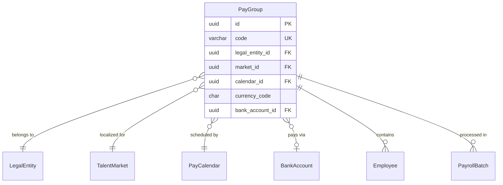

# PayGroup

**Module**: Payroll (PR)  
**Submodule**: CONFIG  
**Version**: 2.0  
**Last Updated**: 2025-12-23

---

## Entity: PayGroup {#pay-group}

**Classification**: CORE_ENTITY

**Definition**: Defines a group of employees processed together in the same payroll run with shared calendar and currency

**Purpose**: Organizes employees into logical payroll processing groups for efficient batch processing and reporting

**Key Characteristics**:
- Links employees to specific payroll calendar
- Defines currency for the group
- Optional bank account for payment processing
- Can be organized by department, location, or business unit
- Supports payroll profile assignment for policy management
- **SCD Type 2**: Yes - tracks historical changes to group configuration

---

### Attributes

| Attribute | Type | Required | Constraints | Description |
|-----------|------|----------|-------------|-------------|
| `id` | UUID | ✅ | PK | Primary identifier |
| `code` | varchar(50) | ✅ | UNIQUE, NOT NULL | Unique pay group code |
| `name` | varchar(100) | ✅ | NOT NULL | Pay group display name |
| `legal_entity_id` | UUID | ✅ | FK → Core.LegalEntity | Owning legal entity |
| `market_id` | UUID | ✅ | FK → Core.TalentMarket | Talent market |
| `calendar_id` | UUID | ✅ | FK → PayCalendar | Payroll calendar |
| `currency_code` | char(3) | ✅ | ISO 4217 | Payment currency |
| `bank_account_id` | UUID | ❌ | FK → BankAccount | Default bank account for payments |
| `metadata` | jsonb | ❌ | NULL | Additional flexible data |
| `created_at` | timestamp | ✅ | Auto | Creation timestamp |
| `updated_at` | timestamp | ❌ | Auto | Last modification timestamp |

---

### Relationships

> **📌 Note**: Structural relationships only. For business context, see [Concept Layer](../../../01-concept/02-processing/).

#### Entity Relationship Diagram



#### Relationship Details

| Relationship | Target | Cardinality | Foreign Key | Purpose |
|--------------|--------|-------------|-------------|---------|
| `legal_entity` | Core.LegalEntity | N:1 | `legal_entity_id` | Owning legal entity for this pay group |
| `market` | Core.TalentMarket | N:1 | `market_id` | Talent market for localization |
| `calendar` | [PayCalendar](./02-pay-calendar.md) | N:1 | `calendar_id` | Payroll calendar defining schedule |
| `bank_account` | BankAccount (BANK) | N:1 | `bank_account_id` | Default bank account for group payments |
| `employees` | Core.Employee | 1:N | (inverse) | Employees assigned to this group |
| `payroll_batches` | PayrollBatch (PROCESSING) | 1:N | (inverse) | Payroll runs for this group |

**Relationship Notes**:
- Multiple pay groups can share the same calendar
- currency_code should match calendar's default_currency (can differ for special cases)
- bank_account_id is optional (can be specified at payment batch level)

**Integration Points**:
- **Core Module (CO)**: Employee assignments and organizational structure
- **Time & Attendance (TA)**: Time data aggregated at pay group level
- **Banking**: Payment file generation per group

---

### Data Validation & Constraints

> **Note**: Entity-specific validation rules only.

| Field | Validation | Error Message |
|-------|------------|---------------|
| `code` | Unique, 3-50 chars, alphanumeric+underscore | "Pay group code must be unique and 3-50 characters" |
| `currency_code` | Valid ISO 4217 currency code | "Invalid currency code. Must be 3-letter ISO 4217 code" |

**Database Constraints**:
- `pk_pay_group`: PRIMARY KEY (`id`)
- `uk_pay_group_code`: UNIQUE (`code`)
- `fk_pay_group_legal_entity`: FOREIGN KEY (`legal_entity_id` → `legal_entity.id`)
- `fk_pay_group_market`: FOREIGN KEY (`market_id` → `talent_market.id`)
- `fk_pay_group_calendar`: FOREIGN KEY (`calendar_id` → `pay_calendar.id`)
- `fk_pay_group_bank_account`: FOREIGN KEY (`bank_account_id` → `bank_account.id`)
- `ck_pay_group_currency`: CHECK (`LENGTH(currency_code) = 3`)

---

### Examples

#### Example 1: Vietnam Office Workers

```yaml
PayGroup:
  code: "VN_OFFICE_MONTHLY"
  name: "Vietnam Office Workers - Monthly"
  legal_entity_id: "vng-corp-uuid"
  market_id: "vietnam-market-uuid"
  calendar_id: "vn-monthly-calendar-uuid"
  currency_code: "VND"
  bank_account_id: "vng-vietcombank-uuid"
```

**Business Context**: Monthly payroll for office workers in Vietnam, paid in VND via Vietcombank

#### Example 2: Singapore Contractors

```yaml
PayGroup:
  code: "SG_CONTRACTORS_BIWEEKLY"
  name: "Singapore Contractors - Bi-Weekly"
  legal_entity_id: "vng-singapore-uuid"
  market_id: "singapore-market-uuid"
  calendar_id: "sg-biweekly-calendar-uuid"
  currency_code: "SGD"
  bank_account_id: null
```

**Business Context**: Bi-weekly payroll for contractors, bank account specified per payment batch

---

### Best Practices

✅ **DO**:
- Group employees by similar pay characteristics (frequency, currency)
- Use descriptive group codes indicating location and frequency
- Align currency with calendar default currency

❌ **DON'T**:
- Don't create too many small groups (impacts processing efficiency)
- Don't mix different currencies in same group
- Don't change calendar mid-period

**Performance Tips**:
- Pay groups are frequently queried - ensure proper indexing on code and calendar_id
- Cache pay group configurations in application layer
- Use pay groups to parallelize payroll processing

**Security Considerations**:
- Restrict pay group modification to Payroll Administrators
- Audit pay group changes (impacts employee assignments)
- Validate employee assignments to prevent unauthorized access

---

### Migration Notes

**Version History**:
- **v2.0 (2025-07-01)**: Added `market_id` for talent market linkage
- **v1.0 (2024-01-01)**: Initial pay group definition

**Deprecated Fields**: None

**Breaking Changes**:
- v2.0: `market_id` is now required (previously not present)

---

## References

- **Sub-module Index**: [README.md](./README.md)
- **Concept Guides**: [../../../01-concept/01-config/](../../../01-concept/01-config/)
- **Database Schema**: [../../../03-design/5.Payroll.V3.dbml](../../../03-design/5.Payroll.V3.dbml)
