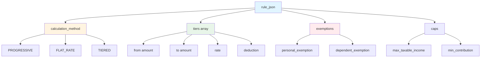
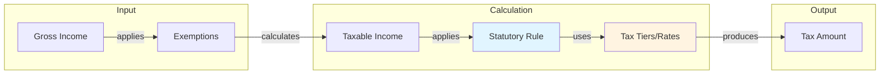
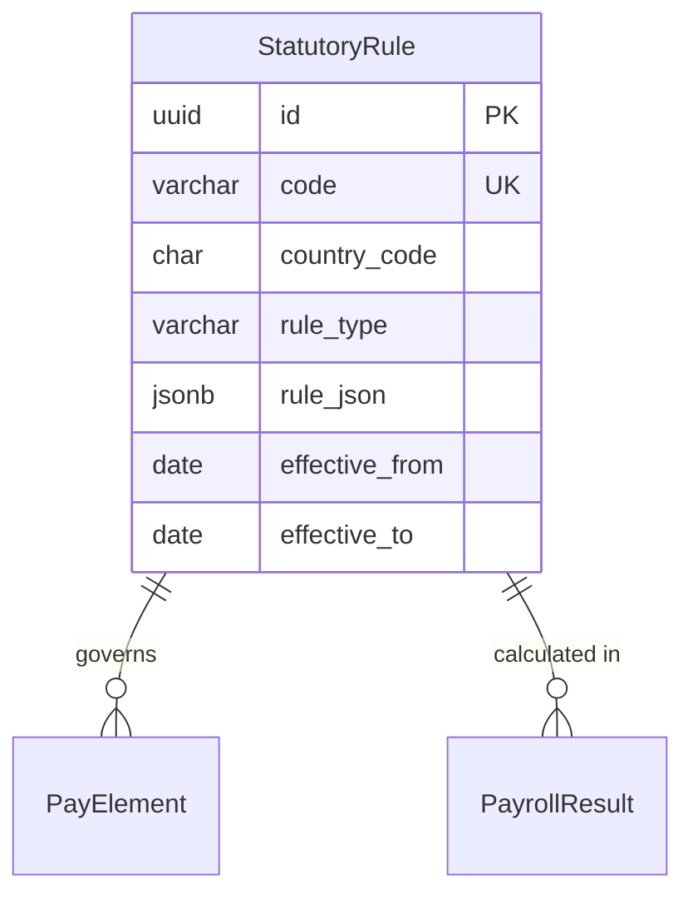

# StatutoryRule

**Module**: Payroll (PR)  
**Submodule**: CONFIG  
**Version**: 2.0  
**Last Updated**: 2025-12-23

---

## Entity: StatutoryRule {#statutory-rule}

**Classification**: CORE_ENTITY

**Definition**: Defines statutory calculation rules for taxes, social insurance, and other government-mandated payroll components

**Purpose**: Ensures compliance with local labor laws and tax regulations by encoding statutory calculation rules for different jurisdictions

**Key Characteristics**:
- Country and region-specific rules
- Contains calculation logic in JSON (tax brackets, rates, thresholds)
- Effective date tracking for regulatory changes
- Links to pay elements for automatic calculation
- Supports multiple rule types (TAX, SOCIAL_INSURANCE, PENSION, etc.)
- **SCD Type 2**: Yes - tracks historical changes to statutory rules and rates

---

### Attributes

| Attribute | Type | Required | Constraints | Description |
|-----------|------|----------|-------------|-------------|
| `id` | UUID | ✅ | PK | Primary identifier |
| `code` | varchar(50) | ✅ | UNIQUE, NOT NULL | Unique statutory rule code (e.g., VN_PIT_2024) |
| `name` | varchar(100) | ✅ | NOT NULL | Statutory rule display name |
| `country_code` | char(2) | ✅ | ISO 3166-1 | Country code (VN, SG, US, etc.) |
| `region_code` | varchar(10) | ❌ | NULL | Region/state code for sub-national rules |
| `rule_type` | varchar(30) | ✅ | ENUM | Type: TAX, SOCIAL_INSURANCE, PENSION, HEALTH_INSURANCE |
| `rule_json` | jsonb | ✅ | NOT NULL | Calculation rules and parameters |
| `effective_from` | date | ✅ | NOT NULL | Rule effective start date |
| `effective_to` | date | ❌ | NULL | Rule expiry date (NULL = current) |
| `metadata` | jsonb | ❌ | NULL | Additional flexible data |
| `created_at` | timestamp | ✅ | Auto | Creation timestamp |
| `updated_at` | timestamp | ❌ | Auto | Last modification timestamp |

**Attribute Details**:

#### `rule_json`

**Type**: jsonb  
**Purpose**: Stores statutory calculation rules including tax brackets, rates, and thresholds

**Structure**:
```yaml
rule_json:
  calculation_method: "PROGRESSIVE" | "FLAT_RATE" | "TIERED"
  tiers:
    - from: 0
      to: 5000000
      rate: 0.05
      deduction: 0
    - from: 5000001
      to: 10000000
      rate: 0.10
      deduction: 250000
  exemptions:
    personal_exemption: 11000000
    dependent_exemption: 4400000
  caps:
    max_taxable_income: null
    min_contribution: 0
```

**Structure Diagram**:


**Statutory Calculation Flow**:


---

### Relationships

> **📌 Note**: Structural relationships only. For business context, see [Concept Layer](../../../01-concept/01-config/).

#### Entity Relationship Diagram



#### Relationship Details

| Relationship | Target | Cardinality | Foreign Key | Purpose |
|--------------|--------|-------------|-------------|---------|
| `pay_elements` | [PayElement](./04-pay-element.md) | 1:N | (inverse) | Pay elements governed by this statutory rule |
| `payroll_results` | PayrollResult (PROCESSING) | 1:N | (inverse) | Calculated statutory amounts in payroll runs |

**Integration Points**:
- **Tax Authorities**: Compliance with tax regulations
- **Social Insurance**: Mandatory contribution calculations
- **Reporting**: Statutory reports and filings

---

### Data Validation & Constraints

> **Note**: Entity-specific validation rules only.

| Field | Validation | Error Message |
|-------|------------|---------------|
| `code` | Unique, 3-50 chars, uppercase | "Statutory rule code must be unique and uppercase" |
| `country_code` | Valid ISO 3166-1 alpha-2 code | "Invalid country code" |
| `effective_from` | Must be <= effective_to | "Effective from date must be before effective to date" |
| `rule_json.tiers` | Tiers must not overlap | "Tax tiers must not overlap" |

**Database Constraints**:
- `pk_statutory_rule`: PRIMARY KEY (`id`)
- `uk_statutory_rule_code`: UNIQUE (`code`)
- `ck_statutory_rule_type`: CHECK (`rule_type IN ('TAX','SOCIAL_INSURANCE','PENSION','HEALTH_INSURANCE')`)
- `ck_statutory_rule_dates`: CHECK (`effective_from <= effective_to OR effective_to IS NULL`)

---

### Examples

#### Example 1: Vietnam Personal Income Tax 2024

```yaml
StatutoryRule:
  code: "VN_PIT_2024"
  name: "Vietnam Personal Income Tax 2024"
  country_code: "VN"
  rule_type: "TAX"
  rule_json:
    calculation_method: "PROGRESSIVE"
    tiers:
      - from: 0
        to: 5000000
        rate: 0.05
        deduction: 0
      - from: 5000001
        to: 10000000
        rate: 0.10
        deduction: 250000
      - from: 10000001
        to: 18000000
        rate: 0.15
        deduction: 750000
      - from: 18000001
        to: 32000000
        rate: 0.20
        deduction: 1650000
      - from: 32000001
        to: 52000000
        rate: 0.25
        deduction: 3250000
      - from: 52000001
        to: 80000000
        rate: 0.30
        deduction: 5850000
      - from: 80000001
        to: null
        rate: 0.35
        deduction: 9850000
    exemptions:
      personal_exemption: 11000000
      dependent_exemption: 4400000
  effective_from: "2024-01-01"
  effective_to: null
```

**Business Context**: Vietnam progressive income tax with 7 brackets, effective from Jan 2024

#### Example 2: Singapore CPF Contribution

```yaml
StatutoryRule:
  code: "SG_CPF_2024"
  name: "Singapore CPF Contribution 2024"
  country_code: "SG"
  rule_type: "SOCIAL_INSURANCE"
  rule_json:
    calculation_method: "FLAT_RATE"
    employee_rate: 0.20
    employer_rate: 0.17
    caps:
      max_monthly_wage: 6000
      min_monthly_wage: 500
  effective_from: "2024-01-01"
  effective_to: null
```

**Business Context**: Singapore CPF with 20% employee + 17% employer contribution

---

### Best Practices

✅ **DO**:
- Update statutory rules when regulations change
- Test calculations with official examples
- Document regulation references in metadata
- Create new SCD2 version for rate changes

❌ **DON'T**:
- Don't modify active rules (create new version)
- Don't delete statutory rules (archive instead)
- Don't mix rules from different countries
- Don't hardcode rates (use rule_json)

**Performance Tips**:
- Cache active statutory rules by country
- Pre-validate tier structures
- Index on country_code and effective dates

**Security Considerations**:
- Restrict statutory rule modification to Compliance team
- Audit all rule changes
- Validate rule_json structure
- Monitor for calculation anomalies

---

### Migration Notes

**Version History**:
- **v2.0 (2025-07-01)**: Added `rule_json` for flexible rule definitions
- **v1.0 (2024-01-01)**: Initial statutory rule definition

**Deprecated Fields**: None

**Breaking Changes**:
- v2.0: `rule_json` structure changed (migration required)

---

## References

- **Sub-module Index**: [README.md](./README.md)
- **Concept Guides**: [../../../01-concept/01-config/](../../../01-concept/01-config/)
- **Database Schema**: [../../../03-design/5.Payroll.V3.dbml](../../../03-design/5.Payroll.V3.dbml)
