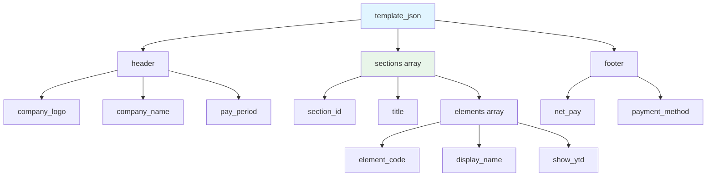
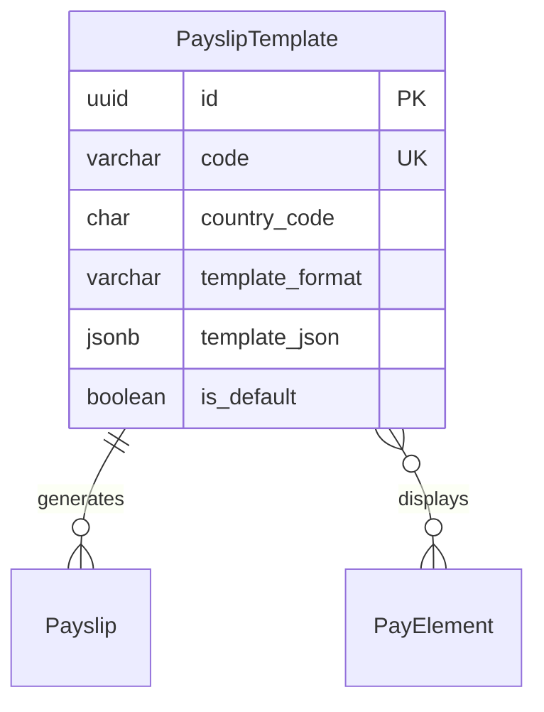

# PayslipTemplate

**Module**: Payroll (PR)  
**Submodule**: CONFIG  
**Version**: 2.0  
**Last Updated**: 2025-12-23

---

## Entity: PayslipTemplate {#payslip-template}

**Classification**: CORE_ENTITY

**Definition**: Defines payslip layout and content structure for employee pay statements

**Purpose**: Provides customizable templates for generating payslips with configurable sections, elements, and formatting

**Key Characteristics**:
- Supports multiple template formats (PDF, HTML, EMAIL)
- Contains template structure in JSON
- Configurable sections and element display
- Multi-language support
- Country-specific compliance requirements
- **SCD Type 2**: Yes - tracks historical changes to template designs

---

### Attributes

| Attribute | Type | Required | Constraints | Description |
|-----------|------|----------|-------------|-------------|
| `id` | UUID | ✅ | PK | Primary identifier |
| `code` | varchar(50) | ✅ | UNIQUE, NOT NULL | Unique template code |
| `name` | varchar(100) | ✅ | NOT NULL | Template display name |
| `country_code` | char(2) | ✅ | ISO 3166-1 | Country code for localization |
| `template_format` | varchar(20) | ✅ | ENUM | Format: PDF, HTML, EMAIL |
| `template_json` | jsonb | ✅ | NOT NULL | Template structure and layout |
| `is_default` | boolean | ✅ | DEFAULT false | Whether this is the default template |
| `metadata` | jsonb | ❌ | NULL | Additional flexible data |
| `created_at` | timestamp | ✅ | Auto | Creation timestamp |
| `updated_at` | timestamp | ❌ | Auto | Last modification timestamp |

**Attribute Details**:

#### `template_json`

**Type**: jsonb  
**Purpose**: Stores payslip template structure, sections, and formatting

**Structure**:
```yaml
template_json:
  header:
    company_logo: true
    company_name: true
    pay_period: true
  sections:
    - section_id: "earnings"
      title: "Earnings"
      elements:
        - element_code: "BASIC_SALARY"
          display_name: "Basic Salary"
          show_ytd: true
    - section_id: "deductions"
      title: "Deductions"
      elements:
        - element_code: "TAX_PIT"
          display_name: "Income Tax"
          show_ytd: true
  footer:
    net_pay: true
    payment_method: true
    bank_details: true
```

**Structure Diagram**:


---

### Relationships

> **📌 Note**: Structural relationships only. For business context, see [Concept Layer](../../../01-concept/01-config/).

#### Entity Relationship Diagram



#### Relationship Details

| Relationship | Target | Cardinality | Foreign Key | Purpose |
|--------------|--------|-------------|-------------|---------|
| `payslips` | Payslip (PROCESSING) | 1:N | (inverse) | Payslips generated using this template |
| `elements` | [PayElement](./04-pay-element.md) | N:N | (via template_json) | Pay elements displayed on payslip |

**Integration Points**:
- **Payroll Processing**: Payslip generation
- **Employee Self-Service**: Payslip viewing and download
- **Compliance**: Statutory payslip requirements

---

### Data Validation & Constraints

> **Note**: Entity-specific validation rules only.

| Field | Validation | Error Message |
|-------|------------|---------------|
| `code` | Unique, 3-50 chars, uppercase | "Template code must be unique and uppercase" |
| `country_code` | Valid ISO 3166-1 alpha-2 code | "Invalid country code" |
| `template_json.sections` | Must include at least one section | "Template must have at least one section" |

**Database Constraints**:
- `pk_payslip_template`: PRIMARY KEY (`id`)
- `uk_payslip_template_code`: UNIQUE (`code`)
- `ck_payslip_template_format`: CHECK (`template_format IN ('PDF','HTML','EMAIL')`)

---

### Examples

#### Example 1: Vietnam Standard Payslip

```yaml
PayslipTemplate:
  code: "VN_STANDARD_PDF"
  name: "Vietnam Standard Payslip (PDF)"
  country_code: "VN"
  template_format: "PDF"
  template_json:
    header:
      company_logo: true
      company_name: true
      pay_period: true
      employee_info: true
    sections:
      - section_id: "earnings"
        title: "Thu nhập"
        elements:
          - element_code: "BASIC_SALARY"
            display_name: "Lương cơ bản"
            show_ytd: true
          - element_code: "ALLOWANCE"
            display_name: "Phụ cấp"
            show_ytd: true
      - section_id: "deductions"
        title: "Các khoản khấu trừ"
        elements:
          - element_code: "TAX_PIT"
            display_name: "Thuế TNCN"
            show_ytd: true
          - element_code: "SOCIAL_INSURANCE"
            display_name: "Bảo hiểm xã hội"
            show_ytd: true
    footer:
      net_pay: true
      payment_method: true
      bank_details: true
  is_default: true
```

**Business Context**: Standard Vietnamese payslip with Vietnamese labels

---

### Best Practices

✅ **DO**:
- Test templates with sample data
- Include all statutory required elements
- Support multi-language labels

❌ **DON'T**:
- Don't expose sensitive data unnecessarily
- Don't change templates mid-period
- Don't delete templates (archive instead)

**Performance Tips**:
- Cache template configurations
- Pre-compile template structures

**Security Considerations**:
- Restrict template modification to HR Administrators
- Validate template_json structure
- Ensure data privacy compliance

---

### Migration Notes

**Version History**:
- **v2.0 (2025-07-01)**: Added `template_json` for flexible layouts
- **v1.0 (2024-01-01)**: Initial payslip template definition

**Deprecated Fields**: None

**Breaking Changes**: None

---

## References

- **Sub-module Index**: [README.md](./README.md)
- **Concept Guides**: [../../../01-concept/01-config/](../../../01-concept/01-config/)
- **Database Schema**: [../../../03-design/5.Payroll.V3.dbml](../../../03-design/5.Payroll.V3.dbml)
