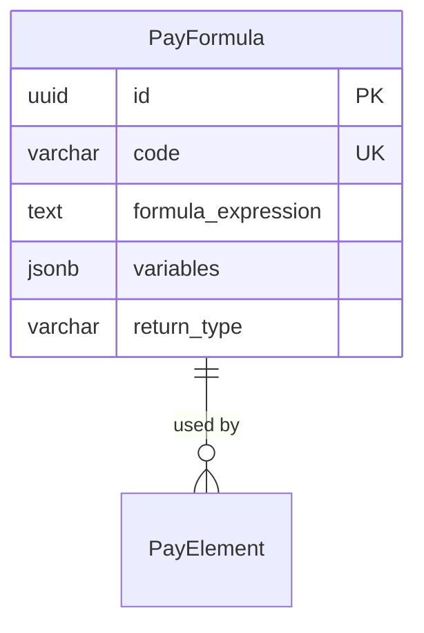

# PayFormula

**Module**: Payroll (PR)  
**Submodule**: CONFIG  
**Version**: 2.0  
**Last Updated**: 2025-12-23

---

## Entity: PayFormula {#pay-formula}

**Classification**: REFERENCE_DATA

**Definition**: Defines reusable calculation formulas for payroll elements

**Purpose**: Provides centralized formula library for consistent calculations across multiple pay elements

**Key Characteristics**:
- Reusable formula definitions
- Supports variables and parameters
- Can be referenced by multiple PayElements
- Includes formula validation and testing
- Version control for formula changes
- **SCD Type 2**: No - formulas are versioned separately

---

### Attributes

| Attribute | Type | Required | Constraints | Description |
|-----------|------|----------|-------------|-------------|
| `id` | UUID | ✅ | PK | Primary identifier |
| `code` | varchar(50) | ✅ | UNIQUE, NOT NULL | Unique formula code |
| `name` | varchar(100) | ✅ | NOT NULL | Formula display name |
| `description` | text | ❌ | NULL | Formula description and usage |
| `formula_expression` | text | ✅ | NOT NULL | Formula expression |
| `variables` | jsonb | ✅ | NOT NULL | Formula variables definition |
| `return_type` | varchar(20) | ✅ | ENUM | Return type: NUMBER, BOOLEAN, TEXT |
| `metadata` | jsonb | ❌ | NULL | Additional flexible data |
| `created_at` | timestamp | ✅ | Auto | Creation timestamp |
| `updated_at` | timestamp | ❌ | Auto | Last modification timestamp |

---

### Relationships

> **📌 Note**: Structural relationships only. For business context, see [Concept Layer](../../../01-concept/01-config/).

#### Entity Relationship Diagram



#### Relationship Details

| Relationship | Target | Cardinality | Foreign Key | Purpose |
|--------------|--------|-------------|-------------|---------|
| `pay_elements` | [PayElement](./04-pay-element.md) | 1:N | (inverse) | Pay elements using this formula |

---

### Data Validation & Constraints

> **Note**: Entity-specific validation rules only.

| Field | Validation | Error Message |
|-------|------------|---------------|
| `code` | Unique, 3-50 chars, uppercase | "Formula code must be unique and uppercase" |
| `formula_expression` | Valid mathematical expression | "Invalid formula expression" |

**Database Constraints**:
- `pk_pay_formula`: PRIMARY KEY (`id`)
- `uk_pay_formula_code`: UNIQUE (`code`)
- `ck_pay_formula_return_type`: CHECK (`return_type IN ('NUMBER','BOOLEAN','TEXT')`)

---

### Examples

#### Example 1: Overtime Calculation

```yaml
PayFormula:
  code: "OVERTIME_CALC"
  name: "Overtime Calculation Formula"
  description: "Calculates overtime pay based on hours and rate"
  formula_expression: "OVERTIME_HOURS * HOURLY_RATE * OVERTIME_MULTIPLIER"
  variables:
    - name: "OVERTIME_HOURS"
      type: "NUMBER"
      source: "INPUT"
    - name: "HOURLY_RATE"
      type: "NUMBER"
      source: "ELEMENT"
      element_code: "HOURLY_RATE"
    - name: "OVERTIME_MULTIPLIER"
      type: "NUMBER"
      source: "CONSTANT"
      value: 1.5
  return_type: "NUMBER"
```

**Business Context**: Standard overtime calculation with 1.5x multiplier

---

### Best Practices

✅ **DO**:
- Test formulas thoroughly
- Document formula logic
- Use descriptive variable names

❌ **DON'T**:
- Don't create overly complex formulas
- Don't change formulas without testing
- Don't delete formulas in use

**Performance Tips**:
- Cache compiled formulas
- Validate formulas at configuration time

**Security Considerations**:
- Restrict formula modification to Payroll Administrators
- Validate formula expressions

---

### Migration Notes

**Version History**:
- **v2.0 (2025-07-01)**: Added variables definition
- **v1.0 (2024-01-01)**: Initial formula definition

**Deprecated Fields**: None

**Breaking Changes**: None

---

## References

- **Sub-module Index**: [README.md](./README.md)
- **Concept Guides**: [../../../01-concept/01-config/](../../../01-concept/01-config/)
- **Database Schema**: [../../../03-design/5.Payroll.V3.dbml](../../../03-design/5.Payroll.V3.dbml)
