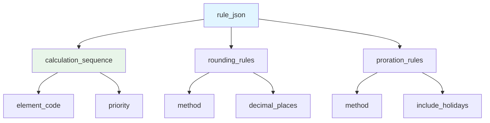
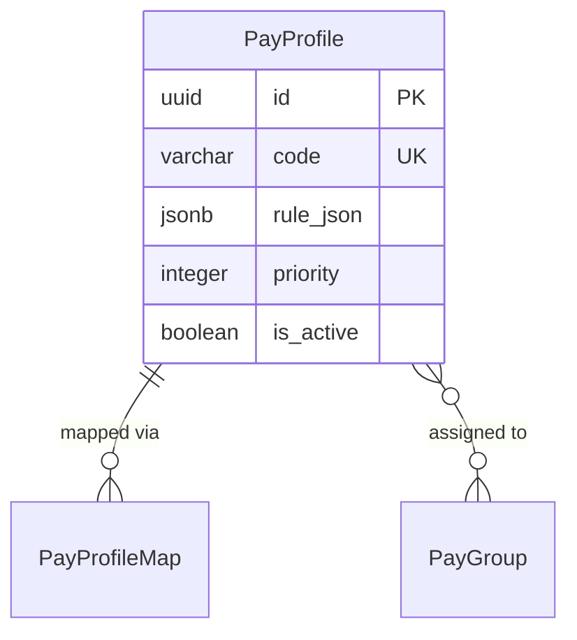

# PayProfile

**Module**: Payroll (PR)  
**Submodule**: CONFIG  
**Version**: 2.0  
**Last Updated**: 2025-12-23

---

## Entity: PayProfile {#pay-profile}

**Classification**: CORE_ENTITY

**Definition**: Defines payroll processing profiles with rules and policies for different employee groups

**Purpose**: Groups payroll processing rules, policies, and configurations for consistent application across employee segments

**Key Characteristics**:
- Contains processing rules and policies in JSON
- Can be assigned to pay groups or individual employees
- Supports rule inheritance and overrides
- Includes calculation priorities and sequences
- Used for policy management and compliance
- **SCD Type 2**: Yes - tracks historical changes to profile rules

---

### Attributes

| Attribute | Type | Required | Constraints | Description |
|-----------|------|----------|-------------|-------------|
| `id` | UUID | ✅ | PK | Primary identifier |
| `code` | varchar(50) | ✅ | UNIQUE, NOT NULL | Unique profile code |
| `name` | varchar(100) | ✅ | NOT NULL | Profile display name |
| `description` | text | ❌ | NULL | Profile description |
| `rule_json` | jsonb | ✅ | NOT NULL | Processing rules and policies |
| `priority` | integer | ✅ | DEFAULT 0 | Profile priority for rule resolution |
| `is_active` | boolean | ✅ | DEFAULT true | Whether profile is currently active |
| `metadata` | jsonb | ❌ | NULL | Additional flexible data |
| `created_at` | timestamp | ✅ | Auto | Creation timestamp |
| `updated_at` | timestamp | ❌ | Auto | Last modification timestamp |

**Attribute Details**:

#### `rule_json`

**Type**: jsonb  
**Purpose**: Stores payroll processing rules and policies

**Structure**:
```yaml
rule_json:
  calculation_sequence:
    - element_code: "BASIC_SALARY"
      priority: 1
    - element_code: "ALLOWANCE"
      priority: 2
  rounding_rules:
    method: "ROUND_HALF_UP"
    decimal_places: 0
  proration_rules:
    method: "CALENDAR_DAYS"
    include_holidays: false
```

**Structure Diagram**:


---

### Relationships

> **📌 Note**: Structural relationships only. For business context, see [Concept Layer](../../../01-concept/01-config/).

#### Entity Relationship Diagram



#### Relationship Details

| Relationship | Target | Cardinality | Foreign Key | Purpose |
|--------------|--------|-------------|-------------|---------|
| `profile_maps` | [PayProfileMap](./13-pay-profile-map.md) | 1:N | (inverse) | Profile assignments to pay groups |
| `pay_groups` | [PayGroup](./03-pay-group.md) | N:N | (via PayProfileMap) | Pay groups using this profile |

---

### Data Validation & Constraints

> **Note**: Entity-specific validation rules only.

| Field | Validation | Error Message |
|-------|------------|---------------|
| `code` | Unique, 3-50 chars, uppercase | "Profile code must be unique and uppercase" |
| `priority` | Integer >= 0 | "Priority must be non-negative" |

**Database Constraints**:
- `pk_pay_profile`: PRIMARY KEY (`id`)
- `uk_pay_profile_code`: UNIQUE (`code`)
- `ck_pay_profile_priority`: CHECK (`priority >= 0`)

---

### Examples

#### Example 1: Standard Employee Profile

```yaml
PayProfile:
  code: "PROFILE_STANDARD"
  name: "Standard Employee Profile"
  description: "Default profile for regular employees"
  rule_json:
    calculation_sequence:
      - element_code: "BASIC_SALARY"
        priority: 1
      - element_code: "ALLOWANCE"
        priority: 2
      - element_code: "TAX_PIT"
        priority: 10
    rounding_rules:
      method: "ROUND_HALF_UP"
      decimal_places: 0
    proration_rules:
      method: "CALENDAR_DAYS"
      include_holidays: false
  priority: 0
  is_active: true
```

**Business Context**: Standard processing rules for regular employees

---

### Best Practices

✅ **DO**:
- Test profiles with sample data
- Document rule logic clearly
- Use priority for rule resolution

❌ **DON'T**:
- Don't create conflicting rules
- Don't change profiles mid-period
- Don't delete profiles in use

**Performance Tips**:
- Cache active profiles
- Pre-validate rule_json structure

**Security Considerations**:
- Restrict profile modification to Payroll Administrators
- Audit profile changes

---

### Migration Notes

**Version History**:
- **v2.0 (2025-07-01)**: Added `rule_json` for flexible rules
- **v1.0 (2024-01-01)**: Initial profile definition

**Deprecated Fields**: None

**Breaking Changes**: None

---

## References

- **Sub-module Index**: [README.md](./README.md)
- **Concept Guides**: [../../../01-concept/01-config/](../../../01-concept/01-config/)
- **Database Schema**: [../../../03-design/5.Payroll.V3.dbml](../../../03-design/5.Payroll.V3.dbml)
