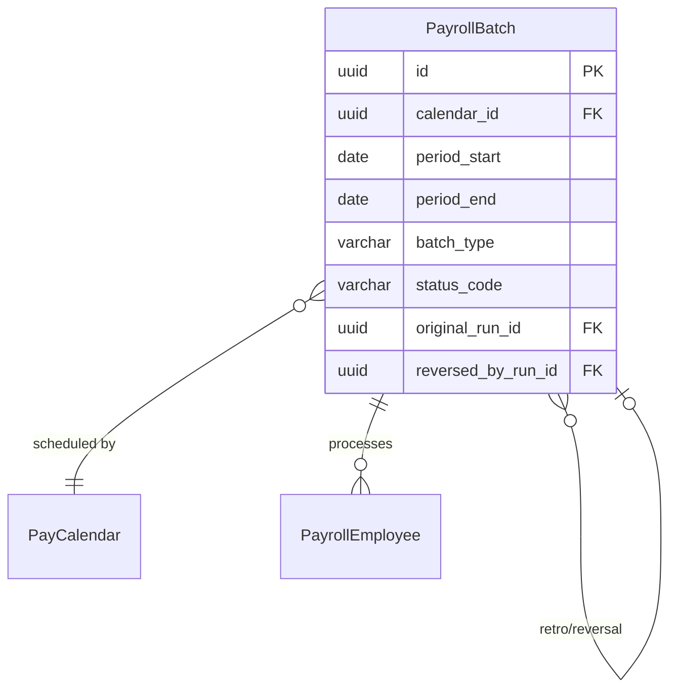
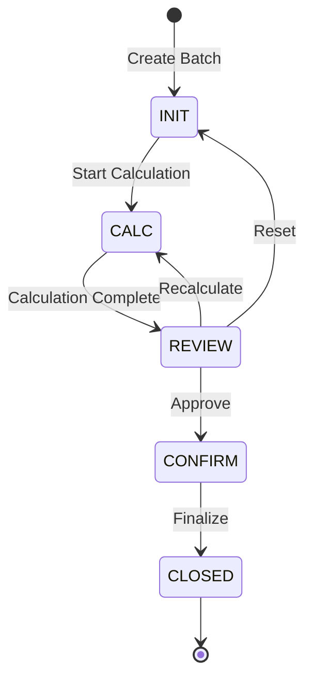

# PayrollBatch

**Module**: Payroll (PR)  
**Submodule**: PROCESSING  
**Version**: 2.0  
**Last Updated**: 2025-12-24

---

## Entity: PayrollBatch {#payroll-batch}

**Classification**: CORE_ENTITY

**Definition**: Represents a payroll run batch that processes payroll for a specific period and calendar

**Purpose**: Orchestrates payroll calculation for a group of employees within a defined pay period, tracking execution status and results

**Key Characteristics**:
- Links to PayCalendar for scheduling
- Supports multiple batch types (REGULAR, SUPPLEMENTAL, RETRO)
- Tracks execution lifecycle through status codes
- Enables retro and reversal processing via self-references
- Contains execution metadata and timestamps
- **SCD Type 2**: No - transactional data with status progression

---

### Attributes

| Attribute | Type | Required | Constraints | Description |
|-----------|------|----------|-------------|-------------|
| `id` | UUID | ✅ | PK | Primary identifier |
| `calendar_id` | UUID | ✅ | FK → PayCalendar | Payroll calendar |
| `period_start` | date | ✅ | NOT NULL | Pay period start date |
| `period_end` | date | ✅ | NOT NULL | Pay period end date |
| `batch_type` | varchar(20) | ✅ | ENUM | Type: REGULAR, SUPPLEMENTAL, RETRO |
| `run_label` | varchar(100) | ✅ | NOT NULL | Descriptive run label |
| `status_code` | varchar(20) | ✅ | ENUM | Status: INIT, CALC, REVIEW, CONFIRM, CLOSED |
| `original_run_id` | UUID | ❌ | FK → PayrollBatch | Original run for retro/reversal |
| `reversed_by_run_id` | UUID | ❌ | FK → PayrollBatch | Run that reversed this batch |
| `executed_at` | timestamp | ❌ | NULL | Calculation execution timestamp |
| `finalized_at` | timestamp | ❌ | NULL | Finalization timestamp |
| `costed_flag` | boolean | ✅ | DEFAULT false | Whether GL costing completed |
| `metadata` | jsonb | ❌ | NULL | Additional flexible data |
| `created_at` | timestamp | ✅ | Auto | Creation timestamp |
| `created_by` | varchar(100) | ✅ | NOT NULL | Creator user ID |
| `updated_at` | timestamp | ❌ | Auto | Last modification timestamp |
| `updated_by` | varchar(100) | ❌ | NULL | Last modifier user ID |

---

### Relationships

> **📌 Note**: Structural relationships only. For business context, see [Concept Layer](../../../01-concept/02-processing/).

#### Entity Relationship Diagram



#### Relationship Details

| Relationship | Target | Cardinality | Foreign Key | Purpose |
|--------------|--------|-------------|-------------|---------|
| `calendar` | [PayCalendar](../01-config/02-pay-calendar.md) | N:1 | `calendar_id` | Payroll calendar defining schedule |
| `employees` | [PayrollEmployee](./02-payroll-employee.md) | 1:N | (inverse) | Employees processed in this batch |
| `original_run` | PayrollBatch | N:1 | `original_run_id` | Original run for retro adjustments |
| `reversed_by` | PayrollBatch | N:1 | `reversed_by_run_id` | Run that reversed this batch |

**Integration Points**:
- **CONFIG**: Uses PayCalendar for period determination
- **Banking**: Triggers payment batch generation
- **GL/Accounting**: Generates costing entries

---

### Lifecycle States



**State Descriptions**:
- **INIT**: Batch created, employees selected, ready for calculation
- **CALC**: Calculation in progress
- **REVIEW**: Calculation complete, pending review and approval
- **CONFIRM**: Approved, ready for finalization
- **CLOSED**: Finalized, payslips generated, payments initiated

**State Transition Rules**:
- Cannot move to CALC without employees selected
- Cannot move to CONFIRM without review approval
- Cannot modify CLOSED batches (must reverse)
- Retro batches reference original_run_id

---

### Data Validation & Constraints

> **Note**: Entity-specific validation rules only.

| Field | Validation | Error Message |
|-------|------------|---------------|
| `period_end` | Must be >= period_start | "Period end must be after or equal to period start" |
| `batch_type` | Must be REGULAR, SUPPLEMENTAL, or RETRO | "Invalid batch type" |
| `status_code` | Must be valid status | "Invalid status code" |
| `original_run_id` | Required if batch_type = RETRO | "Retro batch must reference original run" |

**Database Constraints**:
- `pk_payroll_batch`: PRIMARY KEY (`id`)
- `fk_payroll_batch_calendar`: FOREIGN KEY (`calendar_id` → `pay_calendar.id`)
- `fk_payroll_batch_original`: FOREIGN KEY (`original_run_id` → `payroll_batch.id`)
- `fk_payroll_batch_reversed_by`: FOREIGN KEY (`reversed_by_run_id` → `payroll_batch.id`)
- `ck_payroll_batch_type`: CHECK (`batch_type IN ('REGULAR','SUPPLEMENTAL','RETRO')`)
- `ck_payroll_batch_status`: CHECK (`status_code IN ('INIT','CALC','REVIEW','CONFIRM','CLOSED')`)
- `ck_payroll_batch_period`: CHECK (`period_end >= period_start`)

---

### Examples

#### Example 1: Regular Monthly Payroll

```yaml
PayrollBatch:
  id: "batch-2025-01-uuid"
  calendar_id: "vn-monthly-calendar-uuid"
  period_start: "2025-01-01"
  period_end: "2025-01-31"
  batch_type: "REGULAR"
  run_label: "January 2025 - Monthly Payroll"
  status_code: "REVIEW"
  original_run_id: null
  reversed_by_run_id: null
  executed_at: "2025-02-01T10:00:00Z"
  finalized_at: null
  costed_flag: true
  created_by: "admin@vng.com"
  created_at: "2025-01-25T09:00:00Z"
```

**Business Context**: Standard monthly payroll for January, calculated and awaiting approval

#### Example 2: Supplemental Bonus Run

```yaml
PayrollBatch:
  id: "batch-2025-01-bonus-uuid"
  calendar_id: "vn-monthly-calendar-uuid"
  period_start: "2025-01-01"
  period_end: "2025-01-31"
  batch_type: "SUPPLEMENTAL"
  run_label: "January 2025 - Year-End Bonus"
  status_code: "CONFIRM"
  original_run_id: null
  reversed_by_run_id: null
  executed_at: "2025-02-05T14:00:00Z"
  finalized_at: null
  costed_flag: false
  created_by: "hr@vng.com"
  created_at: "2025-02-05T13:00:00Z"
```

**Business Context**: Off-cycle bonus payment, approved and ready for finalization

#### Example 3: Retroactive Adjustment

```yaml
PayrollBatch:
  id: "batch-2025-02-retro-uuid"
  calendar_id: "vn-monthly-calendar-uuid"
  period_start: "2025-02-01"
  period_end: "2025-02-28"
  batch_type: "RETRO"
  run_label: "February 2025 - Retro Salary Adjustment"
  status_code: "CALC"
  original_run_id: "batch-2025-01-uuid"
  reversed_by_run_id: null
  executed_at: null
  finalized_at: null
  costed_flag: false
  created_by: "payroll@vng.com"
  created_at: "2025-02-10T11:00:00Z"
```

**Business Context**: Retroactive salary increase applied to January payroll

---

### Best Practices

✅ **DO**:
- Use descriptive run_label with period and purpose
- Progress through status codes sequentially
- Set executed_at when calculation completes
- Set finalized_at when batch is closed
- Use RETRO batch type for retroactive adjustments
- Link retro batches to original_run_id

❌ **DON'T**:
- Don't skip status progression (INIT → CLOSED)
- Don't modify CLOSED batches (create reversal instead)
- Don't delete batches (use reversal mechanism)
- Don't create multiple REGULAR batches for same period
- Don't finalize without review approval

**Performance Tips**:
- Index on calendar_id and period dates for lookups
- Index on status_code for active batch queries
- Batch employee processing for large runs
- Use async processing for CALC status

**Security Considerations**:
- Restrict batch creation to Payroll Administrators
- Require approval workflow for CONFIRM transition
- Audit all status changes
- Log created_by and updated_by for accountability
- Restrict CLOSED batch access to read-only

---

### Migration Notes

**Version History**:
- **v2.0 (2025-07-01)**: Added original_run_id and reversed_by_run_id for retro/reversal
- **v2.0 (2025-07-01)**: Added costed_flag for GL integration tracking
- **v1.0 (2024-01-01)**: Initial payroll batch definition

**Deprecated Fields**:
- `pay_group_id`: Deprecated in favor of calendar-based processing
- `calendar_seq`: Deprecated, use period dates instead

**Breaking Changes**:
- v2.0: Removed pay_group_id (now derived from calendar and employee assignments)

---

## References

- **Sub-module Index**: [README.md](./README.md)
- **Concept Guides**: [../../../01-concept/02-processing/](../../../01-concept/02-processing/)
- **Database Schema**: [../../../03-design/5.Payroll.V3.dbml](../../../03-design/5.Payroll.V3.dbml)
