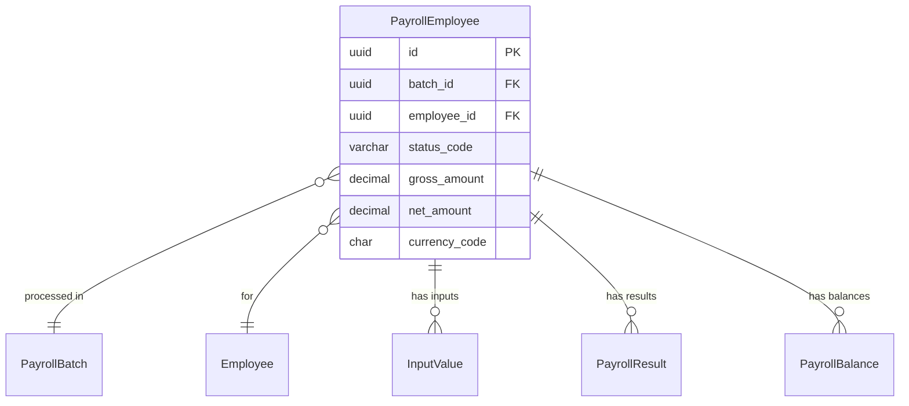

# PayrollEmployee

**Module**: Payroll (PR)  
**Submodule**: PROCESSING  
**Version**: 2.0  
**Last Updated**: 2025-12-24

---

## Entity: PayrollEmployee {#payroll-employee}

**Classification**: CORE_ENTITY

**Definition**: Represents an employee's participation in a specific payroll batch with calculation results

**Purpose**: Tracks individual employee processing within a payroll run, storing gross/net amounts and calculation status

**Key Characteristics**:
- Links employee to payroll batch
- Stores calculated gross and net amounts
- Tracks calculation status per employee
- Contains currency for multi-currency support
- **SCD Type 2**: No - transactional data

---

### Attributes

| Attribute | Type | Required | Constraints | Description |
|-----------|------|----------|-------------|-------------|
| `id` | UUID | ✅ | PK | Primary identifier |
| `batch_id` | UUID | ✅ | FK → PayrollBatch | Payroll batch |
| `employee_id` | UUID | ✅ | FK → Employee | Employee being processed |
| `status_code` | varchar(20) | ✅ | ENUM | Status: SELECTED, CALC_OK, ERROR |
| `gross_amount` | decimal(18,2) | ❌ | NULL | Calculated gross pay |
| `net_amount` | decimal(18,2) | ❌ | NULL | Calculated net pay |
| `currency_code` | char(3) | ✅ | ISO 4217 | Payment currency |
| `metadata` | jsonb | ❌ | NULL | Additional flexible data |

---

### Relationships

> **📌 Note**: Structural relationships only.

#### Entity Relationship Diagram



#### Relationship Details

| Relationship | Target | Cardinality | Foreign Key | Purpose |
|--------------|--------|-------------|-------------|---------|
| `batch` | [PayrollBatch](./01-payroll-batch.md) | N:1 | `batch_id` | Payroll batch |
| `employee` | Core.Employee | N:1 | `employee_id` | Employee |
| `input_values` | [InputValue](./03-input-value.md) | 1:N | (inverse) | Input values |
| `results` | [PayrollResult](./04-payroll-result.md) | 1:N | (inverse) | Element results |
| `balances` | [PayrollBalance](./05-payroll-balance.md) | 1:N | (inverse) | Balance values |

---

### Data Validation & Constraints

| Field | Validation | Error Message |
|-------|------------|---------------|
| `status_code` | Must be SELECTED, CALC_OK, or ERROR | "Invalid status code" |
| `currency_code` | Valid ISO 4217 code | "Invalid currency code" |

**Database Constraints**:
- `pk_payroll_employee`: PRIMARY KEY (`id`)
- `fk_payroll_employee_batch`: FOREIGN KEY (`batch_id` → `payroll_batch.id`)
- `fk_payroll_employee_emp`: FOREIGN KEY (`employee_id` → `employee.id`)
- `uk_payroll_employee`: UNIQUE (`batch_id`, `employee_id`)

---

### Examples

```yaml
PayrollEmployee:
  id: "emp-run-uuid"
  batch_id: "batch-2025-01-uuid"
  employee_id: "emp-12345-uuid"
  status_code: "CALC_OK"
  gross_amount: 25000000.00
  net_amount: 21500000.00
  currency_code: "VND"
```

---

### Best Practices

✅ **DO**:
- Set status_code to track calculation progress
- Update gross/net amounts after calculation
- Use currency_code from employee's pay group

❌ **DON'T**:
- Don't duplicate employees in same batch
- Don't modify amounts after batch finalized

---

## References

- **Sub-module Index**: [README.md](./README.md)
- **Database Schema**: [../../../03-design/5.Payroll.V3.dbml](../../../03-design/5.Payroll.V3.dbml)
