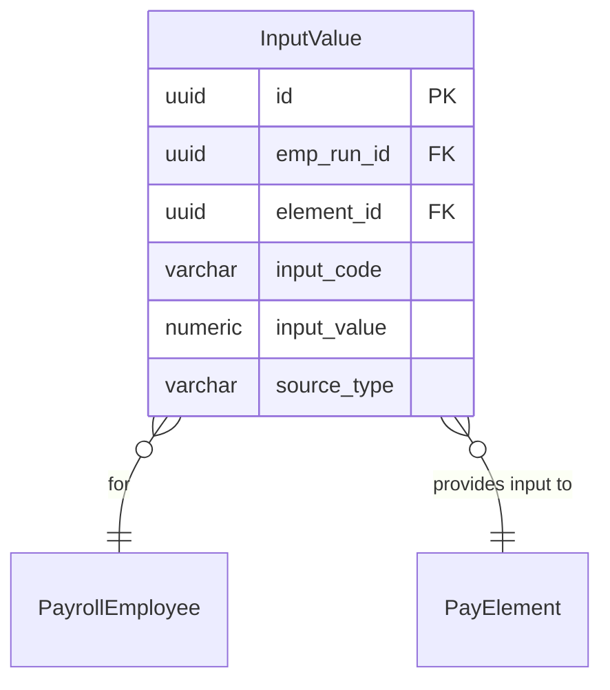

# InputValue

**Module**: Payroll (PR)  
**Submodule**: PROCESSING  
**Version**: 2.0  
**Last Updated**: 2025-12-24

---

## Entity: InputValue {#input-value}

**Classification**: CORE_ENTITY

**Definition**: Stores input values for payroll elements during a payroll run

**Purpose**: Captures input data (hours, rates, amounts) required for element calculations from various sources

**Key Characteristics**:
- Links to PayrollEmployee and PayElement
- Stores input values with source tracking
- Supports multiple input types (RATE, HOURS, AMOUNT)
- Tracks data source (Time & Attendance, Manual, etc.)
- **SCD Type 2**: No - transactional data

---

### Attributes

| Attribute | Type | Required | Constraints | Description |
|-----------|------|----------|-------------|-------------|
| `id` | UUID | ✅ | PK | Primary identifier |
| `emp_run_id` | UUID | ✅ | FK → PayrollEmployee | Payroll employee run |
| `element_id` | UUID | ✅ | FK → PayElement | Pay element |
| `input_code` | varchar(50) | ✅ | NOT NULL | Input code (RATE, HOURS, AMOUNT) |
| `input_value` | numeric(18,2) | ✅ | NOT NULL | Input value |
| `source_ref` | varchar(50) | ❌ | NULL | Source reference (TA_123, MAN_ADJ_9) |
| `source_type` | varchar(30) | ✅ | NOT NULL | Source type (TimeAttendance, Absence, Manual) |
| `unit` | varchar(10) | ❌ | NULL | Unit of measurement |
| `metadata` | jsonb | ❌ | NULL | Additional flexible data |

---

### Relationships



#### Relationship Details

| Relationship | Target | Cardinality | Foreign Key | Purpose |
|--------------|--------|-------------|-------------|---------|
| `payroll_employee` | [PayrollEmployee](./02-payroll-employee.md) | N:1 | `emp_run_id` | Employee run |
| `element` | [PayElement](../01-config/04-pay-element.md) | N:1 | `element_id` | Pay element |

**Integration Points**:
- **Time & Attendance**: Provides hours data
- **Absence**: Provides leave hours/days
- **Manual Adjustments**: User-entered values

---

### Data Validation & Constraints

| Field | Validation | Error Message |
|-------|------------|---------------|
| `input_value` | Must be numeric | "Input value must be numeric" |
| `source_type` | Must be valid source | "Invalid source type" |

**Database Constraints**:
- `pk_input_value`: PRIMARY KEY (`id`)
- `fk_input_value_emp_run`: FOREIGN KEY (`emp_run_id` → `payroll_employee.id`)
- `fk_input_value_element`: FOREIGN KEY (`element_id` → `pay_element.id`)

---

### Examples

```yaml
InputValue:
  id: "input-uuid"
  emp_run_id: "emp-run-uuid"
  element_id: "ot-1-5-element-uuid"
  input_code: "OT_HOURS"
  input_value: 20.5
  source_ref: "TA_2025_01_EMP12345"
  source_type: "TimeAttendance"
  unit: "HOURS"
```

**Business Context**: 20.5 overtime hours from Time & Attendance system

---

### Best Practices

✅ **DO**:
- Track source_ref for audit trail
- Validate input_value before saving
- Use consistent source_type codes

❌ **DON'T**:
- Don't modify inputs after calculation
- Don't duplicate inputs for same element

---

## References

- **Sub-module Index**: [README.md](./README.md)
- **Database Schema**: [../../../03-design/5.Payroll.V3.dbml](../../../03-design/5.Payroll.V3.dbml)
