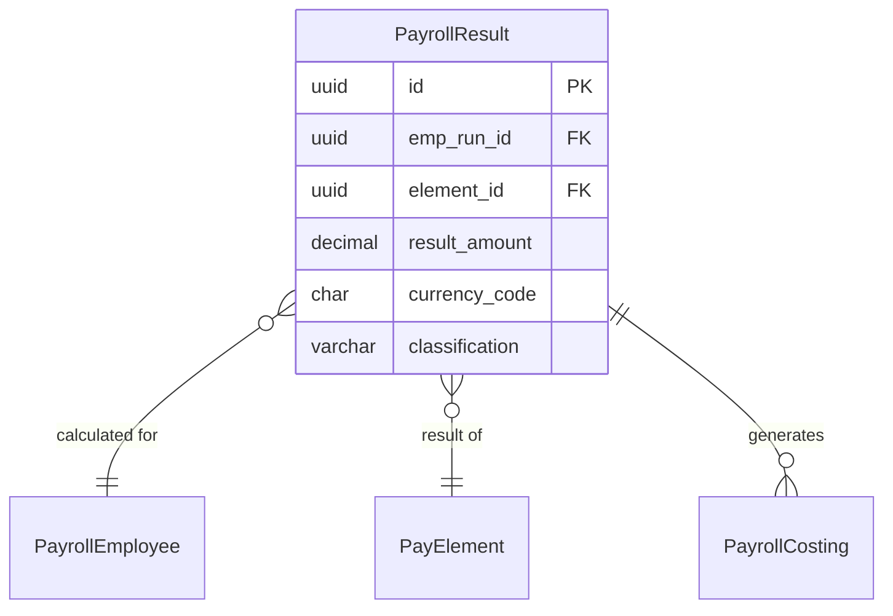

# PayrollResult

**Module**: Payroll (PR)  
**Submodule**: PROCESSING  
**Version**: 2.0  
**Last Updated**: 2025-12-24

---

## Entity: PayrollResult {#payroll-result}

**Classification**: CORE_ENTITY

**Definition**: Stores calculated results for each pay element in a payroll run

**Purpose**: Captures calculated amounts for earnings, deductions, and taxes for each employee

**Key Characteristics**:
- Links to PayrollEmployee and PayElement
- Stores calculated result amounts
- Includes element classification for reporting
- Multi-currency support
- **SCD Type 2**: No - transactional data

---

### Attributes

| Attribute | Type | Required | Constraints | Description |
|-----------|------|----------|-------------|-------------|
| `id` | UUID | ✅ | PK | Primary identifier |
| `emp_run_id` | UUID | ✅ | FK → PayrollEmployee | Payroll employee run |
| `element_id` | UUID | ✅ | FK → PayElement | Pay element |
| `result_amount` | decimal(18,2) | ✅ | NOT NULL | Calculated amount |
| `currency_code` | char(3) | ✅ | ISO 4217 | Currency |
| `classification` | varchar(20) | ✅ | ENUM | EARNING, DEDUCTION, TAX |
| `metadata` | jsonb | ❌ | NULL | Additional data |

---

### Relationships



#### Relationship Details

| Relationship | Target | Cardinality | Foreign Key | Purpose |
|--------------|--------|-------------|-------------|---------|
| `payroll_employee` | [PayrollEmployee](./02-payroll-employee.md) | N:1 | `emp_run_id` | Employee run |
| `element` | [PayElement](../01-config/04-pay-element.md) | N:1 | `element_id` | Pay element |
| `costings` | [PayrollCosting](./06-payroll-costing.md) | 1:N | (inverse) | GL costing entries |

---

### Data Validation & Constraints

| Field | Validation | Error Message |
|-------|------------|---------------|
| `result_amount` | Must be numeric | "Result amount must be numeric" |
| `classification` | Must be EARNING, DEDUCTION, or TAX | "Invalid classification" |

**Database Constraints**:
- `pk_payroll_result`: PRIMARY KEY (`id`)
- `fk_payroll_result_emp_run`: FOREIGN KEY (`emp_run_id` → `payroll_employee.id`)
- `fk_payroll_result_element`: FOREIGN KEY (`element_id` → `pay_element.id`)

---

### Examples

```yaml
PayrollResult:
  id: "result-uuid"
  emp_run_id: "emp-run-uuid"
  element_id: "basic-sal-element-uuid"
  result_amount: 15000000.00
  currency_code: "VND"
  classification: "EARNING"
```

**Business Context**: Basic salary calculation result

---

### Best Practices

✅ **DO**:
- Store all element results for audit
- Use classification for reporting
- Validate result_amount is reasonable

❌ **DON'T**:
- Don't modify results after batch finalized
- Don't delete results (archive batch instead)

---

## References

- **Sub-module Index**: [README.md](./README.md)
- **Database Schema**: [../../../03-design/5.Payroll.V3.dbml](../../../03-design/5.Payroll.V3.dbml)
