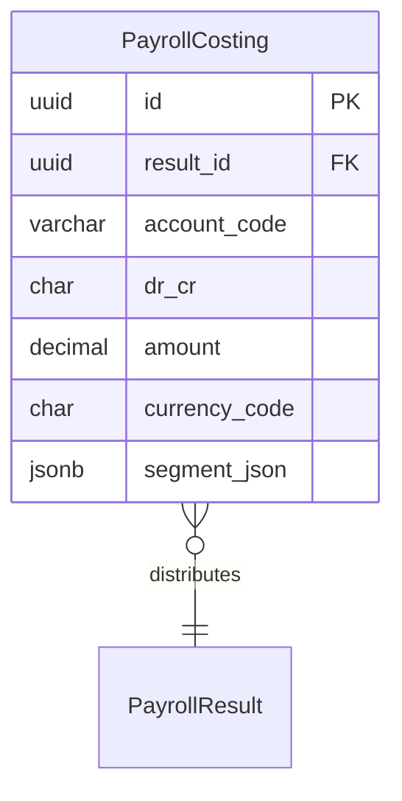

# PayrollCosting

**Module**: Payroll (PR)  
**Submodule**: PROCESSING  
**Version**: 2.0  
**Last Updated**: 2025-12-24

---

## Entity: PayrollCosting {#payroll-costing}

**Classification**: CORE_ENTITY

**Definition**: Stores GL account distribution entries for payroll results

**Purpose**: Generates accounting entries for payroll costs distributed to GL accounts

**Key Characteristics**:
- Links to PayrollResult for element amounts
- Stores debit/credit entries
- Supports multi-segment GL accounting
- Includes cost center and department dimensions
- **SCD Type 2**: No - transactional data

---

### Attributes

| Attribute | Type | Required | Constraints | Description |
|-----------|------|----------|-------------|-------------|
| `id` | UUID | ✅ | PK | Primary identifier |
| `result_id` | UUID | ✅ | FK → PayrollResult | Payroll result |
| `account_code` | varchar(50) | ✅ | NOT NULL | GL account code |
| `dr_cr` | char(1) | ✅ | D or C | Debit (D) or Credit (C) |
| `amount` | decimal(18,2) | ✅ | NOT NULL | Costing amount |
| `currency_code` | char(3) | ✅ | ISO 4217 | Currency |
| `segment_json` | jsonb | ❌ | NULL | GL segment details (cost center, dept) |

---

### Relationships



#### Relationship Details

| Relationship | Target | Cardinality | Foreign Key | Purpose |
|--------------|--------|-------------|-------------|---------|
| `result` | [PayrollResult](./04-payroll-result.md) | N:1 | `result_id` | Payroll result |

**Integration Points**:
- **GL/Accounting**: Posts journal entries
- **Cost Centers**: Distributes costs by department/project

---

### Data Validation & Constraints

| Field | Validation | Error Message |
|-------|------------|---------------|
| `dr_cr` | Must be 'D' or 'C' | "Invalid debit/credit indicator" |

**Database Constraints**:
- `pk_payroll_costing`: PRIMARY KEY (`id`)
- `fk_payroll_costing_result`: FOREIGN KEY (`result_id` → `payroll_result.id`)
- `ck_payroll_costing_dr_cr`: CHECK (`dr_cr IN ('D','C')`)

---

### Examples

```yaml
PayrollCosting:
  id: "costing-uuid"
  result_id: "result-uuid"
  account_code: "6100-SALARY"
  dr_cr: "D"
  amount: 15000000.00
  currency_code: "VND"
  segment_json:
    cost_center: "CC_IT"
    department: "DEPT_ENG"
```

**Business Context**: Debit salary expense to IT cost center

---

### Best Practices

✅ **DO**:
- Validate account_code against chart of accounts
- Ensure debits = credits for each result
- Use segment_json for multi-dimensional costing

❌ **DON'T**:
- Don't create unbalanced entries
- Don't modify costing after GL posting

---

## References

- **Sub-module Index**: [README.md](./README.md)
- **Database Schema**: [../../../03-design/5.Payroll.V3.dbml](../../../03-design/5.Payroll.V3.dbml)
