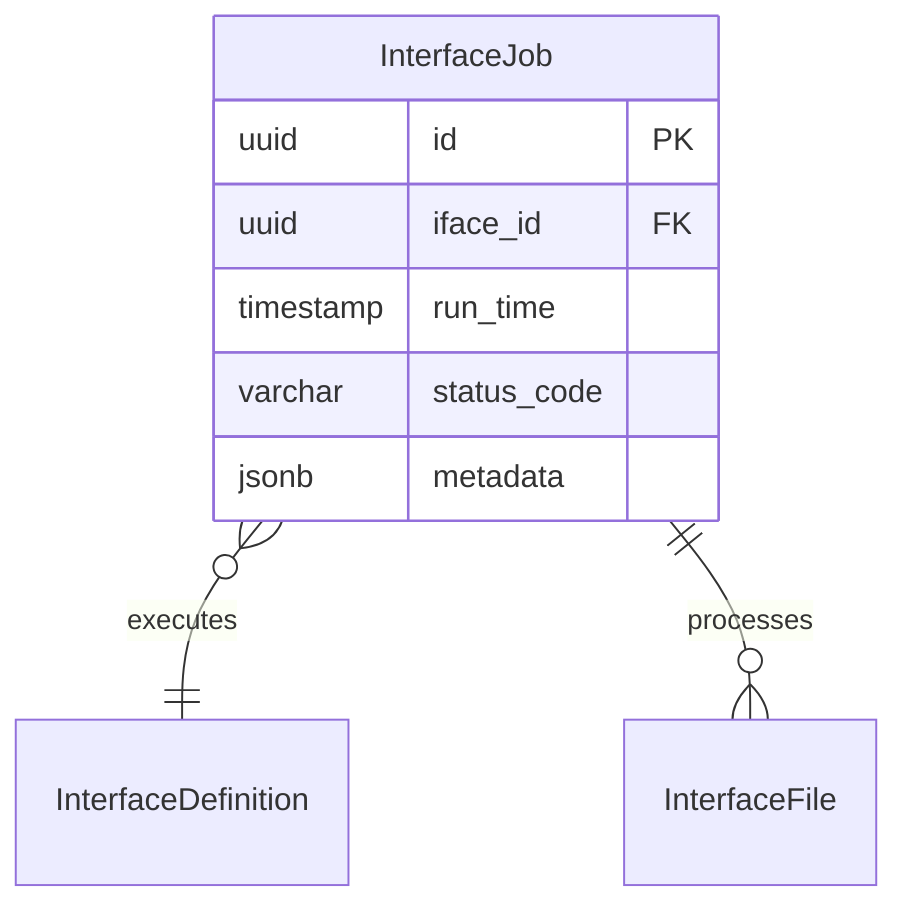

# InterfaceJob

**Module**: Payroll (PR)  
**Submodule**: GATEWAY  
**Version**: 2.0  
**Last Updated**: 2025-12-24

---

## Entity: InterfaceJob {#interface-job}

**Classification**: CORE_ENTITY

**Definition**: Tracks execution instances of interface definitions

**Purpose**: Records each interface execution with status and metadata for monitoring and troubleshooting

**Key Characteristics**:
- Links to InterfaceDefinition
- Tracks execution time and status
- Stores execution metadata
- **SCD Type 2**: No - transactional execution data

---

### Attributes

| Attribute | Type | Required | Constraints | Description |
|-----------|------|----------|-------------|-------------|
| `id` | UUID | ✅ | PK | Primary identifier |
| `iface_id` | UUID | ✅ | FK → InterfaceDefinition | Interface definition |
| `run_time` | timestamp | ✅ | DEFAULT now() | Execution start time |
| `status_code` | varchar(20) | ✅ | ENUM | Status: STARTED, DONE, ERROR |
| `metadata` | jsonb | ❌ | NULL | Execution metadata |

---

### Relationships



#### Relationship Details

| Relationship | Target | Cardinality | Foreign Key | Purpose |
|--------------|--------|-------------|-------------|---------|
| `interface` | [InterfaceDefinition](./01-interface-definition.md) | N:1 | `iface_id` | Interface definition |
| `files` | [InterfaceFile](./03-interface-file.md) | 1:N | (inverse) | Files processed |

---

### Data Validation & Constraints

**Database Constraints**:
- `pk_interface_job`: PRIMARY KEY (`id`)
- `fk_interface_job_iface`: FOREIGN KEY (`iface_id` → `interface_definition.id`)
- `ck_interface_job_status`: CHECK (`status_code IN ('STARTED','DONE','ERROR')`)

---

### Examples

```yaml
InterfaceJob:
  id: "job-uuid"
  iface_id: "iface-ta-in-uuid"
  run_time: "2025-02-01T02:00:00Z"
  status_code: "DONE"
  metadata:
    files_processed: 1
    records_imported: 150
    duration_seconds: 45
```

---

### Best Practices

✅ **DO**:
- Log execution metadata for monitoring
- Track duration for performance analysis

❌ **DON'T**:
- Don't delete job records (archive old jobs)

---

## References

- **Sub-module Index**: [README.md](./README.md)
- **Database Schema**: [../../../03-design/5.Payroll.V3.dbml](../../../03-design/5.Payroll.V3.dbml)
