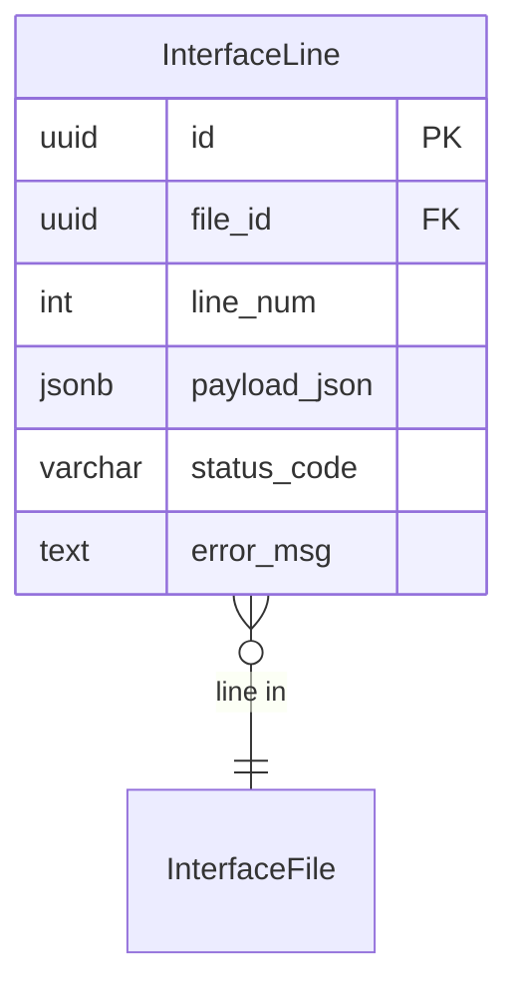

# InterfaceLine

**Module**: Payroll (PR)  
**Submodule**: GATEWAY  
**Version**: 2.0  
**Last Updated**: 2025-12-24

---

## Entity: InterfaceLine {#interface-line}

**Classification**: CORE_ENTITY

**Definition**: Stores individual line-level data from interface files

**Purpose**: Captures detailed line-by-line processing results with payload and error tracking

**Key Characteristics**:
- Links to InterfaceFile
- Stores line number and payload data
- Tracks line-level status and errors
- **SCD Type 2**: No - transactional line data

---

### Attributes

| Attribute | Type | Required | Constraints | Description |
|-----------|------|----------|-------------|-------------|
| `id` | UUID | ✅ | PK | Primary identifier |
| `file_id` | UUID | ✅ | FK → InterfaceFile | Interface file |
| `line_num` | int | ✅ | NOT NULL | Line number in file |
| `payload_json` | jsonb | ✅ | NOT NULL | Line data payload |
| `status_code` | varchar(20) | ✅ | ENUM | Status: OK, ERROR |
| `error_msg` | text | ❌ | NULL | Error message if status = ERROR |

---

### Relationships



#### Relationship Details

| Relationship | Target | Cardinality | Foreign Key | Purpose |
|--------------|--------|-------------|-------------|---------|
| `file` | [InterfaceFile](./03-interface-file.md) | N:1 | `file_id` | Interface file |

---

### Data Validation & Constraints

**Database Constraints**:
- `pk_interface_line`: PRIMARY KEY (`id`)
- `fk_interface_line_file`: FOREIGN KEY (`file_id` → `interface_file.id`)
- `ck_interface_line_status`: CHECK (`status_code IN ('OK','ERROR')`)

---

### Examples

#### Example 1: Successful Line

```yaml
InterfaceLine:
  id: "line-uuid"
  file_id: "file-uuid"
  line_num: 1
  payload_json:
    employee_code: "EMP12345"
    ot_hours: 20.5
    period_date: "2025-01-31"
  status_code: "OK"
  error_msg: null
```

#### Example 2: Error Line

```yaml
InterfaceLine:
  id: "line-error-uuid"
  file_id: "file-uuid"
  line_num: 45
  payload_json:
    employee_code: "EMP99999"
    ot_hours: 350
    period_date: "2025-01-31"
  status_code: "ERROR"
  error_msg: "Employee not found: EMP99999"
```

---

### Best Practices

✅ **DO**:
- Store complete payload for audit
- Log detailed error messages

❌ **DON'T**:
- Don't delete line records

---

## References

- **Sub-module Index**: [README.md](./README.md)
- **Database Schema**: [../../../03-design/5.Payroll.V3.dbml](../../../03-design/5.Payroll.V3.dbml)
