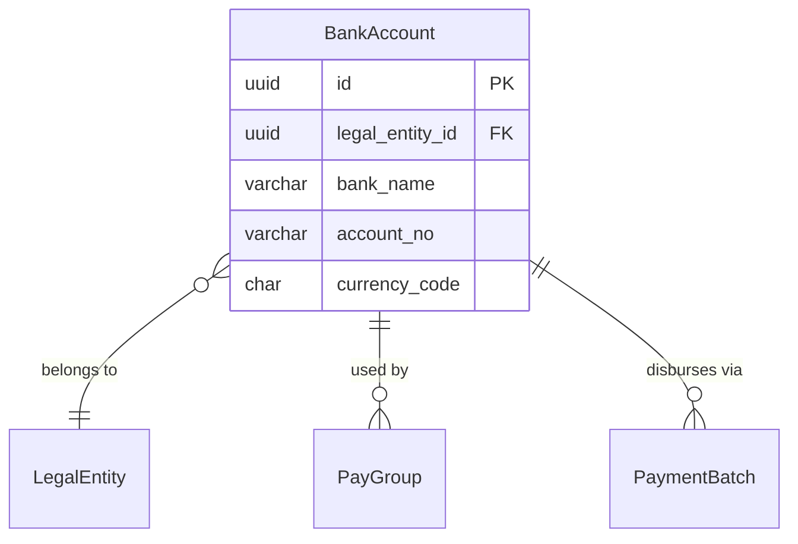

# BankAccount

**Module**: Payroll (PR)  
**Submodule**: BANKING  
**Version**: 2.0  
**Last Updated**: 2025-12-24

---

## Entity: BankAccount {#bank-account}

**Classification**: CORE_ENTITY

**Definition**: Defines company bank accounts used for payroll payment disbursement

**Purpose**: Stores bank account information for generating payment files and tracking payment sources

**Key Characteristics**:
- Links to legal entity
- Stores bank details and account number
- Multi-currency support
- Used by PayGroup and PaymentBatch
- **SCD Type 2**: No - reference data with updates tracked via metadata

---

### Attributes

| Attribute | Type | Required | Constraints | Description |
|-----------|------|----------|-------------|-------------|
| `id` | UUID | ✅ | PK | Primary identifier |
| `legal_entity_id` | UUID | ✅ | FK → LegalEntity | Owning legal entity |
| `bank_name` | varchar(100) | ✅ | NOT NULL | Bank name |
| `account_no` | varchar(50) | ✅ | NOT NULL | Bank account number |
| `currency_code` | char(3) | ✅ | ISO 4217 | Account currency |
| `metadata` | jsonb | ❌ | NULL | Additional data (branch, swift, etc.) |

---

### Relationships



#### Relationship Details

| Relationship | Target | Cardinality | Foreign Key | Purpose |
|--------------|--------|-------------|-------------|---------|
| `legal_entity` | Core.LegalEntity | N:1 | `legal_entity_id` | Owning entity |
| `pay_groups` | [PayGroup](../01-config/03-pay-group.md) | 1:N | (inverse) | Pay groups using this account |
| `payment_batches` | [PaymentBatch](./02-payment-batch.md) | 1:N | (inverse) | Payment batches |

---

### Data Validation & Constraints

**Database Constraints**:
- `pk_bank_account`: PRIMARY KEY (`id`)
- `fk_bank_account_entity`: FOREIGN KEY (`legal_entity_id` → `legal_entity.id`)
- `ck_bank_account_currency`: CHECK (`LENGTH(currency_code) = 3`)

---

### Examples

```yaml
BankAccount:
  id: "bank-vietcombank-uuid"
  legal_entity_id: "vng-corp-uuid"
  bank_name: "Vietcombank"
  account_no: "0123456789"
  currency_code: "VND"
  metadata:
    branch: "Ho Chi Minh City Branch"
    swift_code: "BFTVVNVX"
    routing_number: null
```

---

### Best Practices

✅ **DO**:
- Validate account numbers before saving
- Store additional bank details in metadata

❌ **DON'T**:
- Don't expose account numbers in logs
- Don't delete accounts (inactivate instead)

---

## References

- **Sub-module Index**: [README.md](./README.md)
- **Database Schema**: [../../../03-design/5.Payroll.V3.dbml](../../../03-design/5.Payroll.V3.dbml)
