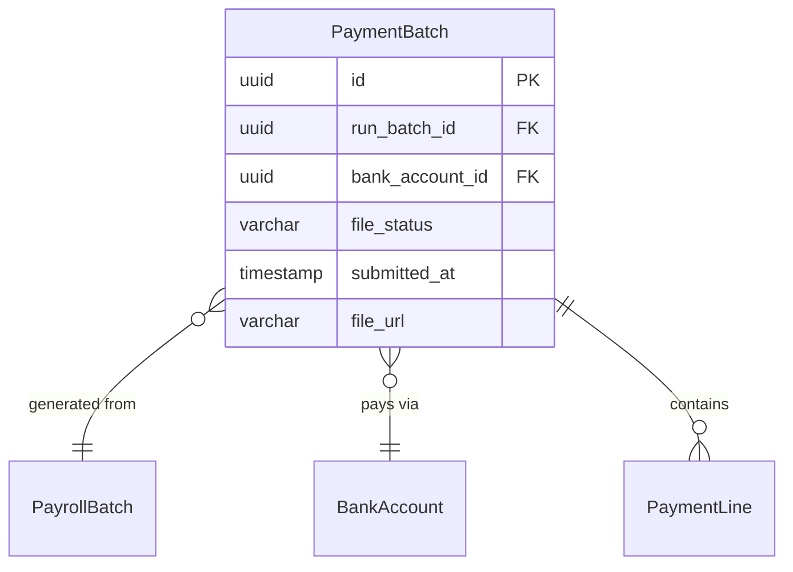

# PaymentBatch

**Module**: Payroll (PR)  
**Submodule**: BANKING  
**Version**: 2.0  
**Last Updated**: 2025-12-24

---

## Entity: PaymentBatch {#payment-batch}

**Classification**: CORE_ENTITY

**Definition**: Groups payment lines for bank file generation and submission

**Purpose**: Orchestrates payment file creation and tracks submission status to banking systems

**Key Characteristics**:
- Links to PayrollBatch and BankAccount
- Tracks file generation and submission status
- Stores file URL for retrieval
- **SCD Type 2**: No - transactional payment data

---

### Attributes

| Attribute | Type | Required | Constraints | Description |
|-----------|------|----------|-------------|-------------|
| `id` | UUID | ✅ | PK | Primary identifier |
| `run_batch_id` | UUID | ✅ | FK → PayrollBatch | Source payroll batch |
| `bank_account_id` | UUID | ✅ | FK → BankAccount | Disbursement bank account |
| `file_status` | varchar(20) | ✅ | ENUM | Status: PENDING, SENT, CONFIRMED |
| `submitted_at` | timestamp | ❌ | NULL | Submission timestamp |
| `file_url` | varchar(255) | ❌ | NULL | Generated file URL |
| `metadata` | jsonb | ❌ | NULL | Additional data |

---

### Relationships



#### Relationship Details

| Relationship | Target | Cardinality | Foreign Key | Purpose |
|--------------|--------|-------------|-------------|---------|
| `payroll_batch` | [PayrollBatch](../02-processing/01-payroll-batch.md) | N:1 | `run_batch_id` | Source payroll batch |
| `bank_account` | [BankAccount](./01-bank-account.md) | N:1 | `bank_account_id` | Bank account |
| `payment_lines` | [PaymentLine](./03-payment-line.md) | 1:N | (inverse) | Payment lines |

---

### Data Validation & Constraints

**Database Constraints**:
- `pk_payment_batch`: PRIMARY KEY (`id`)
- `fk_payment_batch_run`: FOREIGN KEY (`run_batch_id` → `payroll_batch.id`)
- `fk_payment_batch_bank`: FOREIGN KEY (`bank_account_id` → `bank_account.id`)
- `ck_payment_batch_status`: CHECK (`file_status IN ('PENDING','SENT','CONFIRMED')`)

---

### Examples

```yaml
PaymentBatch:
  id: "payment-batch-uuid"
  run_batch_id: "batch-2025-01-uuid"
  bank_account_id: "bank-vietcombank-uuid"
  file_status: "SENT"
  submitted_at: "2025-02-05T14:00:00Z"
  file_url: "s3://payroll-files/payments/2025-01-payment.txt"
  metadata:
    total_amount: 500000000.00
    employee_count: 150
    file_format: "NACHA"
```

---

### Best Practices

✅ **DO**:
- Generate file after payroll finalization
- Track submission timestamps
- Store file URL for audit

❌ **DON'T**:
- Don't regenerate files after submission
- Don't delete payment batches

---

## References

- **Sub-module Index**: [README.md](./README.md)
- **Database Schema**: [../../../03-design/5.Payroll.V3.dbml](../../../03-design/5.Payroll.V3.dbml)
