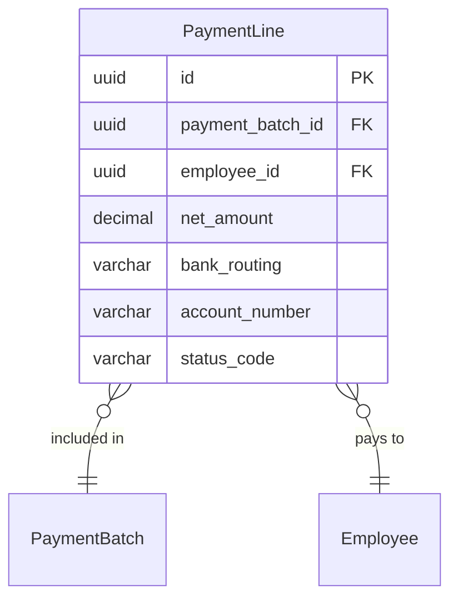

# PaymentLine

**Module**: Payroll (PR)  
**Submodule**: BANKING  
**Version**: 2.0  
**Last Updated**: 2025-12-24

---

## Entity: PaymentLine {#payment-line}

**Classification**: CORE_ENTITY

**Definition**: Individual employee payment line within a payment batch

**Purpose**: Stores per-employee payment details for bank file generation

**Key Characteristics**:
- Links to PaymentBatch and Employee
- Stores net amount and bank details
- Tracks line-level payment status
- **SCD Type 2**: No - transactional payment data

---

### Attributes

| Attribute | Type | Required | Constraints | Description |
|-----------|------|----------|-------------|-------------|
| `id` | UUID | ✅ | PK | Primary identifier |
| `payment_batch_id` | UUID | ✅ | FK → PaymentBatch | Payment batch |
| `employee_id` | UUID | ✅ | FK → Employee | Employee |
| `net_amount` | decimal(18,2) | ✅ | NOT NULL | Net payment amount |
| `bank_routing` | varchar(20) | ❌ | NULL | Bank routing number |
| `account_number` | varchar(30) | ❌ | NULL | Employee account number |
| `status_code` | varchar(20) | ✅ | ENUM | Status: READY, SENT, FAIL |
| `metadata` | jsonb | ❌ | NULL | Additional data |

---

### Relationships



#### Relationship Details

| Relationship | Target | Cardinality | Foreign Key | Purpose |
|--------------|--------|-------------|-------------|---------|
| `payment_batch` | [PaymentBatch](./02-payment-batch.md) | N:1 | `payment_batch_id` | Payment batch |
| `employee` | Core.Employee | N:1 | `employee_id` | Employee |

---

### Data Validation & Constraints

**Database Constraints**:
- `pk_payment_line`: PRIMARY KEY (`id`)
- `fk_payment_line_batch`: FOREIGN KEY (`payment_batch_id` → `payment_batch.id`)
- `fk_payment_line_employee`: FOREIGN KEY (`employee_id` → `employee.id`)
- `ck_payment_line_status`: CHECK (`status_code IN ('READY','SENT','FAIL')`)

---

### Examples

```yaml
PaymentLine:
  id: "payment-line-uuid"
  payment_batch_id: "payment-batch-uuid"
  employee_id: "emp-12345-uuid"
  net_amount: 21500000.00
  bank_routing: "970436"
  account_number: "9876543210"
  status_code: "READY"
  metadata:
    employee_name: "Nguyen Van A"
    bank_name: "Vietcombank"
```

---

### Best Practices

✅ **DO**:
- Validate bank details before file generation
- Encrypt account numbers
- Track line-level status

❌ **DON'T**:
- Don't expose account numbers in logs
- Don't modify lines after file sent

---

## References

- **Sub-module Index**: [README.md](./README.md)
- **Database Schema**: [../../../03-design/5.Payroll.V3.dbml](../../../03-design/5.Payroll.V3.dbml)
