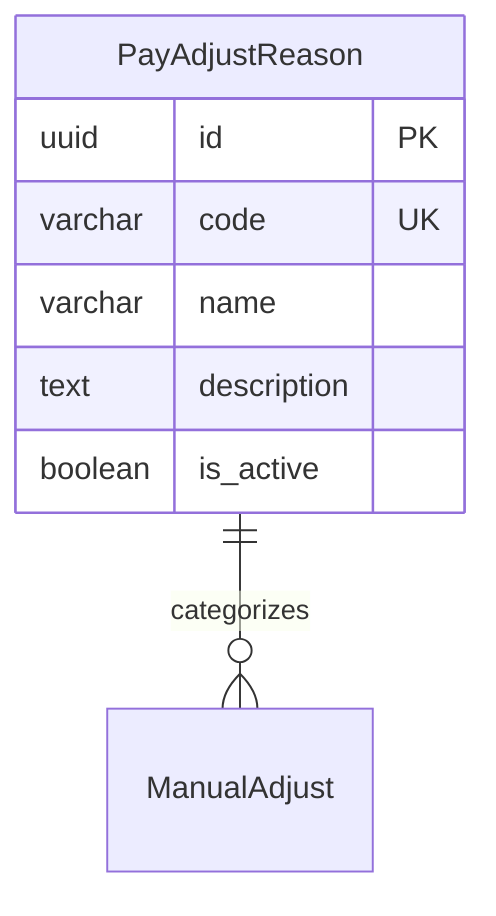

# PayAdjustReason

**Module**: Payroll (PR)  
**Submodule**: UTILITY  
**Version**: 2.0  
**Last Updated**: 2025-12-24

---

## Entity: PayAdjustReason {#pay-adjust-reason}

**Classification**: REFERENCE_DATA

**Definition**: Master list of adjustment reasons for manual payroll adjustments

**Purpose**: Provides standardized reason codes for tracking and categorizing manual payroll adjustments

**Key Characteristics**:
- Reference data for adjustment categorization
- Used by ManualAdjust entity
- Can be activated/deactivated
- **SCD Type 2**: No - reference data with is_active flag

---

### Attributes

| Attribute | Type | Required | Constraints | Description |
|-----------|------|----------|-------------|-------------|
| `id` | UUID | ✅ | PK | Primary identifier |
| `code` | varchar(50) | ✅ | UNIQUE, NOT NULL | Reason code |
| `name` | varchar(100) | ✅ | NOT NULL | Reason display name |
| `description` | text | ❌ | NULL | Detailed description |
| `is_active` | boolean | ✅ | DEFAULT true | Whether reason is active |
| `created_at` | timestamp | ✅ | Auto | Creation timestamp |
| `updated_at` | timestamp | ❌ | Auto | Last update timestamp |

---

### Relationships



---

### Examples

```yaml
PayAdjustReason:
  code: "SALARY_CORRECTION"
  name: "Salary Correction"
  description: "Correction for salary calculation errors"
  is_active: true
```

---

### Best Practices

✅ **DO**:
- Use descriptive reason codes
- Document reason purpose clearly

❌ **DON'T**:
- Don't delete reasons (inactivate instead)

---

## References

- **Sub-module Index**: [README.md](./README.md)
- **Database Schema**: [../../../03-design/5.Payroll.V3.dbml](../../../03-design/5.Payroll.V3.dbml)
