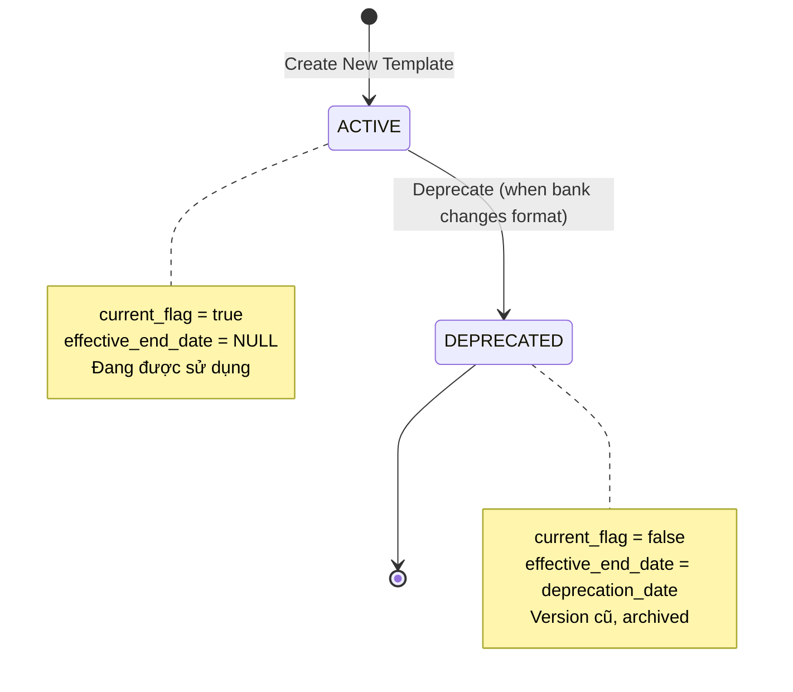
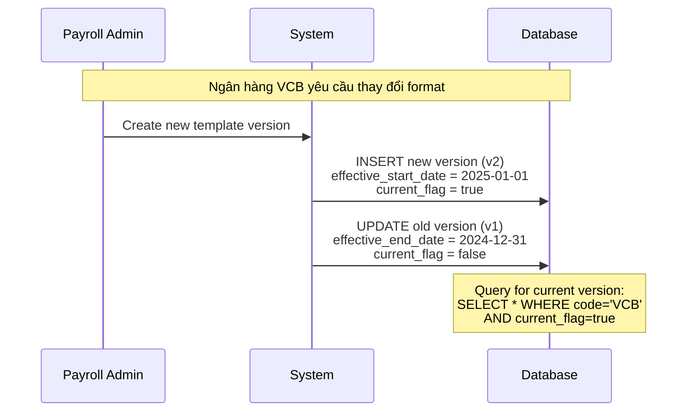
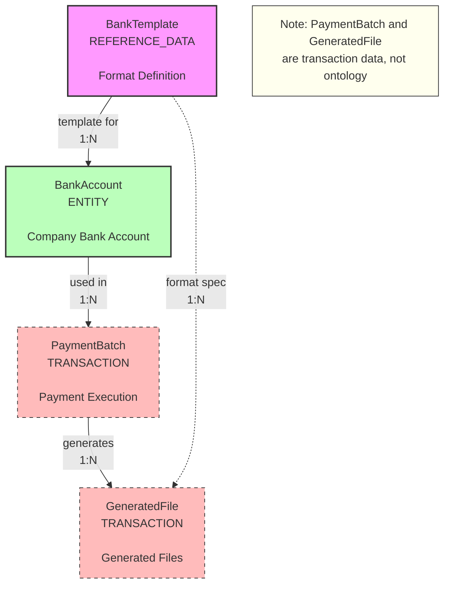

---
# ============================================================================
# ENTITY ONTOLOGY v4.0
# ============================================================================
# Format: Markdown + YAML Frontmatter
# File: R-bank-template.onto.md

$schema: "ontology/entity/v4"
$id: "xtalent:payroll:reporting:bank-template"

# ----------------------------------------------------------------------------
# ENTITY IDENTITY
# ----------------------------------------------------------------------------
entity: BankTemplate
classification: REFERENCE_DATA
module: PAYROLL
submodule: reporting

definition: "Định nghĩa format file thanh toán cho từng ngân hàng"
purpose: "Cung cấp template chuẩn để generate file chuyển khoản lương theo yêu cầu của từng ngân hàng, đảm bảo tính tương thích với hệ thống banking"

# ----------------------------------------------------------------------------
# 1. ATTRIBUTES
# ----------------------------------------------------------------------------
attributes:
  # Primary key
  code:
    type: string
    required: true
    unique: true
    max_length: 20
    description: "Mã ngân hàng (bank code)"
    example: "VCB"
    pattern: "^[A-Z0-9_]+$"
    
  # Core attributes  
  name:
    type: string
    required: true
    max_length: 100
    description: "Tên đầy đủ của ngân hàng"
    example: "Vietcombank - Ngân hàng TMCP Ngoại thương Việt Nam"
    
  format:
    type: enum
    required: true
    values: [CSV, TXT, FIXED_WIDTH, EXCEL, XML]
    description: "Loại định dạng file yêu cầu"
    example: "CSV"
    
  delimiter:
    type: string
    required: false
    max_length: 5
    description: "Ký tự phân cách (cho CSV/TXT)"
    example: ","
    notes: "Nullable cho FIXED_WIDTH format"
    
  columns_json:
    type: jsonb
    required: true
    description: "Định nghĩa cấu trúc cột trong file"
    schema:
      type: array
      items:
        properties:
          position: integer
          name: string
          data_type: string
          max_length: integer
          required: boolean
          format_pattern: string
    example: |
      [
        {"position": 1, "name": "employee_id", "data_type": "string", "max_length": 10, "required": true},
        {"position": 2, "name": "account_number", "data_type": "string", "max_length": 20, "required": true},
        {"position": 3, "name": "amount", "data_type": "decimal", "format_pattern": "0.00", "required": true}
      ]
      
  header_required:
    type: boolean
    required: true
    default: true
    description: "File có yêu cầu dòng header hay không"
    
  footer_required:
    type: boolean
    required: true
    default: false
    description: "File có yêu cầu dòng footer (tổng số records, tổng amount) hay không"
    
  encoding:
    type: string
    required: false
    max_length: 20
    default: "UTF-8"
    description: "Character encoding của file"
    example: "UTF-8"
    
  validation_rules:
    type: jsonb
    required: false
    description: "Các rule validation đặc thù của ngân hàng"
    example: |
      {
        "max_file_size_mb": 10,
        "max_records_per_file": 5000,
        "account_number_pattern": "^[0-9]{10,15}$"
      }
      
  # SCD2 tracking
  effective_start_date:
    type: date
    required: true
    description: "Ngày bắt đầu hiệu lực của template version này"
    
  effective_end_date:
    type: date
    required: false
    description: "Ngày kết thúc hiệu lực (null = đang hiện tại)"
    
  current_flag:
    type: boolean
    required: true
    default: true
    description: "Đánh dấu version hiện tại đang sử dụng"
    
  # Metadata
  description:
    type: text
    required: false
    description: "Mô tả chi tiết về template và yêu cầu của ngân hàng"
    
  sample_file_path:
    type: string
    required: false
    max_length: 255
    description: "Đường dẫn đến file mẫu tham khảo"

# ----------------------------------------------------------------------------
# 2. RELATIONSHIPS
# ----------------------------------------------------------------------------
relationships:
  used_by_bank_accounts:
    target: "[[BankAccount]]"
    target_ref: "xtalent:payroll:banking:bank-account"
    cardinality: "1:N"
    description: "Các bank account sử dụng template này để generate payment files"
    notes: "BankAccount entity ở external module (Finance/Banking)"
    
  generates_payment_files:
    target: "[[GeneratedFile]]"
    target_ref: "xtalent:payroll:runtime:generated-file"
    cardinality: "1:N"
    description: "Files được generate từ template này"
    notes: "GeneratedFile là transaction data, không phải ontology"

# ----------------------------------------------------------------------------
# 3. LIFECYCLE
# ----------------------------------------------------------------------------
lifecycle:
  state_attribute: current_flag
  valid_states:
    - state: ACTIVE
      description: "Template version hiện tại đang được sử dụng"
      initial: true
    - state: DEPRECATED
      description: "Template version cũ, đã bị thay thế bởi version mới"
      terminal: true
      
  notes: |
    SCD2 pattern: Khi ngân hàng thay đổi format, tạo version mới thay vì update:
    1. Version cũ: set effective_end_date = today, current_flag = false (DEPRECATED)
    2. Version mới: insert với effective_start_date = today, current_flag = true (ACTIVE)

# ----------------------------------------------------------------------------
# 4. ACTIONS
# ----------------------------------------------------------------------------
actions:
  - name: Deprecate
    description: "Đánh dấu template version cũ không còn sử dụng"
    applicable_when: "current_flag = true"
    requires:
      - new_version_id
    mutations:
      - attribute: current_flag
        value: false
      - attribute: effective_end_date
        value: "today()"
    notes: "Phải có version mới trước khi deprecate version cũ"
        
  - name: TestFormat
    description: "Test format với sample payment data"
    applicable_when: "current_flag = true"
    requires:
      - sample_payment_data
    side_effects:
      - type: FILE_GENERATION
        description: "Generate test file with sample data"
      - type: VALIDATION
        description: "Validate generated file against template rules"
    notes: "Không mutate entity, chỉ generate test output"
    
  - name: ValidateColumns
    description: "Validate columns_json structure"
    applicable_when: "current_flag = true"
    requires: []
    validations:
      - check: "All required bank fields are present"
      - check: "Column positions are sequential"
      - check: "Data types are supported"
    notes: "Run before activate new version"

# ----------------------------------------------------------------------------
# 5. POLICIES
# ----------------------------------------------------------------------------
policies:
  # Data constraints
  constraints:
    - id: POL-BANK-001
      rule: "code IS NOT NULL AND code = UPPER(code)"
      message: "Bank code phải viết hoa"
      severity: ERROR
      
    - id: POL-BANK-002
      rule: "format IN ('CSV', 'TXT', 'FIXED_WIDTH', 'EXCEL', 'XML')"
      message: "Format phải là một trong các giá trị được hỗ trợ"
      severity: ERROR
      
    - id: POL-BANK-003
      rule: "delimiter IS NOT NULL WHEN format IN ('CSV', 'TXT')"
      message: "CSV và TXT format phải có delimiter"
      severity: ERROR
      
    - id: POL-BANK-004
      rule: "JSONB_IS_ARRAY(columns_json) AND ARRAY_LENGTH(columns_json) > 0"
      message: "columns_json phải là mảng và có ít nhất 1 cột"
      severity: ERROR
      
    - id: POL-BANK-005
      rule: "effective_start_date <= effective_end_date OR effective_end_date IS NULL"
      message: "End date không thể trước start date"
      severity: ERROR
      
    - id: POL-BANK-006
      rule: "COUNT(*) WHERE code = X AND current_flag = true <= 1"
      message: "Chỉ có một version ACTIVE cho mỗi bank code"
      severity: ERROR
      
  # Access control
  access_control:
    classification: INTERNAL
    visibility_rules:
      - attribute: "*"
        view: [PAYROLL_SPECIALIST, PAYROLL_ADMIN, FINANCE_OPS]
        edit: [PAYROLL_ADMIN, SYSTEM_ADMIN]
      - attribute: "columns_json"
        view: [PAYROLL_ADMIN, FINANCE_OPS, DEVELOPER]
        edit: [PAYROLL_ADMIN]
        notes: "Developers cần xem để implement integration"
    sensitive_attributes:
      - validation_rules
    notes: "Template chứa business logic của integration, cần bảo vệ"
        
  # Eligibility
  eligibility:
    - id: ELIG-BANK-001
      name: "Usable for Payment Generation"
      expression: "current_flag = true AND (effective_end_date IS NULL OR effective_end_date >= today())"
      description: "Chỉ version hiện tại được dùng để generate payment files mới"
      
    - id: ELIG-BANK-002
      name: "Can Deprecate"
      expression: "current_flag = true AND EXISTS(newer_version)"
      description: "Chỉ deprecate khi đã có version mới thay thế"

# ----------------------------------------------------------------------------
# IMPLEMENTATION HINTS (Optional)
# ----------------------------------------------------------------------------
_hints:
  indexes:
    - columns: [code, current_flag]
      unique: true
      note: "Đảm bảo chỉ 1 current version per bank"
    - columns: [code, effective_start_date]
    - columns: [current_flag]
      where: "current_flag = true"
      note: "Partial index for fast lookup of active templates"
  common_banks:
    vietnam:
      - VCB: "Vietcombank"
      - TCB: "Techcombank"
      - VTB: "Vietinbank"
      - ACB: "ACB"
      - BIDV: "BIDV"
    international:
      - HSBC: "HSBC"
      - CITI: "Citibank"
      - SCB: "Standard Chartered"
  versioning_example: |
    -- VCB template version history
    Version 1 (2023-01-01 to 2024-12-31): CSV format, 15 columns
    Version 2 (2025-01-01 to NULL): CSV format, 18 columns (added new fields)
---

# BankTemplate

## Mô tả

**BankTemplate** (Mẫu file ngân hàng) là entity kiểu REFERENCE_DATA, định nghĩa format file chuyển khoản lương theo yêu cầu của từng ngân hàng.

### Vai trò trong hệ thống

- **Payment File Generation**: Cung cấp template để generate file thanh toán lương cho ngân hàng
- **Format Standardization**: Đảm bảo file generate đúng format yêu cầu của từng ngân hàng
- **Version Management**: Theo dõi lịch sử thay đổi format khi ngân hàng update yêu cầu (SCD2)
- **Integration Bridge**: Cầu nối giữa Payroll system và Banking system

### Đặc điểm

- **SCD2 Enabled**: Theo dõi version history khi ngân hàng thay đổi format
- **JSON Schema**: `columns_json` chứa định nghĩa chi tiết cấu trúc file
- **Multiple Formats**: Hỗ trợ CSV, TXT, FIXED_WIDTH, EXCEL, XML
- **Bank-Specific**: Mỗi ngân hàng có yêu cầu format riêng

## Lifecycle Visualization



### SCD2 Version Management



## Relationship Diagram



## Format Specifications

### Supported Formats

```yaml
CSV:
  description: "Comma-Separated Values"
  delimiter: "," or ";" or "|" (configurable)
  header_required: usually true
  footer_required: optional
  example_banks: ["VCB", "TCB", "ACB"]
  
TXT:
  description: "Delimited text file"
  delimiter: "\t" (tab) or custom
  header_required: varies
  footer_required: optional
  example_banks: ["BIDV", "VTB"]
  
FIXED_WIDTH:
  description: "Fixed-width columns (no delimiter)"
  columns_json: Must include width for each column
  header_required: false
  footer_required: usually true
  example_banks: ["HSBC", "CITI"]
  
EXCEL:
  description: ".xlsx file format"
  delimiter: N/A
  header_required: true
  footer_required: optional
  example_banks: ["SCB"]
  
XML:
  description: "XML format (rare)"
  delimiter: N/A
  columns_json: XML node structure
  example_banks: ["International banks"]
```

### Column Definition Schema

```typescript
interface ColumnDefinition {
  position: number;           // Thứ tự cột (1-indexed)
  name: string;              // Tên field
  data_type: string;         // "string" | "integer" | "decimal" | "date"
  max_length?: number;       // Độ dài tối đa (cho string)
  width?: number;            // Độ rộng cột (cho FIXED_WIDTH)
  required: boolean;         // Có bắt buộc không
  format_pattern?: string;   // Format pattern (vd: "0.00" cho decimal)
  padding?: string;          // "LEFT" | "RIGHT" (cho FIXED_WIDTH)
  padding_char?: string;     // Ký tự padding (default: space)
  default_value?: any;       // Giá trị mặc định nếu null
}
```

## Real-World Examples

### Example 1: Vietcombank CSV Template

```json
{
  "code": "VCB",
  "name": "Vietcombank - Ngân hàng TMCP Ngoại thương Việt Nam",
  "format": "CSV",
  "delimiter": ",",
  "header_required": true,
  "footer_required": true,
  "encoding": "UTF-8",
  "columns_json": [
    {
      "position": 1,
      "name": "employee_id",
      "data_type": "string",
      "max_length": 10,
      "required": true
    },
    {
      "position": 2,
      "name": "employee_name",
      "data_type": "string",
      "max_length": 100,
      "required": true
    },
    {
      "position": 3,
      "name": "account_number",
      "data_type": "string",
      "max_length": 15,
      "required": true,
      "format_pattern": "^[0-9]{13,15}$"
    },
    {
      "position": 4,
      "name": "amount",
      "data_type": "decimal",
      "required": true,
      "format_pattern": "0.00"
    },
    {
      "position": 5,
      "name": "currency",
      "data_type": "string",
      "max_length": 3,
      "required": true,
      "default_value": "VND"
    },
    {
      "position": 6,
      "name": "description",
      "data_type": "string",
      "max_length": 200,
      "required": false,
      "default_value": "Salary payment"
    }
  ],
  "validation_rules": {
    "max_file_size_mb": 10,
    "max_records_per_file": 5000,
    "account_number_pattern": "^[0-9]{13,15}$",
    "min_amount": 1000,
    "max_amount": 1000000000
  }
}
```

**Generated CSV File Example:**
```csv
employee_id,employee_name,account_number,amount,currency,description
EMP000001,Nguyen Van A,1234567890123,15000000.00,VND,Salary payment Dec 2025
EMP000002,Tran Thi B,9876543210987,12500000.00,VND,Salary payment Dec 2025
FOOTER,Total Records: 2,Total Amount: 27500000.00
```

### Example 2: HSBC Fixed-Width Template

```json
{
  "code": "HSBC",
  "name": "HSBC - The Hongkong and Shanghai Banking Corporation",
  "format": "FIXED_WIDTH",
  "delimiter": null,
  "header_required": false,
  "footer_required": true,
  "encoding": "UTF-8",
  "columns_json": [
    {
      "position": 1,
      "name": "record_type",
      "data_type": "string",
      "width": 2,
      "required": true,
      "padding": "RIGHT",
      "padding_char": " "
    },
    {
      "position": 2,
      "name": "account_number",
      "data_type": "string",
      "width": 20,
      "required": true,
      "padding": "LEFT",
      "padding_char": "0"
    },
    {
      "position": 3,
      "name": "amount",
      "data_type": "decimal",
      "width": 15,
      "required": true,
      "format_pattern": "000000000000.00",
      "padding": "LEFT",
      "padding_char": "0"
    },
    {
      "position": 4,
      "name": "beneficiary_name",
      "data_type": "string",
      "width": 35,
      "required": true,
      "padding": "RIGHT",
      "padding_char": " "
    }
  ],
  "validation_rules": {
    "total_record_width": 72,
    "record_type_values": ["10", "99"],
    "footer_record_type": "99"
  }
}
```

**Generated Fixed-Width File Example:**
```
10001234567890123456000000015000000.00NGUYEN VAN A                      
10009876543210987654000000012500000.00TRAN THI B                        
99000000000000000002000000027500000.00TOTAL                             
```

## Policies Explained

### Constraints

1. **POL-BANK-001: Uppercase Code**
   ```sql
   code IS NOT NULL AND code = UPPER(code)
   ```
   - Bank codes phải uppercase (VCB, không phải vcb)
   - Convention chuẩn trong banking industry

2. **POL-BANK-002: Valid Format**
   ```sql
   format IN ('CSV', 'TXT', 'FIXED_WIDTH', 'EXCEL', 'XML')
   ```
   - Chỉ support các format được định nghĩa
   - Reject unknown formats để tránh lỗi generation

3. **POL-BANK-003: Delimiter Required for Delimited Formats**
   ```sql
   delimiter IS NOT NULL WHEN format IN ('CSV', 'TXT')
   ```
   - CSV và TXT phải có delimiter (comma, tab, etc.)
   - FIXED_WIDTH không cần delimiter (null is OK)

4. **POL-BANK-004: Valid Column Definition**
   ```sql
   JSONB_IS_ARRAY(columns_json) AND ARRAY_LENGTH(columns_json) > 0
   ```
   - `columns_json` phải là mảng có ít nhất 1 cột
   - Empty columns = invalid template

5. **POL-BANK-005: Valid Date Range**
   ```sql
   effective_start_date <= effective_end_date OR effective_end_date IS NULL
   ```
   - SCD2 date logic phải hợp lệ
   - NULL end date = current version

6. **POL-BANK-006: Single Active Version**
   ```sql
   COUNT(*) WHERE code = X AND current_flag = true <= 1
   ```
   - Mỗi bank code chỉ có 1 version ACTIVE
   - Prevent conflicts khi generate files

### Access Control

**Classification**: INTERNAL
- **View**: Payroll team, Finance Ops, Developers (cần xem để implement)
- **Edit**: Chỉ Payroll Admin và System Admin
- **Sensitive**: `columns_json`, `validation_rules` (business logic)

**Rationale**:
- Template chứa integration logic → cần bảo vệ
- Thay đổi sai có thể làm fail payment → strict access control

### Eligibility Rules

1. **ELIG-BANK-001: Usable for Payment Generation**
   ```javascript
   current_flag === true && 
   (effective_end_date === null || effective_end_date >= today())
   ```
   - Chỉ version hiện tại được dùng generate payment mới
   - Deprecated versions chỉ dùng cho historical reference

2. **ELIG-BANK-002: Can Deprecate**
   ```javascript
   current_flag === true && EXISTS(newer_version)
   ```
   - Phải có version mới trước khi deprecate version cũ
   - Không được để trống (no active template)

## Version Management Workflow

### Scenario: Bank Format Change

**Context**: Vietcombank thông báo thay đổi format từ 15 cột lên 18 cột, có hiệu lực từ 2025-01-01

**Steps**:

1. **Create New Version**
   ```sql
   INSERT INTO bank_template (
     code, name, format, delimiter, columns_json,
     effective_start_date, effective_end_date, current_flag
   ) VALUES (
     'VCB',
     'Vietcombank - Format V2',
     'CSV',
     ',',
     '[...18 columns...]',  -- new structure
     '2025-01-01',
     NULL,
     true  -- new version is current
   );
   ```

2. **Deprecate Old Version**
   ```sql
   UPDATE bank_template
   SET 
     effective_end_date = '2024-12-31',
     current_flag = false
   WHERE code = 'VCB' 
     AND current_flag = true
     AND effective_start_date < '2025-01-01';
   ```

3. **Testing**
   - Run `TestFormat` action với sample data
   - Verify generated file matches bank requirements
   - Coordinate với bank để test file

4. **Cutover**
   - Schedule cutover: 2024-12-31 23:59 use old format
   - From 2025-01-01 00:00 use new format
   - System auto-selects based on `current_flag` and `effective_start_date`

### Query for Version History

```sql
-- Get all versions of VCB template
SELECT 
  code,
  effective_start_date,
  effective_end_date,
  current_flag,
  ARRAY_LENGTH(columns_json) as column_count
FROM bank_template
WHERE code = 'VCB'
ORDER BY effective_start_date DESC;

-- Result:
-- code | start_date | end_date   | current | columns
-- VCB  | 2025-01-01 | NULL       | true    | 18
-- VCB  | 2023-01-01 | 2024-12-31 | false   | 15
```

## Integration Points

### Upstream Dependencies
*None* - BankTemplate là reference data, không phụ thuộc

### Downstream Consumers

1. **BankAccount** (External Entity)
   ```yaml
   Relationship: BankAccount.template_code → BankTemplate.code
   Usage: Xác định template nào dùng khi generate file
   Constraint: Must use current_flag = true version
   ```

2. **Payment File Generator** (Process, not entity)
   ```python
   def generate_payment_file(bank_code, payment_data):
       template = get_current_template(bank_code)
       file_content = render_template(template, payment_data)
       validate_file(file_content, template.validation_rules)
       return file_content
   ```

## Business Rules Summary

| Rule ID | Description | Enforcement |
|---------|-------------|-------------|
| BR-BANK-001 | Each bank code must have exactly one current version | DB Unique Index |
| BR-BANK-002 | Cannot delete template if used by active bank accounts | FK Constraint |
| BR-BANK-003 | New version effective_start_date must be after old version | Application Logic |
| BR-BANK-004 | Generated files must pass validation_rules | Runtime Validation |
| BR-BANK-005 | columns_json must include all mandatory bank fields | Schema Validation |

## For AI Agents

### 1. Code Generation

```python
# Get current template for a bank
def get_current_bank_template(bank_code):
    return BankTemplate.query.filter_by(
        code=bank_code,
        current_flag=True
    ).first()

# Generate payment file
def generate_payment_file(bank_code, payments):
    template = get_current_bank_template(bank_code)
    
    if template.format == 'CSV':
        return generate_csv(template, payments)
    elif template.format == 'FIXED_WIDTH':
        return generate_fixed_width(template, payments)
    # ... other formats
```

### 2. API Design

```yaml
GET /api/payroll/bank-templates
  Response: All templates (include historical for reference)
  
GET /api/payroll/bank-templates?current=true
  Response: Only current versions
  
GET /api/payroll/bank-templates/{code}/current
  Response: Current version for specific bank
  
POST /api/payroll/bank-templates
  Body: New template version
  Validation: Auto-deprecate old version if same code
```

### 3. Validation Logic

```typescript
// Validate columns_json structure
function validateColumnDefinition(columns: ColumnDef[]): boolean {
  // Check positions are sequential
  const positions = columns.map(c => c.position).sort();
  for (let i = 0; i < positions.length; i++) {
    if (positions[i] !== i + 1) return false;
  }
  
  // Check required fields for bank
  const requiredFields = ['account_number', 'amount'];
  const fieldNames = columns.map(c => c.name);
  return requiredFields.every(f => fieldNames.includes(f));
}
```

## Related Documents

### Ontology Layer
- **PayElement**: [`A-pay-element.onto.md`](../elements/A-pay-element.onto.md)
- **PayGroup**: [`E-pay-group.onto.md`](../structure/E-pay-group.onto.md)

### Concept Layer
- Banking Integration Guide: `../../01-concept/integration/banking-integration-guide.md`
- Payment File Generation: `../../01-concept/reporting/payment-file-guide.md`

### Specification Layer
- Integration Spec: `../../02-spec/05-integration-spec.md`
- Business Rules: `../../02-spec/02-BR/BR-banking.md`

### Design Layer
- Database Schema: `../../03-design/5.Payroll.v3.dbml` (Table: `bank_template`)

---

**Version**: 1.0  
**Last Updated**: 2025-12-26  
**Status**: Active  
**Owner**: Payroll Integration Team
