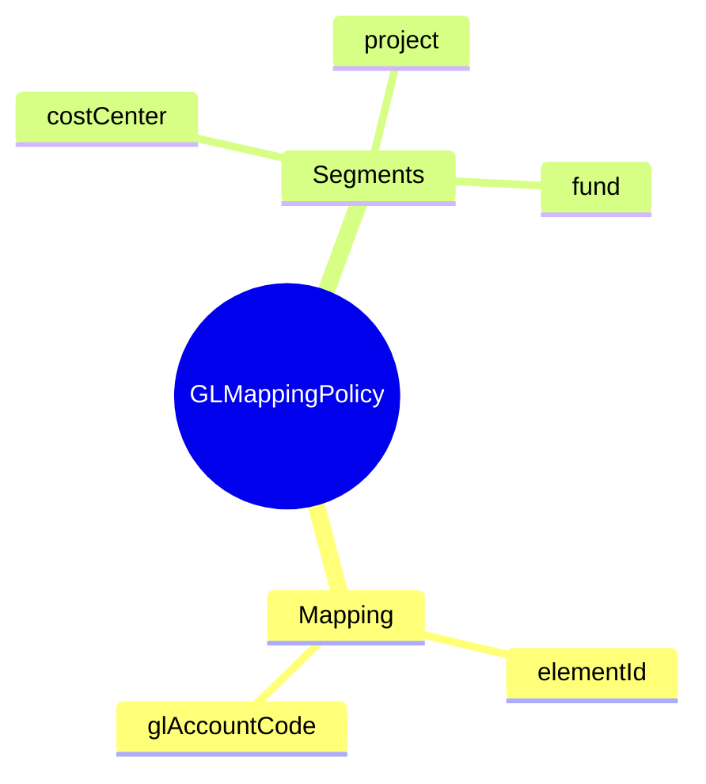

# GLMappingPolicy

## Overview



**GLMappingPolicy** (Policy Mapping GL) định nghĩa cách map các pay elements vào General Ledger accounts cho accounting purposes.

## Business Context

### Key Stakeholders
- **Finance/Accounting**: Define GL mappings theo chart of accounts
- **Payroll Administrators**: Maintain mappings
- **Auditors**: Review mappings cho compliance

### Business Processes
- **GL Posting**: Generate journal entries từ payroll
- **Financial Reporting**: Proper expense categorization
- **Cost Analysis**: Labor cost by category

## Attributes Guide

- **glAccountCode**: GL account number (ví dụ: "61000", "62100.001")
- **segmentJson**: Additional accounting dimensions
  ```json
  {
    "costCenter": "CC-12345",
    "project": "PRJ-001",
    "fund": "FUND-01"
  }
  ```

## Examples

### Example 1: Basic Salary Expense
- **element**: BASIC_SALARY
- **glAccountCode**: 61000
- **description**: Salary Expense - Direct Labor

### Example 2: Employer BHXH
- **element**: BHXH_ER
- **glAccountCode**: 62100
- **description**: Employer Social Insurance Expense

## Related Entities

| Entity | Relationship | Description |
|--------|--------------|-------------|
| [[PayElement]] | belongsTo | Element being mapped |
