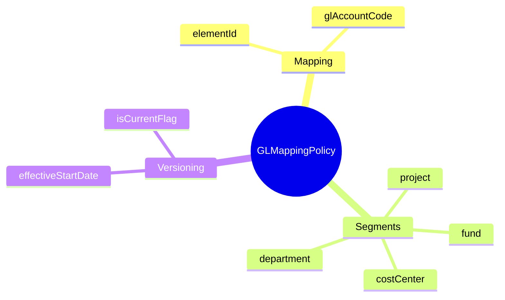
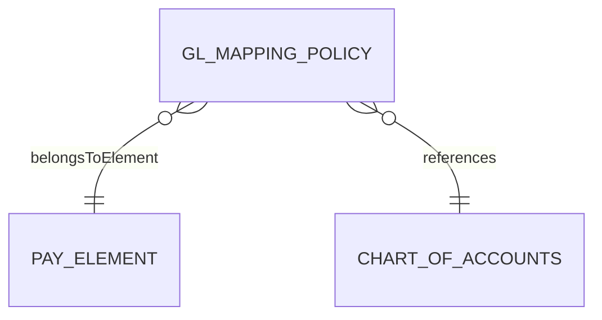
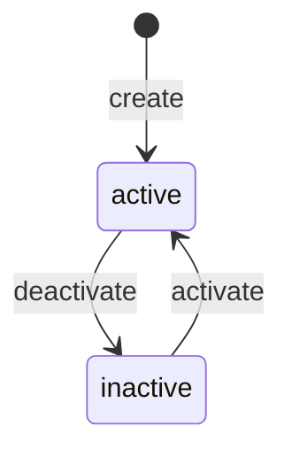
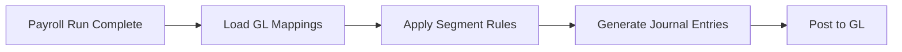

# GLMappingPolicy

## Overview

**GLMappingPolicy** (Policy Mapping GL) định nghĩa cách map các pay elements vào General Ledger accounts cho accounting purposes. Mỗi [[PayElement]] có thể có nhiều GL mappings tùy theo segment (cost center, project).



## Business Context

### Key Stakeholders
- **Finance/Accounting**: Define GL mappings theo chart of accounts
- **Payroll Administrators**: Maintain mappings
- **Auditors**: Review mappings cho compliance
- **Financial Controllers**: Monitor expense allocation

### GL Segment Structure

| Segment | Description | Example |
|---------|-------------|---------|
| **Account** | Main GL account | 61000 (Salary Expense) |
| **Cost Center** | Department/Division | CC-12345 |
| **Project** | Project code | PRJ-001 |
| **Fund** | Funding source | FUND-01 |
| **Location** | Geographic location | HCM, HN |

### Business Value
GLMappingPolicy ensures accurate financial reporting, proper cost allocation, and compliance with accounting standards.

## Attributes Guide

### Core Identity
- **elementId**: FK to [[PayElement]]. VD: BASIC_SALARY, OT_150
- **glAccountCode**: GL account number. VD: "61000", "62100.001"

### Segments (segmentJson)
```json
{
  "costCenter": "CC-12345",
  "project": "PRJ-001",
  "fund": "FUND-01",
  "location": "HCM"
}
```

### Versioning
- **effectiveStartDate/EndDate**: Khoảng thời gian áp dụng
- **isCurrentFlag**: Version đang active

## Relationships Explained



### PayElement
- **belongsToElement** → [[PayElement]]: Element được map. Một element có thể có nhiều mappings cho các segments khác nhau.

## Lifecycle & Workflows



| State | Meaning |
|-------|---------|
| **active** | Mapping đang được sử dụng |
| **inactive** | Tạm ngừng mapping |

### GL Posting Flow



## Actions & Operations

### create
**Who**: Finance/Payroll Admin  
**Required**: elementId, glAccountCode, effectiveStartDate

### update
**Who**: Finance/Payroll Admin  
**Affects**: glAccountCode, segmentJson, description

### deactivate
**Who**: Finance/Payroll Admin  
**When**: Mapping no longer needed

## Business Rules

#### Valid GL Account (validGLAccount)
**Rule**: GL account phải tồn tại trong Chart of Accounts.

#### Edit Access (editAccess)
**Rule**: Finance và Payroll Admin có quyền chỉnh sửa.

## Examples

### Example 1: Basic Salary Expense
```yaml
elementId: BASIC_SALARY
glAccountCode: "61000"
description: "Salary Expense - Direct Labor"
segmentJson: null  # Default segments
```

### Example 2: Employer BHXH with Cost Center
```yaml
elementId: BHXH_ER
glAccountCode: "62100"
description: "Employer Social Insurance Expense"
segmentJson:
  costCenter: "CC-HR-001"
```

### Example 3: Project-Based Allocation
```yaml
elementId: OT_150
glAccountCode: "61100"
description: "Overtime Expense - Project Alpha"
segmentJson:
  project: "PRJ-ALPHA"
  costCenter: "CC-12345"
```

## Related Entities

| Entity | Relationship | Description |
|--------|--------------|-------------|
| [[PayElement]] | belongsToElement | Element being mapped |
