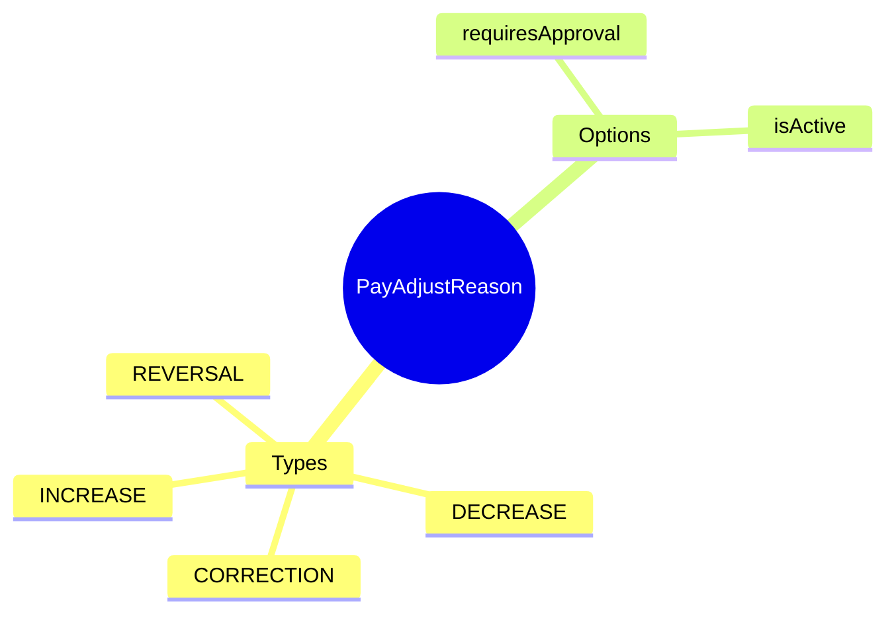

# PayAdjustReason

## Overview

**PayAdjustReason** (Lý do điều chỉnh lương) là reference data chứa danh sách các lý do điều chỉnh lương, dùng khi tạo manual adjustments.

## Business Context

### Key Stakeholders
- **Payroll Administrators**: Select reason khi tạo adjustment
- **Payroll Managers**: Review adjustments by reason
- **Audit**: Track adjustments theo categories

### Business Processes
- **Manual Adjustments**: Required reason for each adjustment
- **Audit Trail**: Categorize adjustments for review
- **Reporting**: Analyze adjustments by reason

## Attributes Guide

- **adjustmentType**:
  - *INCREASE*: Tăng (back pay, bonus missed)
  - *DECREASE*: Giảm (overpayment correction)
  - *CORRECTION*: Sửa lỗi calculation
  - *REVERSAL*: Đảo ngược entry sai
  - *OTHER*: Khác

- **requiresApproval**: Adjustments với reason này cần approval flow

## Examples

### Example 1: Back Pay
- **code**: BACK_PAY
- **name**: Back Pay - Trả lương truy lĩnh
- **adjustmentType**: INCREASE
- **requiresApproval**: true

### Example 2: Data Entry Error
- **code**: DATA_ERROR
- **name**: Data Entry Error Correction
- **adjustmentType**: CORRECTION
- **requiresApproval**: true

### Example 3: Overpayment Recovery
- **code**: OVERPAY_RECOVER
- **name**: Overpayment Recovery
- **adjustmentType**: DECREASE
- **requiresApproval**: true

## Related Entities

This is standalone reference data, used by Manual Adjustment records.
